# **SWF FILE FORMAT SPECIFICATION VERSION 19**

Copyright © 2006-2012 Adobe Systems Incorporated. All rights reserved. This manual may not be copied, photocopied, reproduced, translated, or converted to any electronic or machine-readable form in whole or in part without written approval from Adobe Systems Incorporated. Notwithstanding the foregoing, a person obtaining an electronic version of this manual from Adobe may print out one copy of this manual provided that no part of this manual may be printed out, reproduced, distributed, resold, or transmitted for any other purposes, including, without limitation, commercial purposes, such as selling copies of this documentation or providing paid-for support services.

#### **Trademarks**

Adobe, ActionScript, Flash, Flash Media Server, Adobe Media Server, Flash Player, PostScript, and XMP are either registered trademarks or trademarks of Adobe Systems Incorporated and may be registered in the United States or in other jurisdictions including internationally. Other product names, logos, designs, titles, words, or phrases mentioned within this publication may be trademarks, service marks, or trade names of Adobe Systems Incorporated or other entities and may be registered in certain jurisdictions including internationally. No right or license is granted to any Adobe trademark.

#### **Third-Party Information**

This guide contains links to third-party websites that are not under the control of Adobe Systems Incorporated, and Adobe Systems Incorporated is not responsible for the content on any linked site. If you access a third-party website mentioned in this guide, then you do so at your own risk. Adobe Systems Incorporated provides these links only as a convenience, and the inclusion of the link does not imply that Adobe Systems Incorporated endorses or accepts any responsibility for the content on those third- party sites. No right, license or interest is granted in any third party technology referenced in this guide.

NOTICE: THIS PUBLICATION AND THE INFORMATION HEREIN IS FURNISHED "AS IS", IS SUBJECT TO CHANGE WITHOUT NOTICE, AND SHOULD NOT BE CONSTRUED AS A COMMITMENT BY ADOBE SYSTEMS INCORPORATED. ADOBE SYSTEMS INCORPORATED ASSUMES NO RESPONSIBILITY OR LIABILITY FOR ANY ERRORS OR INACCURACIES, MAKES NO WARRANTY OF ANY KIND (EXPRESS, IMPLIED, OR STATUTORY) WITH RESPECT TO THIS PUBLICATION, AND EXPRESSLY DISCLAIMS ANY AND ALL WARRANTIES OF MERCHANTABILITY, FITNESS FOR PARTICULAR PURPOSES, AND NONINFRINGEMENT OF THIRD PARTY RIGHTS.

Adobe Systems Incorporated - Published 2012

#### Contents

| In | troduction                        | 12         |
|----|-----------------------------------|------------|
| Cl | napter 1: Basic Data Types        | 14         |
|    | Coordinates and twips             | 14         |
|    | Integer types and byte order      | 14         |
|    | Fixed-point numbers               | 15         |
|    | Floating-point numbers            | 16         |
|    | Encoded integers                  | 16         |
|    | Bit values                        | 17         |
|    | Using bit values                  | 18         |
|    | String values                     | 19         |
|    | Language code                     | 20         |
|    | RGB color record                  | 21         |
|    | RGBA color with alpha record      | 21         |
|    | ARGB color with alpha record      | 21         |
|    | Rectangle record                  | 22         |
|    | MATRIX record                     | 22         |
|    | Color transform record            | 24         |
|    | Color transform with alpha record | 25         |
| С  | napter 2: SWF Structure Summary   | 27         |
|    | The SWF header                    | 27         |
|    | SWF file structure                | <b>2</b> 8 |
|    | Tag format                        | 29         |
|    | Definition and control tags       | <b>2</b> 9 |
|    | Tag ordering in SWF files         | 30         |

| The dictionary                           | 30 |
|------------------------------------------|----|
| Processing a SWF file                    | 32 |
| File compression strategy                | 32 |
| Summary                                  | 32 |
| Chapter 3: The Display List              | 33 |
| Clipping layers                          | 33 |
| Using the display list                   | 33 |
| Display list tags                        | 34 |
| PlaceObject                              | 34 |
| PlaceObject2                             | 35 |
| PlaceObject3                             | 38 |
| Color Matrix filter                      | 42 |
| Convolution filter                       | 42 |
| Blur filter                              | 44 |
| Drop Shadow filter                       | 45 |
| Glow filter                              | 46 |
| Bevel filter                             | 46 |
| Gradient Glow and Gradient Bevel filters | 47 |
| ClipEventFlags                           | 48 |
| RemoveObject                             | 50 |
| RemoveObject2                            | 50 |
| ShowFrame                                | 51 |
| Chapter 4: Control Tags                  | 52 |
| SetBackgroundColor                       | 52 |
| FrameLabel                               | 52 |

|   | Protect                      | 53  |
|---|------------------------------|-----|
|   | End                          | 53  |
|   | ExportAssets                 | 53  |
|   | ImportAssets                 | 54  |
|   | EnableDebugger               | 55  |
|   | EnableDebugger2              | 55  |
|   | ScriptLimits                 | 56  |
|   | SetTabIndex                  | 56  |
|   | File Attributes              | 57  |
|   | ImportAssets2                | 58  |
|   | SymbolClass                  | 59  |
|   | Metadata                     | 59  |
|   | DefineScalingGrid            | 60  |
|   | DefineSceneAndFrameLabelData | 62  |
| С | napter 5: Actions            | 63  |
|   | SWF 3 action model           | 63  |
|   | SWF 3 actions                | 64  |
|   | SWF 4 action model           | 67  |
|   | The program counter          |     |
|   | SWF 4 actions                |     |
|   | SWF 5 action model           |     |
|   | SWF 5 actions                |     |
|   | ScriptObject actions         |     |
|   | Type actions                 |     |
|   | Math actions                 |     |
|   | IVIQUI QUUUII3               | エロム |

| Stack operator actions   |     |
|--------------------------|-----|
| SWF 6 action model       | 108 |
| SWF 6 actions            | 108 |
| SWF 7 action model       | 111 |
| SWF 7 actions            | 111 |
| SWF 9 action model       | 117 |
| DoABC                    | 117 |
| SWF 10 action model      | 118 |
| Chapter 6: Shapes        | 119 |
| Shape overview           | 119 |
| Shape example            | 120 |
| Shape structures         | 121 |
| Fill styles              | 121 |
| Line styles              | 123 |
| Shape structures         | 125 |
| Shape tags               | 131 |
| Chapter 7: Gradients     | 134 |
| Gradient transformations | 134 |
| Gradient control points  | 135 |
| Gradient structures      | 135 |
| GRADIENT                 | 135 |
| FOCALGRADIENT            | 136 |
| GRADRECORD               | 136 |
| Chapter 8: Bitmaps       | 137 |
| DefineBits               |     |

| JPEGTables                   |     |
|------------------------------|-----|
| DefineBitsJPEG2              |     |
| DefineBitsJPEG3              | 139 |
| DefineBitsLossless           | 139 |
| DefineBitsLossless2          | 142 |
| DefineBitsJPEG4              | 143 |
| Chapter 9: Shape Morphing    | 144 |
| DefineMorphShape             | 145 |
| DefineMorphShape2            | 146 |
| Morph fill styles            | 148 |
| MORPHFILLSTYLEARRAY          | 148 |
| MORPHFILLSTYLE               | 148 |
| Morph gradient values        | 149 |
| MORPHGRADIENT                | 149 |
| MORPHGRADRECORD              | 149 |
| Morph line styles            | 150 |
| MORPHLINESTYLEARRAY          | 150 |
| MORPHLINESTYLE               | 150 |
| MORPHLINESTYLE2              | 150 |
| Chapter 10: Fonts and Text   | 152 |
| Glyph text and device text   | 152 |
| Static text and dynamic text |     |
| Glyph text                   |     |
| Glyph definitions            | 153 |
| The EM square                | 154 |

| C      | onverting TrueType fonts to SWF glyphs | 154 |
|--------|----------------------------------------|-----|
| K      | erning and advance values              | 155 |
| Α      | dvanced text rendering engine          | 155 |
| D      | efineFont and DefineText               | 156 |
| St     | tatic glyph text example               | 157 |
| Fon    | t tags                                 | 158 |
| D      | efineFont                              | 158 |
| D      | efineFontInfo                          | 158 |
| W      | Vestern indirect fonts                 | 160 |
| Ja     | apanese indirect fonts                 | 160 |
| D      | efineFontInfo2                         | 161 |
| D      | efineFont2                             | 162 |
| D      | efineFont3                             | 164 |
| D      | efineFontAlignZones                    | 166 |
| K      | erning record                          | 167 |
| D      | efineFontName                          | 168 |
| Stat   | ic text tags                           | 168 |
| D      | efineText                              | 168 |
| Te     | ext records                            | 169 |
| Dyn    | amic text tags                         | 171 |
| D      | efineEditText                          | 171 |
| C:     | SMTextSettings                         | 174 |
| D      | efineFont4                             | 175 |
| Chapte | er 11: Sounds                          | 177 |
| Διιd   | io coding formats                      | 177 |

| Event     | sounds                             | 178 |
|-----------|------------------------------------|-----|
| Defi      | neSound                            | 178 |
| Star      | tSound                             | 179 |
| Star      | tSound2                            | 180 |
| Soul      | nd styles                          | 180 |
| Stream    | ning sound                         | 181 |
| Soui      | ndStreamHead                       | 181 |
| Soui      | ndStreamHead2                      | 183 |
| Soui      | ndStreamBlock                      | 184 |
| Fran      | ne subdivision for streaming sound | 184 |
| ADPCN     | A compression                      | 186 |
| ADP       | CM sound data                      | 187 |
| MP3 c     | ompression                         | 188 |
| MP3       | sound data                         | 188 |
| MP3       | 3 frame                            | 190 |
| Nellym    | noser compression                  | 192 |
| Speex     | compression                        | 192 |
| Chapter 1 | 12: Buttons                        | 193 |
| Button    | states                             | 193 |
| Button    | tracking                           | 193 |
| Events    | , state transitions, and actions   | 194 |
| Butto     | n tags                             | 195 |
| Butt      | onrecord                           | 195 |
| Defi      | neButton                           | 196 |
| Defi      | neButton2                          | 197 |

| DefineButtonCxform                  | 199 |
|-------------------------------------|-----|
| DefineButtonSound                   | 199 |
| Chapter 13: Sprites and Movie Clips | 201 |
| Sprite names                        | 201 |
| DefineSprite                        | 202 |
| Chapter 14: Video                   | 204 |
| Sorenson H.263 Bitstream Format     | 204 |
| Summary of differences from H.263   | 204 |
| Video packet                        | 205 |
| Macro block                         | 206 |
| Block data                          | 207 |
| Screen Video bitstream format       | 208 |
| Block format                        | 208 |
| Video packet                        | 209 |
| Image block                         | 210 |
| Screen Video V2 bitstream format    | 210 |
| V2 Colorspace                       | 210 |
| V2 Video Packet                     | 211 |
| Image Block V2                      | 212 |
| Image format                        | 212 |
| Image block diff position           | 213 |
| Image block prime position          | 213 |
| On2 Truemotion VP6 bitstream format | 213 |
| VP6 FLV video packet                | 215 |
| VP6 FLV Alpha video packet          | 215 |

| VP6 SWF video packet                                   | 216 |
|--------------------------------------------------------|-----|
| VP6 SWF Alpha video packet                             | 216 |
| SWF video tags                                         | 216 |
| DefineVideoStream                                      | 217 |
| VideoFrame                                             | 217 |
| Chapter 15: Metadata                                   | 219 |
| File Attributes                                        | 219 |
| EnableTelemetry                                        | 220 |
| DefineBinaryData                                       | 220 |
| Appendix A: SWF Uncovered: A Simple SWF File Dissected | 221 |
| Appendix B: Reverse index of tag values                |     |
| Appendix C: Screen Video v2 Palette                    | 238 |

# <span id="page-11-0"></span>**Introduction**

The SWF (pronounced "swiff ") file format delivers vector graphics, text, video, and sound over the Internet and is supported by Adobe® Flash® Player software. The SWF file format is designed to be an efficient delivery format, not a format for exchanging graphics between graphics editors. It is designed to meet the following goals:

- On-screen display—The format is primarily intended for on-screen display and supports anti-aliasing, fast rendering to a bitmap of any color format, animation, and interactive buttons.
- Extensibility—The format is a tagged format, so it can be evolved with new features while maintaining backward compatibility with earlier versions of Flash Player.
- Network delivery—The format can travel over a network with limited and unpredictable bandwidth. The files are compressed to be small and support incremental rendering through streaming. The SWF file format is a binary format and is not human readable like HTML. The SWF file format uses techniques such as bit-packing and structures with optional fields to minimize file size.
- Simplicity—The format is simple so that Flash Player is small and easily ported. Also, Flash Player depends upon a limited set of operating system features only.
- File independence—The files display with minimal dependence on external resources such as fonts.
- Scalability—The files work well on limited hardware, and can take advantage of better hardware when it is available. This ability is important because computers have different monitor resolutions and bit depths.
- Speed—The graphics described by SWF files render quickly.
- Scriptability—The format includes tags that provide sequences of byte codes to be interpreted by a stack machine. The byte codes support the ActionScript® language. Flash Player provides a runtime ActionScript object model that allows interaction with drawing primitives, servers, and features of Flash Player.

SWF files have the extension .swf and a MIME type of application/x-shockwave-flash.

The SWF format has evolved through several versions. Through SWF 5, substantial additions were made to the SWF tag set. Starting with SWF 6 and later, the SWF format changes less, as more new features are implemented partly or entirely at the ActionScript level. Starting with SWF 9, the ActionScript 3.0 language, which employs the new ActionScript Virtual Machine 2 (AVM2) can be used. Anyone planning to generate SWF file content that uses newer features should become familiar with the ActionScript object model that Flash Player exposes. Some references for this information are in the ActionScript Developer's Guide (see [http://help.adobe.com/en\\_US/as3/dev/index.html\)](http://help.adobe.com/en_US/as3/dev/index.html), ActionScript 3.0 Language Reference (see [http://help.adobe.com/en\\_US/FlashPlatform/reference/actionscript/3/\)](http://help.adobe.com/en_US/FlashPlatform/reference/actionscript/3/), and the Adobe ActionScript Virtual

Machine 2 Overview (PDF file) at [www.adobe.com/go/avm2overview.](http://www.adobe.com/go/avm2overview/)

If you need to knows the mapping between Flash Player / AIR names to SWF version (for example, 11.4 is SWF 17), look up the features in a given release, or check out the latest in what's new in the Flash Player and SWF features, visit: [Flash Player and Air Feature List.](http://www.adobe.com/devnet/articles/flashplayer-air-feature-list.html)

Adobe seriously considers all feedback to the SWF file format specification. E-mail any unclear or potentially erroneous information within the specification to Adobe at [flashformat@adobe.com.](mailto:flashformat@adobe.com) All such email submissions shall be subject to the Submitted Materials guidelines in the Terms of Use at [www.adobe.com/misc/copyright.html.](http://www.adobe.com/misc/copyright.html)

Summary of post-ship changes:

• April 23, 2013 – Fixed wrong order in ActionStackSwap

# <span id="page-13-0"></span>**Chapter 1: Basic Data Types**

This section describes the basic data types that make up the more complex data structures in the SWF file format. All other structures in the SWF file format are built on these fundamental types.

# <span id="page-13-1"></span>**Coordinates and twips**

The SWF file format stores all x-y coordinates as integers, usually in a unit of measurement called a twip. In the SWF format, a twip is 1/20th of a logical pixel. A logical pixel is the same as a screen pixel when the file is played at 100%—that is, without scaling.

For example, a rectangle 800 twips wide by 400 twips high is rendered as 40 by 20 logical pixels. Fractional pixel sizes are approximated with anti-aliasing. A rectangle 790 by 390 twips (39.5 by 19.5 pixels) appears to have slightly blurred edges.

Twips are a good compromise between size and precision. They provide sub-pixel accuracy for zooming and precise placement of objects, while consuming very few bits per coordinate.

Coordinates in the SWF file format use the traditional graphics axes: x is horizontal and proceeds from minimum values at the left to maximum values at the right, and y is vertical and proceeds from minimum values at the top to maximum values at the bottom.

# <span id="page-13-2"></span>**Integer types and byte order**

The SWF file format uses 8-bit, 16-bit, 32-bit, 64-bit, signed, and unsigned integer types. All integer values are stored in the SWF file by using little-endian byte order: the least significant byte is stored first, and the most significant byte is stored last, in the same way as the Intel x86 architecture. The bit order within bytes in the SWF file format is big-endian: the most significant bit is stored first, and the least significant bit is stored last.

#### For example:

- The 32-bit value 0x456e7120 is stored as 20 71 6e 45.
- The 16-bit value 0xe712 is stored as 12 e7.

All integer types must be byte-aligned. That is, the first bit of an integer value must be stored in the first bit of a byte in the SWF file.

Signed integers are represented by using traditional 2's-complement bit patterns. These are the signed integer representations used on most modern computer platforms. In the 2's complement system, negative numbers have 1 as the first bit, and zero and positive numbers have 0 as the first bit. A negative number, -n, is represented as the bitwise opposite of the positive-zero number n-1.

#### **Integer Types**

| Type    | Comment                                                  |
|---------|----------------------------------------------------------|
| SI8     | Signed 8-bit integer value                               |
| SI16    | Signed 16-bit integer value                              |
| SI32    | Signed 32-bit integer value                              |
| SI8[n]  | Signed 8-bit array—n is the number of array elements     |
| SI16[n] | Signed 16-bit array—n is the is number of array elements |
| UI8     | Unsigned 8-bit integer value                             |
| UI16    | Unsigned 16-bit integer value                            |
| UI32    | Unsigned 32-bit integer value                            |
| UI8[n]  | Unsigned 8-bit array—n is the number of array elements   |
| UI16[n] | Unsigned 16-bit array—n is the number of array elements  |
| UI24[n] | Unsigned 24-bit array—n is the number of array elements  |
| UI32[n] | Unsigned 32-bit array—n is the number of array elements  |
| UI64[n] | Unsigned 64-bit array—n is the number of array elements  |

# <span id="page-14-0"></span>**Fixed-point numbers**

The SWF file format supports two types of fixed-point numbers: 32-bit and 16-bit.

The 32-bit fixed-point numbers are 16.16. That is, the high 16 bits represent the number before the decimal point, and the low 16 bits represent the number after the decimal point. FIXED values are stored like 32-bit integers in the SWF file (using little-endian byte order) and must be byte aligned.

For example: The real value 7.5 is equivalent to: 0x0007.8000. This value is stored in the SWF file as: 00 80 07 00.

SWF 8 and later supports 16-bit 8.8 signed, fixed-point numbers. The high 8 bits represent the number before the decimal point, and the low 8 bits represent the number after the decimal point. FIXED8 values are stored like 16-bit integers in the SWF file (using little- endian byte order) and must be byte aligned.

#### **Fixed-Point Types**

| Type   | Comment                         |
|--------|---------------------------------|
| FIXED  | 32-bit 16.16 fixed-point number |
| FIXED8 | 16-bit 8.8 fixed-point number   |

# <span id="page-15-0"></span>**Floating-point numbers**

SWF 8 and later supports the use of IEEE Standard 754 compatible floating-point types. Three types of floatingpoint numbers are supported.

#### **Floating-Point Types**

| Type    | Comment                                                |
|---------|--------------------------------------------------------|
| FLOAT16 | Half-precision (16-bit) floating-point number          |
| FLOAT   | Single-precision (32-bit) IEEE Standard 754 compatible |
| DOUBLE  | Double-precision (64-bit) IEEE Standard 754 compatible |

FLOAT16 is identical to the characteristics of FLOAT except for changes to the number of bits allocated to the exponent and mantissa:

- 1 bit for the sign
- 5 bits for the exponent, with an exponent bias of 16
- 10 bits for the mantissa

# <span id="page-15-1"></span>**Encoded integers**

SWF 9 and later supports the use of integers encoded with a variable number of bytes. One type of encoded integer is supported.

#### **Floating-Point Types**

| Type       | Comment                                         |
|------------|-------------------------------------------------|
| EncodedU32 | Variable length encoded 32-bit unsigned integer |

This is a 32-bit unsigned integer value encoded with a variable number of bytes to save space. All EncodedU32's are encoded as 1-5 bytes depending on the value (larger values need more space). The encoding method is if the hi bit in the current byte is set, then the next byte is also part of the value. Each bit in a byte contributes 7 bits to the value, with the hi bit telling us whether to use the next byte, or if this is the last byte for the value.

This is the algorithm for parsing an EncodedU32:

```
int GetEncodedU32(unsigned char*& pos)
{
 int result = pos[0];
 if (!(result & 0x00000080))
 {
 pos++;
 return result;
 }
 result = (result & 0x0000007f) | pos[1]<<7;
 if (!(result & 0x00004000))
 {
 pos += 2;
 return result;
 }
 result = (result & 0x00003fff) | pos[2]<<14;
 if (!(result & 0x00200000))
 {
 pos += 3;
 return result;
 }
 result = (result & 0x001fffff) | pos[3]<<21;
 if (!(result & 0x10000000))
 {
 pos += 4;
 return result;
 }
 result = (result & 0x0fffffff) | pos[4]<<28;
 pos += 5;
 return result;
}
```

# <span id="page-16-0"></span>**Bit values**

Bit values are variable-length bit fields that can represent three types of numbers:

- 1. Unsigned integers
- 2. Signed integers
- 3. Signed 16.16 fixed-point values.

Bit values do not have to be byte aligned. Other types (such as UI8 and UI16) are always byte aligned. If a bytealigned type follows a bit value, the last byte that contains the bit value is padded with zeros.

The following example is a stream of 64 bits. The 64 bits represent 9 values of varying bit length, followed by a UI16 value:

The bit stream begins with a 6-bit value (BV1), followed by a 5-bit value (BV2) that is spread across Byte1 and

Byte2. BV3 is spread across Byte2 and Byte3, while BV4 is wholly contained within Byte3. Byte 5 contains two bit values: BV7 and BV8. BV9 is followed by a byte- aligned type (UI16), so the last four bits of Byte 6 are padded with zeros.

#### **Bit Values**

| Type      | Comment                                                                             |
|-----------|-------------------------------------------------------------------------------------|
| SB[nBits] | Signed-bit value (nBits is the number of bits used to store the value)              |
| UB[nBits] | Unsigned-bit value (nBits is the number of bits used to store the value)            |
| FB[nBits] | Signed, fixed-point bit value (nBits is the number of bits used to store the value) |

When an unsigned-bit value is expanded into a larger word size, the leftmost bits are filled with zeros. When a signed-bit value is expanded into a larger word size, the high bit is copied to the leftmost bits.

This expansion is called sign extension. For example, the 4-bit unsigned value UB[4] = 1110 would be expanded to a 16-bit value like this: 0000000000001110 = 14. The same value interpreted as a signed value, SB[4] = 1110 would be expanded to 1111111111111110 = –2.

Signed-bit values are similar but must take account of the sign bit. The signed value of 35 is represented as SB[7] = 0100011. The extra zero bit is required; otherwise the high bit is sign extended and the value is interpreted as negative.

Fixed-point bit values are 32-bit 16.16 signed, fixed-point numbers. That is, the high 16 bits represent the number before the decimal point, and the low 16 bits represent the number after the decimal point. A fixedpoint bit value is identical to a signed-bit value, but the interpretation is different. For example, a 19-bit, signedbit value of 0x30000 is interpreted as

196608 decimal. The 19-bit, fixed-point bit value 0x30000 is interpreted as 3.0. The format of this value is effectively 3.16 rather than 16.16.

# <span id="page-17-0"></span>**Using bit values**

Bit values are stored by using the minimum number of bits possible for the range needed. Most bit value fields use a fixed number of bits. Some use a variable number of bits, but in all such cases, the number of bits to be used is explicitly stated in another field in the same structure. In these variable-length cases, applications that generate SWF files must determine the minimum number of bits necessary to represent the actual values that will be specified. For signed-bit values, if the number to be encoded is positive, an extra bit is necessary to preserve the leading 0; otherwise sign extension changes the bit value into a negative number.

As an example of variable-sized bit values, consider the RECT structure:

| Field | Type      | Comment                       |
|-------|-----------|-------------------------------|
| Nbits | UB[5]     | Bits in each rect value field |
| Xmin  | SB[Nbits] | x minimum position for rect   |
| Xmax  | SB[Nbits] | x maximum position for rect   |
| Ymin  | SB[Nbits] | y minimum position for rect   |
| Ymax  | SB[Nbits] | y maximum position for rect   |

The Nbits field determines the number of bits used to store the coordinate values Xmin, Xmax, Ymin, and Ymax. Say the coordinates of the rectangle are as follows:

```
Xmin = 127 decimal = 1111111 binary 
Xmax = 260 decimal = 100000100 binary 
Ymin = 15 decimal = 1111 binary 
Ymax = 514 decimal = 1000000010 binary
```

Nbits is calculated by finding the coordinate that requires the most bits to represent. In this case, that value is 514 (01000000010 binary) which requires 11 bits to represent. The rectangle is stored as the following table shows:

| Field | Type and Value       | Comment                  |
|-------|----------------------|--------------------------|
| Nbits | UB[5] = 01011        | Bits required (11)       |
| Xmin  | SB[11] = 00100000100 | x minimum in twips (127) |
| Xmax  | SB[11] = 00001111111 | x maximum in twips (260) |
| Ymin  | SB[11] = 00000001111 | y minimum in twips (15)  |
| Ymax  | SB[11] = 01000000010 | y maximum in twips (514) |

# <span id="page-18-0"></span>**String values**

A string value represents a null-terminated character string. The format for a string value is a sequential list of bytes terminated by the null character byte.

| Field  | Type              | Comment                        |
|--------|-------------------|--------------------------------|
| String | UI8[zero or more] | Non-null string character data |

| StringEnd | UI8 | Marks end of string; always zero |
|-----------|-----|----------------------------------|
|           |     |                                  |

In SWF 5 or earlier, STRING values are encoded using either ANSI (which is a superset of ASCII) or shift-JIS (a Japanese encoding). You cannot indicate the encoding that is used; instead, the decoding choice is made according to the locale in which Flash Player is running. This means that text content in SWF 5 or earlier can only be encoded in ANSI or shift-JIS, and the target audience must be known during authoring—otherwise garbled text results.

In SWF 6 or later, STRING values are always encoded by using the Unicode UTF-8 standard. This is a multibyte encoding; each character is composed of between one and four bytes. UTF-8 is a superset of ASCII; the byte range 0 to 127 in UTF-8 exactly matches the ASCII mapping, and all ASCII characters 0 to 127 are represented by just one byte. UTF-8 guarantees that whenever a character other than character 0 (the null character) is encoded by using more than one byte, none of those bytes are zero. This avoids the appearance of internal null characters in UTF-8 strings, meaning that it remains safe to treat null bytes as string terminators, just as for ASCII strings.

# <span id="page-19-0"></span>**Language code**

A language code identifies a spoken language that applies to text. Language codes are associated with font specifications in the SWF file format.

**Note**: A language code does not specify a text encoding; it specifies a spoken language.

| Field        | Type | Comment                       |
|--------------|------|-------------------------------|
| LanguageCode | UI8  | Language code (see following) |

Flash Player uses language codes to determine line-breaking rules for dynamic text, and to choose backup fonts when a specified device font is unavailable. Other uses for language codes may be found in the future.

A language code of zero means no language. This code results in behavior that is dependent on the locale in which Flash Player is running.

At the time of writing, the following language codes are recognized by Flash Player:

- 1 = Latin (the western languages covered by Latin-1: English, French, German, and so on)
- 2 = Japanese
- 3 = Korean
- 4 = Simplified Chinese
- 5 = Traditional Chinese

# <span id="page-20-0"></span>**RGB color record**

The RGB record represents a color as a 24-bit red, green, and blue value.

| Field | Type | Comment           |
|-------|------|-------------------|
| Red   | UI8  | Red color value   |
| Green | UI8  | Green color value |
| Blue  | UI8  | Blue color value  |

# <span id="page-20-1"></span>**RGBA color with alpha record**

The RGBA record represents a color as 32-bit red, green, blue and alpha value. An RGBA color with an alpha value of 255 is completely opaque. An RGBA color with an alpha value of zero is completely transparent. Alpha values between zero and 255 are partially transparent.

| Field | Type | Comment                      |
|-------|------|------------------------------|
| Red   | UI8  | Red color value              |
| Green | UI8  | Green color value            |
| Blue  | UI8  | Blue color value             |
| Alpha | UI8  | alpha value defining opacity |

# <span id="page-20-2"></span>**ARGB color with alpha record**

The ARGB record behaves exactly like the RGBA record, but the alpha value for the ARGB record is in the first byte.

| Field | Type | Comment                      |
|-------|------|------------------------------|
| Alpha | UI8  | alpha value defining opacity |
| Red   | UI8  | Red color value              |
| Green | UI8  | Green color value            |
| Blue  | UI8  | Blue color value             |

# <span id="page-21-0"></span>**Rectangle record**

A rectangle value represents a rectangular region defined by a minimum x- and y-coordinate position and a maximum x- and y-coordinate position. The RECT record must be byte aligned.

| Field | Type      | Comment                                   |
|-------|-----------|-------------------------------------------|
| Nbits | UB[5]     | Bits used for each subsequent field       |
| Xmin  | SB[Nbits] | x minimum position for rectangle in twips |
| Xmax  | SB[Nbits] | x maximum position for rectangle in twips |
| Ymin  | SB[Nbits] | y minimum position for rectangle in twips |
| Ymax  | SB[Nbits] | y maximum position for rectangle in twips |

# <span id="page-21-1"></span>**MATRIX record**

The MATRIX record represents a standard 2x3 transformation matrix of the sort commonly used in 2D graphics. It is used to describe the scale, rotation, and translation of a graphic object. The MATRIX record must be byte aligned.

| Field          | Type                              | Comment                                  |  |
|----------------|-----------------------------------|------------------------------------------|--|
| HasScale       | UB[1]                             | Has scale values if equal to 1           |  |
| NScaleBits     | If HasScale = 1, UB[5]            | Bits in each scale value field           |  |
| ScaleX         | If HasScale = 1, FB[NScaleBits]   | x scale value                            |  |
| ScaleY         | If HasScale = 1, FB[NScaleBits]   | y scale value                            |  |
| HasRotate      | UB[1]                             | Has rotate and skew values if equal to 1 |  |
| NRotateBits    | If HasRotate = 1, UB[5]           | Bits in each rotate value field          |  |
| RotateSkew0    | If HasRotate = 1, FB[NRotateBits] | First rotate and skew value              |  |
| RotateSkew1    | If HasRotate = 1, FB[NRotateBits] | Second rotate and skew value             |  |
| NTranslateBits | UB[5]                             | Bits in each translate value field       |  |
| TranslateX     | SB[NTranslateBits]                | x translate value in twips               |  |
| TranslateY     | SB[NTranslateBits]                | y translate value in twips               |  |

The ScaleX, ScaleY, RotateSkew0 and RotateSkew1 fields are stored as 16.16 fixed-point values. The TranslateX and TranslateY values are stored as signed values in twips.

The MATRIX record is optimized for common cases such as a matrix that performs a translation only. In this case, the HasScale and HasRotate flags are zero, and the matrix only contains the TranslateX and TranslateY fields.

The mapping from the MATRIX fields to the 2x3 matrix is as follows:

ScaleX RotateSkew0

RotateSkew1 ScaleY

TranslateX TranslateY

For any coordinates (x, y), the transformed coordinates (x', y') are calculated as follows:

```
x' = x * ScaleX + y * RotateSkew1 + TranslateX
y' = x * RotateSkew0 + y * ScaleY + TranslateY
```

The following table describes how the members of the matrix are used for each type of operation:

|            | ScaleX                             | RotateSkew0                               | RotateSkew1                             | ScaleY                           |
|------------|------------------------------------|-------------------------------------------|-----------------------------------------|----------------------------------|
| Rotation   | Cosine                             | Sine                                      | Negative sine                           | Cosine                           |
| Scaling    | Horizontal scaling<br>component    | Nothing                                   | Nothing                                 | Vertical scaling<br>component    |
| Shear      | Nothing                            | Horizontal<br>proportionality<br>constant | Vertical<br>proportionality<br>constant | Nothing                          |
| Reflection | Horizontal reflection<br>component | Nothing                                   | Nothing                                 | Vertical reflection<br>component |

# <span id="page-23-0"></span>**Color transform record**

The CXFORM record defines a simple transform that can be applied to the color space of a graphic object. The following are the two types of transform possible:

- Multiplication transforms
- Addition transforms

Multiplication transforms multiply the red, green, and blue components by an 8.8 fixed-point multiplication term. The fixed-point representation of 1.0 is 0x100 or 256 decimal.

For any color (R,G,B), the transformed color (R', G', B') is calculated as follows:

```
R' = (R * RedMultTerm) / 256
G' = (G * GreenMultTerm) / 256
B' = (B * BlueMultTerm) / 256
```

Addition transforms add an addition term (positive or negative) to the red, green, and blue components of the object being displayed. If the result is greater than 255, the result is clamped to 255. If the result is less than zero, the result is clamped to zero.

For any color (R,G,B), the transformed color (R', G', B') is calculated as follows:

```
R' = max(0, min(R + RedAddTerm, 255)) 
G' = max(0, min(G + GreenAddTerm, 255)) 
B' = max(0, min(B + BlueAddTerm, 255))
```

Addition and multiplication transforms can be combined as follows. The multiplication operation is performed first:

```
R' = max(0, min(((R * RedMultTerm) / 256) + RedAddTerm, 255))
G' = max(0, min(((G * GreenMultTerm) / 256) + GreenAddTerm, 255))
B' = max(0, min(((B * BlueMultTerm) / 256) + BlueAddTerm, 255))
```

The CXFORM record must be byte aligned.

| Field         | Type                           | Comment                                 |
|---------------|--------------------------------|-----------------------------------------|
| HasAddTerms   | UB[1]                          | Has color addition values if equal to 1 |
| HasMultTerms  | UB[1]                          | Has color multiply values if equal to 1 |
| Nbits         | UB[4]                          | Bits in each value field                |
| RedMultTerm   | If HasMultTerms = 1, SB[Nbits] | Red multiply value                      |
| GreenMultTerm | If HasMultTerms = 1, SB[Nbits] | Green multiply value                    |

| BlueMultTerm | If HasMultTerms = 1, SB[Nbits] | Blue multiply value  |
|--------------|--------------------------------|----------------------|
| RedAddTerm   | If HasAddTerms = 1, SB[Nbits]  | Red addition value   |
| GreenAddTerm | If HasAddTerms = 1, SB[Nbits]  | Green addition value |
| BlueAddTerm  | If HasAddTerms = 1, SB[Nbits]  | Blue addition value  |

# <span id="page-24-0"></span>**Color transform with alpha record**

The CXFORMWITHALPHA record extends the functionality of CXFORM by allowing color transforms to be applied to the alpha channel, as well as the red, green, and blue channels.

The following are the two types of transform possible:

- Multiplication Transforms
- Addition Transforms

Multiplication transforms multiply the red, green, blue, and alpha components by an 8.8 fixed-point value. The fixed-point representation of 1.0 is 0x100 or 256 decimal. Therefore, the result of a multiplication operation should be divided by 256.

For any color (R,G,B,A), the transformed color (R', G', B', A') is calculated as follows:

```
R' = (R * RedMultTerm) / 256
G' = (G * GreenMultTerm) / 256
B' = (B * BlueMultTerm) / 256
A' = (A * AlphaMultTerm) / 256
```

The CXFORMWITHALPHA record is most commonly used to display objects as partially transparent, achieved by multiplying the alpha channel by some value between zero and 256.

Addition transforms add a fixed value (positive or negative) to the red, green, blue, and alpha components of the object being displayed. If the result is greater than 255, the result is clamped to 255. If the result is less than zero, the result is clamped to zero.

For any color (R,G,B,A), the transformed color (R', G', B', A') is calculated as follows:

```
R' = max(0, min(R + RedAddTerm, 255)) 
G' = max(0, min(G + GreenAddTerm, 255)) 
B' = max(0, min(B + BlueAddTerm, 255)) 
A' = max(0, min(A + AlphaAddTerm, 255))
```

Addition and multiplication transforms can be combined as follows. The multiplication operation is performed first:

```
R' = max(0, min(((R * RedMultTerm) / 256) + RedAddTerm, 255)) 
G' = max(0, min(((G * GreenMultTerm) / 256) + GreenAddTerm, 255))
B' = max(0, min(((B * BlueMultTerm) / 256) + BlueAddTerm, 255))
A' = max(0, min(((A * AlphaMultTerm) / 256) + AlphaAddTerm, 255))
```

Like the CXFORM record, the CXFORMWITHALPHA record is byte aligned.

| Field         | Type                           | Comment                                 |
|---------------|--------------------------------|-----------------------------------------|
| HasAddTerms   | UB[1]                          | Has color addition values if equal to 1 |
| HasMultTerms  | UB[1]                          | Has color multiply values if equal to 1 |
| Nbits         | UB[4]                          | Bits in each value field                |
| RedMultTerm   | If HasMultTerms = 1, SB[Nbits] | Red multiply value                      |
| GreenMultTerm | If HasMultTerms = 1, SB[Nbits] | Green multiply value                    |
| BlueMultTerm  | If HasMultTerms = 1, SB[Nbits] | Blue multiply value                     |
| AlphaMultTerm | If HasMultTerms = 1, SB[Nbits] | Alpha multiply value                    |
| RedAddTerm    | If HasAddTerms = 1, SB[Nbits]  | Red addition value                      |
| GreenAddTerm  | If HasAddTerms = 1, SB[Nbits]  | Green addition value                    |
| BlueAddTerm   | If HasAddTerms = 1, SB[Nbits]  | Blue addition value                     |
| AlphaAddTerm  | If HasAddTerms = 1, SB[Nbits]  | Transparency addition value             |

# <span id="page-26-0"></span>**Chapter 2: SWF Structure Summary**

This chapter provides a summary of the elements that comprise a SWF file.

# <span id="page-26-1"></span>**The SWF header**

All SWF files begin with the following header. The types are defined in [Chapter 1: Basic Data Types.](#page-13-0)

| Field      | Type | Comment                                             |  |
|------------|------|-----------------------------------------------------|--|
| Signature  | UI8  | Signature byte:                                     |  |
|            |      | "F" indicates uncompressed                          |  |
|            |      | "C" indicates<br>a<br>zlib compressed SWF<br>(SWF 6 |  |
|            |      | and later only)                                     |  |
|            |      | "Z" indicates a LZMA compressed SWF (SWF            |  |
|            |      | 13 and later only)                                  |  |
| Signature  | UI8  | Signature byte always "W"                           |  |
| Signature  | UI8  | Signature byte always "S"                           |  |
| Version    | UI8  | Single byte file version (for example, 0x06 for     |  |
|            |      | SWF 6)                                              |  |
| FileLength | UI32 | Length of entire file in bytes                      |  |
| FrameSize  | RECT | Frame size in twips                                 |  |
| FrameRate  | UI16 | Frame delay in 8.8 fixed number of frames           |  |
|            |      | per second                                          |  |
| FrameCount | UI16 | Total number of frames in file                      |  |

The header begins with a three-byte signature of one of:

- 0x46, 0x57, 0x53 ("FWS"). An FWS signature indicates an uncompressed SWF file.
- 0x43, 0x57, 0x53 ("CWS"). A CWS indicates that the entire file after the first 8 bytes (that is, after the FileLength field) was compressed by using the ZLIB open standard. The data format that the ZLIB library uses is described by Request for Comments (RFCs) documents 1950 to 1952. CWS file compression is permitted in SWF 6 or later only.
- 0x5a, 0x57, 0x53 ("ZWS"). A ZWS indicates that the entire file after the first 8 bytes (that is, after the FileLength field) was compressed by using the LZMA open standard: [http://www.7-](http://www.7-zip.org/sdk.html)

[zip.org/sdk.html.](http://www.7-zip.org/sdk.html) ZWS file compression is permitted in SWF 13 or later only.

A one-byte version number follows the signature. The version number is not an ASCII character, but an 8-bit number. For example, for SWF 4, the version byte is 0x04, not the ASCII character "4" (0x34).

The FileLength field is the total length of the SWF file, including the header. If this is an uncompressed SWF file (FWS signature), the FileLength field should exactly match the file size. If this is a compressed SWF file (CWS signature), the FileLength field indicates the total length of the file after decompression, and thus generally does not match the file size. Having the uncompressed size available can make the decompression process more efficient.

The FrameSize field defines the width and height of the on-screen display. This field is stored as a RECT structure, meaning that its size may vary according to the number of bits needed to encode the coordinates. The FrameSize RECT always has Xmin and Ymin value of 0; the Xmax and Ymax members define the width and height (see [Using bit values\)](#page-17-0).

The FrameRate is the desired playback rate in frames per second. This rate is not guaranteed if, for example, Flash Player is running on a slow or busy CPU.

The FrameCount is the total number of frames in this SWF file.

# <span id="page-27-0"></span>**SWF file structure**

Following the header is a series of tagged data blocks. All tags share a common format, so any program parsing a SWF file can skip over blocks it does not understand. Data inside the block can point to offsets within the block, but can never point to an offset in another block. This ability enables tags to be removed, inserted, or modified by tools that process a SWF file.

The FileAttributes tag is only required for SWF 8 and later.

| Header | FileAttributes | Tag | Tag | … | End tag |
|--------|----------------|-----|-----|---|---------|
|        | tag            |     |     |   |         |
|        |                |     |     |   |         |

# <span id="page-28-0"></span>**Tag format**

Each tag begins with a tag type and a length. The tag-header formats can be either short or long. Short tag headers are used for tags with 62 bytes of data or less. Long tag headers, with a signed 32-bit length field, can be used for any tag size up to 2GB, far larger than is presently practical.

| RECORDHEADER (short) |      |                                                  |
|----------------------|------|--------------------------------------------------|
| Field                | Type | Comment                                          |
| TagCodeAndLength     | UI16 | Upper 10 bits: tag type Lower 6 bits: tag length |

**Note**: The TagCodeAndLength field is a two-byte word, not a bit field of 10 bits followed by a bit field of 6 bits. The little-endian byte ordering of a SWF file makes these two layouts different.

The length specified in the TagCodeAndLength field does not include the RECORDHEADER that starts a tag.

If the tag is 63 bytes or longer, it is stored in a long tag header. The long tag header consists of a short tag header with a length of 0x3f, followed by a 32-bit length.

| RECORDHEADER (long) |      |                                                                   |
|---------------------|------|-------------------------------------------------------------------|
| Field               | Type | Comment                                                           |
| TagCodeAndLength    | UI16 | Tag type and length of 0x3F Packed together as in short<br>header |
| Length              | UI32 | Length of tag                                                     |

# <span id="page-28-1"></span>**Definition and control tags**

The two categories of tags in a SWF file are as follows:

- Definition tags define the content of the SWF file—the shapes, text, bitmaps, sounds, and so on. Each definition tag assigns a unique ID called a character ID to the content it defines. Flash Player then stores the character in a repository called the dictionary. Definition tags, by themselves, do not cause anything to be rendered.
- Control tags create and manipulate rendered instances of characters in the dictionary, and control the flow of the file.

# <span id="page-29-0"></span>**Tag ordering in SWF files**

Generally speaking, tags in a SWF can occur in any order. However, you must observe the following rules:

- The FileAttributes tag must be the first tag in the SWF file for SWF 8 and later.
- A tag should only depend on tags that come before it. A tag should never depend on a tag that comes later in the file.
- A definition tag that defines a character must occur before any control tag that refers to that character.
- Streaming sound tags must be in order. Out-of-order streaming sound tags result in the sound being played out of order.
- The End tag is always the last tag in the SWF file.

# <span id="page-29-1"></span>**The dictionary**

The dictionary is a repository of characters that are defined, and are available for control tags to use. The process of building and using the dictionary is as follows:

- 1. The definition tag defines some content, such as a shape, font, bitmap, or sound.
- 2. The definition tag assigns a unique CharacterId to the content.
- 3. The content is saved in the dictionary under the CharacterId.
- 4. A control tag uses the CharacterId to retrieve the content from the dictionary, and performs some action on the content, such as displaying a shape, or playing a sound.

Every definition tag must specify a unique ID. Duplicate IDs are not allowed. Typically, the first CharacterId is 1, the second CharacterId is 2, and so on. The number zero (0) is special and is considered a null character.

Control tags are not the only tags that reference the dictionary. Definition tags can use characters from the dictionary to define more complex characters. For example, the DefineButton and DefineSprite tags refer to other characters to define their contents. The DefineText tag can refer to font characters to select different fonts for the text.

The following diagram illustrates a typical interaction between definition tags, control tags, and the dictionary:

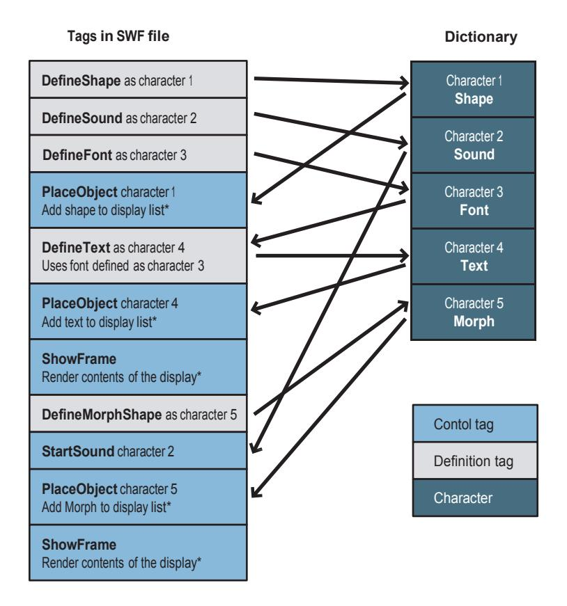

# <span id="page-31-0"></span>**Processing a SWF file**

Flash Player processes all of the tags in a SWF file until a ShowFrame tag is encountered. At this point, the display list is copied to the screen and Flash Player is idle until it is time to process the next frame. The contents of the first frame are the cumulative effect of performing all of the control tag operations before the first ShowFrame tag. The contents of the second frame are the cumulative effect of performing all of the control tag operations from the beginning of the file to the second ShowFrame tag, and so on.

# <span id="page-31-1"></span>**File compression strategy**

Since SWF files are frequently delivered over a network connection, they should be as compact as possible. Several techniques are used to accomplish this, including the following items:

- Reuse—The structure of the character dictionary makes it easy to reuse elements in a SWF file. For example, a shape, button, sound, font, or bitmap can be stored in a file once and referenced many times.
- Compression—Shapes are compressed by using an efficient delta encoding scheme; often the first coordinate of a line is assumed to be the last coordinate of the previous line. Distances are also often expressed relative to the last position.
- Default values—Some structures, like matrixes and color transforms, have common fields that are used more often than others. For example, for a matrix, the most common field is the translation field. Scaling and rotation are less common. Therefore, if the scaling field is not present, it is assumed to be 100%. If the rotation field is not present, it is assumed that there is no rotation. This use of default values helps to minimize file sizes.
- Change Encoding—As a rule, SWF files only store the changes between states. This is reflected in shape data structures and in the place-move-remove model that the display list uses.
- Shape Data Structure—The shape data structure uses a unique structure to minimize the size of shapes and to render anti-aliased shapes efficiently on the screen.

# <span id="page-31-2"></span>**Summary**

A SWF file is made up of a header, followed by a number of tags. The two types of tags are definition tags and control tags. Definition tags define the objects known as characters, which are stored in the dictionary. Control tags manipulate characters, and control the flow of the file.

# <span id="page-32-0"></span>**Chapter 3: The Display List**

Displaying a frame of a SWF file is a three-stage process:

- 1. Objects are defined with definition tags such as DefineShape, DefineSprite, and so on. Each object is given a unique ID called a character, and is stored in a repository called the dictionary.
- 2. Selected characters are copied from the dictionary and placed on the display list, which is the list of the characters that will be displayed in the next frame.
- 3. Once complete, the contents of the display list are rendered to the screen with ShowFrame.

A *depth value* is assigned to each character on the display list. The depth determines the stacking order of the character. Characters with lower depth values are displayed underneath characters with higher depth values. A character with a depth value of 1 is displayed at the bottom of the stack. A character can appear more than once in the display list, but at different depths. Only one character can be at any given depth.

In SWF 1 and 2, the display list was a flat list of the objects that are present on the screen at any given time. In SWF 3 and later versions, the display list is a hierarchical list where an element on the display can have a list of child elements. For more information, see DefineSprite.

The following six tags are used to control the display list:

- PlaceObject Adds a character to the display list.
- PlaceObject2 & PlaceObject3 Adds a character to the display list, or modifies the character at the specified depth.
- RemoveObject Removes the specified character from the display list.
- RemoveObject2Removes the character at the specified depth.
- ShowFrame Renders the contents of the display list to the display.

**Note**: The older tags, PlaceObject and RemoveObject, are rarely used in SWF 3 and later versions.

The following diagram illustrates the display process. First, three objects are defined: a shape, a text object, and a sprite. These objects are given character IDs and stored in the dictionary. Character 1 (the shape) is then placed at depth 1, the bottom of the stack, and will be obscured by all other characters when the frame is rendered. Character 2 (the text) is placed twice; once at depth 2, and once at depth 4, the top of the stack. Character 3 (the sprite) is placed at depth 3.

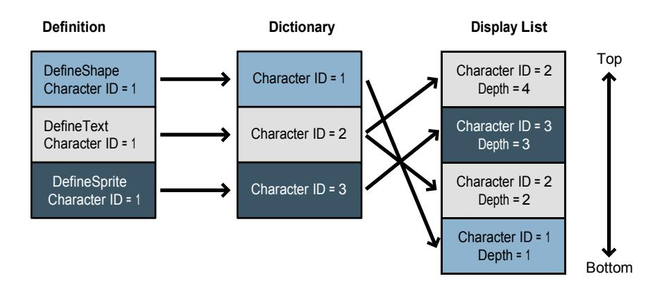

# <span id="page-34-0"></span>**Clipping layers**

Flash Player supports a special kind of object in the display list called a clipping layer. A character placed as a clipping layer is not displayed; rather it clips (or masks) the characters placed above it. The ClipDepth field in PlaceObject2 specifies the top-most depth that the clipping layer masks.

For example, if a shape was placed at depth 1 with a ClipDepth of 4, all depths above 1, up to and including depth 4, are masked by the shape placed at depth 1. Characters placed at depths above 4 are not masked.

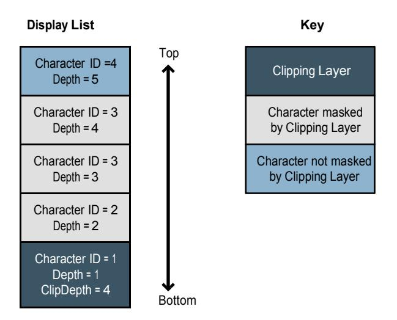

# <span id="page-34-1"></span>**Using the display list**

The following procedure creates and displays an animation:

- 1. Define each character with a definition tag. Each character is given a unique character ID, and added to the dictionary.
- 2. Add each character to the display list with a PlaceObject2 tag. Each PlaceObject2 tag specifies the character to be displayed, plus the following attributes:
  - A depth value, which controls the stacking order of the character being placed. Characters with lower depth values appear to be underneath characters with higher depth values. A depth value of 1 means the character is displayed at the bottom of the stack. Only one character can be at any given depth.
  - A transformation matrix, which determines the position, scale, factor, and angle of rotation of the character being placed. The same character can be placed more than once (at different depths) with a different transformation matrix.
  - An optional color transform, which specifies the color effect applied to the character being placed. Color effects include transparency and color shifts.

- An optional name string, which identifies the character being placed for SetTarget actions. SetTarget is used to perform actions inside sprite objects.
- An optional ClipDepth value, which specifies the top-most depth that will be masked by the character being placed.
- An optional ratio value, which controls how a morph character is displayed when placed. A ratio of zero displays the character at the start of the morph. A ratio of 65535 displays the character at the end of the morph.
- 3. Use a ShowFrame tag to render the contents of the display list to the screen.
- 4. Use a PlaceObject2 tag to modify each character on the display List. Each PlaceObject2 assigns a new transformation matrix to the character at a given depth. The character ID is not specified because each depth can have only one character.
- 5. Use a ShowFrame tag to display the characters in their new positions.

Repeat steps 4 and 5 for each frame of the animation.

If a character does not change from frame to frame, you do not need to replace the unchanged character after each frame.

6. Use a RemoveObject2 tag to Remove each character from the display list. Only the depth value is required to identify the character being removed.

# <span id="page-35-0"></span>**Display list tags**

Display list tags are used to add character and character attributes to a display list.

### <span id="page-35-1"></span>**PlaceObject**

The PlaceObject tag adds a character to the display list. The CharacterId identifies the character to be added. The Depth field specifies the stacking order of the character. The Matrix field species the position, scale, and rotation of the character. If the size of the PlaceObject tag exceeds the end of the transformation matrix, it is assumed that a ColorTransform field is appended to the record. The ColorTransform field specifies a color effect (such as transparency) that is applied to the character. The same character can be added more than once to the display list with a different depth and transformation matrix.

PlaceObject is rarely used in SWF 3 and later versions; it is superseded by PlaceObject2 and PlaceObject3.

The minimum file format version is SWF 1.

| Field                     | Type         | Comment                  |
|---------------------------|--------------|--------------------------|
| Header                    | RECORDHEADER | Tag type = 4             |
| CharacterId               | UI16         | ID of character to place |
| Depth                     | UI16         | Depth of character       |
| Matrix                    | MATRIX       | Transform matrix data    |
| ColorTransform (optional) | CXFORM       | Color transform data     |

### <span id="page-36-0"></span>**PlaceObject2**

The PlaceObject2 tag extends the functionality of the PlaceObject tag. The PlaceObject2 tag can both add a character to the display list, and modify the attributes of a character that is already on the display list. The PlaceObject2 tag changed slightly from SWF 4 to SWF 5. In SWF 5, clip actions were added.

The tag begins with a group of flags that indicate which fields are present in the tag. The optional fields are CharacterId, Matrix, ColorTransform, Ratio, ClipDepth, Name, and ClipActions. The Depth field is the only field that is always required.

The depth value determines the stacking order of the character. Characters with lower depth values are displayed underneath characters with higher depth values. A depth value of 1 means the character is displayed at the bottom of the stack. Any given depth can have only one character. This means a character that is already on the display list can be identified by its depth alone (that is, a CharacterId is not required).

The PlaceFlagMove and PlaceFlagHasCharacter tags indicate whether a new character is being added to the display list, or a character already on the display list is being modified. The meaning of the flags is as follows:

- PlaceFlagMove = 0 and PlaceFlagHasCharacter = 1 A new character (with ID of CharacterId) is placed on the display list at the specified depth. Other fields set the attributes of this new character.
- PlaceFlagMove = 1 and PlaceFlagHasCharacter = 0 The character at the specified depth is modified. Other fields modify the attributes of this character. Because any given depth can have only one character, no CharacterId is required.
- PlaceFlagMove = 1 and PlaceFlagHasCharacter = 1 The character at the specified Depth is removed, and a new character (with ID of CharacterId) is placed at that depth. Other fields set the attributes of this new character.

Frames replace the transformation matrix of the character at the desired depth. For example, a character that is moved over a series of frames has PlaceFlagHasCharacter set in the first frame, and PlaceFlagMove set in

subsequent frames. The first frame places the new character at the desired depth, and sets the initial transformation matrix. Subsequent

The optional fields in PlaceObject2 have the following meaning:

- The CharacterId field specifies the character to be added to the display list. CharacterId is used only when a new character is being added. If a character that is already on the display list is being modified, the CharacterId field is absent.
- The Matrix field specifies the position, scale and rotation of the character being added or modified.
- The ColorTransform field specifies the color effect applied to the character being added or modified.
- The Ratio field specifies a morph ratio for the character being added or modified. This field applies only to characters defined with DefineMorphShape, and controls how far the morph has progressed. A ratio of zero displays the character at the start of the morph. A ratio of 65535 displays the character at the end of the morph. For values between zero and 65535 Flash Player interpolates between the start and end shapes, and displays an in- between shape.
- The ClipDepth field specifies the top-most depth that will be masked by the character being added. A ClipDepth of zero indicates that this is not a clipping character.
- The Name field specifies a name for the character being added or modified. This field is typically used with sprite characters, and is used to identify the sprite for SetTarget actions. It allows the main file (or other sprites) to perform actions inside the sprite (see [Chapter 13: Sprites and Movie Clips\)](#page-202-0).
- The ClipActions field, which is valid only for placing sprite characters, defines one or more event handlers to be invoked when certain events occur.

The minimum file format version is SWF 3.

| Field                      | Type         | Comment                                                                              |
|----------------------------|--------------|--------------------------------------------------------------------------------------|
| Header                     | RECORDHEADER | Tag type = 26                                                                        |
| PlaceFlagHasClipActions    | UB[1]        | SWF 5 and later: has clip actions<br>(sprite characters only) Otherwise:<br>always 0 |
| PlaceFlagHasClipDepth      | UB[1]        | Has clip depth                                                                       |
| PlaceFlagHasName           | UB[1]        | Has name                                                                             |
| PlaceFlagHasRatio          | UB[1]        | Has ratio                                                                            |
| PlaceFlagHasColorTransform | UB[1]        | Has color transform                                                                  |

| PlaceFlagHasMatrix    | UB[1]                                             | Has matrix                         |
|-----------------------|---------------------------------------------------|------------------------------------|
| PlaceFlagHasCharacter | UB[1]                                             | Places a character                 |
| PlaceFlagMove         | UB[1]                                             | Defines a character to be moved    |
| Depth                 | UI16                                              | Depth of character                 |
| CharacterId           | If PlaceFlagHasCharacter, UI16                    | ID of character to place           |
| Matrix                | If PlaceFlagHasMatrix, MATRIX                     | Transform matrix data              |
| ColorTransform        | If PlaceFlagHasColorTransform,<br>CXFORMWITHALPHA | Color transform data               |
| Ratio                 | If PlaceFlagHasRatio, UI16                        |                                    |
| Name                  | If PlaceFlagHasName, STRING                       | Name of character                  |
| ClipDepth             | If PlaceFlagHasClipDepth, UI16                    | Clip depth (see "Clipping layers") |
| ClipActions           | If PlaceFlagHasClipActions,<br>CLIPACTIONS        | SWF 5 and later: Clip Actions Data |

Clip actions are valid for placing sprite characters only. Clip actions define event handlers for a sprite character.

| Field             | Type                                                    | Comment                               |
|-------------------|---------------------------------------------------------|---------------------------------------|
| Reserved          | UI16                                                    | Must be 0                             |
| AllEventFlags     | CLIPEVENTFLAGS                                          | All events used in these clip actions |
| ClipActionRecords | CLIPACTIONRECORD [one or more]                          | Individual event handlers             |
| ClipActionEndFlag | If SWF version <= 5, UI16,<br>If SWF version >= 6, UI32 | Must be 0                             |

| CLIPACTIONRECORD |                |                                        |  |
|------------------|----------------|----------------------------------------|--|
| Field            | Type           | Comment                                |  |
| EventFlags       | CLIPEVENTFLAGS | Events to which this handler applies   |  |
| ActionRecordSize | UI32           | Offset in bytes from end of this field |  |

|         |                                                                   | to next CLIPACTIONRECORD (or<br>ClipActionEndFlag) |
|---------|-------------------------------------------------------------------|----------------------------------------------------|
| KeyCode | If EventFlags contain ClipEventKeyPress: UI8,<br>Otherwise absent | Key code to trap (see<br>"DefineButton2")          |
| Actions | ACTIONRECORD [one or more]                                        | Actions to perform                                 |

## <span id="page-39-0"></span>**PlaceObject3**

The PlaceObject3 tag extends the functionality of the PlaceObject2 tag. PlaceObject3 adds the following new features:

- The PlaceFlagHasClassName field indicates that a class name will be specified, indicating the type of object to place. Because we no longer use ImportAssets in ActionScript 3.0, there needed to be some way to place a Timeline object using a class imported from another SWF, which does not have a 16-bit character ID in the instantiating SWF. Supported in Flash Player 9.0.45.0 and later.
- The PlaceFlagHasImage field indicates the creation of native Bitmap objects on the display list. When PlaceFlagHasClassName and PlaceFlagHasImage are both defined, this indicates a Bitmap class to be loaded from another SWF. Immediately following the flags is the class name (as above) for the BitmapData class in the loaded SWF. A Bitmap object will be placed with the named BitmapData class as it's internal data. When PlaceFlagHasCharacter and PlaceFlagHasImage are both defined, this indicates a Bitmap from the current SWF. The BitmapData to be used as its internal data will be defined by the following characterID. This only occurs when the BitmapData has a class associated with it. If there is no class associated with the BitmapData, DefineShape should be used with a Bitmap fill. Supported in Flash Player 9.0.45.0 and later.
- The PlaceFlagHasCacheAsBitmap field specifies whether Flash Player should internally cache a display object as a bitmap. Caching can speed up rendering when the object does not change frequently.
- A number of different blend modes can be specified as an alternative to normal alpha compositing. The following blend modes are supported:
  - o Add
  - o Layer Alpha
  - o Lighten Darken
  - o Overlay Difference
  - o Multiply Erase
  - o Screen Hardlight

- o Subtract
- o Invert
- A number of bitmap filters can be applied to the display object. Adding filters implies that the display object will be cached as a bitmap. The following bitmap filters are supported:
  - o Bevel
  - o Drop shadow
  - o Blur
  - o Glow
  - o Color matrix
  - o Gradient bevel
  - o Convolution
  - o Gradient glow

The minimum file format version is SWF 8.

| PlaceObject3               |              |                                                                                      |
|----------------------------|--------------|--------------------------------------------------------------------------------------|
| Field                      | Type         | Comment                                                                              |
| Header                     | RECORDHEADER | Tag type = 70                                                                        |
| PlaceFlagHasClipActions    | UB[1]        | SWF 5 and later: has clip actions<br>(sprite characters only) Otherwise:<br>always 0 |
| PlaceFlagHasClipDepth      | UB[1]        | Has clip depth                                                                       |
| PlaceFlagHasName           | UB[1]        | Has name                                                                             |
| PlaceFlagHasRatio          | UB[1]        | Has ratio                                                                            |
| PlaceFlagHasColorTransform | UB[1]        | Has color transform                                                                  |
| PlaceFlagHasMatrix         | UB[1]        | Has matrix                                                                           |
| PlaceFlagHasCharacter      | UB[1]        | Places a character                                                                   |
| PlaceFlagMove              | UB[1]        | Defines a character to be moved                                                      |

| Reserved                  | UB[1]                                                                                   | Must be 0                                                                                                                                         |
|---------------------------|-----------------------------------------------------------------------------------------|---------------------------------------------------------------------------------------------------------------------------------------------------|
| PlaceFlagOpaqueBackground | UB[1]                                                                                   | Has opaque background. SWF 11 and<br>higher.                                                                                                      |
| PlaceFlagHasVisible       | UB[1]                                                                                   | Has visibility flag. SWF 11 and higher.                                                                                                           |
| PlaceFlagHasImage         | UB[1]                                                                                   | Has class name or character ID of<br>bitmap to place. If<br>PlaceFlagHasClassName, use<br>ClassName. If PlaceFlagHasCharacter,<br>use CharacterId |
| PlaceFlagHasClassName     | UB[1]                                                                                   | Has class name of object to place                                                                                                                 |
| PlaceFlagHasCacheAsBitmap | UB[1]                                                                                   | Enables bitmap caching                                                                                                                            |
| PlaceFlagHasBlendMode     | UB[1]                                                                                   | Has blend mode                                                                                                                                    |
| PlaceFlagHasFilterList    | UB[1]                                                                                   | Has filter list                                                                                                                                   |
| Depth                     | UI16                                                                                    | Depth of character                                                                                                                                |
| ClassName                 | If PlaceFlagHasClassName or<br>(PlaceFlagHasImage and<br>PlaceFlagHasCharacter), String | Name of the class to place                                                                                                                        |
| CharacterId               | If PlaceFlagHasCharacter, UI16                                                          | ID of character to place                                                                                                                          |
| Matrix                    | If PlaceFlagHasMatrix, MATRIX                                                           | Transform matrix data                                                                                                                             |
| ColorTransform            | If PlaceFlagHasColorTransform,<br>CXFORMWITHALPHA                                       | Color transform data                                                                                                                              |
| Ratio                     | If PlaceFlagHasRatio, UI16                                                              |                                                                                                                                                   |
| Name                      | If PlaceFlagHasName, STRING                                                             | Name of character                                                                                                                                 |
| ClipDepth                 | If PlaceFlagHasClipDepth, UI16                                                          | Clip depth (see Clipping layers)                                                                                                                  |
| SurfaceFilterList         | If PlaceFlagHasFilterList, FILTERLIST                                                   | List of filters on this object                                                                                                                    |
| BlendMode                 | If PlaceFlagHasBlendMode, UI8                                                           | 0 or 1 = normal;<br>2 = layer;<br>3 = multiply;<br>4 = screen;<br>5 = lighten;                                                                    |

|                  |                                            | 6 = darken;<br>7 = difference;<br>8 = add;<br>9 = subtract;<br>10 = invert;<br>11 = alpha;<br>12 = erase;<br>13 = overlay; |
|------------------|--------------------------------------------|----------------------------------------------------------------------------------------------------------------------------|
|                  |                                            | 14 = hardlight;<br>Values 15 to 255 are reserved.                                                                          |
| BitmapCache      | If PlaceFlagHasCacheAsBitmap, UI8          | 0 = Bitmap cache disabled; 1-255 =<br>Bitmap cache enabled                                                                 |
| Visible          | If PlaceFlagHasVisible, UI8                | 0 = Place invisible, 1 = Place visible                                                                                     |
| Background Color | If PlaceFlagHasVisible, RGBA               |                                                                                                                            |
| ClipActions      | If PlaceFlagHasClipActions,<br>CLIPACTIONS | SWF 5 and later: Clip Actions Data                                                                                         |

| FILTERLIST      |                         |                   |
|-----------------|-------------------------|-------------------|
| Field           | Type                    | Comment           |
| NumberOfFilters | UI8                     | Number of Filters |
| Filter          | FILTER[NumberOfFilters] | List of filters   |

| FILTER   |      |                             |
|----------|------|-----------------------------|
| Field    | Type | Comment                     |
| FilterID | UI8  | 0 = Has DropShadowFilter    |
|          |      | 1 = Has BlurFilter          |
|          |      | 2 =<br>Has GlowFilter       |
|          |      | 3 = Has BevelFilter         |
|          |      | 4 = Has GradientGlowFilter  |
|          |      | 5 = Has ConvolutionFilter   |
|          |      | 6 = Has ColorMatrixFilter   |
|          |      | 7 = Has GradientBevelFilter |
|          |      |                             |

| DropShadowFilter    | If FilterID = 0, DROPSHADOWFILTER    | Drop Shadow filter    |
|---------------------|--------------------------------------|-----------------------|
| BlurFilter          | If FilterID = 1, BLURFILTER          | Blur filter           |
| GlowFilter          | If FilterID = 2, GLOWFILTER          | Glow filter           |
| BevelFilter         | If FilterID = 3, BEVELFILTER         | Bevel filter          |
| GradientGlowFilter  | If FilterID = 4, GRADIENTGLOWFILTER  | Gradient Glow filter  |
| ConvolutionFilter   | If FilterID = 5, CONVOLUTIONFILTER   | Convolution filter    |
| ColorMatrixFilter   | If FilterID = 6, COLORMATRIXFILTER   | Color Matrix filter   |
| GradientBevelFilter | If FilterID = 7, GRADIENTBEVELFILTER | Gradient Bevel filter |

## <span id="page-43-0"></span>**Color Matrix filter**

A Color Matrix filter applies a color transformation on the pixels of a display list object. Given an input RGBA pixel in a display list object, the color transformation is calculated in the following way:

The resulting RGBA values are saturated.

The matrix values are stored from left to right and each row from top to bottom. The last row is always assumed to be (0,0,0,0,1) and does not need to be stored.

| COLORMATRIXFILTER |           |                     |
|-------------------|-----------|---------------------|
| Field             | Type      | Comment             |
| Matrix            | FLOAT[20] | Color matrix values |

```
R'
G'
B'
A'
1
       =
           r0 r1 r2 r3 r4
           g0 g1 g2 g3 g4
           b0 b1 b2 b3 b4
           a0 a1 a2 a3 a4
           0 0 0 0 1
                               R
                               G
                               B
                               A
                               1
```

## <span id="page-43-1"></span>**Convolution filter**

The Convolution filter is a two-dimensional discrete convolution. It is applied on each pixel of a display object. In the following mathematical representation, F is the input pixel plane, G is the input matrix, and H is the output pixel plane:

$$H x y = \int_{j=0}^{MatrixY-1MatrixX-1} \frac{F\left[x+i-\frac{MatrixX}{2}\right]\left[y+j-\frac{MatrixY}{2}\right]+Bias G i j}{Divisor}$$

The convolution is applied on each of the RGBA color components and then saturated, except when the PreserveAlpha flag is set; in this case, the alpha channel value is not modified. The clamping flag specifies how pixels outside of the input pixel plane are handled. If set to false, the DefaultColor value is used, and otherwise, the pixel is clamped to the closest valid input pixel.

| CONVOLUTIONFILTER |                          |                                            |
|-------------------|--------------------------|--------------------------------------------|
| Field             | Type                     | Comment                                    |
| MatrixX           | UI8                      | Horizontal matrix size                     |
| MatrixY           | UI8                      | Vertical matrix size                       |
| Divisor           | FLOAT                    | Divisor applied to the matrix values       |
| Bias              | FLOAT                    | Bias applied to the matrix values          |
| Matrix            | FLOAT[MatrixX * MatrixY] | Matrix values                              |
| DefaultColor      | RGBA                     | Default color for pixels outside the image |
| Reserved          | UB[6]                    | Must be 0                                  |
| Clamp             | UB[1]                    | Clamp mode                                 |
| PreserveAlpha     | UB[1]                    | Preserve the alpha                         |

## <span id="page-45-0"></span>**Blur filter**

The blur filter is based on a sub-pixel precise median filter (also known as a box filter). The filter is applied on each of the RGBA color channels.

The general mathematical representation of a simple non-sub-pixel precise median filter is as follows, and can be easily extended to support sub-pixel precision.

This r*epresentation assumes that BlurX and BlurY are odd integers in order to get the same result as Flash Player*. The filter window is always centered on a pixel in Flash Player.

$$H[x][y] = \underbrace{\sum_{j=0}^{B \text{lurY}-1B \text{lurX}-1}}_{i=0} F\left[x+i-\frac{B \text{lurX}}{2}\right] \left[y+j-\frac{B \text{lurY}}{2}\right]$$
(BlurX)(BlurY)

When the number of passes is set to three, it closely approximates a Gaussian Blur filter. A higher number of passes is possible, but for performance reasons, Adobe does not recommend it.

| BLURFILTER |       |                        |
|------------|-------|------------------------|
| Field      | Type  | Comment                |
| BlurX      | FIXED | Horizontal blur amount |
| BlurY      | FIXED | Vertical blur amount   |
| Passes     | UB[5] | Number of blur passes  |
| Reserved   | UB[3] | Must be 0              |

### <span id="page-46-0"></span>**Drop Shadow filter**

The Drop Shadow filter is based on the same median filter as the blur filter, but the filter is applied only on the alpha color channel to obtain a shadow pixel plane.

The angle parameter is in radians. With angle set to 0, the shadow shows on the right side of the object. The distance is measured in pixels. The shadow pixel plane values are interpolated bilinearly if sub-pixel values are used.

The strength of the shadow normalized is 1.0 in fixed point. The strength value is applied by multiplying each value in the shadow pixel plane.

Various compositing options are available for the drop shadow to support both inner and outer shadows in regular or knockout modes.

The resulting color value of each pixel is obtained by multiplying the color channel of the provided RGBA color value by the associated value in the shadow pixel plane. The resulting pixel value is composited on the original input pixel plane by using one of the specified compositing modes.

| DROPSHADOWFILTER |        |                                 |  |
|------------------|--------|---------------------------------|--|
| Field            | Type   | Comment                         |  |
| DropShadowColor  | RGBA   | Color of the shadow             |  |
| BlurX            | FIXED  | Horizontal blur amount          |  |
| BlurY            | FIXED  | Vertical blur amount            |  |
| Angle            | FIXED  | Radian angle of the drop shadow |  |
| Distance         | FIXED  | Distance of the drop shadow     |  |
| Strength         | FIXED8 | Strength of the drop shadow     |  |

| InnerShadow     | UB[1] | Inner shadow mode             |
|-----------------|-------|-------------------------------|
| Knockout        | UB[1] | Knockout mode                 |
| CompositeSource | UB[1] | Composite source.<br>Always 1 |
| Passes          | UB[5] | Number of blur passes         |

## <span id="page-47-0"></span>**Glow filter**

The Glow filter works in the same way as the Drop Shadow filter, except that it does not have a distance and angle parameter. Therefore, it can run slightly faster.

| GLOWFILTER      |        |                            |  |
|-----------------|--------|----------------------------|--|
| Field           | Type   | Comment                    |  |
| GlowColor       | RGBA   | Color of the shadow        |  |
| BlurX           | FIXED  | Horizontal blur amount     |  |
| BlurY           | FIXED  | Vertical blur amount       |  |
| Strength        | FIXED8 | Strength of the glow       |  |
| InnerGlow       | UB[1]  | Inner glow mode            |  |
| Knockout        | UB[1]  | Knockout mode              |  |
| CompositeSource | UB[1]  | Composite source. Always 1 |  |
| Passes          | UB[5]  | Number of blur passes      |  |

### <span id="page-47-1"></span>**Bevel filter**

The Bevel filter creates a smooth bevel on display list objects.

| BEVELFILTER    |       |                        |  |  |
|----------------|-------|------------------------|--|--|
| Field          | Type  | Comment                |  |  |
| ShadowColor    | RGBA  | Color of the shadow    |  |  |
| HighlightColor | RGBA  | Color of the highlight |  |  |
| BlurX          | FIXED | Horizontal blur amount |  |  |

| BlurY           | FIXED  | Vertical blur amount            |
|-----------------|--------|---------------------------------|
| Angle           | FIXED  | Radian angle of the drop shadow |
| Distance        | FIXED  | Distance of the drop shadow     |
| Strength        | FIXED8 | Strength of the drop shadow     |
| InnerShadow     | UB[1]  | Inner shadow mode               |
| Knockout        | UB[1]  | Knockout mode                   |
| CompositeSource | UB[1]  | Composite source. Always 1      |
| OnTop           | UB[1]  | OnTop<br>mode                   |
| Passes          | UB[4]  | Number of blur passes           |

### <span id="page-48-0"></span>**Gradient Glow and Gradient Bevel filters**

The Gradient Glow and Gradient Bevel filters are extensions of the normal Glow and Bevel Filters and allow a gradient to be specified instead of a single color. Instead of multiplying a single color value by the shadow-pixel plane value, the shadow-pixel plane value is mapped directly into the gradient ramp to obtain the resulting color pixel value, which is then composited by using one of the specified compositing modes.

| GRADIENTGLOWFILTER |                                   |  |  |
|--------------------|-----------------------------------|--|--|
| Type               | Comment                           |  |  |
| UI8                | Number of colors in the gradient  |  |  |
| RGBA[NumColors]    | Gradient colors                   |  |  |
| UI8[NumColors]     | Gradient ratios                   |  |  |
| FIXED              | Horizontal blur amount            |  |  |
| FIXED              | Vertical blur amount              |  |  |
| FIXED              | Radian angle of the gradient glow |  |  |
| FIXED              | Distance of the gradient glow     |  |  |
| FIXED8             | Strength of the gradient glow     |  |  |
| UB[1]              | Inner glow mode                   |  |  |
|                    |                                   |  |  |

| Knockout        | UB[1]           | Knockout mode                      |
|-----------------|-----------------|------------------------------------|
| CompositeSource | UB[1]           | Composite source. Always 1         |
| OnTop           | UB[1]           | OnTop mode                         |
| Passes          | UB[4]           | Number of blur passes              |
| NumColors       | UI8             | Number of colors in the gradient   |
| GradientColors  | RGBA[NumColors] | Gradient colors                    |
| GradientRatio   | UI8[NumColors]  | Gradient ratios                    |
| BlurX           | FIXED           | Horizontal blur amount             |
| BlurY           | FIXED           | Vertical blur amount               |
| Angle           | FIXED           | Radian angle of the gradient bevel |
| Distance        | FIXED           | Distance of the gradient bevel     |
| Strength        | FIXED8          | Strength of the gradient bevel     |
| InnerShadow     | UB[1]           | Inner bevel mode                   |
| Knockout        | UB[1]           | Knockout mode                      |

| GRADIENTBEVELFILTER |       |                            |
|---------------------|-------|----------------------------|
| Field               | Type  | Comment                    |
| CompositeSource     | UB[1] | Composite source. Always 1 |
| OnTop               | UB[1] | OnTop mode                 |
| Passes              | UB[4] | Number of blur passes      |

### <span id="page-49-0"></span>**ClipEventFlags**

The CLIPEVENTFLAGS sequence specifies one or more sprite events to which an event handler applies. In SWF 5 and earlier, CLIPEVENTFLAGS is 2 bytes; in SWF 6 and later, it is 4 bytes.

| CLIPEVENTFLAGS |  |  |  |
|----------------|--|--|--|
|                |  |  |  |

| Field                   | Type                          | Comment                                                             |
|-------------------------|-------------------------------|---------------------------------------------------------------------|
| ClipEventKeyUp          | UB[1]                         | Key up event                                                        |
| ClipEventKeyDown        | UB[1]                         | Key down event                                                      |
| ClipEventMouseUp        | UB[1]                         | Mouse up event                                                      |
| ClipEventMouseDown      | UB[1]                         | Mouse down event                                                    |
| ClipEventMouseMove      | UB[1]                         | Mouse move event                                                    |
| ClipEventUnload         | UB[1]                         | Clip unload event                                                   |
| ClipEventEnterFrame     | UB[1]                         | Frame event                                                         |
| ClipEventLoad           | UB[1]                         | Clip load event                                                     |
| ClipEventDragOver       | UB[1]                         | SWF 6 and later: mouse drag over event Otherwise:<br>always 0       |
| ClipEventRollOut        | UB[1]                         | SWF 6 and later: mouse rollout event. Otherwise:<br>always 0        |
| ClipEventRollOver       | UB[1]                         | SWF 6 and later: mouse rollover event. Otherwise:<br>always 0       |
| ClipEventReleaseOutside | UB[1]                         | SWF 6 and later: mouse release outside event<br>Otherwise: always 0 |
| ClipEventRelease        | UB[1]                         | SWF 6 and later: mouse release inside event<br>Otherwise: always 0  |
| ClipEventPress          | UB[1]                         | SWF 6 and later: mouse press event. Otherwise:<br>always 0          |
| ClipEventInitialize     | UB[1]                         | SWF 6 and later: initialize event. Otherwise: always<br>0           |
| ClipEventData           | UB[1]                         | Data received event                                                 |
| Reserved                | If SWF version >= 6,<br>UB[5] | Always 0                                                            |
| ClipEventConstruct      | If SWF version >= 6,<br>UB[1] | SWF 7 and later: construct event Otherwise: always<br>0             |

| ClipEventKeyPress | If SWF version >= 6,<br>UB[1] | Key press event      |
|-------------------|-------------------------------|----------------------|
| ClipEventDragOut  | If SWF version >= 6,<br>UB[1] | Mouse drag out event |
| Reserved          | If SWF version >= 6,<br>UB[8] | Always 0             |

The extra events added in SWF 6 correspond to the button movie clips in the Flash authoring tool, which are sprites that can be scripted in the same way as buttons (see BUTTONCONDACTION). The DragOut through Press events correspond to the button state transition events in button action conditions; the correspondence between them is shown in the description of Button events (see ["Events, state transitions, and actions"](#page-195-0)).

The KeyDown and KeyUp events are not specific to a particular key; handlers for these events are executed whenever any key on the keyboard (with the possible exception of certain special keys) transitions to the down state or up state, respectively. To find out what key made the transition, actions within a handler should call methods of the ActionScript Key object.

The KeyPress event works differently from KeyDown and KeyUp. KeyPress is specific to a particular key or ASCII character (which is specified in the CLIPACTIONRECORD). KeyPress events work in an identical way (see BUTTONCONDACTION).

### <span id="page-51-0"></span>**RemoveObject**

The RemoveObject tag removes the specified character (at the specified depth) from the display list.

The minimum file format version is SWF 1.

| Field       | Type         | Comment                   |
|-------------|--------------|---------------------------|
| Header      | RECORDHEADER | Tag type = 5              |
| CharacterId | UI16         | ID of character to remove |
| Depth       | UI16         | Depth of character        |

### <span id="page-51-1"></span>**RemoveObject2**

The RemoveObject2 tag removes the character at the specified depth from the display list. The minimum file format version is SWF 3.

| Field  | Type         | Comment       |
|--------|--------------|---------------|
| Header | RECORDHEADER | Tag type = 28 |

| Depth | UI16 | Depth of character |
|-------|------|--------------------|
|       |      |                    |

### <span id="page-52-0"></span>**ShowFrame**

The ShowFrame tag instructs Flash Player to display the contents of the display list. The file is paused for the duration of a single frame.

The minimum file format version is SWF 1.

| Field  | Type         | Comment      |
|--------|--------------|--------------|
| Header | RECORDHEADER | Tag type = 1 |

# <span id="page-53-0"></span>**Chapter 4: Control Tags**

Control tags manage some overall aspects of files, frames, and playback in SWF files.

# <span id="page-53-1"></span>**SetBackgroundColor**

The SetBackgroundColor tag sets the background color of the display. The minimum file format version is SWF 1.

| Field           | Type         | Comment                         |
|-----------------|--------------|---------------------------------|
| Header          | RECORDHEADER | Tag type = 9                    |
| BackgroundColor | RGB          | Color of the display background |

# <span id="page-53-2"></span>**FrameLabel**

The FrameLabel tag gives the specified Name to the current frame. ActionGoToLabel uses this name to identify the frame.

The minimum file format version is SWF 3.

| Field  | Type         | Comment         |
|--------|--------------|-----------------|
| Header | RECORDHEADER | Tag type = 43   |
| Name   | STRING       | Label for frame |

In SWF files of version 6 or later, an extension to the FrameLabel tag called named anchors is available. A named anchor is a special kind of frame label that, in addition to labeling a frame for seeking using ActionGoToLabel, labels the frame for seeking using HTML anchor syntax. The browser plug-in versions of Adobe Flash Player, in version 6 and later, will inspect the URL in the browser's Location bar for an anchor specification (a trailing phrase of the form

#anchorname). If an anchor specification is present in the Location bar, Flash Player will begin playback starting at the frame that contains a FrameLabel tag that specifies a named anchor of the same name, if one exists; otherwise playback will begin at Frame 1 as usual. In addition, when Flash Player arrives at a frame that contains a named anchor, it will add an anchor specification with the given anchor name to the URL in the browser's Location bar. This ensures that when users create a bookmark at such a time, they can later return to the same point in the SWF file, subject to the granularity at which named anchors are present within the file.

To create a named anchor, insert one additional non-null byte after the null terminator of the anchor name. This is valid only for SWF 6 or later.

| NamedAnchor       |                                     |                  |  |
|-------------------|-------------------------------------|------------------|--|
| Field             | Type                                | Comment          |  |
| Header            | RECORDHEADER                        | Tag type = 43    |  |
| Name              | Null-terminated STRING. (0 is NULL) | Label for frame. |  |
| Named Anchor flag | UI8                                 | Always 1         |  |

# <span id="page-54-0"></span>**Protect**

The Protect tag marks a file as not importable for editing in an authoring environment. If the Protect tag contains no data (tag length = 0), the SWF file cannot be imported. If this tag is present in the file, any authoring tool should prevent the file from loading for editing.

If the Protect tag does contain data (tag length is not 0), the SWF file can be imported if the correct password is specified. The data in the tag is a null-terminated string that specifies an MD5-encrypted password. Specifying a password is only supported in SWF 5 or later.

The MD5 password encryption algorithm used was written by Poul-Henning Kamp and is freely distributable. It resides in the FreeBSD tree at src/lib/libcrypt/crypt-md5.c. The EnableDebugger tag also uses MD5 password encryption algorithm.

The minimum file format version is SWF 2.

| Field  | Type         | Comment       |
|--------|--------------|---------------|
| Header | RECORDHEADER | Tag type = 24 |

# <span id="page-54-1"></span>**End**

The End tag marks the end of a file. This must always be the last tag in a file. The End tag is also required to end a sprite definition.

The minimum file format version is SWF 1.

| Field  | Type         | Comment      |
|--------|--------------|--------------|
| Header | RECORDHEADER | Tag type = 0 |

# <span id="page-54-2"></span>**ExportAssets**

The ExportAssets tag makes portions of a SWF file available for import by other SWF files (see ["ImportAssets"](#page-55-0)).

For example, ten SWF files that are all part of the same website can share an embedded custom font if one file embeds the font and exports the font character. Each exported character is identified by a string. Any type of character can be exported.

If the value of the character in ExportAssets was previously exported with a different identifier, Flash Player associates the tag with the latter identifier. That is, if Flash Player has already read a given value for Tag1 and the same Tag1 value is read later in the SWF file, the second Name1 value is used.

The minimum file format version is SWF 5.

| Field  | Type         | Comment                                 |
|--------|--------------|-----------------------------------------|
| Header | RECORDHEADER | Tag type = 56                           |
| Count  | UI16         | Number of assets to export              |
| Tag1   | UI16         | First character ID to export            |
| Name1  | STRING       | Identifier for first exported character |
| TagN   | UI16         | Last character ID to export             |
| NameN  | STRING       | Identifier for last exported character  |

# <span id="page-55-0"></span>**ImportAssets**

The ImportAssets tag imports characters from another SWF file. The importing SWF file references the exporting SWF file by the URL where it can be found. Imported assets are added to the dictionary just like characters defined within a SWF file.

The URL of the exporting SWF file can be absolute or relative. If it is relative, it will be resolved relative to the location of the importing SWF file.

The ImportAssets tag must be earlier in the frame than any later tags that rely on the imported assets.

The ImportAssets tag was deprecated in SWF 8; Flash Player 8 or later ignores this tag. In SWF 8 or later, use the ImportAssets2 tag instead.

The minimum file format version is SWF 5, and the maximum file format version is SWF 7.

| Field  | Type         | Comment                                    |
|--------|--------------|--------------------------------------------|
| Header | RECORDHEADER | Tag type = 57                              |
| URL    | STRING       | URL where the source SWF file can be found |

| Count | UI16   | Number of assets to import                                                                                                    |
|-------|--------|-------------------------------------------------------------------------------------------------------------------------------|
| Tag1  | UI16   | Character ID to use for first imported character in importing<br>SWF file (need not match character ID in exporting SWF file) |
| Name1 | STRING | Identifier for first imported character (must match<br>an<br>identifier in exporting SWF file)                                |
| TagN  | UI16   | Character ID to use for last imported character in importing<br>SWF file                                                      |
| NameN | STRING | Identifier for last imported character                                                                                        |

# <span id="page-56-0"></span>**EnableDebugger**

The EnableDebugger tag enables debugging. The password in the EnableDebugger tag is encrypted by using the MD5 algorithm, in the same way as the Protect tag.

The EnableDebugger tag was deprecated in SWF 6; Flash Player 6 or later ignores this tag because the format of the debugging information required in the ActionScript debugger was changed in SWF 6. In SWF 6 or later, use the EnableDebugger2 tag instead.

The minimum and maximum file format version is SWF 5.

| Field    | Type                                | Comment                |
|----------|-------------------------------------|------------------------|
| Header   | RECORDHEADER                        | Tag type = 58          |
| Password | Null-terminated STRING. (0 is NULL) | MD5-encrypted password |

# <span id="page-56-1"></span>**EnableDebugger2**

The EnableDebugger2 tag enables debugging. The Password field is encrypted by using the MD5 algorithm, in the same way as the Protect tag.

The minimum file format version is SWF 6.

| Field    | Type                                | Comment                |
|----------|-------------------------------------|------------------------|
| Header   | RECORDHEADER                        | Tag type = 64          |
| Reserved | UI16                                | Always 0               |
| Password | Null-terminated STRING. (0 is NULL) | MD5-encrypted password |

# <span id="page-57-0"></span>**ScriptLimits**

The ScriptLimits tag includes two fields that can be used to override the default settings for maximum recursion depth and ActionScript time-out: MaxRecursionDepth and ScriptTimeoutSeconds.

The MaxRecursionDepth field sets the ActionScript maximum recursion limit. The default setting is 256 at the time of this writing. This default can be changed to any value greater than zero (0).

The ScriptTimeoutSeconds field sets the maximum number of seconds the player should process ActionScript before displaying a dialog box asking if the script should be stopped. The default value for ScriptTimeoutSeconds varies by platform and is between 15 to 20 seconds. This default value is subject to change.

The minimum file format version is SWF 7.

| Field                | Type         | Comment                                                                         |
|----------------------|--------------|---------------------------------------------------------------------------------|
| Header               | RECORDHEADER | Tag type = 65                                                                   |
| MaxRecursionDepth    | UI16         | Maximum recursion depth                                                         |
| ScriptTimeoutSeconds | UI16         | Maximum ActionScript processing time before script stuck<br>dialog box displays |

# <span id="page-57-1"></span>**SetTabIndex**

Flash Player maintains a concept of tab order of the interactive and textual objects displayed. Tab order is used both for actual tabbing and, in SWF 6 and later, to determine the order in which objects are exposed to accessibility aids (such as screen readers). The SWF 7 SetTabIndex tag sets the index of an object within the tab order.

If no character is currently placed at the specified depth, this tag is ignored.

You can also use using the ActionScript tabIndex property to establish tab ordering, but this does not provide a way to set a tab index for a static text object, because the player does not provide a scripting reflection of static text objects. Fortunately, this is not a problem for the purpose of tabbing, because static text objects are never actually tab stops. However, this is a problem for the purpose of accessibility ordering, because static text objects are exposed to accessibility aids. When generating SWF content that is intended to be accessible and contains static text objects, the SetTabIndex tag is more useful than the tabIndex property.

The minimum file format version is SWF 7.

| Field  | Type         | Comment       |
|--------|--------------|---------------|
| Header | RECORDHEADER | Tag type = 66 |

| Depth    | UI16 | Depth of character |
|----------|------|--------------------|
| TabIndex | UI16 | Tab order value    |

# <span id="page-58-0"></span>**FileAttributes**

The FileAttributes tag defines characteristics of the SWF file. This tag is required for SWF 8 and later and must be the first tag in the SWF file. Additionally, the FileAttributes tag can optionally be included in all SWF file versions.

The HasMetadata flag identifies whether the SWF file contains the Metadata tag. Flash Player does not care about this bit field or the related tag but it is useful for search engines.

The UseNetwork flag signifies whether Flash Player should grant the SWF file local or network file access if the SWF file is loaded locally. The default behavior is to allow local SWF files to interact with local files only, and not with the network. However, by setting the UseNetwork flag, the local SWF can forfeit its local file system access in exchange for access to the network. Any version of SWF can use the UseNetwork flag to set the file access for locally loaded SWF files that are running in Flash Player 8 or later.

The minimum file format version is SWF 8.

| Field                                       | Type         | Comment                                                                                                                                                                                                                               |
|---------------------------------------------|--------------|---------------------------------------------------------------------------------------------------------------------------------------------------------------------------------------------------------------------------------------|
| Header                                      | RECORDHEADER | Tag type = 69                                                                                                                                                                                                                         |
| Reserved                                    | UB[1]        | Must be 0                                                                                                                                                                                                                             |
| UseDirectBlit (see note<br>following table) | UB[1]        | If 1, the SWF file uses hardware acceleration to blit<br>graphics to the screen, where such acceleration is<br>available. If 0, the SWF file will not use hardware<br>accelerated graphics facilities. Minimum file<br>version is 10. |
| UseGPU (see note<br>following table)        | UB[1]        | If 1, the SWF file uses GPU compositing features<br>when drawing graphics, where such acceleration is<br>available. If 0, the SWF file will not use hardware<br>accelerated graphics facilities. Minimum file<br>version is 10.       |
| HasMetadata                                 | UB[1]        | If 1, the SWF file contains the Metadata tag. If 0,<br>the SWF file does not contain the Metadata tag.                                                                                                                                |
| ActionScript3                               | UB[1]        | If 1, this SWF uses ActionScript 3.0. If 0, this SWF<br>uses ActionScript 1.0 or 2.0. Minimum file format<br>version is 9.                                                                                                            |

| Reserved   | UB[2]  | Must be 0                                                                                                                                       |
|------------|--------|-------------------------------------------------------------------------------------------------------------------------------------------------|
| UseNetwork | UB[1]  | If 1, this SWF file is given network file access when<br>loaded locally. If 0, this SWF file is given local file<br>access when loaded locally. |
| Reserved   | UB[24] | Must be 0                                                                                                                                       |

The UseDirectBlit and UseGPU flags are relevant only when a SWF file is playing in the standalone Flash Player. When a SWF file plays in a web browser plug-in, UseDirectBlit is equivalent to specifying a wmode of "direct" in the tags that embed the SWF inside the HTML page, while UseGPU is equivalent to a wmode of "gpu".

# <span id="page-59-0"></span>**ImportAssets2**

The ImportAssets2 tag replaces the ImportAssets tag for SWF 8 and later. ImportAssets2 currently mirrors the ImportAssets tag's functionality.

The ImportAssets2 tag imports characters from another SWF file. The importing SWF file references the exporting SWF file by the URL where it can be found. Imported assets are added to the dictionary just like characters defined within a SWF file.

The URL of the exporting SWF file can be absolute or relative. If it is relative, it is resolved relative to the location of the importing SWF file.

The ImportAssets2 tag must be earlier in the frame than any later tags that rely on the imported assets.

The minimum file format version is SWF 8.

| Field    | Type         | Comment                                                           |
|----------|--------------|-------------------------------------------------------------------|
| Header   | RECORDHEADER | Tag type = 71                                                     |
| URL      | STRING       | URL where the source SWF file can be found                        |
| Reserved | UI8          | Must be 1                                                         |
| Reserved | UI8          | Must be 0                                                         |
| Count    | UI16         | Number of assets to import                                        |
| Tag1     | UI16         | Character ID to use for first imported character in importing     |
|          |              | SWF file (need not match character ID in exporting SWF file)      |
| Name1    | STRING       | Identifier for first imported character (must match an identifier |

|       |        | in exporting SWF file)                                                   |
|-------|--------|--------------------------------------------------------------------------|
| TagN  | UI16   | Character ID to use for last imported character in importing<br>SWF file |
| NameN | STRING | Identifier for last imported character                                   |

# <span id="page-60-0"></span>**SymbolClass**

The SymbolClass tag creates associations between symbols in the SWF file and ActionScript 3.0 classes. It is the ActionScript 3.0 equivalent of the ExportAssets tag. If the character ID is zero, the class is associated with the main timeline of the SWF. This is how the root class of a SWF is designated. Classes listed in the SymbolClass tag are available for creation by other SWF files (see StartSound2, DefineEditText (HasFontClass), and PlaceObject3 (PlaceFlagHasClassName and PlaceFlagHasImage). For example, ten SWF files that are all part of the same website can share an embedded custom font if one file embeds and exports the font class.

| Field      | Type         | Comment                                                                                                                                                     |
|------------|--------------|-------------------------------------------------------------------------------------------------------------------------------------------------------------|
| Header     | RECORDHEADER | Tag type = 76                                                                                                                                               |
| NumSymbols | UI16         | Number of symbols that will be associated by this tag.                                                                                                      |
| Tag1       | U16          | The 16-bit character tag ID for the symbol to associate                                                                                                     |
| Name1      | STRING       | The fully-qualified name of the ActionScript 3.0 class with<br>which to associate this symbol. The class must have already<br>been declared by a DoABC tag. |
|            |              |                                                                                                                                                             |
| TagN       | U16          | Tag ID for symbol N                                                                                                                                         |
| NameN      | STRING       | Fully-qualified class name for symbol N                                                                                                                     |

# <span id="page-60-1"></span>**Metadata**

The Metadata tag is an optional tag to describe the SWF file to an external process. The tag embeds XML metadata in the SWF file so that, for example, a search engine can locate this tag, access a title for the SWF file, and display that title in search results. Flash Player always ignores the Metadata tag.

If the Metadata tag is included in a SWF file, the FileAttributes tag must also be in the SWF file with its HasMetadata flag set. Conversely, if the FileAttributes tag has the HasMetadata flag set, the Metadata tag must be in the SWF file. The Metadata tag can only be in the SWF file one time.

The format of the metadata is RDF that is compliant with Adobe's Extensible Metadata Platform (XMP™) specification. For more information about RDF and XMP, see the following sources:

- The RDF Primer a[t www.w3.org/TR/rdf-primer](http://www.w3.org/TR/rdf-primer/)
- The RDF Specification at [www.w3.org/TR/1999/REC-rdf-syntax-19990222](http://www.w3.org/TR/1999/REC-rdf-syntax-19990222/)
- The XMP home page at [www.adobe.com/products/xmp](http://www.adobe.com/products/xmp/)

The following examples show two of many acceptable ways to represent the Metadata string in the SWF file. The first example provides basic information about the SWF file, the title and description:

```
<rdf:RDF xmlns:rdf='http://www.w3.org/1999/02/22-rdf-syntax-ns#'>
<rdf:Description rdf:about='' xmlns:dc='http://purl.org/dc/1.1'>
<dc:title>Simple Title</dc:title>
<dc:description>Simple Description</dc:description>
</rdf:Description>
</rdf:RDF>
```

In the second example, the title is described for multiple languages:

```
<rdf:RDF xmlns:rdf='http://www.w3.org/1999/02/22-rdf-syntax-ns#'>
<rdf:Description rdf:about='' xmlns:dc='http://purl.org/dc/1.1'>
<dc:title>
<rdf:Alt>
<rdf:li xml:lang='x-default'>Default Title</rdf:li>
<rdf:li xml:lang='en-us'>US English Title</rdf:li>
<rdf:li xml:lang='fr-fr'>Titre Français</rdf:li>
<rdf:li xml:lang='it-it'>Titolo Italiano</rdf:li>
</rdf:Alt>
</dc:title>
<dc:description>Simple Description</dc:description>
</rdf:Description>
</rdf:RDF>
```

The Metadata string is stored in the SWF file with all unnecessary white space removed. The minimum file format version is SWF 1.

| Field    | Type         | Comment       |
|----------|--------------|---------------|
| Header   | RECORDHEADER | Tag type = 77 |
| Metadata | STRING       | XML Metadata  |

# <span id="page-61-0"></span>**DefineScalingGrid**

The DefineScalingGrid tag introduces the concept of 9-slice scaling, which allows component-style scaling to be applied to a sprite or button character.

When the DefineScalingGrid tag associates a character with a 9-slice grid, Flash Player conceptually divides the sprite or button into nine sections with a grid-like overlay. When the character is scaled, each of the nine areas is scaled independently. To maintain the visual integrity of the character, corners are not scaled, while the remaining areas of the image are scaled larger or smaller, as needed.

| Field       | Type         | Comment                                                                             |
|-------------|--------------|-------------------------------------------------------------------------------------|
| Header      | RECORDHEADER | Tag type = 78                                                                       |
| CharacterId | UI16         | ID of sprite or button character<br>upon which the scaling grid<br>will be applied. |
| Splitter    | RECT         | Center region of 9-slice grid                                                       |

The Splitter rectangle specifies the center portion of the nine regions of the scaling grid, and from this rectangle Flash Player derives the 9-slice grid. The width and height of the rectangle must be at least one twip each (1/20 pixel), or Flash Player ignores the DefineScalingGrid tag.

When a sprite or button with a DefineScalingGrid association is scaled, the nine regions of the character scale according to the following table:

| No scale       | Horizontal scale                 | No scale       |
|----------------|----------------------------------|----------------|
| Vertical scale | Horizontal and vertical<br>scale | Vertical scale |
| No scale       | Horizontal scale                 | No scale       |

9-slice scaling does not affect the children of, or any text within, the specified character. These objects transform normally.

The sprite or button with a DefineScalingGrid association cannot be rotated or skewed, and doing so disables 9 slice behavior. However, this limitation does not apply to parents or children of the 9-slice object, and parent rotation or skew is applied to the 9-slice objects in the normal manner.

Flash Player stretches any fills in the character to fit the shape.

9-slice scaling does not affect the bounds or origin of any object.

If a 9-slice character is scaled below its original size, the five scaling regions are consumed until they become very small. Once the minimum size is reached, Flash Player reverts to normal, non-9-slice scaling.

The minimum file format version is SWF 8.

# <span id="page-63-0"></span>**DefineSceneAndFrameLabelData**

The DefineSceneAndFrameLabelData tag contains scene and frame label data for a MovieClip. Scenes are supported for the main timeline only, for all other movie clips a single scene is exported.

| Field           | Type         | Comment                                                             |
|-----------------|--------------|---------------------------------------------------------------------|
| Header          | RECORDHEADER | Tag type = 86                                                       |
| SceneCount      | EncodedU32   | Number of<br>scenes                                                 |
| Offset1         | EncodedU32   | Frame offset for scene 1                                            |
| Name1           | STRING       | Name of scene 1                                                     |
|                 |              |                                                                     |
| OffsetN         | EncodedU32   | Frame offset for scene N                                            |
| NameN           | STRING       | Name of scene N                                                     |
| FrameLabelCount | EncodedU32   | Number of frame labels                                              |
| FrameNum1       | EncodedU32   | Frame number<br>of frame label #1 (zero-based, global to<br>symbol) |
| FrameLabel1     | STRING       | Frame label string of frame label #1                                |
|                 |              |                                                                     |
| FrameNumN       | EncodedU32   | Frame number of frame label #N (zero-based, global to<br>symbol)    |
| FrameLabelN     | STRING       | Frame label string of frame label #N                                |

# <span id="page-64-0"></span>**Chapter 5: Actions**

Actions are an essential part of an interactive SWF file. Actions allow a file to react to events such as mouse movements or mouse clicks. The SWF 3 action model and earlier supports a simple action model. The SWF 4 action model supports a greatly enhanced action model that includes an expression evaluator, variables, and conditional branching and looping. The SWF 5 action model adds a JavaScript-style object model, data types, and functions.

# <span id="page-64-1"></span>**SWF 3 action model**

The SWF 3 action model consists of eleven instructions for Flash Player:

| Instruction   | See                 | Description                                                   |
|---------------|---------------------|---------------------------------------------------------------|
| Play          | ActionPlay          | Start playing at the current frame                            |
| Stop          | ActionStop          | Stop playing at the current frame                             |
| NextFrame     | ActionNextFrame     | Go to the next frame                                          |
| PreviousFrame | ActionPreviousFrame | Go to the previous frame                                      |
| GotoFrame     | ActionGotoFrame     | Go to the specified frame                                     |
| GotoLabel     | ActionGoToLabel     | Go to the frame with the specified label                      |
| WaitForFrame  | ActionWaitForFrame  | Wait for the specified frame                                  |
| GetURL        | ActionGetURL        | Get the<br>specified URL                                      |
| StopSounds    | ActionStopSounds    | Stop all sounds playing                                       |
| ToggleQuality | ActionToggleQuality | Toggle the display between high and low quality               |
| SetTarget     | ActionSetTarget     | Change the context of subsequent actions to a<br>named object |

An action (or list of actions) can be triggered by a button state transition, or by SWF 3 actions. The action is not executed immediately, but is added to a list of actions to be processed. The list is executed on a ShowFrame tag, or after the button state has changed. An action can cause other actions to be triggered, in which case, the action is added to the list of actions to be processed. Actions are processed until the action list is empty.

By default, Timeline actions such as Stop (see ActionStop), Play (see ActionPlay), and GoToFrame (see ActionGotoFrame) apply to files that contain them. However, the SetTarget action (see ActionSetTarget), which is called Tell Target in the Adobe Flash user interface, can be used to send an action command to another file or sprite (see DefineSprite).

### <span id="page-65-0"></span>**SWF 3 actions**

The actions in this section are available in SWF 3.

### <span id="page-65-1"></span>**DoAction**

DoAction instructs Flash Player to perform a list of actions when the current frame is complete. The actions are performed when the ShowFrame tag is encountered, regardless of where in the frame the DoAction tag appears.

Starting with SWF 9, if the ActionScript3 field of the FileAttributes tag is 1, the contents of the DoAction tag will be ignored.

| Field         | Type                        | Comment                                                           |
|---------------|-----------------------------|-------------------------------------------------------------------|
| Header        | RECORDHEADER                | Tag type = 12                                                     |
| Actions       | ACTIONRECORD [zero or more] | List of actions to perform (see following table,<br>ActionRecord) |
| ActionEndFlag | UI8 = 0                     | Always set to 0                                                   |

### **ACTIONRECORD**

An ACTIONRECORD consists of an ACTIONRECORDHEADER followed by a possible data payload. The ACTIONRECORDHEADER describes the action using an ActionCode. If the action also carries data, the ActionCode's high bit will be set which indicates that the ActionCode is followed by a 16-bit length and a data payload. Note that many actions have no data payload and only consist of a single byte value.

An ACTIONRECORDHEADER has the following layout:

| Field      | Type                  | Comment                                                                                          |
|------------|-----------------------|--------------------------------------------------------------------------------------------------|
| ActionCode | UI8                   | An action code                                                                                   |
| Length     | If code >= 0x80, UI16 | The number of bytes in the ACTIONRECORDHEADER, not counting<br>the ActionCode and Length fields. |

### **ActionGotoFrame**

ActionGotoFrame instructs Flash Player to go to the specified frame in the current file.

| Field           | Type               | Comment                               |
|-----------------|--------------------|---------------------------------------|
| ActionGotoFrame | ACTIONRECORDHEADER | ActionCode = 0x81; Length is always 2 |
| Frame           | UI16               | Frame index                           |

### **ActionGetURL**

ActionGetURL instructs Flash Player to get the URL that UrlString specifies. The URL can be of any type, including an HTML file, an image or another SWF file. If the file is playing in a browser, the URL is displayed in the frame that TargetString specifies. The "\_level0" and "\_level1" special target names are used to load another SWF file into levels 0 and 1 respectively.

| Field        | Type               | Comment           |
|--------------|--------------------|-------------------|
| ActionGetURL | ACTIONRECORDHEADER | ActionCode = 0x83 |
| UrlString    | STRING             | Target URL string |
| TargetString | STRING             | Target string     |

### **ActionNextFrame**

ActionNextFrame instructs Flash Player to go to the next frame in the current file.

| Field           | Type               | Comment           |
|-----------------|--------------------|-------------------|
| ActionNextFrame | ACTIONRECORDHEADER | ActionCode = 0x04 |

### **ActionPreviousFrame**

ActionPreviousFrame instructs Flash Player to go to the previous frame of the current file.

| Field           | Type               | Comment           |
|-----------------|--------------------|-------------------|
| ActionPrevFrame | ACTIONRECORDHEADER | ActionCode = 0x05 |

### **ActionPlay**

ActionPlay instructs Flash Player to start playing at the current frame.

| Field      | Type               | Comment           |
|------------|--------------------|-------------------|
| ActionPlay | ACTIONRECORDHEADER | ActionCode = 0x06 |

### **ActionStop**

ActionStop instructs Flash Player to stop playing the file at the current frame.

| Field      | Type               | Comment           |
|------------|--------------------|-------------------|
| ActionStop | ACTIONRECORDHEADER | ActionCode = 0x07 |

### **ActionToggleQuality**

ActionToggleQuality toggles the display between high and low quality.

| Field              | Type               | Comment           |
|--------------------|--------------------|-------------------|
| ActionToggleQualty | ACTIONRECORDHEADER | ActionCode = 0x08 |

### **ActionStopSounds**

ActionStopSounds instructs Flash Player to stop playing all sounds.

| Field            | Type               | Comment           |
|------------------|--------------------|-------------------|
| ActionStopSounds | ACTIONRECORDHEADER | ActionCode = 0x09 |

### **ActionWaitForFrame**

ActionWaitForFrame instructs Flash Player to wait until the specified frame; otherwise skips the specified number of actions.

| Field              | Type               | Comment                                          |
|--------------------|--------------------|--------------------------------------------------|
| ActionWaitForFrame | ACTIONRECORDHEADER | ActionCode = 0x8A; Length is always 3            |
| Frame              | UI16               | Frame to wait for                                |
| SkipCount          | UI8                | Number of actions to skip if frame is not loaded |

### **ActionSetTarget**

ActionSetTarget instructs Flash Player to change the context of subsequent actions, so they apply to a named object (TargetName) rather than the current file.

For example, the SetTarget action can be used to control the Timeline of a sprite object. The following sequence of actions sends a sprite called "spinner" to the first frame in its Timeline:

1. SetTarget "spinner"

- 2. GotoFrame zero
- 3. SetTarget " " (empty string)
- 4. End of actions. (Action code = 0)

All actions following SetTarget "spinner" apply to the spinner object until SetTarget "", which sets the action context back to the current file. For a complete discussion of target names see DefineSprite.

| Field           | Type               | Comment                 |
|-----------------|--------------------|-------------------------|
| ActionSetTarget | ACTIONRECORDHEADER | ActionCode = 0x8B       |
| TargetName      | STRING             | Target of action target |

### **ActionGoToLabel**

ActionGoToLabel instructs Flash Player to go to the frame associated with the specified label. You can attach a label to a frame with the FrameLabel tag.

| Field           | Type               | Comment           |
|-----------------|--------------------|-------------------|
| ActionGoToLabel | ACTIONRECORDHEADER | ActionCode = 0x8C |
| Label           | STRING             | Frame label       |

# <span id="page-68-0"></span>**SWF 4 action model**

The SWF 4 file format supports a greatly enhanced action model that includes an expression evaluator, variables, conditional branching and looping.

Flash Player 4 incorporates a stack machine that interprets and executes SWF 4 actions. The key SWF 4 action is ActionPush. This action is used to push one or more parameters onto the stack. Unlike SWF 3 actions, SWF 4 actions do not have parameters embedded in the tag, rather they push parameters onto the stack, and pop results off the stack.

The expression evaluator is also stack based. Arithmetic operators include ActionAdd, ActionSubtract, ActionMultiply, and ActionDivide. The Flash authoring tool converts expressions to a series of stack operations. For example, the expression 1+x\*3 is represented as the following action sequence:

ActionPush "x" ActionGetVariable ActionPush "3" ActionMultiply ActionPush "1" ActionAdd

The result of this expression is on the stack.

All values on the stack, including numeric values, are stored as strings. In the preceding example, the numeric values 3 and 1 are pushed onto the stack as the strings "3" and "1".

### <span id="page-69-0"></span>**The program counter**

The current point of execution of Flash Player is called the program counter (PC). The value of the PC is defined as the address of the action that follows the action currently being executed. Control flow actions such as ActionJump change the value of the PC. These actions are similar to branch instructions in assembler, or the goto instruction in other languages. For example, ActionJump tells Flash Player to jump to a new position in the action sequence. The new PC is specified as an offset from the current PC. Both positive and negative offsets can occur, so Flash Player can jump forward and backward in the action sequence.

## <span id="page-69-1"></span>**SWF 4 actions**

The following actions are available in SWF 4:

| Type of action       | Name of action                                                                                                                                                                   |
|----------------------|----------------------------------------------------------------------------------------------------------------------------------------------------------------------------------|
| Arithmetic operators | ActionAdd ActionDivide ActionMultiply ActionSubtract                                                                                                                             |
| Numerical comparison | ActionEquals ActionLess                                                                                                                                                          |
| Logical operators    | ActionAnd ActionNot ActionOr                                                                                                                                                     |
| String manipulation  | ActionStringAdd ActionStringEquals ActionStringExtract ActionStringLength<br>ActionMBStringExtract ActionMBStringLength ActionStringLess                                         |
| Stack operations     | ActionPop ActionPush                                                                                                                                                             |
| Type conversion      | ActionAsciiToChar ActionCharToAscii ActionToInteger ActionMBAsciiToChar<br>ActionMBCharToAscii                                                                                   |
| Control flow         | ActionCall ActionIf ActionJump                                                                                                                                                   |
| Variables            | ActionGetVariable ActionSetVariable                                                                                                                                              |
| Movie control        | ActionGetURL2 ActionGetProperty ActionGotoFrame2 ActionRemoveSprite<br>ActionSetProperty ActionSetTarget2 ActionStartDrag ActionWaitForFrame2<br>ActionCloneSprite ActionEndDrag |
| Utilities            | ActionGetTime ActionRandomNumber ActionTrace                                                                                                                                     |

### **Stack operations**

This section lists stack operations.

#### *ActionPush*

ActionPush pushes one or more values to the stack.

| Field          | Type                 | Comment                             |
|----------------|----------------------|-------------------------------------|
| ActionPush     | ACTIONRECORDHEADER   | ActionCode = 0x96                   |
| Type           | UI8                  | 0 = string literal                  |
|                |                      | 1 = floating-point<br>literal       |
|                |                      | The following types are available   |
|                |                      | in SWF, 5 and later:                |
|                |                      | 2 = null                            |
|                |                      | 3 = undefined                       |
|                |                      | 4 = register                        |
|                |                      | 5 = Boolean                         |
|                |                      | 6 = double                          |
|                |                      | 7 = integer                         |
|                |                      | 8 = constant 8                      |
|                |                      | 9 = constant 16                     |
| String         | If Type = 0, STRING  | Null-terminated character string    |
| Float          | If Type = 1, FLOAT   | 32-bit IEEE single-precision little |
|                |                      | endian floating-point value         |
| RegisterNumber | If Type = 4, UI8     | Register number                     |
| Boolean        | If Type = 5, UI8     | Boolean value                       |
| Double         | If Type = 6, DOUBLE  | 64-bit IEEE double-precision little |
|                |                      | endian double value                 |
| Integer        | If Type =<br>7, UI32 | 32-bit little-endian integer        |
| Constant8      | If Type = 8, UI8     | Constant pool index (for indexes <  |
|                |                      | 256) (see ActionConstantPool)       |
| Constant16     | If Type = 9, UI16    | Constant pool index (for indexes    |
|                |                      | >= 256) (see ActionConstantPool)    |

ActionPush pushes one or more values onto the stack. The Type field specifies the type of the value to be pushed.

If Type = 1, the value to be pushed is specified as a 32-bit IEEE single-precision little-endian floating-point value. PropertyIds are pushed as FLOATs. ActionGetProperty and ActionSetProperty use PropertyIds to access the properties of named objects.

If Type = 4, the value to be pushed is a register number. Flash Player supports up to 4 registers. With the use of ActionDefineFunction2, up to 256 registers can be used.

In the first field of ActionPush, the length in ACTIONRECORD defines the total number of Type and value bytes that follow the ACTIONRECORD itself. More than one set of Type and value fields may follow the first field, depending on the number of bytes that the length in ACTIONRECORD specifies.

#### *ActionPop*

ActionPop pops a value from the stack and discards it.

| Field     | Type               | Comment           |
|-----------|--------------------|-------------------|
| ActionPop | ACTIONRECORDHEADER | ActionCode = 0x17 |

ActionPop pops a value off the stack and discards the value.

### **Arithmetic operators**

The following sections describe arithmetic operators.

#### *ActionAdd*

ActionAdd adds two numbers and pushes the result back to the stack.

| Field     | Type               | Comment           |
|-----------|--------------------|-------------------|
| ActionAdd | ACTIONRECORDHEADER | ActionCode = 0x0A |

ActionAdd does the following:

- 1. Pops value A off the stack.
- 2. Pops value B off the stack.
- 3. Converts A and B to floating-point; non-numeric values evaluate to 0.
- 4. Adds the numbers A and B.
- 5. Pushes the result, A+B, to the stack.

#### *ActionSubtract*

ActionSubtract subtracts two numbers and pushes the result back to the stack.

| Field          | Type               | Comment           |
|----------------|--------------------|-------------------|
| ActionSubtract | ACTIONRECORDHEADER | ActionCode = 0x0B |

ActionSubtract does the following:

- 1. Pops value A off the stack.
- 2. Pops value B off the stack.
- 3. Converts A and B to floating-point; non-numeric values evaluate to 0.
- 4. Subtracts A from B.
- 5. Pushes the result, B-A, to the stack.

#### *ActionMultiply*

ActionMultiply multiplies two numbers and pushes the result back to the stack.

| Field          | Type               | Comment           |
|----------------|--------------------|-------------------|
| ActionMultiply | ACTIONRECORDHEADER | ActionCode = 0x0C |

ActionMultiply does the following:

- 1. Pops value A off the stack.
- 2. Pops value B off the stack.
- 3. Converts A and B to floating-point; non-numeric values evaluate to 0.
- 4. Multiplies A times B.
- 5. Pushes the result, A\*B, to the stack.

#### *ActionDivide*

ActionDivide divides two numbers and pushes the result back to the stack.

| Field        | Type               | Comment           |
|--------------|--------------------|-------------------|
| ActionDivide | ACTIONRECORDHEADER | ActionCode = 0x0D |

#### ActionDivide does the following:

- 1. Pops value A off the stack.
- 2. Pops value B off the stack.
- 3. Converts A and B to floating-point; non-numeric values evaluate to 0.
- 4. Divides B by A.
- 5. Pushes the result, B/A, to the stack.
- 6. If A is zero, the result NaN, Infinity, or -Infinity is pushed to the stack in SWF 5 and later. In SWF 4, the result is the string #ERROR#.

### **Numerical comparison**

#### *ActionEquals*

ActionEquals tests two numbers for equality.

| Field        | Type               | Comment           |
|--------------|--------------------|-------------------|
| ActionEquals | ACTIONRECORDHEADER | ActionCode = 0x0E |

#### ActionEquals does the following:

- 1. Pops value A off the stack.
- 2. Pops value B off the stack.
- 3. Converts A and B to floating-point; non-numeric values evaluate to 0.
- 4. Compares the numbers for equality.
- 5. If the numbers are equal, true is pushed to the stack for SWF 5 and later.
- 6. For SWF 4, 1 is pushed to the stack.

7. Otherwise, false is pushed to the stack for SWF 5 and later. (For SWF 4, 0 is pushed to the stack.)

#### *ActionLess*

ActionLess tests if a number is less than another number

| Field      | Type               | Comment           |
|------------|--------------------|-------------------|
| ActionLess | ACTIONRECORDHEADER | ActionCode = 0x0F |

ActionLess does the following:

- 1. Pops value A off the stack.
- 2. Pops value B off the stack.
- 3. Converts A and B to floating-point; non-numeric values evaluate to 0.
- 4. If B < A, true is pushed to the stack for SWF 5 and later (1 is pushed for SWF 4); otherwise, false is pushed to the stack for SWF 5 and later (0 is pushed for SWF 4).

### **Logical operators**

#### *ActionAnd*

ActionAnd performs a logical AND of two numbers.

| Field     | Type               | Comment           |
|-----------|--------------------|-------------------|
| ActionAnd | ACTIONRECORDHEADER | ActionCode = 0x10 |

ActionAdd does the following:

- 1. Pops value A off the stack.
- 2. Pops value B off the stack.
- 3. Converts A and B to floating-point; non-numeric values evaluate to 0.
- 4. If both numbers are nonzero, true is pushed to the stack for SWF 5 and later (1 is pushed for SWF 4); otherwise, false is pushed to the stack for SWF 5 and later (0 is pushed for SWF 4).

#### *ActionOr*

ActionOr performs a logical OR of two numbers.

| Field    | Type               | Comment           |
|----------|--------------------|-------------------|
| ActionOr | ACTIONRECORDHEADER | ActionCode = 0x11 |

#### ActionOr does the following:

- 1. Pops value A off the stack.
- 2. Pops value B off the stack.
- 3. Converts A and B to floating-point; non-numeric values evaluate to 0.
- 4. If either of the numbers is nonzero, true is pushed to the stack for SWF 5 and later (1 is pushed for SWF 4); otherwise, false is pushed to the stack for SWF 5 and later (0 is pushed for SWF 4).

#### *ActionNot*

ActionNot performs a logical NOT of a number.

**Note**: In SWF 5 files, the ActionNot operator converts its argument to a Boolean value, and pushes a result of type Boolean. In SWF 4 files, the argument and result are numbers.

| Field     | Type               | Comment           |
|-----------|--------------------|-------------------|
| ActionNot | ACTIONRECORDHEADER | ActionCode = 0x12 |
| Result    | Boolean            |                   |

#### ActionNot does the following:

- 1. Pops a value off the stack.
- 2. Converts the value to floating point; non-numeric values evaluate to 0.
- 3. If the value is zero, true is pushed on the stack for SWF 5 and later (1 is pushed for SWF 4).
- 4. If the value is nonzero, false is pushed on the stack for SWF 5 and later (0 is pushed for SWF 4).

### **String manipulation**

#### *ActionStringEquals*

ActionStringEquals tests two strings for equality.

| Field              | Type               | Comment           |
|--------------------|--------------------|-------------------|
| ActionStringEquals | ACTIONRECORDHEADER | ActionCode = 0x13 |

ActionStringEquals does the following:

- 1. Pops value A off the stack.
- 2. Pops value B off the stack.
- 3. Compares A and B as strings.( The comparison is case-sensitive)
- 4. If the strings are equal, true is pushed to the stack for SWF 5 and later (SWF 4 pushes 1).
- 5. Otherwise, false is pushed to the stack for SWF 5 and later (SWF 4 pushes 0).

#### *ActionStringLength*

ActionStringLength computes the length of a string.

| Field              | Type               | Comment           |
|--------------------|--------------------|-------------------|
| ActionStringLength | ACTIONRECORDHEADER | ActionCode = 0x14 |

ActionStringLength does the following:

- 1. Pops a string off the stack.
- 2. Calculates the length of the string and pushes it to the stack.

#### *ActionStringAdd*

ActionStringAdd concatenates two strings.

| Field           | Type               | Comment           |
|-----------------|--------------------|-------------------|
| ActionStringAdd | ACTIONRECORDHEADER | ActionCode = 0x21 |

ActionStringAdd does the following:

- 1. Pops value A off the stack.
- 2. Pops value B off the stack.
- 3. Pushes the concatenation BA to the stack.

#### *ActionStringExtract*

ActionStringExtract extracts a substring from a string.

| Field               | Type               | Comment           |
|---------------------|--------------------|-------------------|
| ActionStringExtract | ACTIONRECORDHEADER | ActionCode = 0x15 |

ActionStringExtract does the following:

- 1. Pops number count off the stack.
- 2. Pops number index off the stack.
- 3. Pops string string off the stack.
- 4. Pushes the substring of the string starting at the indexed character and count characters in length to the stack.
- 5. If either index or count do not evaluate to integers, the result is the empty string.

#### *ActionStringLess*

ActionStringLess tests to see if a string is less than another string

| Field            | Type               | Comment           |
|------------------|--------------------|-------------------|
| ActionStringLess | ACTIONRECORDHEADER | ActionCode = 0x29 |

ActionStringLess does the following:

- 1. Pops value A off the stack.
- 2. Pops value B off the stack.
- 3. If B < A using a byte-by-byte comparison, true is pushed to the stack for SWF 5 and later (SWF 4 pushes 1); otherwise, false is pushed to the stack for SWF 5 and later (SWF 4 pushes 0).

#### *ActionMBStringLength*

ActionMBStringLength computes the length of a string and is multi-byte aware.

| Field                | Type               | Comment           |
|----------------------|--------------------|-------------------|
| ActionMBStringLength | ACTIONRECORDHEADER | ActionCode = 0x31 |

ActionMBStringLength does the following:

- 1. Pops a string off the stack.
- 2. Calculates the length of the string in characters and pushes it to the stack.

This is a multi-byte aware version of ActionStringLength. On systems with double-byte support, a double-byte character is counted as a single character.

### *ActionMBStringExtract*

ActionMBStringExtract extracts a substring from a string and is multi-byte aware.

| Field                 | Type               | Comment           |
|-----------------------|--------------------|-------------------|
| ActionMBStringExtract | ACTIONRECORDHEADER | ActionCode = 0x35 |

It does the following:

- 1. Pops the number count off the stack.
- 2. Pops the number index off the stack.
- 3. Pops the string string off the stack.
- 4. Pushes the substring of string starting at the index'th character and count characters in length to the stack.

**Note**: If either index or count do not evaluate to integers, the result is the empty string.

This is a multi-byte aware version of ActionStringExtract. Index and count are treated as character indexes, counting double-byte characters as single characters.

### **Type conversion**

#### *ActionToInteger*

ActionToInteger converts a value to an integer.

| Field           | Type               | Comment           |
|-----------------|--------------------|-------------------|
| ActionToInteger | ACTIONRECORDHEADER | ActionCode = 0x18 |

#### ActionToInteger does the following:

- 1. Pops a value off the stack.
- 2. Converts the value to a number.
- 3. Discards any digits after the decimal point, resulting in an integer.
- 4. Pushes the resulting integer to the stack.

#### *ActionCharToAscii*

ActionCharToAscii converts character code to ASCII.

| Field             | Type               | Comment           |
|-------------------|--------------------|-------------------|
| ActionCharToAscii | ACTIONRECORDHEADER | ActionCode = 0x32 |

#### ActionCharToAscii does the following:

- 1. Pops a value off the stack.
- 2. Converts the first character of the value to a numeric ASCII character code.
- 3. Pushes the resulting character code to the stack.

#### *ActionAsciiToChar*

ActionAsciiToChar converts a value to an ASCII character code.

| Field             | Type               | Comment           |
|-------------------|--------------------|-------------------|
| ActionAsciiToChar | ACTIONRECORDHEADER | ActionCode = 0x33 |

#### ActionAsciiToChar does the following:

- 1. Pops a value off the stack.
- 2. Converts the value from a number to the corresponding ASCII character.

3. Pushes the resulting character to the stack.

#### *ActionMBCharToAscii*

ActionMBCharToAscii converts character code to ASCII and is multi-byte aware.

| Field               | Type               | Comment           |
|---------------------|--------------------|-------------------|
| ActionMBCharToAscii | ACTIONRECORDHEADER | ActionCode = 0x36 |

#### ActionMBCharToAscii does the following:

- 1. Pops a value off the stack.
- 2. Converts the first character of the value to a numeric character code. If the first character of the value is a double-byte character, a 16-bit value is constructed with the first byte as the high-order byte and the second byte as the low-order byte.
- 3. Pushes the resulting character code to the stack.

#### *ActionMBAsciiToChar*

ActionMBAsciiToChar converts ASCII to character code and is multi-byte aware.

| Field               | Type               | Comment           |
|---------------------|--------------------|-------------------|
| ActionMBAsciiToChar | ACTIONRECORDHEADER | ActionCode = 0x37 |

#### ActionMBAsciiToChar does the following:

- 1. Pops a value off the stack.
- 2. Converts the value from a number to the corresponding character. If the character is a 16-bit value (>= 256), a double-byte character is constructed with the first byte containing the high-order byte, and the second byte containing the low-order byte.
- 3. Pushes the resulting character to the stack.

### **Control flow**

#### *ActionJump*

ActionJump creates an unconditional branch.

| Field        | Type               | Comment           |
|--------------|--------------------|-------------------|
| ActionJump   | ACTIONRECORDHEADER | ActionCode = 0x99 |
| BranchOffset | SI16               | Offset            |

ActionJump adds BranchOffset bytes to the instruction pointer in the execution stream. The offset is a signed quantity, enabling branches from –32,768 bytes to 32,767 bytes. An offset of 0 points to the action directly after the ActionJump action.

#### *ActionIf*

ActionIf creates a conditional test and branch.

| Field        | Type               | Comment           |
|--------------|--------------------|-------------------|
| ActionIf     | ACTIONRECORDHEADER | ActionCode = 0x9D |
| BranchOffset | SI16               | Offset            |

#### ActionIf does the following:

- 1. Pops Condition, a number, off the stack.
- 2. Converts Condition to a Boolean value.
- 3. Tests if Condition is true. If Condition is true, BranchOffset bytes are added to the instruction pointer in the execution stream.

**Note**: When playing a SWF 4 file, Condition is not converted to a Boolean value and is instead compared to 0, not true.

The offset is a signed quantity, enabling branches from –32768 bytes to 32767 bytes. An offset of 0 points to the action directly after the ActionIf action.

#### *ActionCall*

ActionCall calls a subroutine.

| Field      | Type               | Comment           |
|------------|--------------------|-------------------|
| ActionCall | ACTIONRECORDHEADER | ActionCode = 0x9E |

#### ActionCall does the following:

- 1. Pops a value off the stack. This value should be either a string that matches a frame label, or a number that indicates a frame number. The value can be prefixed by a target string that identifies the movie clip that contains the frame being called.
- 2. If the frame is successfully located, the actions in the target frame are executed. After the actions in the target frame are executed, execution resumes at the instruction after the ActionCall instruction.
- 3. If the frame cannot be found, nothing happens.

### **Variables**

#### *ActionGetVariable*

ActionGetVariable gets a variable's value.

| Field             | Type               | Comment           |
|-------------------|--------------------|-------------------|
| ActionGetVariable | ACTIONRECORDHEADER | ActionCode = 0x1C |

#### ActionGetVariable does the following:

- 1. Pops a name off the stack, a string that names is the variable to get.
- 2. Pushes the value of the variable to the stack.

A variable in another execution context can be referenced by prefixing the variable name with the target path and a colon. For example: /A/B:FOO references variable FOO in a movie clip with a target path of /A/B.

#### *ActionSetVariable*

ActionSetVariable sets a variable.

| Field             | Type               | Comment           |
|-------------------|--------------------|-------------------|
| ActionSetVariable | ACTIONRECORDHEADER | ActionCode = 0x1D |

ActionSetVariable does the following:

- 1. Pops the value off the stack.
- 2. Pops the name off the stack, a string which names the variable to set.
- 3. Sets the variable name in the current execution context to value.

A variable in another execution context can be referenced by prefixing the variable name with the target path and a colon. For example: /A/B:FOO references the FOO variable in the movie clip with a target path of /A/B.

### **Movie control**

#### *ActionGetURL2*

ActionGetURL2 gets a URL and is stack based.

| Field             | Type               | Comment                                                            |
|-------------------|--------------------|--------------------------------------------------------------------|
| ActionGetURL2     | ACTIONRECORDHEADER | ActionCode = 0x9A<br>Length is always 1                            |
| SendVarsMethod    | UB[2]              | 0 = None; 1 = GET<br>2 = POST                                      |
| Reserved          | UB[4]              | Always 0                                                           |
| LoadTargetFlag    | UB[1]              | 0 = Target is a browser window<br>1 = Target is a path to a sprite |
| LoadVariablesFlag | UB[1]              | 0 = No variables to load<br>1 = Load variables                     |

ActionGetURL2 does the following:

1. Pops target off the stack.

- A LoadTargetFlag value of 0 indicates that the target is a window. The target can be an empty string to indicate the current window.
- A LoadTargetFlag value of 1 indicates that the target is a path to a sprite. The target path can be in slash or dot syntax.
- 2. Pops a URL off the stack; the URL specifies the URL to be retrieved.
- 3. SendVarsMethod specifies the method to use for the HTTP request.
  - A SendVarsMethod value of 0 indicates that this is not a form request, so the movie clip's variables should not be encoded and submitted.
  - A SendVarsMethod value of 1 specifies a HTTP GET request.
  - A SendVarsMethod value of 2 specifies a HTTP POST request.
- 4. If the SendVarsMethod value is 1 (GET) or 2 (POST), the variables in the current movie clip are submitted to the URL by using the standard x-www-form-urlencoded encoding and the HTTP request method specified by method.

If the LoadVariablesFlag is set, the server is expected to respond with a MIME type of application/x-www-formurlencoded and a body in the format var1=value1&var2=value2&...&varx=valuex. This response is used to populate ActionScript variables rather than display a document. The variables populated can be in a timeline (if LoadTargetFlag is 0) or in the specified sprite (if LoadTargetFlag is 1).

If the LoadTargetFlag is specified without the LoadVariablesFlag, the server is expected to respond with a MIME type of application/x-shockwave-flash and a body that consists of a SWF file. This response is used to load a subfile into the specified sprite rather than to display an HTML document.

#### *ActionGotoFrame2*

ActionGotoFrame2 goes to a frame and is stack based.

| Field            | Type                       | Comment                                              |
|------------------|----------------------------|------------------------------------------------------|
| ActionGotoFrame2 | ACTIONRECORDHEADER         | ActionCode = 0x9F                                    |
| Reserved         | UB[6]                      | Always 0                                             |
| SceneBiasFlag    | UB[1]                      | Scene bias flag                                      |
| Play flag        | UB[1]                      | 0 = Go to frame and stop<br>1 = Go to frame and play |
| SceneBias        | If SceneBiasFlag = 1, UI16 | Number to be added to<br>frame determined by stack   |

|  | argument |  |
|--|----------|--|
|  |          |  |

ActionGotoFrame2 does the following:

- 1. Pops a frame off the stack.
  - If the frame is a number, n, the next frame of the movie to be displayed is the nth frame in the current movie clip.
  - If the frame is a string, frame is treated as a frame label. If the specified label exists in the current movie clip, the labeled frame will become the current frame. Otherwise, the action is ignored.
- 2. Either a frame or a number can be prefixed by a target path, for example, /MovieClip:3 or /MovieClip:FrameLabel.
- 3. If the Play flag is set, the action goes to the specified frame and begins playing the enclosing movie clip. Otherwise, the action goes to the specified frame and stops.

#### *ActionSetTarget2*

ActionSetTarget2 sets the current context and is stack based.

| Field            | Type               | Comment           |
|------------------|--------------------|-------------------|
| ActionSetTarget2 | ACTIONRECORDHEADER | ActionCode = 0x20 |

ActionSetTarget2 pops the target off the stack and makes it the current active context.

This action behaves exactly like ActionSetTarget but is stack based to enable the target path to be the result of expression evaluation.

### *ActionGetProperty*

ActionGetProperty gets a file property.

| Field             | Type               | Comment           |
|-------------------|--------------------|-------------------|
| ActionGetProperty | ACTIONRECORDHEADER | ActionCode = 0x22 |

ActionGetProperty does the following:

1. Pops index off the stack.

- 2. Pops target off the stack.
- 3. Retrieves the value of the property enumerated as index from the movie clip with target path target and pushes the value to the stack.

The following table lists property index values. The \_quality, \_xmouse and \_ymouse properties are available in SWF 5 and later.

| _X<br>0<br>_Y<br>1<br>_xscale<br>2<br>_yscale<br>3<br>_currentframe<br>4<br>_totalframes<br>5<br>_alpha<br>6<br>_visible<br>7<br>_width<br>8<br>_height<br>9<br>_rotation<br>10<br>_target<br>11<br>_framesloaded<br>12 |
|-------------------------------------------------------------------------------------------------------------------------------------------------------------------------------------------------------------------------|
|                                                                                                                                                                                                                         |
|                                                                                                                                                                                                                         |
|                                                                                                                                                                                                                         |
|                                                                                                                                                                                                                         |
|                                                                                                                                                                                                                         |
|                                                                                                                                                                                                                         |
|                                                                                                                                                                                                                         |
|                                                                                                                                                                                                                         |
|                                                                                                                                                                                                                         |
|                                                                                                                                                                                                                         |
|                                                                                                                                                                                                                         |
|                                                                                                                                                                                                                         |
|                                                                                                                                                                                                                         |
| _name<br>13                                                                                                                                                                                                             |
| _droptarget<br>14                                                                                                                                                                                                       |
| _url<br>15                                                                                                                                                                                                              |
| _highquality<br>16                                                                                                                                                                                                      |
| _focusrect<br>17                                                                                                                                                                                                        |
| _soundbuftime<br>18                                                                                                                                                                                                     |

| _quality | 19 |
|----------|----|
| _xmouse  | 20 |
| _ymouse  | 21 |

#### *ActionSetProperty*

ActionSetProperty sets a file property.

| Field             | Type               | Comment           |
|-------------------|--------------------|-------------------|
| ActionSetProperty | ACTIONRECORDHEADER | ActionCode = 0x23 |

ActionSetProperty does the following:

- 1. Pops a value off the stack.
- 2. Pops an index off the stack.
- 3. Pops a target off the stack.
- 4. Sets the property enumerated as index in the movie clip with the target path target to the value value.

### *ActionCloneSprite*

ActionCloneSprite clones a sprite.

| Field             | Type               | Comment           |
|-------------------|--------------------|-------------------|
| ActionCloneSprite | ACTIONRECORDHEADER | ActionCode = 0x24 |

ActionCloneSprite does the following:

- 1. Pops a depth off the stack.
- 2. Pops a target off the stack.
- 3. Pops a source off the stack.
- 4. Duplicates the movie clip source, giving the new instance the name target, at z-order depth

#### *ActionRemoveSprite*

ActionRemoveSprite removes a clone sprite.

| Field              | Type               | Comment           |
|--------------------|--------------------|-------------------|
| ActionRemoveSprite | ACTIONRECORDHEADER | ActionCode = 0x25 |

ActionRemoveSprite does the following:

- 1. Pops a target off the stack.
- 2. Removes the clone movie clip that the target path target identifies.

#### *ActionStartDrag*

ActionStartDrag starts dragging a movie clip.

| Field           | Type               | Comment           |
|-----------------|--------------------|-------------------|
| ActionStartDrag | ACTIONRECORDHEADER | ActionCode = 0x27 |

ActionStartDrag does the following:

- 1. Pops a target off the stack; target identifies the movie clip to be dragged.
- 2. Pops lockcenter off the stack. If lockcenter evaluates to a nonzero value, the center of the dragged movie clip is locked to the mouse position. Otherwise, the movie clip moves relative to the mouse position when the drag started.
- 3. Pops constrain off the stack.
- 4. If constrain evaluates to a nonzero value:
  - Pops y2 off the stack.
  - Pops x2 off the stack.
  - Pops y1 off the stack.
  - Pops x1 off the stack.

### *ActionEndDrag*

ActionEndDrag ends the drag operation in progress, if any.

| Field         | Type               | Comment           |
|---------------|--------------------|-------------------|
| ActionEndDrag | ACTIONRECORDHEADER | ActionCode = 0x28 |

#### *ActionWaitForFrame2*

ActionWaitForFrame2 waits for a frame to be loaded and is stack based.

| Field               | Type               | Comment                               |
|---------------------|--------------------|---------------------------------------|
| ActionWaitForFrame2 | ACTIONRECORDHEADER | ActionCode = 0x8D; Length is always 1 |
| SkipCount           | UI8                | The number of actions to skip         |

ActionWaitForFrame2 does the following:

- 1. Pops a frame off the stack.
- 2. If the frame is loaded, skip the next n actions that follow the current action, where n is indicated by SkipCount.

The frame is evaluated in the same way as ActionGotoFrame2.

### **Utilities**

#### *ActionTrace*

ActionTrace sends a debugging output string.

| Field       | Type               | Comment           |
|-------------|--------------------|-------------------|
| ActionTrace | ACTIONRECORDHEADER | ActionCode = 0x26 |

ActionTrace does the following:

- 1. Pops a value off the stack.
- 2. In the Test Movie mode of the Adobe Flash editor, ActionTrace appends a value to the output window if the debugging level is not set to None.

In Adobe Flash Player, nothing happens.

#### *ActionGetTime*

ActionGetTime reports the milliseconds since Adobe Flash Player started.

| Field         | Type               | Comment           |
|---------------|--------------------|-------------------|
| ActionGetTime | ACTIONRECORDHEADER | ActionCode = 0x34 |

ActionGetTime does the following:

- 1. Calculates as an integer the number of milliseconds since Flash Player was started.
- 2. Pushes the number to the stack.

#### *ActionRandomNumber*

ActionRandomNumber calculates a random number.

| Field              | Type               | Comment           |
|--------------------|--------------------|-------------------|
| ActionRandomNumber | ACTIONRECORDHEADER | ActionCode = 0x30 |

ActionRandomNumber does the following:

- 1. Pops the maximum off the stack.
- 2. Calculates a random number as an integer in the range 0…(maximum-1).
- 3. Pushes the random number to the stack.

# <span id="page-90-0"></span>**SWF 5 action model**

SWF 5 is similar to SWF 4. New actions greatly expand ActionScript functionality. There are also new type conversion, math and stack operator actions.

## <span id="page-90-1"></span>**SWF 5 actions**

Following is an overview of SWF 5 actions:

| Type of action       | Name of action     |
|----------------------|--------------------|
| ScriptObject actions | ActionCallFunction |
|                      | ActionCallMethod   |
|                      | ActionConstantPool |

| ActionDefineFunction<br>ActionDefineLocal<br>ActionDefineLocal2<br>ActionDelete<br>ActionDelete2<br>ActionEnumerate<br>ActionEquals2<br>ActionGetMember<br>ActionInitArray<br>ActionInitObject<br>ActionNewMethod<br>ActionNewObject<br>ActionSetMember<br>ActionTargetPath<br>ActionWith<br>ActionToNumber<br>Type actions<br>ActionToString<br>ActionTypeOf<br>ActionAdd2<br>Math actions<br>ActionLess2<br>ActionModulo<br>Stack operator actions<br>ActionBitAnd<br>ActionBitLShift<br>ActionBitOr<br>ActionBitRShift<br>ActionBitURShift<br>ActionBitXor ActionDecrement<br>ActionIncrement<br>ActionPush (Enhancements)<br>ActionPushDuplicate ActionReturn<br>ActionStackSwap<br>ActionStoreRegister |  |  |
|-------------------------------------------------------------------------------------------------------------------------------------------------------------------------------------------------------------------------------------------------------------------------------------------------------------------------------------------------------------------------------------------------------------------------------------------------------------------------------------------------------------------------------------------------------------------------------------------------------------------------------------------------------------------------------------------------------------|--|--|
|                                                                                                                                                                                                                                                                                                                                                                                                                                                                                                                                                                                                                                                                                                             |  |  |
|                                                                                                                                                                                                                                                                                                                                                                                                                                                                                                                                                                                                                                                                                                             |  |  |
|                                                                                                                                                                                                                                                                                                                                                                                                                                                                                                                                                                                                                                                                                                             |  |  |
|                                                                                                                                                                                                                                                                                                                                                                                                                                                                                                                                                                                                                                                                                                             |  |  |
|                                                                                                                                                                                                                                                                                                                                                                                                                                                                                                                                                                                                                                                                                                             |  |  |
|                                                                                                                                                                                                                                                                                                                                                                                                                                                                                                                                                                                                                                                                                                             |  |  |
|                                                                                                                                                                                                                                                                                                                                                                                                                                                                                                                                                                                                                                                                                                             |  |  |
|                                                                                                                                                                                                                                                                                                                                                                                                                                                                                                                                                                                                                                                                                                             |  |  |
|                                                                                                                                                                                                                                                                                                                                                                                                                                                                                                                                                                                                                                                                                                             |  |  |
|                                                                                                                                                                                                                                                                                                                                                                                                                                                                                                                                                                                                                                                                                                             |  |  |
|                                                                                                                                                                                                                                                                                                                                                                                                                                                                                                                                                                                                                                                                                                             |  |  |
|                                                                                                                                                                                                                                                                                                                                                                                                                                                                                                                                                                                                                                                                                                             |  |  |
|                                                                                                                                                                                                                                                                                                                                                                                                                                                                                                                                                                                                                                                                                                             |  |  |
|                                                                                                                                                                                                                                                                                                                                                                                                                                                                                                                                                                                                                                                                                                             |  |  |
|                                                                                                                                                                                                                                                                                                                                                                                                                                                                                                                                                                                                                                                                                                             |  |  |
|                                                                                                                                                                                                                                                                                                                                                                                                                                                                                                                                                                                                                                                                                                             |  |  |
|                                                                                                                                                                                                                                                                                                                                                                                                                                                                                                                                                                                                                                                                                                             |  |  |
|                                                                                                                                                                                                                                                                                                                                                                                                                                                                                                                                                                                                                                                                                                             |  |  |
|                                                                                                                                                                                                                                                                                                                                                                                                                                                                                                                                                                                                                                                                                                             |  |  |
|                                                                                                                                                                                                                                                                                                                                                                                                                                                                                                                                                                                                                                                                                                             |  |  |
|                                                                                                                                                                                                                                                                                                                                                                                                                                                                                                                                                                                                                                                                                                             |  |  |
|                                                                                                                                                                                                                                                                                                                                                                                                                                                                                                                                                                                                                                                                                                             |  |  |
|                                                                                                                                                                                                                                                                                                                                                                                                                                                                                                                                                                                                                                                                                                             |  |  |
|                                                                                                                                                                                                                                                                                                                                                                                                                                                                                                                                                                                                                                                                                                             |  |  |
|                                                                                                                                                                                                                                                                                                                                                                                                                                                                                                                                                                                                                                                                                                             |  |  |
|                                                                                                                                                                                                                                                                                                                                                                                                                                                                                                                                                                                                                                                                                                             |  |  |
|                                                                                                                                                                                                                                                                                                                                                                                                                                                                                                                                                                                                                                                                                                             |  |  |
|                                                                                                                                                                                                                                                                                                                                                                                                                                                                                                                                                                                                                                                                                                             |  |  |
|                                                                                                                                                                                                                                                                                                                                                                                                                                                                                                                                                                                                                                                                                                             |  |  |
|                                                                                                                                                                                                                                                                                                                                                                                                                                                                                                                                                                                                                                                                                                             |  |  |
|                                                                                                                                                                                                                                                                                                                                                                                                                                                                                                                                                                                                                                                                                                             |  |  |
|                                                                                                                                                                                                                                                                                                                                                                                                                                                                                                                                                                                                                                                                                                             |  |  |
|                                                                                                                                                                                                                                                                                                                                                                                                                                                                                                                                                                                                                                                                                                             |  |  |
|                                                                                                                                                                                                                                                                                                                                                                                                                                                                                                                                                                                                                                                                                                             |  |  |

## <span id="page-91-0"></span>**ScriptObject actions**

### **ActionCallFunction**

ActionCallFunction executes a function. The function can be an ActionScript built-in function (such as parseInt), a user-defined ActionScript function, or a native function. For more information, see ActionNewObject.

| Field              | Type               | Comment           |
|--------------------|--------------------|-------------------|
| ActionCallFunction | ACTIONRECORDHEADER | ActionCode = 0x3D |

ActionCallFunction does the following:

- 1. Pops the function name (String) from the stack.
- 2. Pops numArgs (int) from the stack.
- 3. Pops the arguments off the stack.
- 4. Invokes the function, passing the arguments to it.
- 5. Pushes the return value of the function invocation to the stack. If no appropriate return value is present (that is, the function does not have a return statement), a push undefined message is generated by the compiler and is pushed to the stack. The undefined return value should be popped off the stack.

For all of the call actions (ActionCallMethod, ActionNewMethod, ActionNewObject, and ActionCallFunction) and initialization actions (ActionInitObject and ActionInitArray), the arguments of the function are pushed onto the stack in reverse order, with the rightmost argument first and the leftmost argument last. The arguments are subsequently popped off in order (first to last).

### **ActionCallMethod**

ActionCallMethod pushes a method (function) call onto the stack, similar to ActionNewMethod.

| Field            | Type               | Comment           |
|------------------|--------------------|-------------------|
| ActionCallMethod | ACTIONRECORDHEADER | ActionCode = 0x52 |

If the named method exists, ActionCallMethod does the following:

1. Pops the name of the method from the stack. If the method name is blank or undefined, the object is taken to be a function object that should be invoked, rather than the container object of a method. For example, if CallMethod is invoked with object obj and method name blank, it's equivalent to using the syntax:

```
obj();
```

If a method's name is foo, it's equivalent to:

```
obj.foo();
```

- 2. Pops the ScriptObject, object, from the stack.
- 3. Pops the number of arguments, args, from the stack.
- 4. Pops the arguments off the stack.
- 5. Executes the method call with the specified arguments.
- 6. Pushes the return value of the method or function to the stack. If no appropriate return value is present (the function does not have a return statement), a push undefined is generated by the compiler and is pushed to the stack. The undefined return value should be popped off the stack.

For all of the call actions (ActionCallMethod, ActionNewMethod, ActionNewObject, and ActionCallFunction) and initialization actions (ActionInitObject and ActionInitArray), the arguments of the function are pushed onto the stack in reverse order, with the rightmost argument first and the leftmost argument last. The arguments are subsequently popped off in order (first to last).

### **ActionConstantPool**

ActionConstantPool creates a new constant pool, and replaces the old constant pool if one already exists.

| Field              | Type               | Comment                       |
|--------------------|--------------------|-------------------------------|
| ActionConstantPool | ACTIONRECORDHEADER | ActionCode = 0x88             |
| Count              | UI16               | Number of constants to follow |
| ConstantPool       | STRING[Count]      | String constants              |

### **ActionDefineFunction**

**Note**: ActionDefineFunction is rarely used as of SWF 7 and later; it was superseded by ActionDefineFunction2.

ActionDefineFunction defines a function with a given name and body size.

| Field                | Type               | Comment                           |
|----------------------|--------------------|-----------------------------------|
| ActionDefineFunction | ACTIONRECORDHEADER | ActionCode = 0x9B                 |
| FunctionName         | STRING             | Function name, empty if anonymous |
| NumParams            | UI16               | # of parameters                   |
| param 1              | STRING             | Parameter name 1                  |
| param 2              | STRING             | Parameter name 2                  |

| param N  | STRING | Parameter name N               |
|----------|--------|--------------------------------|
| codeSize | UI16   | # of bytes of code that follow |

ActionDefineFunction parses (in order) FunctionName, NumParams, [param1, param2, …, param N] and then code size.

ActionDefineFunction does the following:

- 1. Parses the name of the function (name) from the action tag.
- 2. Skips the parameters in the tag.
- 3. Parses the code size from the tag. After the DefineFunction tag, the next codeSize bytes of action data are considered to be the body of the function.
- 4. Gets the code for the function.

ActionDefineFunction can be used in the following ways:

Usage 1 Pushes an anonymous function on the stack that does not persist. This function is a function literal that is declared in an expression instead of a statement. An anonymous function can be used to define a function, return its value, and assign it to a variable in one expression, as in the following ActionScript:

```
area = (function () {return Math.PI * radius *radius;})(5);
```

Usage 2 Sets a variable with a given FunctionName and a given function definition. This is the more conventional function definition. For example, in ActionScript:

```
function Circle(radius) {
  this.radius = radius;
  this.area = Math.PI * radius * radius;
}
```

### **ActionDefineLocal**

ActionDefineLocal defines a local variable and sets its value. If the variable already exists, the value is set to the newly specified value.

| Field             | Type               | Comment           |
|-------------------|--------------------|-------------------|
| ActionDefineLocal | ACTIONRECORDHEADER | ActionCode = 0x3C |

ActionDefineLocal does the following:

- 1. Pops a value off the stack.
- 2. Pops a name off the stack.

### **ActionDefineLocal2**

ActionDefineLocal2 defines a local variable without setting its value. If the variable already exists, nothing happens. The initial value of the local variable is undefined.

| Field              | Type               | Comment           |
|--------------------|--------------------|-------------------|
| ActionDefineLocal2 | ACTIONRECORDHEADER | ActionCode = 0x41 |

ActionDefineLocal2 pops name off the stack.

### **ActionDelete**

ActionDelete deletes a named property from a ScriptObject.

| Field        | Type               | Comment           |
|--------------|--------------------|-------------------|
| ActionDelete | ACTIONRECORDHEADER | ActionCode = 0x3A |

ActionDelete does the following:

- 1. Pops the name of the property to delete off the stack.
- 2. Pops the object to delete the property from.

### **ActionDelete2**

ActionDelete2 deletes a named property. Flash Player first looks for the property in the current scope, and if the property cannot be found, continues to search in the encompassing scopes.

| Field         | Type               | Comment              |
|---------------|--------------------|----------------------|
| ActionDelete2 | ACTIONRECORDHEADER | ActionCode<br>= 0x3B |

ActionDelete2 pops the name of the property to delete off the stack.

### **ActionEnumerate**

ActionEnumerate obtains the names of all "slots" in use in an ActionScript object—that is, for an object obj, all names X that could be retrieved with the syntax obj.X. ActionEnumerate is used to implement the for..in statement in ActionScript.

**Note**: Certain special slot names are omitted; for a list of these, search for the term DontEnum in the ECMA-262 standard.

| Field           | Type               | Comment           |
|-----------------|--------------------|-------------------|
| ActionEnumerate | ACTIONRECORDHEADER | ActionCode = 0x46 |

ActionEnumerate does the following:

- 1. Pops the name of the object variable (which can include slash-path or dot-path syntax) off of the stack.
- 2. Pushes a null value onto the stack to indicate the end of the slot names.
- 3. Pushes each slot name (a string) onto the stack.

The order in which slot names are pushed is undefined.

### **ActionEquals2**

ActionEquals2 is similar to ActionEquals, but ActionEquals2 knows about types. The equality comparison algorithm from ECMA-262 Section 11.9.3 is applied.

| Field         | Type               | Comment           |
|---------------|--------------------|-------------------|
| ActionEquals2 | ACTIONRECORDHEADER | ActionCode = 0x49 |

ActionEquals2 does the following:

- 1. Pops arg1 off the stack.
- 2. Pops arg2 off the stack.
- 3. Pushes the return value to the stack.

### **ActionGetMember**

ActionGetMember retrieves a named property from an object, and pushes the value of the property onto the stack.

| Field           | Type               | Comment           |
|-----------------|--------------------|-------------------|
| ActionGetMember | ACTIONRECORDHEADER | ActionCode = 0x4E |

ActionGetMember does the following:

- 1. Pops the name of the member function.
- 2. Pops the ScriptObject object off of the stack.
- 3. Pushes the value of the property on to the stack.

For example, assume obj is an object, and it is assigned a property, foo, as follows:

```
obj.foo = 3;
```

Then, ActionGetMember with object set to obj and name set to foo pushes 3 onto the stack. If the specified property does not exist, undefined is pushed to the stack.

The object parameter cannot actually be of type Object. If the object parameter is a primitive type such as number, Boolean, or string, it is converted automatically to a temporary wrapper object of class Number, Boolean, or String. Thus, methods of wrapper objects can be invoked on values of primitive types. For example, the following correctly prints 5:

```
var x = "Hello";
trace (x.length);
```

In this case, the variable, x, contains the primitive string, "Hello". When x.length is retrieved, a temporary wrapper object for x is created by using the String type, which has a length property.

### **ActionInitArray**

ActionInitArray initializes an array in a ScriptObject and is similar to ActionInitObject. The newly created object is pushed to the stack. The stack is the only existing reference to the newly created object. A subsequent SetVariable or SetMember action can store the newly created object in a variable.

| Field           | Type               | Comment           |
|-----------------|--------------------|-------------------|
| ActionInitArray | ACTIONRECORDHEADER | ActionCode = 0x42 |

ActionInitArray pops elems and then [arg1, arg2, …, argn] off the stack. ActionInitArray does the following:

- 1. Gets the number of arguments (or elements) from the stack.
- 2. If arguments are present, ActionInitArray initializes an array object with the right number of elements.
- 3. Initializes the array as a ScriptObject.
- 4. Sets the object type to Array.
- 5. Populates the array with initial elements by popping the values off of the stack.

For all of the call actions (ActionCallMethod, ActionNewMethod, ActionNewObject, and ActionCallFunction) and initialization actions (ActionInitObject and ActionInitArray), the arguments of the function are pushed onto the stack in reverse order, with the rightmost argument first and the leftmost argument last. The arguments are subsequently popped off in order (first to last).

### **ActionInitObject**

ActionInitObject initializes an object and is similar to ActionInitArray. The newly created object is pushed to the stack. The stack is the only existing reference to the newly created object. A subsequent SetVariable or SetMember action can store the newly created object in a variable.

| Field            | Type               | Comment           |
|------------------|--------------------|-------------------|
| ActionInitObject | ACTIONRECORDHEADER | ActionCode = 0x43 |

ActionInitObject pops elems off of the stack. Pops [value1, name1, …, valueN, nameN] off the stack.

ActionInitObject does the following:

- 1. Pops the number of initial properties from the stack.
- 2. Initializes the object as a ScriptObject.
- 3. Sets the object type to Object.
- 4. Pops each initial property off the stack. For each initial property, the value of the property is popped off the stack, then the name of the property is popped off the stack. The name of the property is converted to a string. The value can be of any type.

For all of the call actions (ActionCallMethod, ActionNewMethod, ActionNewObject, and ActionCallFunction) and initialization actions (ActionInitObject and ActionInitArray), the arguments of the function are pushed onto the stack in reverse order, with the rightmost argument first and the leftmost argument last. The arguments are subsequently popped off in order (first to last).

### **ActionNewMethod**

ActionNewMethod invokes a constructor function to create a new object. A new object is constructed and passed to the constructor function as the value of the this keyword. Arguments can be specified to the constructor function. The return value from the constructor function is discarded. The newly constructed object is pushed to the stack, similar to ActionCallMethod and ActionNewObject.

| Field           | Type               | Comment           |
|-----------------|--------------------|-------------------|
| ActionNewMethod | ACTIONRECORDHEADER | ActionCode = 0x53 |

#### ActionNewMethod does the following:

- 1. Pops the name of the method from the stack.
- 2. Pops the ScriptObject from the stack. If the name of the method is blank, the ScriptObject is treated as a function object that is invoked as the constructor function. If the method name is not blank, the named method of the ScriptObject is invoked.
- 3. Pops the number of arguments from the stack.
- 4. Executes the method call.
- 5. Pushes the newly constructed object to the stack. If no appropriate return value occurs (for instance, the function does not have a return statement), the compiler generates a push undefined and pushes it to the stack. The undefined return value should be popped off the stack.

For all of the call actions (ActionCallMethod, ActionNewMethod, ActionNewObject, and ActionCallFunction) and initialization actions (ActionInitObject and ActionInitArray), the arguments of the function are pushed onto the stack in reverse order, with the rightmost argument first and the leftmost argument last. The arguments are subsequently popped off in order (first to last).

### **ActionNewObject**

ActionNewObject invokes a constructor function. A new object is created and passed to the constructor function as the this keyword. In addition, arguments can optionally be specified to the constructor function on the stack. The return value of the constructor function is discarded. The newly constructed object is pushed to the stack. ActionNewObject is similar to ActionCallFunction and ActionNewMethod.

| Field           | Type               | Comment           |
|-----------------|--------------------|-------------------|
| ActionNewObject | ACTIONRECORDHEADER | ActionCode = 0x40 |

ActionNewObject does the following:

- 1. Pops the object name (STRING) this from the stack.
- 2. Pops numArgs (int) from the stack.
- 3. Pops the arguments off the stack.
- 4. Invokes the named object as a constructor function, passing it the specified arguments and a newly constructed object as the this keyword.
- 5. The return value of the constructor function is discarded.
- 6. The newly constructed object is pushed to the stack.

For all of the call actions (ActionCallMethod, ActionNewMethod, ActionNewObject, and ActionCallFunction) and initialization actions (ActionInitObject and ActionInitArray), the arguments of the function are pushed onto the stack in reverse order, with the rightmost argument first and the leftmost argument last. The arguments are subsequently popped off in order (first to last).

### **ActionSetMember**

ActionSetMember sets a property of an object. If the property does not already exist, it is created. Any existing value in the property is overwritten.

| Field           | Type               | Comment           |
|-----------------|--------------------|-------------------|
| ActionSetMember | ACTIONRECORDHEADER | ActionCode = 0x4F |

ActionSetMember does the following:

- 1. Pops the new value off the stack.
- 2. Pops the object name off the stack.
- 3. Pops the object off of the stack.

### **ActionTargetPath**

If the object in the stack is of type MovieClip, the object's target path is pushed on the stack in dot notation. If the object is not a MovieClip, the result is undefined rather than the movie clip target path.

| Field            | Type               | Comment           |
|------------------|--------------------|-------------------|
| ActionTargetPath | ACTIONRECORDHEADER | ActionCode = 0x45 |

ActionTargetPath does the following:

- 1. Pops the object off the stack.
- 2. Pushes the target path onto the stack.

### **ActionWith**

Defines a With block of script.

| Field      | Type               | Comment                        |
|------------|--------------------|--------------------------------|
| ActionWith | ACTIONRECORDHEADER | ActionCode = 0x94              |
| Size       | UI16               | # of bytes of code that follow |

ActionWith does the following:

- 1. Pops the object involved with the With.
- 2. Parses the size (body length) of the With block from the ActionWith tag.
- 3. Checks to see if the depth of calls exceeds the maximum depth, which is 16 for SWF 6 and later, and 8 for SWF 5. If the With depth exceeds the maximum depth, the next Size bytes of data are skipped rather than executed.
- 4. After the ActionWith tag, the next Size bytes of action codes are considered to be the body of the With block.
- 5. Adds the With block to the scope chain.

### <span id="page-101-0"></span>**Type actions**

### **ActionToNumber**

Converts the object on the top of the stack into a number, and pushes the number back to the stack.

For the Object type, the ActionScript valueOf() method is invoked to convert the object to a Number type for ActionToNumber. Conversions between primitive types, such as from String to Number, are built-in.

| Field          | Type               | Comment           |
|----------------|--------------------|-------------------|
| ActionToNumber | ACTIONRECORDHEADER | ActionCode = 0x4A |

ActionToNumber does the following:

- 1. Pops the object off of the stack.
- 2. Pushes the number on to the stack.

### **ActionToString**

ActionToString converts the object on the top of the stack into a String, and pushes the string back to the stack.

For the Object type, the ActionScript toString() method is invoked to convert the object to the String type for ActionToString.

| Field          | Type               | Comment           |
|----------------|--------------------|-------------------|
| ActionToString | ACTIONRECORDHEADER | ActionCode = 0x4B |

ActionToString does the following:

- 1. Pops the object off of the stack.
- 2. Pushes the string on to the stack.

### **ActionTypeOf**

ActionTypeOf pushes the object type to the stack, which is equivalent to the ActionScript TypeOf() method. The possible types are:

number boolean string object movieclip null undefined function

| Field        | Type               | Comment           |
|--------------|--------------------|-------------------|
| ActionTypeOf | ACTIONRECORDHEADER | ActionCode = 0x44 |

ActionTypeOf does the following:

- 1. Pops the value to determine the type of off the stack.
- 2. Pushes a string with the type of the object on to the stack.

### <span id="page-103-0"></span>**Math actions**

### **ActionAdd2**

ActionAdd2 is similar to ActionAdd, but performs the addition differently, according to the data types of the arguments. The addition operator algorithm in ECMA-262 Section 11.6.1 is used. If string concatenation is applied, the concatenated string is arg2 followed by arg1.

| Field      | Type               | Comment           |
|------------|--------------------|-------------------|
| ActionAdd2 | ACTIONRECORDHEADER | ActionCode = 0x47 |

#### ActionAdd2 does the following:

- 1. Pops arg1 off of the stack.
- 2. Pops arg2 off of the stack.
- 3. Pushes the result back to the stack.

### **ActionLess2**

ActionLess2 calculates whether arg1 is less than arg2 and pushes a Boolean return value to the stack. This action is similar to ActionLess, but performs the comparison differently according to the data types of the arguments. The abstract relational comparison algorithm in ECMA-262 Section 11.8.5 is used.

| Field       | Type               | Comment           |
|-------------|--------------------|-------------------|
| ActionLess2 | ACTIONRECORDHEADER | ActionCode = 0x48 |

#### ActionLess2 does the following:

- 1. Pops arg1 off of the stack.
- 2. Pops arg2 off of the stack.
- 3. Compares arg2 < arg1.
- 4. Pushes the return value (a Boolean value) onto the stack.

### **ActionModulo**

ActionModulo calculates x modulo y. If y is 0, then NaN (0x7FC00000) is pushed to the stack.

| Field        | Type               | Comment           |
|--------------|--------------------|-------------------|
| ActionModulo | ACTIONRECORDHEADER | ActionCode = 0x3F |

ActionModulo does the following:

- 1. Pops x then y off of the stack.
- 2. Pushes the value x % y on to the stack.

### <span id="page-104-0"></span>**Stack operator actions**

### **ActionBitAnd**

ActionBitAnd pops two numbers off of the stack, performs a bitwise AND, and pushes an S32 number to the stack. The arguments are converted to 32-bit unsigned integers before performing the bitwise operation. The result is a SIGNED 32-bit integer.

| Field        | Type               | Comment |
|--------------|--------------------|---------|
| ActionBitAnd | ACTIONRECORDHEADER |         |
|              | ActionCode = 0x60  |         |
|              |                    |         |

ActionBitAnd does the following:

- 1. Pops arg1 then arg2 off of the stack.
- 2. Pushes the result to the stack.

### **ActionBitLShift**

ActionBitLShift pops the shift count arg and then value off of the stack. The value argument is converted to 32 bit signed integer and only the least significant 5 bits are used as the shift count. The bits in the value arg are shifted to the left by the shift count. ActionBitLShift pushes an S32 number to the stack.

| Field           | Type               | Comment           |
|-----------------|--------------------|-------------------|
| ActionBitLShift | ACTIONRECORDHEADER | ActionCode = 0x63 |

#### ActionBitLShift does the following:

- 1. Pops shift count arg, then value off of the stack.
- 2. Pushes the result to the stack.

### **ActionBitOr**

ActionBitOr pops two numbers off of the stack, performs a bitwise OR, and pushes an S32 number to the stack. The arguments are converted to 32-bit unsigned integers before performing the bitwise operation. The result is a SIGNED 32-bit integer.

| Field       | Type               | Comment           |
|-------------|--------------------|-------------------|
| ActionBitOr | ACTIONRECORDHEADER | ActionCode = 0x61 |

#### ActionBitOr does the following:

- 1. Pops arg1 then arg2 off of the stack.
- 2. Pushes the result to the stack.

### **ActionBitRShift**

ActionBitRShift pops the shift count from the stack. Pops the value from the stack. The value argument is converted to a 32-bit signed integer and only the least significant 5 bits are used as the shift count.

The bits in the arg value are shifted to the right by the shift count. ActionBitRShift pushes an S32 number to the stack.

| Field           | Type               | Comment           |
|-----------------|--------------------|-------------------|
| ActionBitRShift | ACTIONRECORDHEADER | ActionCode = 0x64 |

#### ActionBitRShift does the following:

- 1. Pops the shift count from the stack.
- 2. Pops the value to shift from the stack.
- 3. Pushes the result to the stack.

### **ActionBitURShift**

ActionBitURShift pops the value and shift count arguments from the stack. The value argument is converted to 32-bit signed integer and only the least significant 5 bits are used as the shift count.

The bits in the arg value are shifted to the right by the shift count. ActionBitURShift pushes a UI32 number to the stack.

| Field            | Type               | Comment           |
|------------------|--------------------|-------------------|
| ActionBitURShift | ACTIONRECORDHEADER | ActionCode = 0x65 |

ActionBitURShift does the following:

- 1. Pops the shift count from the stack.
- 2. Pops the value to shift from the stack.
- 3. Pushes the result to the stack.

### **ActionBitXor**

ActionBitXor pops two numbers off of the stack, performs a bitwise XOR, and pushes an S32 number to the stack.

The arguments are converted to 32-bit unsigned integers before performing the bitwise operation. The result is a SIGNED 32-bit integer.

| Field        | Type               | Comment           |
|--------------|--------------------|-------------------|
| ActionBitXor | ACTIONRECORDHEADER | ActionCode = 0x62 |

ActionBitXor does the following:

- 1. Pops arg1 and arg2 off of the stack.
- 2. Pushes the result back to the stack.

### **ActionDecrement**

ActionDecrement pops a value from the stack, converts it to number type, decrements it by 1, and pushes it back to the stack.

| Field           | Type               | Comment           |
|-----------------|--------------------|-------------------|
| ActionDecrement | ACTIONRECORDHEADER | ActionCode = 0x51 |

ActionDecrement does the following:

- 1. Pops the number off of the stack.
- 2. Pushes the result on to the stack.

### **ActionIncrement**

ActionIncrement pops a value from the stack, converts it to number type, increments it by 1, and pushes it back to the stack.

| Field           | Type               | Comment           |
|-----------------|--------------------|-------------------|
| ActionIncrement | ACTIONRECORDHEADER | ActionCode = 0x50 |

ActionIncrement does the following:

- 1. Pops the number off of the stack.
- 2. Pushes the result on to the stack.

### **ActionPush (Enhancements)**

With SWF 5, eight new types were added to ActionPush. For more on ActionPush, see the SWF 4 actions.

### **ActionPushDuplicate**

ActionPushDuplicate pushes a duplicate of top of stack (the current return value) to the stack.

| Field               | Type               | Comment           |
|---------------------|--------------------|-------------------|
| ActionPushDuplicate | ACTIONRECORDHEADER | ActionCode = 0x4C |

### **ActionReturn**

ActionReturn forces the return item to be pushed off the stack and returned. If a return is not appropriate, the return item is discarded.

| Field        | Type               | Comment           |
|--------------|--------------------|-------------------|
| ActionReturn | ACTIONRECORDHEADER | ActionCode = 0x3E |

ActionReturn pops a value off the stack.

### **ActionStackSwap**

ActionStackSwap swaps the top two ScriptAtoms on the stack.

| Field           | Type               | Comment           |
|-----------------|--------------------|-------------------|
| ActionStackSwap | ACTIONRECORDHEADER | ActionCode = 0x4D |

ActionStackSwap does the following:

- 1. Pops Item1 and then Item2 off of the stack.
- 2. Pushes Item1 and then Item2 back to the stack.

### **ActionStoreRegister**

ActionStoreRegister reads the next object from the stack (without popping it) and stores it in one of four registers. If ActionDefineFunction2 is used, up to 256 registers are available.

| Field               | Type               | Comment           |
|---------------------|--------------------|-------------------|
| ActionStoreRegister | ACTIONRECORDHEADER | ActionCode = 0x87 |
| RegisterNumber      | UI8                |                   |

ActionStoreRegister parses register number from the StoreRegister tag.

# <span id="page-109-0"></span>**SWF 6 action model**

SWF 6 adds the DoInitAction action-definition tag, and a few new action bytecodes.

### <span id="page-109-1"></span>**SWF 6 actions**

The following actions are available in SWF 6:

- DoInitAction
- ActionInstanceOf
- ActionEnumerate2
- ActionStrictEquals
- ActionGreater
- ActionStringGreater

### <span id="page-109-2"></span>**DoInitAction**

The DoInitAction tag is similar to the DoAction tag: it defines a series of bytecodes to be executed. However, the actions defined with DoInitAction are executed earlier than the usual DoAction actions, and are executed only once.

In some situations, actions must be executed before the ActionScript representation of the first instance of a particular sprite is created. The most common such action is calling Object.registerClass to associate an ActionScript class with a sprite. Such a call is generally found within the #initclip pragma in the ActionScript language. DoInitAction is used to implement the #initclip pragma.

A DoInitAction tag specifies a particular sprite to which its actions apply. A single frame can contain multiple DoInitAction tags; their actions are executed in the order in which the tags appear. However, the SWF file can contain only one DoInitAction tag for any particular sprite.

The specified actions are executed immediately before the normal actions of the frame in which the DoInitAction tag appears. This only occurs the first time that this frame is encountered; playback reaches the same frame again later, actions provided in DoInitAction are skipped.

Starting with SWF 9, if the ActionScript3 field of the FileAttributes tag is 1, the contents of the DoInitAction tag will be ignored.

**Note**: Specifying actions at the beginning of a DoAction tag is not the same as specifying them in a DoInitAction tag. Flash Player takes steps before the first action in a DoAction tag, most relevantly the creation of ActionScript objects that represent sprites. The actions in DoInitAction occur before these implicit steps are performed.

| Field         | Type                       | Comment                             |
|---------------|----------------------------|-------------------------------------|
| Header        | RECORDHEADER               | Tag type = 59                       |
| Sprite ID     | UI16                       | Sprite to which these actions apply |
| Actions       | ACTIONRECORD[zero or more] | List of actions to perform          |
| ActionEndFlag | UI8                        | Always set to 0                     |

### **ActionInstanceOf**

ActionInstanceOf implements the ActionScript instanceof() operator. This is a Boolean operator that indicates whether the left operand (typically an object) is an instance of the class represented by a constructor function passed as the right operand.

Additionally, with SWF 7 or later, ActionInstanceOf also supports with interfaces. If the right operand constructor is a reference to an interface object, and the left operand implements this interface, ActionInstanceOf accurately reports that the left operand is an instance of the right operand.

| Field            | Type               | Comment           |
|------------------|--------------------|-------------------|
| ActionInstanceOf | ACTIONRECORDHEADER | ActionCode = 0x54 |

ActionInstanceOf does the following:

- 1. Pops constr then obj off of the stack.
- 2. Determines if obj is an instance of constr.
- 3. Pushes the return value (a Boolean value) onto the stack.

### **ActionEnumerate2**

ActionEnumerate2 is similar to ActionEnumerate, but uses a stack argument of object type rather than using a string to specify its name.

| Field            | Type               | Comment           |
|------------------|--------------------|-------------------|
| ActionEnumerate2 | ACTIONRECORDHEADER | ActionCode = 0x55 |

ActionEnumerate2 does the following:

1. Pops obj off of the stack.

- 2. Pushes a null value onto the stack to indicate the end of the slot names.
- 3. Pushes each slot name (a string) from obj onto the stack.

**Note**: The order in which slot names are pushed is undefined.

### **ActionStrictEquals**

ActionStrictEquals is similar to ActionEquals2, but the two arguments must be of the same type in order to be considered equal. Implements the '===' operator from the ActionScript language.

| Field              | Type               | Comment           |
|--------------------|--------------------|-------------------|
| ActionStrictEquals | ACTIONRECORDHEADER | ActionCode = 0x66 |

ActionStrictEquals does the following:

- 1. Pops arg1 then arg2 off the stack.
- 2. Pushes the return value, a Boolean value, to the stack.

### **ActionGreater**

ActionGreater is the exact opposite of ActionLess2. Originally there was no ActionGreater, because it can be emulated by reversing the order of argument pushing, then performing an ActionLess followed by an ActionNot. However, this argument reversal resulted in a reversal of the usual order of evaluation of arguments, which in a few cases led to surprises.

| Field         | Type               | Comment           |
|---------------|--------------------|-------------------|
| ActionGreater | ACTIONRECORDHEADER | ActionCode = 0x67 |

ActionGreater does the following:

- 1. Pops arg1 and then arg2 off of the stack.
- 2. Compares if arg2 > arg1.
- 3. Pushes the return value, a Boolean value, onto the stack.

### **ActionStringGreater**

ActionStringGreater is the exact opposite of ActionStringLess. This action code was added for the same reasons as ActionGreater.

| Field               | Type               | Comment           |
|---------------------|--------------------|-------------------|
| ActionStringGreater | ACTIONRECORDHEADER | ActionCode = 0x68 |

ActionStringGreater does the following:

- 1. Pops arg1 and then arg2 off of the stack.
- 2. Compares if arg2 > arg1, using byte-by-byte comparison.
- 3. Pushes the return value, a Boolean value, onto the stack.

# <span id="page-112-0"></span>**SWF 7 action model**

## <span id="page-112-1"></span>**SWF 7 actions**

The following actions are available in SWF 7:

- ActionDefineFunction2
- ActionExtends
- ActionCastOp
- ActionImplementsOp
- ActionTry
- ActionThrow

### **ActionDefineFunction2**

ActionDefineFunction2 is similar to ActionDefineFunction, with additional features that can help speed up the execution of function calls by preventing the creation of unused variables in the function's activation object and by enabling the replacement of local variables with a variable number of registers. With ActionDefineFunction2, a function can allocate its own private set of up to 256 registers. Parameters or local variables can be replaced with a register, which is loaded with the value instead of the value being stored in the function's activation object. (The activation object is an implicit local scope that contains named arguments and local variables. For further description of the activation object, see the ECMA-262 standard.)

ActionDefineFunction2 also includes six flags to instruct Flash Player to preload variables, and three flags to suppress variables. By setting PreloadParentFlag, PreloadRootFlag, PreloadSuperFlag, PreloadArgumentsFlag, PreloadThisFlag, or PreloadGlobalFlag, common variables can be preloaded into registers before the function executes (\_parent, \_root, super, arguments, this, or \_global, respectively). With flags SuppressSuper,

SuppressArguments, and SuppressThis, common variables super, arguments, and this are not created. By using suppress flags, Flash Player avoids pre- evaluating variables, thus saving time and improving performance.

No suppress flags are provided for \_parent, \_root, or \_global because Flash Player always evaluates these variables as needed; no time is ever wasted on pre-evaluating these variables.

Specifying both the preload flag and the suppress flag for any variable is not allowed.

The body of the function that ActionDefineFunction2 specifies should use ActionPush and ActionStoreRegister for local variables that are assigned to registers. ActionGetVariable and ActionSetVariable cannot be used for variables assigned to registers.

Flash Player 6 release 65 and later supports ActionDefineFunction2.

| Field                 | Type               | Comment                              |
|-----------------------|--------------------|--------------------------------------|
| ActionDefineFunction2 | ACTIONRECORDHEADER | ActionCode = 0x8E                    |
| FunctionName          | STRING             | Name of function, empty if           |
|                       |                    | anonymous                            |
| NumParams             | UI16               | # of parameters                      |
| RegisterCount         | UI8                | Number of registers to allocate,     |
|                       |                    | (from 0 to 254) up to 255 registers  |
| PreloadParentFlag     | UB[1]              | 0 = Don't preload _parent<br>into    |
|                       |                    | register                             |
|                       |                    | 1 = Preload _parent into<br>register |
| PreloadRootFlag       | UB[1]              | 0 = Don't<br>preload _root into      |
|                       |                    | register                             |
|                       |                    | 1 = Preload _root into register      |
| SuppressSuperFlag     | UB[1]              | 0 = Create super variable            |
|                       |                    | 1 = Don't create super variable      |
| PreloadSuperFlag      | UB[1]              | 0 = Don't preload super into         |
|                       |                    | register                             |
|                       |                    | 1 = Preload super into register      |
| SuppressArgumentsFlag | UB[1]              | 0 = Create arguments variable        |

|                      |                          | 1 = Don't create arguments variable          |
|----------------------|--------------------------|----------------------------------------------|
| PreloadArgumentsFlag | UB[1]                    | 0 = Don't preload arguments into<br>register |
|                      |                          | 1 = Preload arguments into register          |
| SuppressThisFlag     | UB[1]                    | 0 = Create this variable                     |
|                      |                          | 1 = Don't create this variable               |
| PreloadThisFlag      | UB[1]                    | 0 = Don't preload this into register         |
|                      |                          | 1 = Preload this into register               |
| Reserved             | UB[7]                    | Always 0                                     |
| PreloadGlobalFlag    | UB[1]                    | 0 = Don't preload _global into<br>register   |
|                      |                          | 1 = Preload _global into register            |
| Parameters           | REGISTERPARAM[NumParams] | See REGISTERPARAM, following                 |
| codeSize             | UI16                     | # of bytes of code that follow               |

#### REGISTERPARAM is defined as follows:

| Field     | Type   | Comment                                                                                                                                                                                                                                                                                                                                                                                                                                                                                 |
|-----------|--------|-----------------------------------------------------------------------------------------------------------------------------------------------------------------------------------------------------------------------------------------------------------------------------------------------------------------------------------------------------------------------------------------------------------------------------------------------------------------------------------------|
| Register  | UI8    | For each parameter to the function, a register can be specified. If the<br>register specified is zero, the parameter is created as a variable named<br>ParamName in the activation object, which can be referenced with<br>ActionGetVariable and ActionSetVariable. If the register specified is<br>nonzero, the parameter is copied into the register, and it can be<br>referenced with ActionPush and ActionStoreRegister, and<br>no variable is<br>created in the activation object. |
| ParamName | STRING | Parameter name                                                                                                                                                                                                                                                                                                                                                                                                                                                                          |

The function body following an ActionDefineFunction2 consists of further action codes, just as for ActionDefineFunction.

Flash Player selects register numbers by first copying each argument into the register specified in the

corresponding REGISTERPARAM record. Next, the preloaded variables are copied into registers starting at 1, and in the order this, arguments, super, \_root, \_parent, and \_global, skipping any that are not to be preloaded. (The SWF file must accurately specify which registers will be used by preloaded variables and ensure that no parameter uses a register number that falls within this range, or else that parameter is overwritten by a preloaded variable.)

The value of NumParams should equal the number of parameter registers. The value of RegisterCount should equal NumParams plus the number of preloaded variables and the number of local variable registers desired.

For example, if NumParams is 2, RegisterCount is 6, PreloadThisFlag is 1, and PreloadRootFlag is 1, the REGISTERPARAM records will probably specify registers 3 and 4. Register 1 will be this, register 2 will be \_root, registers 3 and 4 will be the first and second parameters, and registers 5 and 6 will be for local variables.

### **ActionExtends**

ActionExtends implements the ActionScript extends keyword. ActionExtends creates an inheritance relationship between two classes, called the subclass and the superclass.

SWF 7 adds ActionExtends to the file format to avoid spurious calls to the superclass constructor function (which would occur when inheritance was established under ActionScript 1.0). Consider the following code:

```
Subclass.prototype = new Superclass();
```

Before the existence of ActionExtends, this code would result in a spurious call to the Superclass superconstructor function. Now, ActionExtends is generated by the ActionScript compiler when the code class A extends B is encountered, to set up the inheritance relationship between A and B.

| Field         | Type               | Comment           |
|---------------|--------------------|-------------------|
| ActionExtends | ACTIONRECORDHEADER | ActionCode = 0x69 |

#### ActionExtends does the following:

- 1. Pops the ScriptObject superclass constructor off the stack.
- 2. Pops the ScriptObject subclass constructor off the stack.
- 3. Creates a new ScriptObject.
- 4. Sets the new ScriptObject's proto property to the superclass' prototype property.
- 5. Sets the new ScriptObject's constructor property to the superclass.
- 6. Sets the subclass' prototype property to the new ScriptObject. These steps are the equivalent to the following ActionScript:

```
Subclass.prototype = new Object();
Subclass.prototype. proto = Superclass.prototype;
Subclass.prototype. constructor = Superclass;
```

### **ActionCastOp**

ActionCastOp implements the ActionScript cast operator, which allows the casting from one data type to another. ActionCastOp pops an object off the stack and attempts to convert the object to an instance of the class or to the interface represented by the constructor function.

| Field        | Type               | Comment           |
|--------------|--------------------|-------------------|
| ActionCastOp | ACTIONRECORDHEADER | ActionCode = 0x2B |

#### ActionCastOp does the following:

- 1. Pops the ScriptObject to cast off the stack.
- 2. Pops the constructor function off the stack.
- 3. Determines if object is an instance of constructor (doing the same comparison as ActionInstanceOf).
- 4. If the object is an instance of constructor, the popped ScriptObject is pushed onto the stack.

If the object is not an instance of constructor, a null value is pushed onto the stack.

### **ActionImplementsOp**

ActionImplementsOp implements the ActionScript implements keyword. The ActionImplementsOp action specifies the interfaces that a class implements, for use by ActionCastOp. ActionImplementsOp can also specify the interfaces that an interface implements, as interfaces can extend other interfaces.

| Field              | Type               | Comment           |
|--------------------|--------------------|-------------------|
| ActionImplementsOp | ACTIONRECORDHEADER | ActionCode = 0x2C |

#### ActionImplementsOp does the following:

- 1. Pops the constructor function off the stack. The constructor function represents the class that will implement the interfaces. The constructor function must have a prototype property.
- 2. Pops the count of implemented interfaces off the stack.
- 3. For each interface count, pops a constructor function off of the stack. The constructor function represents an interface.

4. Sets the constructor function's list of interfaces to the array collected in the previous step, and sets the count of interfaces to the count popped in step 2.

### **ActionTry**

ActionTry defines handlers for exceptional conditions, implementing the ActionScript try, catch, and finally keywords.

| Field               | Type                               | Comment                                                                                                                                                           |
|---------------------|------------------------------------|-------------------------------------------------------------------------------------------------------------------------------------------------------------------|
| ActionTry           | ACTIONRECORDHEADER                 | ActionCode = 0x8F                                                                                                                                                 |
| Reserved            | UB[5]                              | Always zero                                                                                                                                                       |
| CatchInRegisterFlag | UB[1]                              | 0 -<br>Do not put caught object into register (instead,<br>store in named variable)<br>1 -<br>Put caught object into register (do not store in<br>named variable) |
| FinallyBlockFlag    | UB[1]                              | 0 -<br>No finally block<br>1 -<br>Has finally block                                                                                                               |
| CatchBlockFlag      | UB[1]                              | 0 -<br>No catch block<br>1 -<br>Has catch block                                                                                                                   |
| TrySize             | UI16                               | Length of the try block                                                                                                                                           |
| CatchSize           | UI16                               | Length of the catch block                                                                                                                                         |
| FinallySize         | UI16                               | Length of the finally block                                                                                                                                       |
| CatchName           | If CatchInRegisterFlag = 0, STRING | Name of the catch variable                                                                                                                                        |
| CatchRegister       | If CatchInRegisterFlag = 1, UI8    | Register to catch into                                                                                                                                            |
| TryBody             | UI8[TrySize]                       | Body of the try block                                                                                                                                             |
| CatchBody           | UI8[CatchSize]                     | Body of the catch block,<br>if any                                                                                                                                |
| FinallyBody         | UI8[FinallySize]                   | Body of the finally block, if any                                                                                                                                 |

The CatchSize and FinallySize fields always exist, whether or not the CatchBlockFlag or FinallyBlockFlag settings are 1.

The try, catch, and finally blocks do not use end tags to mark the end of their respective blocks. Instead, the length of a block is set by the TrySize, CatchSize, and FinallySize values.

### **ActionThrow**

ActionThrow implements the ActionScript throw keyword. ActionThrow is used to signal, or throw, an exceptional condition, which is handled by the exception handlers declared with ActionTry.

If any code within the try block throws an object, control passes to the catch block, if one exists, then to the finally block, if one exists. The finally block always executes, regardless of whether an error was thrown.

If an exceptional condition occurs within a function and the function does not include a catch handler, the function and any caller functions are exited until a catch block is found (executing all finally handlers at all levels).

Any ActionScript data type can be thrown, though typically usage is to throw objects.

| Field       | Type               | Comment           |
|-------------|--------------------|-------------------|
| ActionThrow | ACTIONRECORDHEADER | ActionCode = 0x2A |

ActionThrow pops the value to be thrown off the stack.

# <span id="page-118-0"></span>**SWF 9 action model**

SWF 9 added the DoABC action-definition tag. This tag contains an .abc bytecode block that is parsed by the ActionScript 3.0 virtual machine. The DoABC tag is the main vehicle for delivering ActionScript 3.0 bytecode.

### <span id="page-118-1"></span>**DoABC**

The DoABC tag is similar to the DoAction tag: it defines a series of bytecodes to be executed. However, the bytecodes contained within the DoABC tag run in the ActionScript 3.0 virtual machine.

| Field   | Type         | Comment                                                                                                                                                                                                                                    |
|---------|--------------|--------------------------------------------------------------------------------------------------------------------------------------------------------------------------------------------------------------------------------------------|
| Header  | RECORDHEADER | Tag type = 82                                                                                                                                                                                                                              |
| Flags   | UI32         | A 32-bit flags value, which may contain the following bits set:<br>kDoAbcLazyInitializeFlag = 1: Indicates that the ABC block should not<br>be executed immediately, but only parsed. A later finddef may cause<br>its scripts to execute. |
| Name    | STRING       | The name assigned to the bytecode                                                                                                                                                                                                          |
| ABCData | BYTE[]       | A block of .abc bytecode to be parsed by the ActionScript 3.0 virtual<br>machine, up to the end of the tag.                                                                                                                                |

For details on the contents and format of the ABCData field, see the Adobe ActionScript Virtual Machine 2 (AVM2) Overview at [www.adobe.com/go/avm2overview/.](http://www.adobe.com/go/avm2overview/)

# <span id="page-119-0"></span>**SWF 10 action model**

There are no changes to the action model in SWF 10.

# <span id="page-120-0"></span>**Chapter 6: Shapes**

The SWF shape architecture is designed to be compact, flexible and rendered very quickly to the screen. It is similar to most vector formats in that shapes are defined by a list of edges called a path. A path may be closed, where the start and end of the path meet to close the figure, or open, where the path forms an open-ended stroke. A path may contain a mixture of straight edges, curved edges, and 'pen up and move' commands. The latter allows multiple disconnected figures to be described by a single shape structure.

A fill style defines the appearance of an area enclosed by a path. Fill styles supported by the SWF file format include a color, a gradient, or a bitmap image.

A line style defines the appearance of the outline of a path. The line style may be a stroke of any thickness and color.

Most vector formats allow only one fill and line style per path. The SWF file format extends this concept by allowing each edge to have its own line and fill style. This can have unpredictable results when fill styles change in the middle of a path.

The Adobe Flash authoring tool also supports two fill styles per edge, one for each side of the edge: FillStyle0 and FillStyle1. FillStyle0 should always be used first and then FillStyle1 if the shape is filled on both sides of the edge.

# <span id="page-120-1"></span>**Shape overview**

A shape is composed of the following elements:

- CharacterId—A 16-bit value that uniquely identifies this shape as a 'character' in the dictionary. The CharacterId can be referred to in control tags such as PlaceObject. Characters can be reused and combined with other characters to make more complex shapes.
- Bounding box—The rectangle that completely encloses the shape.
- Fill style array—A list of all the fill styles used in a shape.
- Line style array—A list of all the line styles used in a shape.
- Shape record array—A list of shape records. Shape records can define straight or curved edges, style changes, or move the drawing position.

**Note**: Line and fill styles are defined only once and may be used (and reused) by any of the edges in the shape.

# <span id="page-121-0"></span>**Shape example**

The following example appears to be a collection of shapes, but it can be described with a single DefineShape tag.

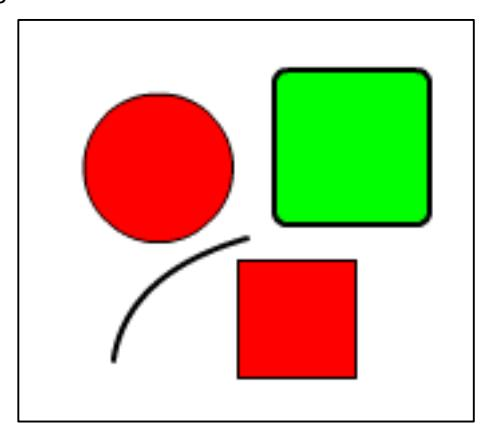

The red circle, red square and green rounded-rectangle are closed paths. The curved line is an open path. The red square consists of all straight edges, the red circle consists of all curved edges, while the rounded rectangle has curved edges interspersed with straight edges.

There are two fill styles, solid green and solid red, and two line styles, 1-pixel black, and 2- pixel black. The red circle and red square share the same fill and line styles. The rounded rectangle and curved line share the same line style.

Here's how to describe this example with the SWF file format.

#### Define the fill styles:

- 1. First, the fill styles are defined with a FILLSTYLEARRAY. The two unique fill styles are solid red and solid green.
- 2. This is followed by a LINESTYLEARRAY that includes the two unique line styles: 1-pixel black, and 2-pixel black.
- 3. This is followed by an array of shape records (see Shape records).

All shape records share a similar structure but can have varied meaning. A shape record can define straight or curved edge, a style change, or it can move the current drawing position.

#### Define the curved line:

- 1. The first shape record selects the 2-pixel-wide line style, and moves the drawing position to the top of the curved line by setting the StateMoveTo flag.
- 2. The next shape record is a curved edge, which ends to the bottom of the line. The path is not closed.

#### Define the red square:

- 1. The next shape record selects the 1-pixel line style and the red fill style. It also moves the drawing position to the upper-left corner of the red rectangle.
- 2. The following four shape records are straight edges. The last edge must end at the upper- left corner. Flash Player requires that closed figures be joined explicitly. That is, the first and last points must be coincident.

#### Define the red circle:

- 1. The next shape record does not change any style settings, but moves the drawing position to the top of the red circle.
- 2. The following eight shape records are curved edges that define the circle. Again, the path must finish where it started.

#### Define the green rounded-rectangle:

- 1. The next shape record selects the 2-pixel-wide line style, and the green fill. It also moves the drawing position to the upper left of the rounded-rectangle.
- 2. The following twelve shape records are a mixture of straight shape records (the sides) interspersed with curved shape records (the rounded corners). The path finishes where it began.

# <span id="page-122-0"></span>**Shape structures**

### <span id="page-122-1"></span>**Fill styles**

The SWF file format supports three basic types of fills for a shape.

- Solid fill A simple RGB or RGBA color that fills a portion of a shape. An alpha value of 255 means a completely opaque fill. An alpha value of zero means a completely transparent fill. Any alpha between 0 and 255 will be partially transparent.
- Gradient Fill A gradient fill can be either a linear or a radial gradient. For an in-depth description of how gradients are defined, see Gradients.
- Bitmap fill Bitmap fills refer to a bitmap characterId. There are two styles: clipped and tiled. A clipped bitmap fill repeats the color on the edge of a bitmap if the fill extends beyond the edge of the bitmap. A tiled fill repeats the bitmap if the fill extends beyond the edge of the bitmap.

### **FILLSTYLEARRAY**

A fill style array enumerates a number of fill styles. The format of a fill style array is described in the following table:

| Field                  | Type                           | Comment                                                                    |
|------------------------|--------------------------------|----------------------------------------------------------------------------|
| FillStyleCount         | UI8                            | Count of fill styles.                                                      |
| FillStyleCountExtended | If FillStyleCount = 0xFF, UI16 | Extended count of fill styles.<br>Supported only for Shape2 and<br>Shape3. |
| FillStyles             | FILLSTYLE[FillStyleCount]      | Array of fill styles.                                                      |

### **FILLSTYLE**

The format of a fill style value within the file is described in the following table:

| Field          | Type                                                           | Comment                                                                 |
|----------------|----------------------------------------------------------------|-------------------------------------------------------------------------|
| FillStyleType  | UI8                                                            | Type of fill style:                                                     |
|                |                                                                | 0x00 = solid fill                                                       |
|                |                                                                | 0x10 = linear gradient fill                                             |
|                |                                                                | 0x12 = radial gradient fill                                             |
|                |                                                                | 0x13 = focal radial gradient fill (SWF<br>8 file format and later only) |
|                |                                                                | 0x40 = repeating bitmap fill                                            |
|                |                                                                | 0x41 = clipped bitmap fill                                              |
|                |                                                                | 0x42 = non-smoothed repeating<br>bitmap                                 |
|                |                                                                | 0x43 = non-smoothed clipped<br>bitmap                                   |
| Color          | If type = 0x00, RGBA (if Shape3);<br>RGB (if Shape1 or Shape2) | Solid fill color with opacity<br>information.                           |
| GradientMatrix | If type = 0x10, 0x12, or 0x13,<br>MATRIX                       | Matrix for gradient fill.                                               |

| Gradient     | If type = 0x10 or 0x12, GRADIENT If<br>type = 0x13, FOCALGRADIENT (SWF<br>8 and later only) | Gradient fill.                   |
|--------------|---------------------------------------------------------------------------------------------|----------------------------------|
| BitmapId     | If type = 0x40, 0x41, 0x42 or 0x43,<br>UI16                                                 | ID of bitmap character for fill. |
| BitmapMatrix | If type = 0x40, 0x41, 0x42 or 0x43,<br>MATRIX                                               | Matrix for bitmap fill.          |

### <span id="page-124-0"></span>**Line styles**

A line style array enumerates a number of line styles.

### **LINESTYLEARRAY**

The format of a line style array is described in the following table:

| Field                  | Type                                                                               | Comment                        |
|------------------------|------------------------------------------------------------------------------------|--------------------------------|
| LineStyleCount         | UI8                                                                                | Count of line styles.          |
| LineStyleCountExtended | If LineStyleCount = 0xFF, UI16                                                     | Extended count of line styles. |
| LineStyles             | If Shape1, Shape2, or Shape3,<br>LINESTYLE[count]. If Shape4,<br>LINESTYLE2[count] | Array of line styles.          |

### **LINESTYLE**

A line style represents a width and color of a line. The format of a line style value within the file is described in the following table:

| Field | Type                                    | Comment                                                        |
|-------|-----------------------------------------|----------------------------------------------------------------|
| Width | UI16                                    | Width of line in twips.                                        |
| Color | RGB (Shape1 or Shape2) RGBA<br>(Shape3) | Color value including alpha channel<br>information for Shape3. |

**Note 1**: Before the introduction of LINESTYLE2 in SWF 8, all lines in the SWF file format have rounded joins and round caps. Different join styles and end styles can be simulated with a very narrow shape that looks identical to the desired stroke.

**Note 2**: The SWF file format has no native support for dashed or dotted line styles. A dashed line can be simulated by breaking up the path into a series of short lines.

### **LINESTYLE2**

LINESTYLE2 builds upon the capabilities of the LINESTYLE record by allowing the use of new types of joins and caps as well as scaling options and the ability to fill a stroke. In order to use LINESTYLE2, the shape must be defined with DefineShape4—not DefineShape, DefineShape2, or DefineShape3.

While the LINESTYLE record permits only rounded joins and round caps, LINESTYLE2 also supports miter and bevel joins, and square caps and no caps. The following diagram illustrates the complete array of joins and caps:

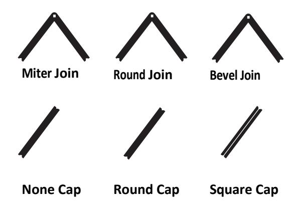

When using LINESTYLE2 for a miter join, a MiterLimitFactor must be specified and is used to calculate the maximum miter length:

Maximum miter length = LINESTYLE2 MiterLimitFactor \* LINESTYLE2 Width If the miter join exceeds the maximum miter length, Flash Player will cut off the miter. Note that MiterLimitFactor is an 8.8 fixed-point value.

LINESTYLE2 also includes the option for pixel hinting to correct blurry vertical or horizontal lines.

| Field         | Type  | Comment                                                        |
|---------------|-------|----------------------------------------------------------------|
| Width         | UI16  | Width of line in twips.                                        |
| StartCapStyle | UB[2] | Start cap style:; 0 = Round cap; 1 =<br>No cap; 2 = Square cap |
| JoinStyle     | UB[2] | Join style: 0 = Round join; 1 = Bevel<br>join; 2 = Miter join  |
| HasFillFlag   | UB[1] | If 1, fill is defined in FillType. If 0,<br>uses Color field.  |
| NoHScaleFlag  | UB[1] | If 1, stroke thickness will not scale if                       |

|                  |                               | the object is scaled horizontally.                                                                                                           |
|------------------|-------------------------------|----------------------------------------------------------------------------------------------------------------------------------------------|
| NoVScaleFlag     | UB[1]                         | If 1, stroke thickness will not scale if<br>the object is scaled vertically.                                                                 |
| PixelHintingFlag | UB[1]                         | If 1, all anchors will be aligned to<br>full pixels.                                                                                         |
| Reserved         | UB[5]                         | Must be 0.                                                                                                                                   |
| NoClose          | UB[1]                         | If 1, stroke will not be closed if the<br>stroke's last point matches its first<br>point. Flash Player will apply caps<br>instead of a join. |
| EndCapStyle      | UB[2]                         | End cap style: 0 = Round cap; 1 =<br>No cap; 2 = Square cap                                                                                  |
| MiterLimitFactor | If JoinStyle = 2, UI16        | Miter limit factor is an 8.8 fixed<br>point value.                                                                                           |
| Color            | If HasFillFlag = 0, RGBA      | Color value including alpha<br>channel.                                                                                                      |
| FillType         | If HasFillFlag = 1, FILLSTYLE | Fill style for this stroke.                                                                                                                  |

## <span id="page-126-0"></span>**Shape structures**

The SHAPE structure defines a shape without fill style or line style information.

### **SHAPE**

SHAPE is used by the DefineFont tag, to define character glyphs.

| Field        | Type                     | Comment                        |
|--------------|--------------------------|--------------------------------|
| NumFillBits  | UB[4]                    | Number of fill index bits.     |
| NumLineBits  | UB[4]                    | Number of line index bits.     |
| ShapeRecords | SHAPERECORD[one or more] | Shape records (see following). |

### **SHAPEWITHSTYLE**

The SHAPEWITHSTYLE structure extends the SHAPE structure by including fill style and line style information.

SHAPEWITHSTYLE is used by the DefineShape tag.

| Field        | Type                     | Comment                        |
|--------------|--------------------------|--------------------------------|
| FillStyles   | FILLSTYLEARRAY           | Array of fill styles.          |
| LineStyles   | LINESTYLEARRAY           | Array of line styles.          |
| NumFillBits  | UB[4]                    | Number of fill index bits.     |
| NumLineBits  | UB[4]                    | Number of line index bits.     |
| ShapeRecords | SHAPERECORD[one or more] | Shape records (see following). |

**Note**: The LINESTYLELARRAY and FILLSTYLEARRAY begin at index 1, not index 0.

The following diagram illustrates the SHAPEWITHSTYLE structure.

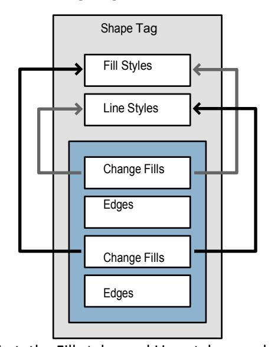

First, the Fill styles and Line styles are defined. These are defined only once and are referred to by array index.

The blue area represents the array of Shape records. The first shape record selects a fill from the fill style array, and moves the drawing position to the start of the shape. This is followed by a series of edge records that define the shape. The next record changes the fill style, and the subsequent edge records are filled using this new style.

This tag is a completely autonomous object. The style change records only refer to fill and line styles that have been defined in this tag.

### **Shape records**

There are four types of shape records:

• End shape record

- Style change record
- Straight edge record
- Curved edge record

Each shape record begins with a TypeFlag. If the TypeFlag is zero, the shape record is a non- edge record, and a further five bits of flag information follow.

### **EndShapeRecord**

The end shape record simply indicates the end of the shape record array. It is a non-edge record with all five flags equal to zero.

| Field      | Type  | Comment                         |
|------------|-------|---------------------------------|
| TypeFlag   | UB[1] | Non-edge record flag. Always 0. |
| EndOfShape | UB[5] | End of shape flag. Always 0.    |

### **StyleChangeRecord**

The style change record is also a non-edge record. It can be used to do the following:

- 1. Select a fill or line style for drawing.
- 2. Move the current drawing position (without drawing).
- 3. Replace the current fill and line style arrays with a new set of styles.

Because fill and line styles often change at the start of a new path, it is useful to perform more than one action in a single record. For example, say a DefineShape tag defines a red circle and a blue square. After the circle is closed, it is necessary to move the drawing position, and replace the red fill with the blue fill. The style change record can achieve this with a single shape record.

| Field           | Type  | Comment                                                            |
|-----------------|-------|--------------------------------------------------------------------|
| TypeFlag        | UB[1] | Non-edge record flag. Always 0.                                    |
| StateNewStyles  | UB[1] | New styles flag. Used by<br>DefineShape2 and DefineShape3<br>only. |
| StateLineStyle  | UB[1] | Line style change flag.                                            |
| StateFillStyle1 | UB[1] | Fill style 1 change flag.                                          |

| StateFillStyle0 | UB[1]                             | Fill style 0 change flag.                       |
|-----------------|-----------------------------------|-------------------------------------------------|
| StateMoveTo     | UB[1]                             | Move to flag.                                   |
| MoveBits        | If StateMoveTo, UB[5]             | Move bit count.                                 |
| MoveDeltaX      | If StateMoveTo, SB[MoveBits]      | Delta X value.                                  |
| MoveDeltaY      | If StateMoveTo, SB[MoveBits]      | Delta Y value.                                  |
| FillStyle0      | If StateFillStyle0, UB[FillBits]  | Fill 0 Style.                                   |
| FillStyle1      | If StateFillStyle1, UB[FillBits]  | Fill 1 Style.                                   |
| LineStyle       | If StateLineStyle, UB[LineBits]   | Line Style.                                     |
| FillStyles      | If StateNewStyles, FILLSTYLEARRAY | Array of new fill styles.                       |
| LineStyles      | If StateNewStyles, LINESTYLEARRAY | Array of new line styles.                       |
| NumFillBits     | If StateNewStyles, UB[4]          | Number of fill index bits<br>for new<br>styles. |
| NumLineBits     | If StateNewStyles, UB[4]          | Number of line index bits for new<br>styles.    |

MoveDeltaX and MoveDeltaY are relative to the shape origin.

The style arrays begin at index 1, not index 0. FillStyle = 1 refers to the first style in the fill style array, FillStyle = 2 refers to the second style in the fill style array, and so on. A fill style index of zero means the path is not filled, and a line style index of zero means the path has no stroke. Initially the fill and line style indices are set to zero no fill or stroke.

### **FillStyle0 and FillStyle1**

The Adobe Flash authoring tool supports two fill styles per edge, one for each side of the edge: FillStyle0 and FillStyle1. For shapes that don't self-intersect or overlap, FillStyle0 should be used. For overlapping shapes the situation is more complex.

For example, if a shape consists of two overlapping squares, and only FillStyle0 is defined, Flash Player renders a 'hole' where the paths overlap. This area can be filled using FillStyle1. In this situation, the rule is that for any directed vector, FillStyle0 is the color to the left of the vector, and FillStyle1 is the color to the right of the vector (as shown in the following diagram).

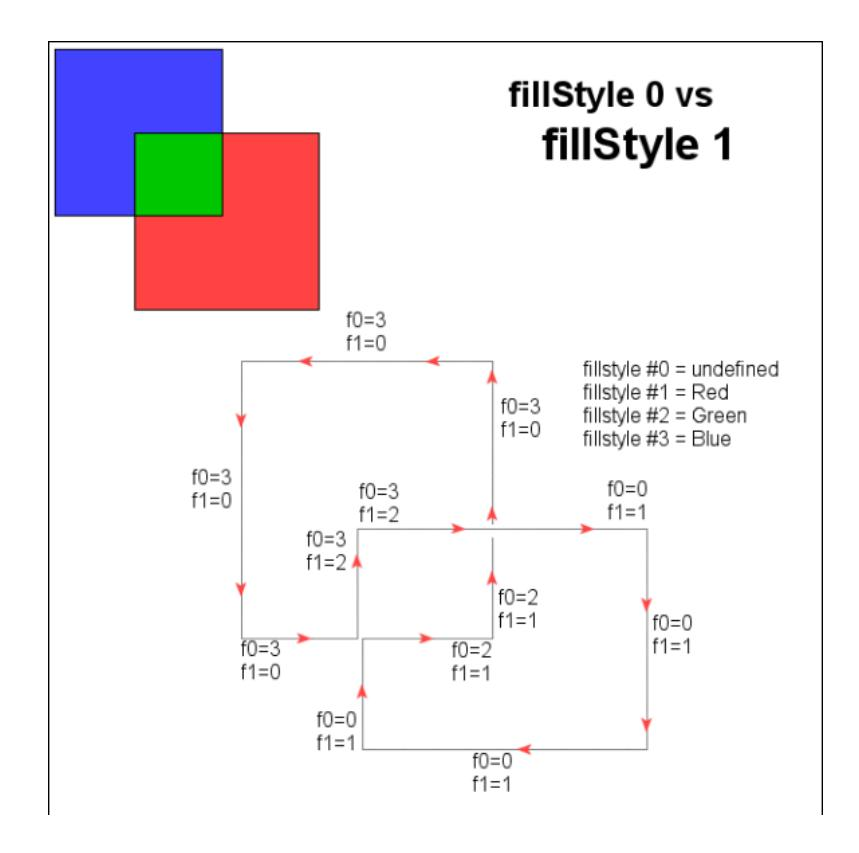

**Note**: FillStyle0 and FillStyle1 should not be confused with FILLSTYLEARRAY indices. FillStyle0 and FillStyle1 are variables that contain indices into the FILLSTYLEARRAY.

### **Edge records**

Edge records have a TypeFlag of 1. There are two types of edge records: straight and curved. The StraightFlag determines the type.

#### *StraightEdgeRecord*

The StraightEdgeRecord stores the edge as an X-Y delta. The delta is added to the current drawing position, and this becomes the new drawing position. The edge is rendered between the old and new drawing positions.

Straight edge records support three types of lines:

- 1. General lines.
- 2. Horizontal lines.
- 3. Vertical lines.

General lines store both X and Y deltas, the horizontal and vertical lines store only the X delta and Y delta respectively.

| Field           | Type                             | Comment                            |
|-----------------|----------------------------------|------------------------------------|
| TypeFlag        | UB[1]                            | This is an edge record. Always 1.  |
| StraightFlag    | UB[1]                            | Straight edge. Always 1.           |
| NumBits         | UB[4]                            | Number of bits per value (2 less   |
|                 |                                  | than the actual number).           |
| GeneralLineFlag | UB[1]                            | General Line equals 1. Vert/Horz   |
|                 |                                  | Line equals 0.                     |
| VertLineFlag    | If GeneralLineFlag = 0,<br>SB[1] | Vertical Line equals 1. Horizontal |
|                 |                                  | Line equals 0.                     |
| DeltaX          | If GeneralLineFlag = 1 or if     | X delta                            |
|                 | VertLineFlag = 0, SB[NumBits+2]  |                                    |
| DeltaY          | If GeneralLineFlag = 1 or if     | Y delta.                           |
|                 | VertLineFlag = 1, SB[NumBits+2]  |                                    |

#### *CurvedEdgeRecord*

The SWF file format differs from most vector file formats by using Quadratic Bezier curves rather than Cubic Bezier curves. PostScript™ uses Cubic Bezier curves, as do most drawing applications.The SWF file format uses Quadratic Bezier curves because they can be stored more compactly, and can be rendered more efficiently.

The following diagram shows a Quadratic Bezier curve and a Cubic Bezier curve.

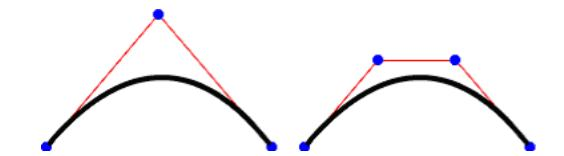

A Quadratic Bezier curve has 3 points: 2 on-curve anchor points, and 1 off-curve control point. A Cubic Bezier curve has 4 points: 2 on-curve anchor points, and 2 off-curve control points.

The curved-edge record stores the edge as two X-Y deltas. The three points that define the

Quadratic Bezier are calculated like this:

- 1. The first anchor point is the current drawing position.
- 2. The control point is the current drawing position + ControlDelta.
- 3. The last anchor point is the current drawing position + ControlDelta + AnchorDelta. The last anchor point becomes the current drawing position.

| Field         | Type          | Comment                           |
|---------------|---------------|-----------------------------------|
| TypeFlag      | UB[1]         | This is an edge record. Always 1. |
| StraightFlag  | UB[1]         | Curved edge. Always 0.            |
| NumBits       | UB[4]         | Number of bits per value (2 less  |
|               |               | than the actual number).          |
| ControlDeltaX | SB[NumBits+2] | X control point change.           |
| ControlDeltaY | SB[NumBits+2] | Y control point change.           |
| AnchorDeltaX  | SB[NumBits+2] | X anchor point change.            |
| AnchorDeltaY  | SB[NumBits+2] | Y anchor point change.            |

#### *Converting between quadratic and cubic Bezier curves*

Replace the single off-curve control point of the quadratic Bezier curve with two new off-curve control points for the cubic Bezier curve. Place each new off-curve control point along the line between one of the on-curve anchor points and the original off-curve control point. The new off-curve control points should be 2/3 of the way from the on-curve anchor point to the original off-curve control point. The diagram of quadratic and cubic Bezier curves above illustrates this substitution.

A cubic Bezier curve can be approximated only with a quadratic Bezier curve, because you are going from a third-order curve to a second-order curve. This involves recursive subdivision of the curve, until the cubic curve and the quadratic equivalent are matched within some arbitrary tolerance.

For a discussion of how to approximate cubic Bezier curves with quadratic Bezier curves see the following:

- Converting Bezier Curves to Quadratic Splines at [stevehollasch.com/cgindex/curves/cbez](http://stevehollasch.com/cgindex/curves/cbez-quadspline.html)[quadspline.html](http://stevehollasch.com/cgindex/curves/cbez-quadspline.html)
- TrueType Reference Manual, Converting Outlines to the TrueType Format at [developer.apple.com/fonts/TTRefMan/RM08/appendixE.html](http://developer.apple.com/fonts/TTRefMan/RM08/appendixE.html)

### <span id="page-132-0"></span>**Shape tags**

### <span id="page-132-1"></span>**DefineShape**

The DefineShape tag defines a shape for later use by control tags such as PlaceObject. The ShapeId uniquely identifies this shape as 'character' in the Dictionary. The ShapeBounds field is the rectangle that completely encloses the shape. The SHAPEWITHSTYLE structure includes all the paths, fill styles and line styles that make up the shape.

The minimum file format version is SWF 1.

| Field       | Type           | Comment               |
|-------------|----------------|-----------------------|
| Header      | RECORDHEADER   | Tag type = 2.         |
| ShapeId     | UI16           | ID for this character |
| ShapeBounds | RECT           | Bounds of the shape.  |
| Shapes      | SHAPEWITHSTYLE | Shape information.    |

### <span id="page-133-0"></span>**DefineShape2**

DefineShape2 extends the capabilities of DefineShape with the ability to support more than 255 styles in the style list and multiple style lists in a single shape. The minimum file format version is SWF 2.

| Field       | Type           | Comment                |
|-------------|----------------|------------------------|
| Header      | RECORDHEADER   | Tag type = 22.         |
| ShapeId     | UI16           | ID for this character. |
| ShapeBounds | RECT           | Bounds of the shape.   |
| Shapes      | SHAPEWITHSTYLE | Shape information.     |

### <span id="page-133-1"></span>**DefineShape3**

DefineShape3 extends the capabilities of DefineShape2 by extending all of the RGB color fields to support RGBA with opacity information.

The minimum file format version is SWF 3.

| Field       | Type           | Comment                |
|-------------|----------------|------------------------|
| Header      | RECORDHEADER   | Tag type = 32.         |
| ShapeId     | UI16           | ID for this character. |
| ShapeBounds | RECT           | Bounds of the shape.   |
| Shapes      | SHAPEWITHSTYLE | Shape information.     |

### <span id="page-133-2"></span>**DefineShape4**

DefineShape4 extends the capabilities of DefineShape3 by using a new line style record in the shape. LINESTYLE2

allows new types of joins and caps as well as scaling options and the ability to fill a stroke.

DefineShape4 specifies not only the shape bounds but also the edge bounds of the shape. While the shape bounds are calculated along the outside of the strokes, the edge bounds are taken from the outside of the edges, as shown in the following diagram. The EdgeBounds field assists Flash Player in accurately determining certain layouts.

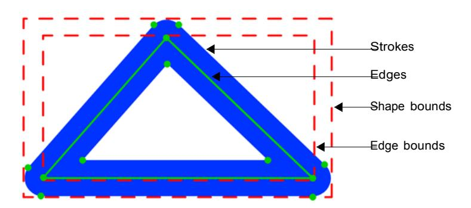

In addition, DefineShape4 includes new hinting flags UsesNonScalingStrokes and UsesScalingStrokes. These flags assist Flash Player in creating the best possible area for invalidation.

The minimum file format version is SWF 8.

| Field                 | Type           | Comment                                                               |
|-----------------------|----------------|-----------------------------------------------------------------------|
| Header                | RECORDHEADER   | Tag type = 83.                                                        |
| ShapeId               | UI16           | ID for this character.                                                |
| ShapeBounds           | RECT           | Bounds of the shape.                                                  |
| EdgeBounds            | RECT           | Bounds of the shape, excluding<br>strokes.                            |
| Reserved              | UB[5]          | Must be 0.                                                            |
| UsesFillWindingRule   | UB[1]          | If 1, use fill winding rule. Minimum<br>file format version is SWF 10 |
| UsesNonScalingStrokes | UB[1]          | If 1, the shape contains at least one<br>non-scaling stroke.          |
| UsesScalingStrokes    | UB[1]          | If 1, the shape contains at least one<br>scaling stroke.              |
| Shapes                | SHAPEWITHSTYLE | Shape information.                                                    |

# <span id="page-135-0"></span>**Chapter 7: Gradients**

Gradients are a special type of shape fill for SWF shapes. They create ramps of colors that interpolate between two or more fixed colors.

Here is an overview of the SWF gradient model:

- There are two styles of gradient: Linear and Radial. In addition, with the SWF 8 file format, a new radial gradient type is added to allow the focal point to be set.
- Each gradient has its own transformation matrix, and can be transformed independently of its parent shape.
- A gradient can have up to eight control points in SWF 7 file format and previous versions, or up to fifteen control points in SWF 8 and later. Colors are interpolated between the control points to create the color ramp.
- Each control point is defined by a ratio and an RGBA color. The ratio determines the position of the control point in the gradient; the RGBA value determines its color.

Following are some examples of SWF gradients (from left to right):

- A simple white-to-black linear gradient.
- A simple white-to-black radial gradient.
- A "rainbow" gradient consisting of seven control points; red, yellow, green, cyan, blue, purple, and red.
- A three-point gradient, where the end points are opaque and the center point is transparent. The result is a gradient in the alpha-channel that allows the diamond shape in the background to show through.

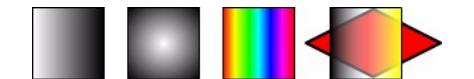

# <span id="page-135-1"></span>**Gradient transformations**

All gradients are defined in a standard space called the gradient square. The gradient square is centered at (0,0), and extends from (-16384,-16384) to (16384,16384).

Each gradient is mapped from the gradient square to the display surface using a standard transformation matrix. This matrix is stored in the FILLSTYLE structure.

**Example**: In the following diagram a linear gradient is mapped onto a circle 4096 units in diameter, and centered at (2048,2048).

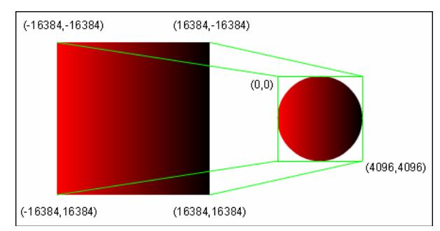

The 2x3 MATRIX required for this mapping is:

```
| 0.125 0.000 |
| 0.000 0.125 |
| 2048.000 2048.000 |
```

The gradient is scaled to one-eighth of its original size (32768 / 4096 = 8), and translated to (2048, 2048).

# <span id="page-136-0"></span>**Gradient control points**

The position of a control point in the gradient is determined by a ratio value between 0 and 255. For a linear gradient, a ratio of zero maps to the left side of the gradient square, and a ratio of 255 maps to the right side. For a radial gradient, a ratio of zero maps to the center point of the gradient square, and a ratio of 255 maps to the largest circle that fits inside the gradient square.

The color of a control point is determined by an RGBA value. An alpha value of zero means the gradient is completely transparent at this point. An alpha value of 255 means the gradient is completely opaque at this point.

Control points are sorted by ratio, with the smallest ratio first.

# <span id="page-136-1"></span>**Gradient structures**

The gradient structures are part of the FILLSTYLE structure.

### <span id="page-136-2"></span>**GRADIENT**

SWF 8 and later supports up to 15 gradient control points, spread modes and a new interpolation type.

Note that for the DefineShape, DefineShape2 or DefineShape3 tags, the SpreadMode and InterpolationMode fields must be 0, and the NumGradients field cannot exceed 8.

| Field | Type | Comment |
|-------|------|---------|
|       |      |         |

| SpreadMode        | UB[2]              | 0 = Pad mode; 1 = Reflect mode; 2  |
|-------------------|--------------------|------------------------------------|
|                   |                    | = Repeat mode; 3 = Reserved        |
| InterpolationMode | UB[2]              | 0 = Normal RGB mode                |
|                   |                    | interpolation; 1 = Linear RGB mode |
|                   |                    | interpolation; 2 and 3 = Reserved  |
| NumGradients      | UB[4]              | 1 to 15                            |
| GradientRecords   | GRADRECORD[nGrads] | Gradient records (see following)   |

### <span id="page-137-0"></span>**FOCALGRADIENT**

A FOCALGRADIENT must be declared in DefineShape4—not DefineShape, DefineShape2 or DefineShape3.

The value range is from -1.0 to 1.0, where -1.0 means the focal point is close to the left border of the radial gradient circle, 0.0 means that the focal point is in the center of the radial gradient circle, and 1.0 means that the focal point is close to the right border of the radial gradient circle.

| Field             | Type               | Comment                                                                                     |
|-------------------|--------------------|---------------------------------------------------------------------------------------------|
| SpreadMode        | UB[2]              | 0 = Pad mode; 1 = Reflect mode; 2 = Repeat mode; 3 =<br>Reserved                            |
| InterpolationMode | UB[2]              | 0 = Normal RGB mode interpolation; 1 = Linear RGB mode<br>interpolation; 2 and 3 = Reserved |
| NumGradients      | UB[4]              | 1 to 15                                                                                     |
| GradientRecords   | GRADRECORD[nGrads] | Gradient records (see following)                                                            |
| FocalPoint        | FIXED8             | Focal point location                                                                        |

### <span id="page-137-1"></span>**GRADRECORD**

The GRADRECORD defines a gradient control point:

| Field | Type                                    | Comment           |
|-------|-----------------------------------------|-------------------|
| Ratio | UI8                                     | Ratio value       |
| Color | RGB (Shape1 or Shape2) RGBA<br>(Shape3) | Color of gradient |

# <span id="page-138-0"></span>**Chapter 8: Bitmaps**

The SWF file format specification supports a variety of bitmap formats. All bitmaps are compressed to reduce file size. Lossy compression, best for imprecise images such as photographs, is provided by JPEG bitmaps; lossless compression, best for precise images such as diagrams, icons, or screen captures, is provided by ZLIB bitmaps. Both types of bitmaps can optionally contain alpha channel (opacity) information.

The JPEG format, officially defined as ITU T.81 or ISO/IEC 10918-1, is an open standard developed by the Independent Joint Photographic Experts Group. The JPEG format is not described in this document. For general information on the JPEG format, see JPEG at [www.jpeg.org/.](http://www.jpeg.org/) For a specification of the JPEG format, see the International Telecommunication Union a[t www.itu.int/ a](http://www.itu.int/)nd search for recommendation T.81. The JPEG data in SWF files is encoded using the JPEG Interchange Format specified in Annex B. Flash Player also understands the popular JFIF format, an extension of the JPEG Interchange Format.

In all cases where arrays of non-JPEG pixel data are stored in bitmap tags, the pixels appear in row-major order, reading like English text, proceeding left to right within rows and top to bottom overall.

# <span id="page-138-1"></span>**DefineBits**

This tag defines a bitmap character with JPEG compression. It contains only the JPEG compressed image data (from the Frame Header onward). A separate JPEGTables tag contains the JPEG encoding data used to encode this image (the Tables/Misc segment).

**Note**: Only one JPEGTables tag is allowed in a SWF file, and thus all bitmaps defined with DefineBits must share common encoding tables.

The data in this tag begins with the JPEG SOI marker 0xFF, 0xD8 and ends with the EOI marker 0xFF, 0xD9. Before version 8 of the SWF file format, SWF files could contain an erroneous header of 0xFF, 0xD9, 0xFF, 0xD8 before the JPEG SOI marker.

The minimum file format version for this tag is SWF 1.

| Field       | Type                 | Comment               |
|-------------|----------------------|-----------------------|
| Header      | RECORDHEADER (long)  | Tag type = 6          |
| CharacterID | UI16                 | ID for this character |
| JPEGData    | UI8[image data size] | JPEG compressed image |

# <span id="page-138-2"></span>**JPEGTables**

This tag defines the JPEG encoding table (the Tables/Misc segment) for all JPEG images defined using the

DefineBits tag. There may only be one JPEGTables tag in a SWF file.

The data in this tag begins with the JPEG SOI marker 0xFF, 0xD8 and ends with the EOI marker 0xFF, 0xD9. Before version 8 of the SWF file format, SWF files could contain an erroneous header of 0xFF, 0xD9, 0xFF, 0xD8 before the JPEG SOI marker.

The minimum file format version for this tag is SWF 1.

| Field    | Type                    | Comment             |
|----------|-------------------------|---------------------|
| Header   | RECORDHEADER            | Tag type = 8        |
| JPEGData | UI8[encoding data size] | JPEG encoding table |

# <span id="page-139-0"></span>**DefineBitsJPEG2**

This tag defines a bitmap character with JPEG compression. It differs from DefineBits in that it contains both the JPEG encoding table and the JPEG image data. This tag allows multiple JPEG images with differing encoding tables to be defined within a single SWF file.

The data in this tag begins with the JPEG SOI marker 0xFF, 0xD8 and ends with the EOI marker 0xFF, 0xD9. Before version 8 of the SWF file format, SWF files could contain an erroneous header of 0xFF, 0xD9, 0xFF, 0xD8 before the JPEG SOI marker.

In addition to specifying JPEG data, DefineBitsJPEG2 can also contain PNG image data and non-animated GIF89a image data.

- If ImageData begins with the eight bytes 0x89 0x50 0x4E 0x47 0x0D 0x0A 0x1A 0x0A, the ImageData contains PNG data.
- If ImageData begins with the six bytes 0x47 0x49 0x46 0x38 0x39 0x61, the ImageData contains GIF89a data.

The minimum file format version for this tag is SWF 2. The minimum file format version for embedding PNG of GIF89a data is SWF 8.

| Field       | Type                | Comment                                                        |
|-------------|---------------------|----------------------------------------------------------------|
| Header      | RECORDHEADER (long) | Tag type = 21                                                  |
| CharacterID | UI16                | ID for this character                                          |
| ImageData   | UI8[data size]      | Compressed image data in either<br>JPEG, PNG, or GIF89a format |

# <span id="page-140-0"></span>**DefineBitsJPEG3**

This tag defines a bitmap character with JPEG compression. This tag extends DefineBitsJPEG2, adding alpha channel (opacity) data. Opacity/transparency information is not a standard feature in JPEG images, so the alpha channel information is encoded separately from the JPEG data, and compressed using the ZLIB standard for compression. The data format used by the ZLIB library is described by Request for Comments (RFCs) documents 1950 to 1952.

The data in this tag begins with the JPEG SOI marker 0xFF, 0xD8 and ends with the EOI marker 0xFF, 0xD9. Before version 8 of the SWF file format, SWF files could contain an erroneous header of 0xFF, 0xD9, 0xFF, 0xD8 before the JPEG SOI marker.

In addition to specifying JPEG data, DefineBitsJPEG2 can also contain PNG image data and non-animated GIF89a image data.

- If ImageData begins with the eight bytes 0x89 0x50 0x4E 0x47 0x0D 0x0A 0x1A 0x0A, the ImageData contains PNG data.
- If ImageData begins with the six bytes 0x47 0x49 0x46 0x38 0x39 0x61, the ImageData contains GIF89a data.

If ImageData contains PNG or GIF89a data, the optional BitmapAlphaData is not supported.

The minimum file format version for this tag is SWF 3. The minimum file format version for embedding PNG of GIF89a data is SWF 8.

| Field           | Type                 | Comment                                                                                                                                                                              |
|-----------------|----------------------|--------------------------------------------------------------------------------------------------------------------------------------------------------------------------------------|
| Header          | RECORDHEADER (long)  | Tag type = 35.                                                                                                                                                                       |
| CharacterID     | UI16                 | ID for this character.                                                                                                                                                               |
| AlphaDataOffset | UI32                 | Count of bytes in ImageData.                                                                                                                                                         |
| ImageData       | UI8[data size]       | Compressed image data in either JPEG, PNG, or GIF89a<br>format                                                                                                                       |
| BitmapAlphaData | UI8[alpha data size] | ZLIB compressed array of alpha data. Only supported when<br>tag contains JPEG data. One byte per pixel. Total size after<br>decompression must equal (width * height) of JPEG image. |

# <span id="page-140-1"></span>**DefineBitsLossless**

Defines a lossless bitmap character that contains RGB bitmap data compressed with ZLIB. The data format used by the ZLIB library is described by Request for Comments (RFCs) documents 1950 to 1952.

Two kinds of bitmaps are supported. Colormapped images define a colormap of up to 256 colors, each represented by a 24-bit RGB value, and then use 8-bit pixel values to index into the colormap. Direct images store actual pixel color values using 15 bits (32,768 colors) or 24 bits (about 17 million colors).

The minimum file format version for this tag is SWF 2.

| Field                | Type                                 | Comment                                                                |
|----------------------|--------------------------------------|------------------------------------------------------------------------|
| Header               | RECORDHEADER (long)                  | Tag type = 20                                                          |
| CharacterID          | UI16                                 | ID for this character                                                  |
| BitmapFormat         | UI8                                  | Format of compressed data:                                             |
|                      |                                      | 3 = 8-bit colormapped image                                            |
|                      |                                      | 4 = 15-bit RGB image                                                   |
|                      |                                      | 5 = 24-bit RGB image                                                   |
| BitmapWidth          | UI16                                 | Width of bitmap image                                                  |
| BitmapHeight         | UI16                                 | Height of bitmap image                                                 |
| BitmapColorTableSize | If BitmapFormat = 3                  | This value is one less than the actual                                 |
|                      | UI8; Otherwise absent                | number of colors in the color table,<br>allowing for up to 256 colors. |
| ZlibBitmapData       | If BitmapFormat = 3, COLORMAPDATA    | ZLIB compressed bitmap data                                            |
|                      | If BitmapFormat = 4 or 5, BITMAPDATA |                                                                        |

The COLORMAPDATA and BITMAPDATA structures contain image data. These structures are each compressed as a single block of data. Their layouts before compression follow.

**Note**: Row widths in the pixel data fields of these structures must be rounded up to the next 32-bit word boundary. For example, an 8-bit image that is 253 pixels wide must be padded out to 256 bytes per line. To determine the appropriate padding, make sure to take into account the actual size of the individual pixel structures; 15-bit pixels occupy 2 bytes and 24-bit pixels occupy 4 bytes (see PIX15 and PIX24).

| COLORMAPDATA  |                       |                                                                                                          |
|---------------|-----------------------|----------------------------------------------------------------------------------------------------------|
| Field         | Type                  | Comment                                                                                                  |
| ColorTableRGB | RGB[color table size] | Defines the mapping from color<br>indices to RGB values. Number of<br>RGB values is BitmapColorTableSize |

|                   |                      | + 1.                              |
|-------------------|----------------------|-----------------------------------|
|                   |                      |                                   |
| ColormapPixelData | UI8[image data size] | Array of color indices. Number of |
|                   |                      | entries is BitmapWidth *          |
|                   |                      | BitmapHeight, subject to padding  |
|                   |                      | (see note preceding this table).  |
|                   |                      |                                   |

| BITMAPDATA      |                                                                                               |                                                                                                                       |  |
|-----------------|-----------------------------------------------------------------------------------------------|-----------------------------------------------------------------------------------------------------------------------|--|
| Field           | Type                                                                                          | Comment                                                                                                               |  |
| BitmapPixelData | If BitmapFormat = 4, PIX15[image<br>data size] If BitmapFormat = 5,<br>PIX24[image data size] | Array of pixel colors. Number of<br>entries is BitmapWidth *<br>BitmapHeight, subject to padding<br>(see note above). |  |

| PIX15         |       |             |
|---------------|-------|-------------|
| Field         | Type  | Comment     |
| Pix15Reserved | UB[1] | Always 0    |
| Pix15Red      | UB[5] | Red value   |
| Pix15Green    | UB[5] | Green value |
| Pix15Blue     | UB[5] | Blue value  |

| PIX24         |      |             |
|---------------|------|-------------|
| Field         | Type | Comment     |
| Pix24Reserved | UI8  | Always 0    |
| Pix24Red      | UI8  | Red value   |
| Pix24Green    | UI8  | Green value |
| Pix24Blue     | UI8  | Blue value  |

# <span id="page-143-0"></span>**DefineBitsLossless2**

DefineBitsLossless2 extends DefineBitsLossless with support for opacity (alpha values). The colormap colors in colormapped images are defined using RGBA values, and direct images store 32-bit ARGB colors for each pixel. The intermediate 15-bit color depth is not available in DefineBitsLossless2.

The minimum file format version for this tag is SWF 3.

| Field                | Type                                       | Comment                                |
|----------------------|--------------------------------------------|----------------------------------------|
| Header               | RECORDHEADER (long)                        | Tag type = 36                          |
| CharacterID          | UI16                                       | ID for this character                  |
| BitmapFormat         | UI8                                        | Format of compressed data              |
|                      |                                            | 3 = 8-bit colormapped image            |
|                      |                                            | 5 = 32-bit ARGB image                  |
| BitmapWidth          | UI16                                       | Width of bitmap image                  |
| BitmapHeight         | UI16                                       | Height of bitmap image                 |
| BitmapColorTableSize | If BitmapFormat = 3, UI8; Otherwise absent | This value is one less than the actual |
|                      |                                            | number of colors in the color table,   |
|                      |                                            | allowing for up to 256 colors.         |
| ZlibBitmapData       | If BitmapFormat = 3, ALPHACOLORMAPDATA     | ZLIB compressed bitmap data            |
|                      | If BitmapFormat = 4 or 5, ALPHABITMAPDATA  |                                        |

The COLORMAPDATA and BITMAPDATA structures contain image data. These structures are each compressed as a single block of data. Their layouts before compression follow.

**Note**: Row widths in the pixel data field of ALPHACOLORMAPDATA must be rounded up to the next 32-bit word boundary. For example, an 8-bit image that is 253 pixels wide must be padded out to 256 bytes per line. Row widths in ALPHABITMAPDATA are always 32-bit aligned because the ARGB structure is 4 bytes.

| ALPHACOLORMAPDATA |                        |                                                                                                              |
|-------------------|------------------------|--------------------------------------------------------------------------------------------------------------|
| Field             | Type                   | Comment                                                                                                      |
| ColorTableRGB     | RGBA[color table size] | Defines the mapping from color indices to RGBA values.<br>Number of RGBA values is BitmapColorTableSize + 1. |

| ColormapPixelData | UI8[image data size] | Array of color indices. Number of entries is BitmapWidth |
|-------------------|----------------------|----------------------------------------------------------|
|                   |                      | * BitmapHeight, subject to padding (see note preceding   |
|                   |                      | this table).                                             |
|                   |                      |                                                          |

| ALPHABITMAPDATA |                       |                                                                                                                                                  |
|-----------------|-----------------------|--------------------------------------------------------------------------------------------------------------------------------------------------|
| Field           | hType                 | Comment                                                                                                                                          |
| BitmapPixelData | ARGB[image data size] | Array of pixel colors. Number of entries is BitmapWidth *<br>BitmapHeight. The RGB data must already be multiplied<br>bythe alpha channel value. |

# <span id="page-144-0"></span>**DefineBitsJPEG4**

This tag defines a bitmap character with JPEG compression. This tag extends DefineBitsJPEG3, adding a deblocking parameter. While this tag also supports PNG and GIF89a data, the deblocking filter is not applied to such data.

The minimum file format version for this tag is SWF 10.

| Field           | Type                 | Comment                                                                                                                                                                                     |
|-----------------|----------------------|---------------------------------------------------------------------------------------------------------------------------------------------------------------------------------------------|
| Header          | RECORDHEADER (long)  | Tag type = 90.                                                                                                                                                                              |
| CharacterID     | UI16                 | ID for this character.                                                                                                                                                                      |
| AlphaDataOffset | UI32                 | Count of bytes in ImageData.                                                                                                                                                                |
| DeblockParam    | UI16                 | Parameter to be fed into the deblocking filter. The<br>parameter describes a relative strength of the<br>deblocking filter from 0-100% expressed in a normalized<br>8.8 fixed point format. |
| ImageData       | UI8[data size]       | Compressed image data in either JPEG, PNG, or GIF89a<br>format.                                                                                                                             |
| BitmapAlphaData | UI8[alpha data size] | ZLIB compressed array of alpha data. Only supported<br>when tag contains JPEG data. One byte per pixel. Total<br>size after decompression must equal (width * height) of<br>JPEG image.     |

# <span id="page-145-0"></span>**Chapter 9: Shape Morphing**

Shape morphing is the metamorphosis of one shape into another over time. The SWF file format specification supports a flexible morphing model, which allows a number of shape attributes to vary during the morph. The SWF file format defines only the start and end states of the morph. Adobe Flash Player is responsible for interpolating between the endpoints and generating the 'in-between' states.

The following shape attributes can be varied during the morph:

- The position of each edge in the shape.
- The color and thickness of the outline.
- The fill color of the shape (if filled with a color).
- The bitmap transform (if filled with a bitmap).
- The gradient transform (if filled with a gradient).
- The color and position of each point in the gradient (if filled with a gradient).

The following restrictions apply to morphing:

- The start and end shapes must have the same number of edges.
- The start and end shapes must have the same type of fill (that is, solid, gradient or bitmap).
- The style change records must be the same for the start and end shapes.
- If filled with a bitmap, both shapes must be filled with the same bitmap.
- If filled with a gradient, both gradients must have the same number of color points.

The following illustration shows a morph from a blue rectangle to a red quadrilateral over five frames. The green outlines represent the 'in-between' shapes of the morph sequence. Both shapes have the same number of points, and the same type of fill, namely a solid fill. Besides changing shape, the shape also gradually changes color from blue to red.

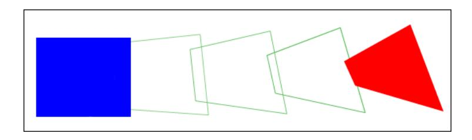

There are two tags involved in defining and playing a morph sequence:

- DefineMorphShape
- PlaceObject2

DefineMorphShape defines the start and end states of the morph. A morph object does not use previously defined shapes; it is considered a special type of shape with only one character ID. DefineMorphShape contains a list of edges for both the start and end shapes. It also defines the fill and line styles, as they are at the start and end of the morph sequence.

The PlaceObject 2 tag displays the morph object at some point in time during the morph sequence. The ratio field controls how far the morph has progressed. A ratio of zero produces a shape identical to the start condition. A ratio of 65535 produces a shape identical to the end condition.

# <span id="page-146-0"></span>**DefineMorphShape**

The DefineMorphShape tag defines the start and end states of a morph sequence. A morph object should be displayed with the PlaceObject2 tag, where the ratio field specifies how far the morph has progressed.

The minimum file format version is SWF 3.

| Field           | Type                | Comment                                                                                                                                                                                            |
|-----------------|---------------------|----------------------------------------------------------------------------------------------------------------------------------------------------------------------------------------------------|
| Header          | RECORDHEADER        | Tag type = 46                                                                                                                                                                                      |
| CharacterId     | UI16                | ID for this character                                                                                                                                                                              |
| StartBounds     | RECT                | Bounds of the start shape                                                                                                                                                                          |
| EndBounds       | RECT                | Bounds of the end shape                                                                                                                                                                            |
| Offset          | UI32                | Indicates offset to EndEdges                                                                                                                                                                       |
| MorphFillStyles | MORPHFILLSTYLEARRAY | Fill style information is stored in the same manner as for a<br>standard shape; however, each fill consists of interleaved<br>information based on a single style type to accommodate<br>morphing. |
| MorphLineStyles | MORPHLINESTYLEARRAY | Line style information is stored in the same manner as for a<br>standard shape; however, each line consists of interleaved<br>information based on a single style type to accommodate<br>morphing. |
| StartEdges      | SHAPE               | Contains the set of edges and the style bits that indicate style<br>changes (for example, MoveTo, FillStyle, and LineStyle). Number                                                                |

|          |       | of edges must equal the number of edges in EndEdges.                                                                        |
|----------|-------|-----------------------------------------------------------------------------------------------------------------------------|
| EndEdges | SHAPE | Contains only the set of edges, with no style information.<br>Number of edges must equal the number of edges in StartEdges. |

- StartBounds This defines the bounding-box of the shape at the start of the morph.
- EndBounds This defines the bounding-box at the end of the morph.
- MorphFillStyles This contains an array of interleaved fill styles for the start and end shapes. The fill style for the start shape is followed by the corresponding fill style for the end shape.
- MorphLineStyles This contains an array of interleaved line styles.
- StartEdges This array specifies the edges for the start shape, and the style change records for both shapes. Because the StyleChangeRecords must be the same for the start and end shapes, they are defined only in the StartEdges array.
- EndEdges This array specifies the edges for the end shape, and contains no style change records. The number of edges specified in StartEdges must equal the number of edges in EndEdges.

Strictly speaking, MoveTo records fall into the category of StyleChangeRecords; however, they should be included in both the StartEdges and EndEdges arrays.

It is possible for an edge to change type over the course of a morph sequence. A straight edge can become a curved edge and vice versa. In this case, think of both edges as curved. A straight edge can be easily represented as a curve, by placing the off-curve (control) point at the midpoint of the straight edge, and the on-curve (anchor) point at the end of the straight edge. The calculation is as follows:

```
CurveControlDelta.x = StraightDelta.x / 2; 
CurveControlDelta.y = StraightDelta.y / 2; 
CurveAnchorDelta.x = StraightDelta.x / 2; 
CurveAnchorDelta.y = StraightDelta.y / 2;
```

# <span id="page-147-0"></span>**DefineMorphShape2**

The DefineMorphShape2 tag extends the capabilities of DefineMorphShape by using a new morph line style record in the morph shape. MORPHLINESTYLE2 allows the use of new types of joins and caps as well as scaling options and the ability to fill the strokes of the morph shape.

DefineMorphShape2 specifies not only the shape bounds but also the edge bounds of the shape. While the shape bounds are calculated along the outside of the strokes, the edge bounds are taken from the outside of the edges. For an example of shape bounds versus edge bounds, see the diagram in DefineShape4. The new StartEdgeBounds and EndEdgeBounds fields assist Flash Player in accurately determining certain layouts.

In addition, DefineMorphShape2 includes new hinting information, UsesNonScalingStrokes and UsesScalingStrokes. These flags assist Flash Player in creating the best possible area for invalidation.

The minimum file format version is SWF 8.

| Field                 | Type                | Comment                                                                                                                                                                                            |
|-----------------------|---------------------|----------------------------------------------------------------------------------------------------------------------------------------------------------------------------------------------------|
| Header                | RECORDHEADER        | Tag type = 84                                                                                                                                                                                      |
| CharacterId           | UI16                | ID for this character                                                                                                                                                                              |
| StartBounds           | RECT                | Bounds of the start shape                                                                                                                                                                          |
| EndBounds             | RECT                | Bounds of the end shape                                                                                                                                                                            |
| StartEdgeBounds       | RECT                | Bounds of the start shape, excluding strokes                                                                                                                                                       |
| EndEdgeBounds         | RECT                | Bounds of the end shape, excluding strokes                                                                                                                                                         |
| Reserved              | UB[6]               | Must be 0                                                                                                                                                                                          |
| UsesNonScalingStrokes | UB[1]               | If 1, the shape contains at least one non-scaling stroke.                                                                                                                                          |
| UsesScalingStrokes    | UB[1]               | If 1, the shape contains at least one scaling stroke.                                                                                                                                              |
| Offset                | UI32                | Indicates offset to EndEdges                                                                                                                                                                       |
| MorphFillStyles       | MORPHFILLSTYLEARRAY | Fill style information is stored in the same manner as<br>for a standard shape; however, each fill consists of<br>interleaved information based on a single style type to<br>accommodate morphing. |
| MorphLineStyles       | MORPHLINESTYLEARRAY | Line style information is stored in the same manner as<br>for a standard shape; however, each line consists of<br>interleaved information based on a single style type to<br>accommodate morphing. |
| StartEdges            | SHAPE               | Contains the set of edges and the style bits that<br>indicate style changes (for example, MoveTo, FillStyle,<br>and LineStyle). Number of edges must equal the<br>number of edges in EndEdges.     |
| EndEdges              | SHAPE               | Contains only the set of edges, with no style<br>information. Number of edges must equal the number<br>of edges in StartEdges.                                                                     |

# <span id="page-149-0"></span>**Morph fill styles**

### <span id="page-149-1"></span>**MORPHFILLSTYLEARRAY**

A morph fill style array enumerates a number of fill styles.

| Field                  | Type                  | Comment                        |
|------------------------|-----------------------|--------------------------------|
| FillStyleCount         | Count = UI8           | Count of fill styles.          |
| FillStyleCountExtended | If Count = 0xFF UI16  | Extended count of fill styles. |
| FillStyles             | MORPHFILLSTYLE[count] | Array of fill styles.          |

### <span id="page-149-2"></span>**MORPHFILLSTYLE**

A fill style represents how a closed shape is filled in.

| Field               | Type                           | Comment                                                                 |
|---------------------|--------------------------------|-------------------------------------------------------------------------|
| FillStyleType       | UI8                            | Type of fill style:                                                     |
|                     |                                | 0x00 = solid fill                                                       |
|                     |                                | 0x10 = linear gradient fill                                             |
|                     |                                | 0x12 = radial gradient fill                                             |
|                     |                                | 0x13 = focal radial gradient fill (SWF 8 file format<br>and later only) |
|                     |                                | 0x40 = repeating bitmap                                                 |
|                     |                                | 0x41 = clipped bitmap fill                                              |
|                     |                                | 0x42 = non-smoothed repeating bitmap                                    |
|                     |                                | 0x43 = non-smoothed clipped bitmap                                      |
| StartColor          | If type = 0x00, RGBA           | Solid fill color with opacity information for start<br>shape.           |
| EndColor            | If type = 0x00, RGBA           | Solid fill color with opacity information for end<br>shape.             |
| StartGradientMatrix | If type = 0x10 or 0x12, MATRIX | Matrix for gradient fill for start shape.                               |

| EndGradientMatrix | If type = 0x10 or 0x12, MATRIX                | Matrix for gradient fill for end shape. |
|-------------------|-----------------------------------------------|-----------------------------------------|
| Gradient          | If type = 0x10 or 0x12,<br>MORPHGRADIENT      | Gradient fill.                          |
| BitmapId          | If type = 0x40, 0x41, 0x42 or<br>0x43, UI16   | ID of bitmap character for fill.        |
| StartBitmapMatrix | If type = 0x40, 0x41, 0x42 or<br>0x43, MATRIX | Matrix for bitmap fill for start shape. |
| EndBitmapMatrix   | If type = 0x40, 0x41, 0x42 or<br>0x43, MATRIX | Matrix for bitmap fill for end shape.   |

# <span id="page-150-0"></span>**Morph gradient values**

Morph gradient values control gradient information for a fill style.

### <span id="page-150-1"></span>**MORPHGRADIENT**

The format of gradient information is described in the following table:

| Field           | Type                           | Comment                           |
|-----------------|--------------------------------|-----------------------------------|
| NumGradients    | UI8                            | 1 to 8.                           |
| GradientRecords | MORPHGRADRECORD [NumGradients] | Gradient records (see following). |

## <span id="page-150-2"></span>**MORPHGRADRECORD**

The gradient record format is described in the following table:

| Field      | Type | Comment                            |
|------------|------|------------------------------------|
| StartRatio | UI8  | Ratio value for start shape.       |
| StartColor | RGBA | Color of gradient for start shape. |
| EndRatio   | UI8  | Ratio value for end shape.         |
| EndColor   | RGBA | Color of gradient for end shape.   |

# <span id="page-151-0"></span>**Morph line styles**

A morph line style array enumerates a number of fill styles.

### <span id="page-151-1"></span>**MORPHLINESTYLEARRAY**

The format of a line style array is described in the following table.

| Field                  | Type                                                                                | Comment                        |
|------------------------|-------------------------------------------------------------------------------------|--------------------------------|
| LineStyleCount         | UI8                                                                                 | Count of line styles.          |
| LineStyleCountExtended | If count = 0xFF UI16                                                                | Extended count of line styles. |
| LineStyles             | MORPHLINESTYLE[count], (if MorphShape1)<br>MORPHLINESTYLE2[count], (if MorphShape2) | Array of line styles.          |

A line style represents a width and color of a line.

### <span id="page-151-2"></span>**MORPHLINESTYLE**

The format of a line style value within the file is described in the following table.

| Field      | Type | Comment                                                             |
|------------|------|---------------------------------------------------------------------|
| StartWidth | UI16 | Width of line in start shape in twips.                              |
| EndWidth   | UI16 | Width of line in end shape in twips.                                |
| StartColor | RGBA | Color value including alpha channel information<br>for start shape. |
| EndColor   | RGBA | Color value including alpha channel information for end shape.      |

### <span id="page-151-3"></span>**MORPHLINESTYLE2**

MORPHLINESTYLE2 builds upon the capabilities of the MORPHLINESTYLE record by allowing the use of new types of joins and caps as well as scaling options and the ability to fill morph strokes. In order to use MORPHLINESTYLE2, the shape must be defined with DefineMorphShape2—not DefineMorphShape.

While the MORPHLINESTYLE record permits only rounded joins and round caps, MORPHLINESTYLE2 also supports miter and bevel joins, and square caps and no caps. For an illustration of the available joins and caps, see the diagram in the LINESTYLE2 description.

When using MORPHLINESTYLE for a miter join, a MiterLimitFactor must be specified and is used along with

#### StartWidth or EndWidth to calculate the maximum miter length:

Max miter length = MORPHLINESTYLE2 MiterLimitFactor \* MORPHLINESTYLE2

#### Width

If the miter join exceeds the maximum miter length, Flash Player will cut off the miter. Note that MiterLimitFactor is an 8.8 fixed-point value.

MORPHLINESTYLE2 also includes the option for pixel hinting in order to correct blurry vertical or horizontal lines.

| Field            | Type                                  | Comment                                                                                                                                |
|------------------|---------------------------------------|----------------------------------------------------------------------------------------------------------------------------------------|
| StartWidth       | UI16                                  | Width of line in start shape in twips.                                                                                                 |
| EndWidth         | UI16                                  | Width of line in end shape in twips.                                                                                                   |
| StartCapStyle    | UB[2]                                 | Start-cap style:; 0 = Round cap; 1 = No cap; 2 = Square cap                                                                            |
| JoinStyle        | UB[2]                                 | Join style:; 0 = Round join; 1 = Bevel join; 2 = Miter join                                                                            |
| HasFillFlag      | UB[1]                                 | If 1, fill is defined in FillType. If 0, uses StartColor and EndColor fields.                                                          |
| NoHScaleFlag     | UB[1]                                 | If 1, stroke thickness will not scale if the object is scaled horizontally.                                                            |
| NoVScaleFlag     | UB[1]                                 | If 1, stroke thickness will not scale if the object is scaled vertically.                                                              |
| PixelHintingFlag | UB[1]                                 | If 1, all anchors will be aligned to full pixels.                                                                                      |
| Reserved         | UB[5]                                 | Must be 0.                                                                                                                             |
| NoClose          | UB[1]                                 | If 1, stroke will not be closed if the stroke's last point matches its first<br>point. Flash Player will apply caps instead of a join. |
| EndCapStyle      | UB[2]                                 | End-cap style: 0 = Round cap; 1 = No cap; 2 = Square cap                                                                               |
| MiterLimitFactor | If JoinStyle = 2,<br>UI16             | Miter limit factor as an 8.8 fixed-point value.                                                                                        |
| StartColor       | If HasFillFlag = 0,<br>RGBA           | Color value including alpha channel information for start shape.                                                                       |
| EndColor         | If HasFillFlag = 0,<br>RGBA           | Color value including alpha channel information for end shape.                                                                         |
| FillType         | If HasFillFlag = 1,<br>MORPHFILLSTYLE | Fill style.                                                                                                                            |

# <span id="page-153-0"></span>**Chapter 10: Fonts and Text**

The SWF file format specification supports a variety of text-drawing primitives. In SWF 6 or later files, all text is represented using Unicode encodings, eliminating dependencies on playback locale for text and strings. As of version 10, the Flash Player also supports right-to- left scripts and support for Hebrew, Arabic, Thai, and other complex scripts.

# <span id="page-153-1"></span>**Glyph text and device text**

The SWF file format supports two kinds of text: glyph text and device text. Glyph text works by embedding character shapes in the SWF file, while device text uses the text rendering capabilities of the playback platform.

Glyph text looks identical on all playback platforms. It can be drawn with either the standard anti-aliasing used by all shapes on a Flash Player Stage, or, in SWF 8 file format and later, rendered with the advanced text rendering engine. The usage of glyph text creates larger SWF files than for device text, especially in files that use many different characters from a large character set.

Device text is anti-aliased by the operating system that hosts Flash Player, and its appearance varies depending on the playback platform. Fonts for device text can be specified in two ways: directly, as a font name that will be sought verbatim on the playback platform; or indirectly, using one of a small number of special font names that are mapped to highly available fonts that differ in name from platform to platform, but are chosen to be as similar in appearance as possible across platforms.

Glyph text characters are defined using the DefineFont, DefineFont2, or DefineFont3 tag. Device text fonts are defined using the DefineFont and DefineFontInfo tags together, or the DefineFont2 tag. DefineFont2 tags for device text fonts do not need to include any character glyphs if they will only be used for dynamic text (see next section), although it is a good idea to include them if there is any doubt about the specified font being available at playback time on any platform. It is possible to use a given DefineFont or DefineFont2 tag as a glyph font for certain text blocks, and as a device font for others, as long as both glyphs and character codes are provided.

# <span id="page-153-2"></span>**Static text and dynamic text**

Text can be defined as static text or, in SWF 4 file format or later, dynamic text. Dynamic text can be changed programmatically at runtime, and, optionally, can be made editable for Adobe Flash Player users as well.

Dynamic text can emulate almost all features of static text; exact positioning of individual characters is the only advantage of static text, aside from implementation effort and version compatibility. Dynamic text also has many formatting capabilities that static text does not have. These rich formatting capabilities are expressed as a subset of HTML text-markup tags.

Static text is defined using the DefineText tag. Dynamic text is defined using the DefineEditText tag. Both of these tags make reference to DefineFont or DefineFont2 tags to obtain their character sources. DefineEditText tags require DefineFont2 tags rather than DefineFont tags; DefineText tags can use either DefineFont or DefineFont2 tags.

The DefineEditText tag provides a flag that indicates whether to use glyph text or device text. However, the DefineText tag does not. This means that, for static text, SWF file format provides no means to indicate whether to use glyph text or device text. This situation is resolved by runtime flags. Normally, all static text is rendered as glyph text. When a Flash Player plug-in is embedded in an HTML page, an HTML tag option called devicefont will cause Flash Player to render all static text as device text, if possible; as usual, glyph text is used as a fallback. The ability of the DefineEditText tag to specify glyph text or device text is another reason to consider dynamic text superior to static text.

# <span id="page-154-0"></span>**Glyph text**

### <span id="page-154-1"></span>**Glyph definitions**

Glyphs are defined once in a standard coordinate space called the EM square. The same set of glyphs are used for every point size of a given font. To render a glyph at different point sizes, Flash Player scales the glyph from EM coordinates to point-size coordinates.

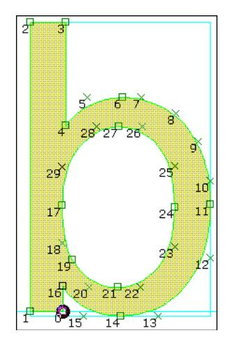

- Glyph fonts—without using the advanced text rendering engine —do not include any hinting information for improving the quality of small font sizes. However, anti-aliasing dramatically improves the legibility of scaled-down text. Glyph text remains legible down to about 12 points (viewed at 100%). At 12 points and lower, advanced anti-aliasing is recommended for readable glyph text. This gives superior text quality at small point sizes and includes extra font meta-information for improved rendering.
- TrueType fonts can be readily converted to SWF glyphs. A simple algorithm can replace the Quadratic Bsplines (used by TrueType fonts) with Quadratic Bezier curves (used by SWF glyphs).

#### Example:

To the left is the glyph for the TrueType letter 'b' of Monotype Arial. It is made up of curved and straight edges. Squares indicate on-curve points, and crosses indicate off-curve points. The black circle is the reference point for the glyph. The blue outline indicates the bounding box of the glyph.

### <span id="page-155-0"></span>**The EM square**

The EM square is an imaginary square that is used to size and align glyphs. The EM square is generally large enough to completely contain all glyphs, including accented glyphs. It includes the font's ascent, descent, and some extra spacing to prevent lines of text from colliding.

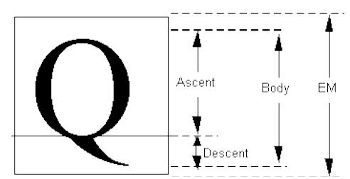

SWF glyphs are always defined on an EM square of 1024 by 1024 units. Glyphs from other sources (such as TrueType fonts) may be defined on a different EM square. To use these glyphs in SWF file format, they should be scaled to fit an EM square of 1024.

### <span id="page-155-1"></span>**Converting TrueType fonts to SWF glyphs**

TrueType glyphs are defined using Quadratic B-Splines, which can be easily converted to the

Quadratic Bezier curves used by SWF glyphs.

A TrueType B-spline is composed of one on-curve point, followed by many off-curve points, followed by another on-curve point. The midpoint between any two off-curve points is guaranteed to be on the curve. A SWF Bezier curve is composed of one on-curve point, followed by one off-curve point, followed by another on-curve point.

The conversion from TrueType to SWF curves involves inserting a new on-curve point at the midpoint of two successive off-curve points.

#### Example:

Following is a four point B-Spline. P0 and P3 are on-curve points. P1 and P2 are successive off-curve points.

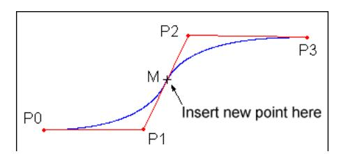

This curve can be represented as two Quadratic Bezier curves by inserting a new point M, at the midpoint of P1,P2. The result is two Quadratic Bezier curves; P0,P1,M and M,P2,P3.

The complete procedure for converting TrueType glyphs to SWF glyphs is as follows:

- 1. Negate the y-coordinate. (In TrueType glyphs, the y-axis points up; in SWF glyphs, the y- axis points down.)
- 2. Scale the x and y co-ordinates from the EM square of the TrueType font, to the EM square of the SWF glyph (always 1024).
- 3. Insert an on-curve (anchor) point at the midpoint of each pair of off-curve points.

### <span id="page-156-0"></span>**Kerning and advance values**

Kerning defines the horizontal distance between two glyphs. Some font systems store kerning information along with each font definition. SWF file format, in contrast, stores kerning information with every glyph instance (every character in a glyph text block). This is referred to as an advance value.

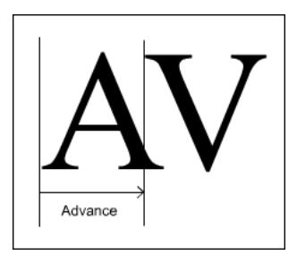

In the preceding example, the A glyph overlaps the V glyph. In this case, the advance is narrower than the width of the A glyph.

### <span id="page-156-1"></span>**Advanced text rendering engine**

Glyph text can be rendered using the normal Flash Player renderer or, in SWF 8 and later, with the advanced text rendering engine.

The advanced text rendering engine is a high-quality text renderer supported inside the Flash Player renderer. The advanced system has the following advantages over using the normal renderer for text:

- Readable, even at small point sizes.
- Maintains the aesthetic look and feel of a font, even at small point sizes.
- Supports pixel snapping for ultra-clear text (when left-aligned dynamic text is used).
- Improved performance over glyph text, typically.
- LCD sub-pixel rendering when Flash Player detects an LCD screen.

A limitation of the advanced text rendering engine, however, is that it does not animate well as compared to glyph text.

The advanced text rendering engine uses Continuous Stroke Modulation (CSM) parameters to tune its performance. CSM is the continuous modulation of both stroke weight and edge sharpness. CSM uses two rendering parameters: inside and outside cutoff. Optimal values for these parameters are highly subjective and can depend on user preferences, lighting conditions, display properties, typeface, foreground and background colors, and point size. However, under most circumstances, high-quality type can be achieved with a small set of interpolated values.

The function that creates the edges for advanced anti-aliasing has an outside cutoff (below which the edge isn't drawn) and an inside cutoff (above which the edge is opaque). Between these two cutoff values is a linear function ranging from zero at the outside cutoff to the maximum value at the inside cutoff.

Adjusting the outside and inside cutoff values affects stroke weight and edge sharpness. The spacing between these two parameters is comparable to twice the filter radius of classic

anti-aliasing methods: a narrow spacing provides a sharper edge while a wider spacing provides a softer, more filtered edge. When the spacing is zero, the resulting density image is a bi-level bitmap. When the spacing is very wide, the resulting density image has a watercolor- like edge. Typically, users prefer sharp, high-contrast edges at small point sizes and softer edges for animated text and larger point sizes.

The outside cutoff typically has a negative value, the inside cutoff typically has a positive value, and their midpoint typically lies near zero. Adjusting these parameters to shift the midpoint towards negative infinity will increase the stroke weight; shifting the midpoint towards positive infinity will decrease the stroke weight. Note that the outside cutoff should always be less than or equal to the inside cutoff.

Flash Player creates a table of CSM parameters as a function of text size and text color for each advanced antialiased font in use. This default table typically provides a suitable set of CSM settings across a wide range of point sizes. However, you can specify a user-defined table to replace the default table by using the ActionScript function setAdvancedAntialiasingTable().

The CSM parameters are intended to make fonts more readable and not to create effects. Extreme values of CSM result in rendering artifacts. To apply effects to text, it is much better to use reasonable CSM values and then apply filters or blend effects.

### <span id="page-157-0"></span>**DefineFont and DefineText**

Of the four text types supported in SWF file format (static glyph, static device, dynamic glyph, and dynamic device), the most complex is static glyph text. The other types use simpler variations on the rules used for defining static glyph text.

Static glyph text is defined using two tags:

- The DefineFont tag defines a set of glyphs.
- The DefineText tag defines the text string that is displayed in the font.

The DefineFont tag defines all the glyphs used by subsequent DefineText tags. DefineFont includes an array of SHAPERECORDs, which describe the outlines of the glyphs. These shape records are the same records used by DefineShape to define non-text shapes. To keep file size to a minimum, only the glyphs actually used are included in the DefineFont tag.

The DefineText tag stores the actual text string(s) to be displayed, represented as a series of glyph indices. It also includes the bounding box of the text object, a transformation matrix, and style attributes such as color and size.

DefineText contains an array of TEXTRECORDs. A TEXTRECORD selects the current font, color, and point size, as well as the x and y position of the next character in the text. These styles apply to all characters that follow, until another TEXTRECORD changes the styles. A TEXTRECORD also contains an array of indices into the glyph table of the current font. Characters are not referred to by their character codes, as in traditional programming, but rather by an index into the glyph table. The glyph data also includes the advance value for each character in the text string.

**Note**: A DefineFont tag must always come before any DefineText tags that refer to it.

### <span id="page-158-0"></span>**Static glyph text example**

Consider the example of displaying the static glyph text bob in the Arial font, with a point size of 24.

First, define the glyphs with a DefineFont tag. The glyph table, of type SHAPE, has two SHAPERECORDs. At index 0 is the shape of a lowercase b (see diagram). At index 1 is the shape of a lowercase o. (The second b in bob is a duplicate, and is not required). DefineFont also includes a unique ID so it can be selected by the DefineText tag.

Next, define the text itself with a DefineText tag. The TEXTRECORD sets the position of the first character, selects the Arial font (using the font's character ID), and sets the point size to 24, so the font is scaled to the correct size. (Remember that glyphs are defined in EM coordinates—the actual point size is part of the DefineText tag). It also contains an array of GLYPHENTRYs. Each glyph entry contains an index into the font's shape array. In this example, the first glyph entry has index 0 (which corresponds to the b shape), the second entry has index 1 (the o), and the third entry has index 0 (b again). Each GLYPHENTRY also includes an advance value for accurately positioning the glyph.

The following diagram illustrates how the DefineText tag interacts with the DefineFont tag:

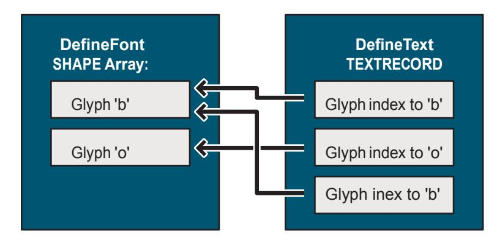

# <span id="page-159-0"></span>**Font tags**

### <span id="page-159-1"></span>**DefineFont**

The DefineFont tag defines the shape outlines of each glyph used in a particular font. Only the glyphs that are used by subsequent DefineText tags are actually defined.

DefineFont tags cannot be used for dynamic text. Dynamic text requires the DefineFont2 tag. The minimum file format version is SWF 1.

| Field           | Type           | Comment                    |
|-----------------|----------------|----------------------------|
| Header          | RECORDHEADER   | Tag type = 10              |
| FontID          | UI16           | ID for this font character |
| OffsetTable     | UI16[nGlyphs]  | Array of shape offsets     |
| GlyphShapeTable | SHAPE[nGlyphs] | Array of shapes            |

The font ID uniquely identifies the font. It can be used by subsequent DefineText tags to select the font. Like all SWF character IDs, font IDs must be unique among all character IDs in a SWF file.

If you provide a DefineFontInfo tag to go along with a DefineFont tag, be aware that the order of the glyphs in the DefineFont tag must match the order of the character codes in the DefineFontInfo tag, which must be sorted by code point order.

The OffsetTable and GlyphShapeTable are used together. These tables have the same number of entries, and there is a one-to-one ordering match between the order of the offsets and the order of the shapes. The OffsetTable points to locations in the GlyphShapeTable. Each offset entry stores the difference (in bytes) between the start of the offset table and the location of the corresponding shape. Because the GlyphShapeTable immediately follows the OffsetTable, the number of entries in each table (the number of glyphs in the font) can be inferred by dividing the first entry in the OffsetTable by two.

The first STYLECHANGERECORD of each SHAPE in the GlyphShapeTable does not use the LineStyle and LineStyles fields. In addition, the first STYLECHANGERECORD of each shape must have both fields StateFillStyle0 and FillStyle0 set to 1.

### <span id="page-159-2"></span>**DefineFontInfo**

The DefineFontInfo tag defines a mapping from a glyph font (defined with DefineFont) to a device font. It provides a font name and style to pass to the playback platform's text engine, and a table of character codes that identifies the character represented by each glyph in the corresponding DefineFont tag, allowing the glyph indices of a DefineText tag to be converted to character strings.

The presence of a DefineFontInfo tag does not force a glyph font to become a device font; it merely makes the option available. The actual choice between glyph and device usage is made according to the value of devicefont (see the introduction) or the value of UseOutlines in a DefineEditText tag. If a device font is unavailable on a playback platform, Flash Player will fall back to glyph text.

The minimum file format version is SWF 1.

| Field              | Type                                                                | Comment                                                                                                                       |  |  |  |  |  |  |
|--------------------|---------------------------------------------------------------------|-------------------------------------------------------------------------------------------------------------------------------|--|--|--|--|--|--|
| Header             | RECORDHEADER                                                        | Tag type = 13.                                                                                                                |  |  |  |  |  |  |
| FontID             | UI16                                                                | Font ID this information is for.                                                                                              |  |  |  |  |  |  |
| FontNameLen        | UI8                                                                 | Length of font name.                                                                                                          |  |  |  |  |  |  |
| FontName           | UI8[FontNameLen]                                                    | Name of the font (see following).                                                                                             |  |  |  |  |  |  |
| FontFlagsReserved  | UB[2]                                                               | Reserved bit fields.                                                                                                          |  |  |  |  |  |  |
| FontFlagsSmallText | UB[1]                                                               | SWF 7 file format or later: Font is small.<br>Character glyphs are aligned on pixel<br>boundaries for dynamic and input text. |  |  |  |  |  |  |
| FontFlagsShiftJIS  | UB[1]                                                               | ShiftJIS character codes.                                                                                                     |  |  |  |  |  |  |
| FontFlagsANSI      | UB[1]                                                               | ANSI character codes.                                                                                                         |  |  |  |  |  |  |
| FontFlagsItalic    | UB[1]                                                               | Font is italic.                                                                                                               |  |  |  |  |  |  |
| FontFlagsBold      | UB[1]                                                               | Font is bold.                                                                                                                 |  |  |  |  |  |  |
| FontFlagsWideCodes | UB[1]                                                               | If 1, CodeTable is UI16 array; otherwise,<br>CodeTable is UI8 array.                                                          |  |  |  |  |  |  |
| CodeTable          | If FontFlagsWideCodes,<br>UI16[nGlyphs], Otherwise,<br>UI8[nGlyphs] | Glyph to code table, sorted in ascending<br>order.                                                                            |  |  |  |  |  |  |

The entries in the CodeTable must be sorted in ascending order by code point, by the value they provide. The order of the entries in the CodeTable must also match the order of the glyphs in the DefineFont tag to which this DefineFontInfo tag applies. This places a requirement on the ordering of glyphs in the corresponding DefineFont tag.

SWF 6 or later files require Unicode text encoding. One aspect of this requirement is that all character code tables are specified using UCS-2 (UCS-2 is generally the first 64k code points of UTF-16). This encoding uses a fixed 2 bytes for each character. This means that when a DefineFontInfo tag appears in a SWF 6 or later file, FontFlagsWideCodes must be set, FontFlagsShiftJIS and FontFlagsANSI must be cleared, and CodeTable must consist of UI16 entries (as always, in little-endian byte order) encoded in UCS-2.

Another Unicode requirement that applies to SWF 6 or later files is that font names must always be encoded using UTF-8. In SWF 5 or earlier files, font names are encoded in a platform-specific way, in the codepage of the system on which they were authored. The playback platform will interpret them using its current codepage, with potentially inconsistent results. If the playback platform is an ANSI system, font names will be interpreted as ANSI strings. If the playback platform is a Japanese shift-JIS system, font names will be interpreted as shift-JIS strings. Many other values for the playback platform's codepage, which governs this decision, are possible. This playback locale dependency is undesirable, which is why SWF 6 file format moved toward a standard encoding for font names. Note that font name strings in the DefineFontInfo tag are not null-terminated; instead their length is specified by the FontNameLen field. FontNameLen specifies the number of bytes in FontName, which is not necessarily equal to the number of characters, since some encodings may use more than one byte per character.

Font names are normally used verbatim, passed directly to the playback platform's font system in order to locate a font. However, there are several special indirect font names that are mapped to different actual font names depending on the playback platform. These indirect mappings are hard-coded into each platform-specific port of Flash Player, and the fonts for each platform are chosen from among system default fonts or other fonts that are very likely to be available. As a secondary consideration, the indirect mappings are chosen so as to maximize the similarity of indirect fonts across platforms.

The following tables describe the indirect font names that are supported.

## <span id="page-161-0"></span>**Western indirect fonts**

| Font name   | Example     |
|-------------|-------------|
| _sans       | Hello world |
| _serif      | Hello world |
| _typewriter | Hello world |

### <span id="page-161-1"></span>**Japanese indirect fonts**

| Font name:    |        |
|---------------|--------|
| English Name: | Gothic |

| UTF-8 Byte String (hex): |  | 5F E3 82 |  | B4 E3 82 |  | B7 E3 83 | 83 | E3 82 | AF |
|--------------------------|--|----------|--|----------|--|----------|----|-------|----|
| Example appearance:      |  |          |  |          |  |          |    |       |    |

| Font name:               |                         |
|--------------------------|-------------------------|
| English Name:            | Tohaba (Gothic Mono)    |
| UTF-8 Byte String (hex): | 5F E7 AD 89<br>E5 B9 85 |
| Example appearance:      |                         |

| Font name:               |                      |
|--------------------------|----------------------|
| English Name:            | Mincho               |
| UTF-8 Byte String (hex): | 5F E6 98 8E E6 9C 9D |
| Example appearance:      |                      |

## <span id="page-162-0"></span>**DefineFontInfo2**

When generating SWF 6 or later, it is recommended that you use the new DefineFontInfo2 tag rather than DefineFontInfo. DefineFontInfo2 is identical to DefineFontInfo, except that it adds a field for a language code. If you use the older DefineFontInfo, the language code will be assumed to be zero, which results in behavior that is dependent on the locale in which Flash Player is running.

The minimum file format version is SWF 6.

| Field              | Type             | Comment                                                                                                        |
|--------------------|------------------|----------------------------------------------------------------------------------------------------------------|
| Header             | RECORDHEADER     | Tag type = 62.                                                                                                 |
| FontID             | UI16             | Font ID this information is for.                                                                               |
| FontNameLen        | UI8              | Length of font name.                                                                                           |
| FontName           | UI8[FontNameLen] | Name of the font.                                                                                              |
| FontFlagsReserved  | UB[2]            | Reserved bit fields.                                                                                           |
| FontFlagsSmallText | UB[1]            | SWF 7 or later: Font is small. Character glyphs are aligned<br>on pixel boundaries for dynamic and input text. |

| FontFlagsShiftJIS  | UB[1]         | Always 0.                                                |
|--------------------|---------------|----------------------------------------------------------|
| FontFlagsANSI      | UB[1]         | Always 0.                                                |
| FontFlagsItalic    | UB[1]         | Font is italic.                                          |
| FontFlagsBold      | UB[1]         | Font is bold.                                            |
| FontFlagsWideCodes | UB[1]         | Always 1.                                                |
| LanguageCode       | LANGCODE      | Language ID.                                             |
| CodeTable          | UI16[nGlyphs] | Glyph to code table in UCS-2, sorted in ascending order. |

### <span id="page-163-0"></span>**DefineFont2**

The DefineFont2 tag extends the functionality of DefineFont. Enhancements include the following:

- 32-bit entries in the OffsetTable, for fonts with more than 64K glyphs.
- Mapping to device fonts, by incorporating all the functionality of DefineFontInfo.
- Font metrics for improved layout of dynamic glyph text.

DefineFont2 tags are the only font definitions that can be used for dynamic text.

The minimum file format version is SWF 3.

| Field                | Type         | Comment                                                                                                           |
|----------------------|--------------|-------------------------------------------------------------------------------------------------------------------|
| Header               | RECORDHEADER | Tag type = 48.                                                                                                    |
| FontID               | UI16         | ID for this font character.                                                                                       |
| FontFlagsHasLayout   | UB[1]        | Has font metrics/layout information.                                                                              |
| FontFlagsShiftJIS    | UB[1]        | ShiftJIS encoding.                                                                                                |
| FontFlagsSmallText   | UB[1]        | SWF 7 or later: Font is small. Character<br>glyphs are aligned on pixel boundaries for<br>dynamic and input text. |
| FontFlagsANSI        | UB[1]        | ANSI encoding.                                                                                                    |
| FontFlagsWideOffsets | UB[1]        | If 1, uses 32 bit offsets.                                                                                        |
| FontFlagsWideCodes   | UB[1]        | If 1, font uses 16-bit codes; otherwise font                                                                      |

|                  |                                                                          | uses 8 bit codes.                                                              |
|------------------|--------------------------------------------------------------------------|--------------------------------------------------------------------------------|
| FontFlagsItalic  | UB[1]                                                                    | Italic Font.                                                                   |
| FontFlagsBold    | UB[1]                                                                    | Bold Font.                                                                     |
| LanguageCode     | LANGCODE                                                                 | SWF 5 or earlier: always 0; SWF 6 or later:<br>language code                   |
| FontNameLen      | UI8                                                                      | Length of name.                                                                |
| FontName         | UI8[FontNameLen]                                                         | Name of font (see DefineFontInfo).                                             |
| NumGlyphs        | UI16                                                                     | Count of glyphs in font. May be zero for<br>device fonts.                      |
| OffsetTable      | If FontFlagsWideOffsets,<br>UI32[NumGlyphs] Otherwise<br>UI16[NumGlyphs] | Same as in DefineFont.                                                         |
| CodeTableOffset  | If FontFlagsWideOffsets, UI32<br>Otherwise UI16                          | Byte count from start of OffsetTable to start<br>of CodeTable.                 |
| GlyphShapeTable  | SHAPE[NumGlyphs]                                                         | Same as in DefineFont.                                                         |
| CodeTable        | If FontFlagsWideCodes,<br>UI16[NumGlyphs] Otherwise<br>UI8[NumGlyphs]    | Sorted in ascending order. Always UCS-2 in<br>SWF 6 or later.                  |
| FontAscent       | If FontFlagsHasLayout, UI16                                              | Font ascender height.                                                          |
| FontDescent      | If FontFlagsHasLayout, UI16                                              | Font descender height.                                                         |
| FontLeading      | If FontFlagsHasLayout, SI16                                              | Font leading height (see following).                                           |
| FontAdvanceTable | If FontFlagsHasLayout,<br>SI16[NumGlyphs]                                | Advance value to be used for each glyph in<br>dynamic glyph text.              |
| FontBoundsTable  | If FontFlagsHasLayout,<br>RECT[NumGlyphs]                                | Not used in Flash Player through version 7<br>(but must be present).           |
| KerningCount     | If FontFlagsHasLayout, UI16                                              | Not used in Flash Player through version 7<br>(always set to 0 to save space). |
| FontKerningTable | If FontFlagsHasLayout,<br>KERNINGRECORD[KerningCount]                    | Not used in Flash Player through version 7<br>(omit with KerningCount of 0).   |

In SWF 6 or later files, DefineFont2 has the same Unicode requirements as DefineFontInfo. Similarly to the DefineFontInfo tag, the CodeTable (and thus also the OffsetTable, GlyphShapeTable, and FontAdvanceTable) must be sorted in code point order.

If a DefineFont2 tag will be used only for dynamic device text, and no glyph-rendering fallback is desired, set NumGlyphs to zero, and omit all tables having NumGlyphs entries. This will substantially reduce the size of the DefineFont2 tag. DefineFont2 tags without glyphs cannot support static text, which uses glyph indices to select characters, and also cannot support glyph text, which requires glyph shape definitions.

Layout information (ascent, descent, leading, advance table, bounds table, kerning table) is useful only for dynamic glyph text. This information takes the place of the per-character placement information that is used in static glyph text. The layout information in the DefineFont2 tag is fairly standard font-metrics information that can typically be extracted directly from a standard font definition, such as a TrueType font.

**Note**: Leading is a vertical line-spacing metric. It is the distance (in EM-square coordinates) between the bottom of the descender of one line and the top of the ascender of the next line.

As with DefineFont, in DefineFont2 the first STYLECHANGERECORD of each SHAPE in the GlyphShapeTable does not use the LineStyle and LineStyles fields. In addition, the first STYLECHANGERECORD of each shape must have both fields StateFillStyle0 and FillStyle0 set to 1.

The DefineFont2 tag reserves space for a font bounds table and kerning table. This information is not used in Flash Player through version 7. However, this information must be present in order to constitute a well-formed DefineFont2 tag. Supply minimal (low-bit) RECTs for FontBoundsTable, and always set KerningCount to zero, which allows FontKerningTable to be omitted.

## <span id="page-165-0"></span>**DefineFont3**

The DefineFont3 tag is introduced along with the DefineFontAlignZones tag in SWF 8. The DefineFontAlignZones tag is optional but recommended for SWF files using advanced anti- aliasing, and it modifies the DefineFont3 tag.

The DefineFont3 tag extends the functionality of DefineFont2 by expressing the SHAPE coordinates in the GlyphShapeTable at 20 times the resolution. All the EMSquare coordinates are multiplied by 20 at export, allowing fractional resolution to 1/20 of a unit. This allows for more precisely defined glyphs and results in better visual quality.

The minimum file format version is SWF 8.

| Field  | Type         | Comment           |
|--------|--------------|-------------------|
| Header | RECORDHEADER | Tag type<br>= 75. |

| FontID               | UI16                                                                     | ID for this font character.                                                                                       |
|----------------------|--------------------------------------------------------------------------|-------------------------------------------------------------------------------------------------------------------|
| FontFlagsHasLayout   | UB[1]                                                                    | Has font metrics/layout information.                                                                              |
| FontFlagsShiftJIS    | UB[1]                                                                    | ShiftJIS encoding.                                                                                                |
| FontFlagsSmallText   | UB[1]                                                                    | SWF 7 or later: Font is small. Character glyphs<br>are aligned on pixel boundaries for dynamic<br>and input text. |
| FontFlagsANSI        | UB[1]                                                                    | ANSI encoding.                                                                                                    |
| FontFlagsWideOffsets | UB[1]                                                                    | If 1, uses 32 bit offsets.                                                                                        |
| FontFlagsWideCodes   | UB[1]                                                                    | Must be 1.                                                                                                        |
| FontFlagsItalic      | UB[1]                                                                    | Italic Font.                                                                                                      |
| FontFlagsBold        | UB[1]                                                                    | Bold Font.                                                                                                        |
| LanguageCode         | LANGCODE                                                                 | SWF 5 or earlier: always 0; SWF 6 or later:<br>language code                                                      |
| FontNameLen          | UI8                                                                      | Length of name.                                                                                                   |
| FontName             | UI8[FontNameLen]                                                         | Name of font (see DefineFontInfo).                                                                                |
| NumGlyphs            | UI16                                                                     | Count of glyphs in font. May be zero for<br>device fonts.                                                         |
| OffsetTable          | If FontFlagsWideOffsets,<br>UI32[NumGlyphs] Otherwise<br>UI16[NumGlyphs] | Same as in DefineFont.                                                                                            |
| CodeTableOffset      | If FontFlagsWideOffsets, UI32<br>Otherwise UI16                          | Byte count from start of OffsetTable to start<br>of CodeTable.                                                    |
| GlyphShapeTable      | SHAPE[NumGlyphs]                                                         | Same as in DefineFont.                                                                                            |
| CodeTable            | UI16[NumGlyphs]                                                          | Sorted in ascending order. Always UCS-2 in<br>SWF 6 or later.                                                     |
| FontAscent           | If FontFlagsHasLayout, UI16                                              | Font ascender height.                                                                                             |
| FontDescent          | If FontFlagsHasLayout, UI16                                              | Font descender height.                                                                                            |
| FontLeading          | If<br>FontFlagsHasLayout, SI16                                           | Font leading height (see following).                                                                              |

| FontAdvanceTable | If FontFlagsHasLayout,       | Advance value to be used for each glyph in |
|------------------|------------------------------|--------------------------------------------|
|                  | SI16[NumGlyphs]              | dynamic glyph text.                        |
| FontBoundsTable  | If FontFlagsHasLayout,       | Not used in Flash Player through version 7 |
|                  | RECT[NumGlyphs]              | (but must be present).                     |
| KerningCount     | If FontFlagsHasLayout, UI16  | Not used in Flash Player through version 7 |
|                  |                              | (always set to 0 to save space).           |
| FontKerningTable | If FontFlagsHasLayout,       | Not used in Flash Player through version 7 |
|                  | KERNINGRECORD [KerningCount] | (omit with KerningCount of 0).             |

### <span id="page-167-0"></span>**DefineFontAlignZones**

The DefineFont3 tag can be modified by a DefineFontAlignZones tag. The advanced text rendering engine uses alignment zones to establish the borders of a glyph for pixel snapping. Alignment zones are critical for highquality display of fonts.

The alignment zone defines a bounding box for strong vertical and horizontal components of a glyph. The box is described by a left coordinate, thickness, baseline coordinate, and height. Small thicknesses or heights are often set to 0.

For example, consider the letter I. The letter I has a strong horizontal at its baseline and the top of the letter. The letter I also has strong verticals that occur at the edges of the stem—not the short top bar or serif. These strong verticals and horizontals of the center block of the letter define the alignment zones.

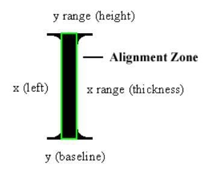

The minimum file format version is SWF 8.

| DefineFontAlignZones |              |                                                 |
|----------------------|--------------|-------------------------------------------------|
| Field                | Type         | Comment                                         |
| Header               | RECORDHEADER | Tag type = 73.                                  |
| FontID               | UI16         | ID<br>of font to use, specified by DefineFont3. |

| CSMTableHint | UB[2]                  | Font thickness hint. Refers to the thickness of the       |
|--------------|------------------------|-----------------------------------------------------------|
|              |                        | typical stroke used in the font. 0 = thin; 1 = medium;    |
|              |                        | 2 = thick; Flash Player maintains a selection of CSM      |
|              |                        | tables for many fonts. However, if the font is not        |
|              |                        | found in Flash Player's internal table, this hint is used |
|              |                        | to choose an appropriate table.                           |
|              |                        |                                                           |
| Reserved     | UB[6]                  | Must be 0.                                                |
| ZoneTable    | ZONERECORD[GlyphCount] | Alignment zone information for each glyph.                |

| ZONERECORD  |                       |                                        |  |
|-------------|-----------------------|----------------------------------------|--|
| Field       | Type                  | Comment                                |  |
| NumZoneData | UI8                   | Number of ZoneData entries. Always 2.  |  |
| ZoneData    | ZONEDATA[NumZoneData] | Compressed alignment zone information. |  |
| Reserved    | UB[6]                 | Must be 0.                             |  |
| ZoneMaskY   | UB[1]                 | Set if there are Y alignment zones.    |  |
| ZoneMaskX   | UB[1]                 | Set if there are X alignment zones.    |  |

| ZONEDATA            |         |                                                               |
|---------------------|---------|---------------------------------------------------------------|
| Field               | Type    | Comment                                                       |
| AlignmentCoordinate | FLOAT16 | X (left) or Y (baseline) coordinate of the alignment<br>zone. |
| Range               | FLOAT16 | Width or height of the alignment zone.                        |

### <span id="page-168-0"></span>**Kerning record**

A Kerning Record defines the distance between two glyphs in EM square coordinates. Certain pairs of glyphs appear more aesthetically pleasing if they are moved closer together, or farther apart. The FontKerningCode1 and FontKerningCode2 fields are the character codes for the left and right characters. The FontKerningAdjustment field is a signed integer that defines a value to be added to the advance value of the left character.

| Field                 | Type                                            | Comment                                                   |
|-----------------------|-------------------------------------------------|-----------------------------------------------------------|
| FontKerningCode1      | If FontFlagsWideCodes, UI16<br>Otherwise UI8    | Character code of the left character.                     |
| FontKerningCode2      | If<br>FontFlagsWideCodes, UI16<br>Otherwise UI8 | Character code of the right character.                    |
| FontKerningAdjustment | SI16                                            | Adjustment relative to left character's advance<br>value. |

### <span id="page-169-0"></span>**DefineFontName**

The DefineFontName tag contains the name and copyright information for a font embedded in the SWF file.

The minimum file format version is SWF 9.

| Field         | Type         | Comment                                                                                                                                                                                                                                               |
|---------------|--------------|-------------------------------------------------------------------------------------------------------------------------------------------------------------------------------------------------------------------------------------------------------|
| Header        | RECORDHEADER | Tag type = 88                                                                                                                                                                                                                                         |
| FontID        | UI16         | ID for this font to which this refers                                                                                                                                                                                                                 |
| FontName      | STRING       | Name of the font. For fonts starting<br>as Type 1, this is the PostScript<br>FullName. For fonts starting in sfnt<br>formats such as TrueType and<br>OpenType, this<br>is name ID 4,<br>platform ID 1, language ID 0 (Full<br>name, Mac OS, English). |
| FontCopyright | STRING       | Arbitrary string of copyright<br>information                                                                                                                                                                                                          |

# <span id="page-169-1"></span>**Static text tags**

## <span id="page-169-2"></span>**DefineText**

The DefineText tag defines a block of static text. It describes the font, size, color, and exact position of every character in the text object.

The minimum file format version is SWF 1.

| Field            | Type                     | Comment                             |
|------------------|--------------------------|-------------------------------------|
| Header           | RECORDHEADER             | Tag type = 11.                      |
| CharacterID      | UI16                     | ID for this text character.         |
| TextBounds       | RECT                     | Bounds of the text.                 |
| TextMatrix       | MATRIX                   | Transformation matrix for the text. |
| GlyphBits        | UI8                      | Bits in each glyph index.           |
| AdvanceBits      | UI8                      | Bits in each advance value.         |
| TextRecords      | TEXTRECORD[zero or more] | Text records.                       |
| EndOfRecordsFlag | UI8                      | Must be 0.                          |

The TextBounds field is the rectangle that completely encloses all the characters in this text block.

The GlyphBits and AdvanceBits fields define the number of bits used for the GlyphIndex and GlyphAdvance fields, respectively, in each GLYPHENTRY record.

### <span id="page-170-0"></span>**Text records**

A TEXTRECORD sets text styles for subsequent characters. It can be used to select a font, change the text color, change the point size, insert a line break, or set the x and y position of the next character in the text. The new text styles apply until another TEXTRECORD changes the styles.

The TEXTRECORD also defines the actual characters in a text object. Characters are referred to by an index into the current font's glyph table, not by a character code. Each TEXTRECORD contains a group of characters that all share the same text style, and are on the same line of text.

| Field                | Type  | Comment                    |
|----------------------|-------|----------------------------|
| TextRecordType       | UB[1] | Always 1.                  |
| StyleFlagsReserved   | UB[3] | Always 0.                  |
| StyleFlagsHasFont    | UB[1] | 1 if text font specified.  |
| StyleFlagsHasColor   | UB[1] | 1 if text color specified. |
| StyleFlagsHasYOffset | UB[1] | 1 if y offset specified.   |

| StyleFlagsHasXOffset | UB[1]                                                                           | 1 if x offset specified.        |
|----------------------|---------------------------------------------------------------------------------|---------------------------------|
| FontID               | If StyleFlagsHasFont, UI16                                                      | Font ID for following text.     |
| TextColor            | If StyleFlagsHasColor, RGB If this record is<br>part of a DefineText2 tag, RGBA | Font color for following text.  |
| XOffset              | If StyleFlagsHasXOffset, SI16                                                   | x offset for following text.    |
| YOffset              | If StyleFlagsHasYOffset, SI16                                                   | y offset for following text.    |
| TextHeight           | If hasFont, UI16                                                                | Font height for following text. |
| GlyphCount           | UI8                                                                             | Number of glyphs in record.     |
| GlyphEntries         | GLYPHENTRY[GlyphCount]                                                          | Glyph entry (see following).    |

The FontID field is used to select a previously defined font. This ID uniquely identifies a DefineFont or DefineFont2 tag from earlier in the SWF file.

The TextHeight field defines the height of the font in twips. For example, a pixel height of 50 is equivalent to a TextHeight of 1000. (50 \* 20 = 1000).

The XOffset field defines the offset from the left of the TextBounds rectangle to the reference point of the glyph (the point within the EM square from which the first curve segment departs). Typically, the reference point is on the baseline, near the left side of the glyph (see the example for Glyph text). The XOffset is generally used to create indented text or non-left- justified text. If there is no XOffset specified, the offset is assumed to be zero.

The YOffset field defines the offset from the top of the TextBounds rectangle to the reference point of the glyph. The TextYOffset is generally used to insert line breaks, moving the text position to the start of a new line.

The GlyphCount field defines the number of characters in this string, and the size of the GLYPHENTRY table.

### **Glyph entry**

The GLYPHENTRY structure describes a single character in a line of text. It is composed of an index into the current font's glyph table, and an advance value. The advance value is the horizontal distance between the reference point of this character and the reference point of the following character.

| Field        | Type            | Comment                        |
|--------------|-----------------|--------------------------------|
| GlyphIndex   | UB[GlyphBits]   | Glyph index into current font. |
| GlyphAdvance | SB[AdvanceBits] | x advance value for glyph.     |

### <span id="page-172-2"></span>**DefineText2**

The DefineText2 tag is almost identical to the DefineText tag. The only difference is that Type 1 text records contained within a DefineText2 tag use an RGBA value (rather than an RGB value) to define TextColor. This allows partially or completely transparent characters.

Text defined with DefineText2 is always rendered with glyphs. Device text can never include transparency.

The minimum file format version is SWF 3.

| Field            | Type                     | Comment                     |
|------------------|--------------------------|-----------------------------|
| Header           | RECORDHEADER             | Tag type = 33.              |
| CharacterID      | UI16                     | ID for this text character. |
| TextBounds       | RECT                     | Bounds of the text.         |
| TextMatrix       | MATRIX                   | Transformation matrix.      |
| GlyphBits        | UI8                      | Bits in each glyph index.   |
| AdvanceBits      | UI8                      | Bits in each advance value. |
| TextRecords      | TEXTRECORD[zero or more] | Text records.               |
| EndOfRecordsFlag | UI8                      | Must be 0.                  |

# <span id="page-172-0"></span>**Dynamic text tags**

### <span id="page-172-1"></span>**DefineEditText**

The DefineEditText tag defines a dynamic text object, or text field.

A text field is associated with an ActionScript variable name where the contents of the text field are stored. The SWF file can read and write the contents of the variable, which is always kept in sync with the text being displayed. If the ReadOnly flag is not set, users may change the value of a text field interactively.

Fonts used by DefineEditText must be defined using DefineFont2, not DefineFont. The minimum file format version is SWF 4.

| Field       | Type         | Comment                             |
|-------------|--------------|-------------------------------------|
| Header      | RECORDHEADER | Tag type = 37.                      |
| CharacterID | UI16         | ID for this dynamic text character. |

| Bounds       | RECT                    | Rectangle that completely encloses the text field.                |
|--------------|-------------------------|-------------------------------------------------------------------|
| HasText      | UB[1]                   | 0 = text field has no default text. 1 = text field initially      |
|              |                         | displays the string specified by InitialText.                     |
| WordWrap     | UB[1]                   | 0 = text will not wrap and will scroll sideways. 1 = text will    |
|              |                         | wrap automatically when the end of line is reached.               |
| Multiline    | UB[1]                   | 0 = text field is one line only. 1 = text field is multi-line and |
|              |                         | scrollable.                                                       |
| Password     | UB[1]                   | 0 = characters are displayed as typed. 1 = all characters are     |
|              |                         | displayed as an asterisk.                                         |
| ReadOnly     | UB[1]                   | 0 = text editing is enabled. 1 = text editing is disabled.        |
| HasTextColor | UB[1]                   | 0 = use default color. 1 = use specified color (TextColor).       |
| HasMaxLength | UB[1]                   | 0 = length of text is unlimited. 1 = maximum length of string     |
|              |                         | is specified by MaxLength.                                        |
| HasFont      | UB[1]                   | 0 = use default font. 1 = use specified font (FontID) and         |
|              |                         | height (FontHeight). (Can't be true<br>if HasFontClass is true).  |
| HasFontClass | UB[1]                   | 0 = no fontClass, 1 = fontClass and Height specified for this     |
|              |                         | text. (can't be true if HasFont is true). Supported in Flash      |
|              |                         | Player 9.0.45.0 and later.                                        |
| AutoSize     | UB[1]                   | 0 = fixed size. 1 = sizes to content (SWF 6<br>or later only).    |
| HasLayout    | UB[1]                   | Layout information provided.                                      |
| NoSelect     | UB[1]                   | Enables or disables interactive text selection.                   |
| Border       | UB[1]                   | Causes a border to be drawn around the text field.                |
|              |                         |                                                                   |
| WasStatic    | UB[1]                   | 0 = Authored as dynamic text; 1 = Authored as static text         |
| HTML         | UB[1]                   | 0 = plaintext content. 1 = HTML content (see following).          |
| UseOutlines  | UB[1]                   | 0 = use device font. 1 = use glyph font.                          |
| FontID       | If HasFont, UI16        | ID of font to use.                                                |
| FontClass    | If HasFontClass, STRING | Class name of font to be loaded from<br>another SWF and           |
|              |                         | used for this text.                                               |
|              |                         |                                                                   |

| FontHeight   | If HasFont, UI16      | Height of font in twips.                                                                                                                               |
|--------------|-----------------------|--------------------------------------------------------------------------------------------------------------------------------------------------------|
| TextColor    | If HasTextColor, RGBA | Color of text.                                                                                                                                         |
| MaxLength    | If HasMaxLength, UI16 | Text is restricted to this length.                                                                                                                     |
| Align        | If HasLayout, UI8     | 0 = Left; 1 = Right; 2 =<br>Center; 3 = Justify                                                                                                        |
| LeftMargin   | If HasLayout, UI16    | Left margin in twips.                                                                                                                                  |
| RightMargin  | If HasLayout, UI16    | Right margin in twips.                                                                                                                                 |
| Indent       | If HasLayout, UI16    | Indent in twips.                                                                                                                                       |
| Leading      | If HasLayout, SI16    | Leading in twips (vertical distance between bottom of<br>descender of one line and top of ascender of the next).                                       |
| VariableName | STRING                | Name of the variable where the contents of the text field<br>are stored. May be qualified with dot syntax or slash syntax<br>for non-global variables. |
| InitialText  | If HasText STRING     | Text that is initially displayed.                                                                                                                      |

If the HTML flag is set, the contents of InitialText are interpreted as a limited subset of the HTML tag language, with a few additions not normally present in HTML. The following tags are supported:

| Tag            | Description                                                                                                                                                                                                                                                                                                                                          |  |
|----------------|------------------------------------------------------------------------------------------------------------------------------------------------------------------------------------------------------------------------------------------------------------------------------------------------------------------------------------------------------|--|
| <p> </p>       | Defines a paragraph. The attribute align may be present, with value left,<br>right, or center.                                                                                                                                                                                                                                                       |  |
| <br>           | Inserts a line break.                                                                                                                                                                                                                                                                                                                                |  |
| <a><br/> </a>  | Defines a hyperlink. The attribute href must be present. The attribute target<br>is optional, and specifies a window name.                                                                                                                                                                                                                           |  |
| <font> </font> | Defines a span of text that uses a given font. The following attributes are<br>available: • face, which specifies a font name that must match a font name<br>supplied in a DefineFont2 tag; • size, which is specified in twips, and may<br>include a leading '+' or '-' for relative sizes; • color, which is specified as a<br>#RRGGBB hex triplet |  |
| <b> </b>       | Defines a span of bold text.                                                                                                                                                                                                                                                                                                                         |  |
| <i> </i>       | Defines a span of italic text.                                                                                                                                                                                                                                                                                                                       |  |

| <u> </u>                       | Defines a span of underlined text.                                                                                                                                                                                                                                                                                                                                                                                                                                                                  |  |
|--------------------------------|-----------------------------------------------------------------------------------------------------------------------------------------------------------------------------------------------------------------------------------------------------------------------------------------------------------------------------------------------------------------------------------------------------------------------------------------------------------------------------------------------------|--|
| <li> </li>                     | Defines a bulleted paragraph. The <ul> tag is not necessary and is not<br/>supported. Numbered lists are not supported.</ul>                                                                                                                                                                                                                                                                                                                                                                        |  |
| <textformat><br/></textformat> | Defines a span of text with certain formatting options. The following<br>attributes are available:;<br>• leftmargin, which specifies the left margin in twips;<br>• rightmargin, which specifies the right margin in twips;<br>• indent, which specifies the left indent in twips;<br>• blockindent, which specifies a block indent in twips;<br>• leading, which specifies the<br>leading in twips;<br>• tabstops, which specifies a comma-separated list of tab stops, each<br>specified in twips |  |
| <tab></tab>                    | Inserts a tab character, which advances to the next tab stop as defined with<br>the <textformat> tag.</textformat>                                                                                                                                                                                                                                                                                                                                                                                  |  |

### <span id="page-175-0"></span>**CSMTextSettings**

In addition to the advanced text rendering tags discussed earlier in this chapter, the rendering engine also supports a tag for modifying text fields. The CSMTextSettings tag modifies a previously streamed DefineText, DefineText2, or DefineEditText tag. The CSMTextSettings tag turns advanced anti-aliasing on or off for a text field, and can also be used to define quality and options.

The minimum file format version is SWF 8.

| Field        | Type         | Comment                                                                                                                                                                                                |
|--------------|--------------|--------------------------------------------------------------------------------------------------------------------------------------------------------------------------------------------------------|
| Header       | RECORDHEADER | Tag type = 74.                                                                                                                                                                                         |
| TextID       | UI16         | ID for the DefineText, DefineText2, or DefineEditText to which<br>this tag applies.                                                                                                                    |
| UseFlashType | UB[2]        | 0 = use normal renderer. 1 = use advanced text rendering<br>engine.                                                                                                                                    |
| GridFit      | UB[3]        | 0 = Do not use grid fitting. AlignmentZones and LCD sub-pixel<br>information will not be used. 1 = Pixel grid fit. Only supported<br>for left-aligned dynamic text. This setting provides the ultimate |

|           |       | in advanced anti-aliased text readability, with crisp letters<br>aligned to pixels. 2 = Sub-pixel grid fit. Align letters to the 1/3<br>pixel used by LCD monitors. Can also improve quality for CRT<br>output. |
|-----------|-------|-----------------------------------------------------------------------------------------------------------------------------------------------------------------------------------------------------------------|
| Reserved  | UB[3] | Must be 0.                                                                                                                                                                                                      |
| Thickness | F32   | The thickness attribute for the associated text field. Set to 0.0<br>to use the default (anti-aliasing table) value.                                                                                            |
| Sharpness | F32   | The sharpness attribute for the associated text field. Set to 0.0<br>to use the default<br>(anti-aliasing table) value.                                                                                         |
| Reserved  | UI8   | Must be 0.                                                                                                                                                                                                      |

The Thickness and Sharpness fields are interpretations of the CSM parameters, applied to a particular text field. The thickness and sharpness setting will override the default CSM setting for that text field.

The CSM parameters, at render time, are computed from the thickness and sharpness:

```
outsideCutoff = (0.5f * sharpness - thickness) * fontSize;
insideCutoff = (-0.5f * sharpness - thickness) * fontSize;
```

Using the font size in the cutoff calculations results in linear scaling of CSM parameters, and linear scaling tends to be a poor approximation when significant scaling is applied. When a text field will scale, it is usually better to use the default table or provide your own anti- aliasing table.

## <span id="page-176-0"></span>**DefineFont4**

DefineFont4 supports only the new Flash Text Engine. The storage of font data for embedded fonts is in CFF format.

The minimum file format version is SWF 10.

| Field                | Type         | Comment                                                   |
|----------------------|--------------|-----------------------------------------------------------|
| Header               | RECORDHEADER | Tag type = 91                                             |
| FontID               | UI16         | ID for this font character.                               |
| FontFlagsReserved    | UB[5]        | Reserved bit fields.                                      |
| FontFlagsHasFontData | UB[1]        | Font is embedded. Font tag includes SFNT font data block. |
| FontFlagsItalic      | UB[1]        | Italic font                                               |

| FontFlagsBold | UB[1]            | Bold font                                                                                                                                                                                                                                                                                                                                                                                                                                                                                                                                                                                                                  |
|---------------|------------------|----------------------------------------------------------------------------------------------------------------------------------------------------------------------------------------------------------------------------------------------------------------------------------------------------------------------------------------------------------------------------------------------------------------------------------------------------------------------------------------------------------------------------------------------------------------------------------------------------------------------------|
| FontName      | STRING           | Name of the font.                                                                                                                                                                                                                                                                                                                                                                                                                                                                                                                                                                                                          |
| FontData      | FONTDATA[0 or 1] | When present, this is an OpenType CFF font, as defined in the<br>OpenType specification at<br>www.microsoft.com/typography/otspec. The following tables<br>must be present: 'CFF ', 'cmap', 'head', 'maxp', 'OS/2', 'post',<br>and either (a) 'hhea' and 'hmtx', or (b), 'vhea', 'vmtx', and<br>'VORG'. The 'cmap' table must include one of the following<br>kinds of Unicode 'cmap' subtables: (0, 4), (0, 3), (3, 10), (3, 1), or<br>(3, 0) [notation: (platform ID, platform-<br>specific encoding ID)].<br>Tables such as 'GSUB', 'GPOS', 'GDEF', and 'BASE' may also be<br>present. Only present for embedded fonts. |

# <span id="page-178-0"></span>**Chapter 11: Sounds**

The SWF file format specification defines a small and efficient sound model. SWF supports several audio coding formats and can store the audio using a range of sample rates in both bstereo and mono. Adobe Flash Player supports rate conversion and multichannel mixing of these sounds. The number of simultaneous channels supported depends on the CPU resources available to the Flash Player, but is typically three to eight channels.

There are two types of sounds in SWF file format:

- Event sounds
- Streaming sounds

Event sounds are played in response to some event such as a mouse click, or when Flash Player reaches a certain frame. Event sounds must be defined (downloaded) before they are used. They can be reused for multiple events if desired. Event sounds may also have a sound "style" that modifies how the basic sound is played.

Streaming sounds are downloaded and played in tight synchronization with the timeline. In this mode, sound packets are stored with each frame.

**Note**: The exact sample rates used are as follows. These are standard sample rates based on CD audio, which is sampled at 44100 Hz. The four sample rates are one-eighth, one- quarter, one-half, and exactly the 44100 Hz sampling rate.

```
5.5 kHz = 5512 Hz 
11 kHz = 11025 Hz 
22 kHz = 22050 Hz 
44 kHz = 44100 Hz
```

# <span id="page-178-1"></span>**Audio coding formats**

The Flash Player can store audio using a variety of coding formats. Each of these will be described more thoroughly in later sections of these chapters. This section lists the coding formats supported, the format number that the Flash Player uses to reference that format, and the first SWF version that recognizes the format number.

| Coding format               | Audio format number | Minimum SWF version |
|-----------------------------|---------------------|---------------------|
| Uncompressed, native-endian | 0                   | 1                   |
| ADPCM                       | 1                   | 1                   |
| MP3                         | 2                   | 4                   |

| Uncompressed, little-endian | 3  | 4  |
|-----------------------------|----|----|
| Nellymoser 16 kHz           | 4  | 10 |
| Nellymoser 8 kHz            | 5  | 10 |
| Nellymoser                  | 6  | 6  |
| Speex                       | 11 | 10 |

# <span id="page-179-0"></span>**Event sounds**

There are several control tags and records required to play an event sound:

- The DefineSound tag provides the audio samples that make up an event sound.
- The SOUNDINFO record defines the styles that are applied to the event sound. Styles include fade-in, fade-out, synchronization and looping flags, and envelope control.
- The StartSound tag instructs the Flash Player to begin playing the sound.
- The StartSound2 tag instructs the Flash Player to begin playing a sound class from another SWF.

### <span id="page-179-1"></span>**DefineSound**

The DefineSound tag defines an event sound. It includes the audio coding format, sampling rate, size of each sample (8 or 16 bit), a stereo/mono flag, and an array of audio samples. Note that not all of these parameters will be honored depending on the audio coding format.

The minimum file format version is SWF 1.

| Field       | Type         | Comment                                                                                                                                                                             |
|-------------|--------------|-------------------------------------------------------------------------------------------------------------------------------------------------------------------------------------|
| Header      | RECORDHEADER | Tag type = 14                                                                                                                                                                       |
| SoundId     | UI16         | ID for this sound.                                                                                                                                                                  |
| SoundFormat | UB[4]        | Format of SoundData. See "Audio coding formats".                                                                                                                                    |
| SoundRate   | UB[2]        | The sampling rate. This is ignored for Nellymoser and Speex<br>codecs. 5.5kHz is not allowed for MP3. 0 = 5.5 kHz; 1 = 11 kHz; 2<br>= 22 kHz; 3 = 44 kHz                            |
| SoundSize   | UB[1]        | Size of each sample. This parameter only pertains to<br>uncompressed formats. This is ignored for compressed formats<br>which always decode to 16 bits internally. 0 = snd8Bit; 1 = |

|                  |                         | snd16Bit                                                                                                         |
|------------------|-------------------------|------------------------------------------------------------------------------------------------------------------|
| SoundType        | UB[1]                   | Mono or stereo sound. This is ignored for Nellymoser and<br>Speex. 0 = sndMono; 1 = sndStereo                    |
| SoundSampleCount | UI32                    | Number of samples. Not affected by mono/stereo setting; for<br>stereo sounds this is the number of sample pairs. |
| SoundData        | UI8[size of sound data] | The sound data; varies by format.                                                                                |

The SoundId field uniquely identifies the sound so it can be played by StartSound. Format 0 (uncompressed) and Format 3 (uncompressed little-endian) are similar. Both encode uncompressed audio samples. For 8-bit samples, the two formats are identical. For 16- bit samples, the two formats differ in byte ordering. Using format 0, 16-bit samples are encoded and decoded according to the native byte ordering of the platform on which the encoder and Flash Player, respectively, are running. Using format 3, 16-bit samples are always encoded in little-endian order (least significant byte first), and are byte-swapped if necessary in Flash Player before playback. Format 0 is clearly disadvantageous because it introduces a playback platform dependency. For 16-bit samples, format 3 is highly preferable to format 0 for SWF 4 or later.

The contents of SoundData vary depending on the value of the SoundFormat field in the SoundStreamHead tag:

- If SoundFormat is 0 or 3, SoundData contains raw, uncompressed samples.
- If SoundFormat is 1, SoundData contains an ADPCM sound data record.
- If SoundFormat is 2, SoundData contains an MP3 sound data record.
- If SoundFormat is 4, 5, or 6, SoundData contains Nellymoser data (see ["Nellymoser compression"](#page-193-0) ).
- If SoundFormat is 11, SoundData contains Speex data (see ["Speex compression"](#page-193-1)).

### <span id="page-180-0"></span>**StartSound**

StartSound is a control tag that either starts (or stops) playing a sound defined by DefineSound. The SoundId field identifies which sound is to be played. The SoundInfo field defines how the sound is played. Stop a sound by setting the SyncStop flag in the SOUNDINFO record.

The minimum file format version is SWF 1.

| Field   | Type         | Comment                        |
|---------|--------------|--------------------------------|
| Header  | RECORDHEADER | Tag type = 15.                 |
| SoundId | UI16         | ID of sound character to play. |

| SoundInfo | SOUNDINFO | Sound style information. |
|-----------|-----------|--------------------------|
|           |           |                          |

### <span id="page-181-0"></span>**StartSound2**

StartSound is a control tag that either starts (or stops) playing a sound defined by DefineSound. The SoundId field identifies which sound is to be played. The SoundInfo field defines how the sound is played. Stop a sound by setting the SyncStop flag in the SOUNDINFO record.

The minimum file format version is SWF 9. Supported in Flash Player 9.0.45.0 and later.

| Field          | Type         | Comment                          |
|----------------|--------------|----------------------------------|
| Header         | RECORDHEADER | Tag type = 89.                   |
| SoundClassName | STRING       | Name of the sound class to play. |
| SoundInfo      | SOUNDINFO    | Sound style information.         |

## <span id="page-181-1"></span>**Sound styles**

### **SOUNDINFO**

The SOUNDINFO record modifies how an event sound is played. An event sound is defined with the DefineSound tag. Sound characteristics that can be modified include:

- Whether the sound loops (repeats) and how many times it loops.
- Where sound playback begins and ends.
- A sound envelope for time-based volume control.

| Field          | Type  | Comment                                   |
|----------------|-------|-------------------------------------------|
| Reserved       | UB[2] | Always 0.                                 |
| SyncStop       | UB[1] | Stop the sound now.                       |
| SyncNoMultiple | UB[1] | Don't start the sound if already playing. |
| HasEnvelope    | UB[1] | Has envelope information.                 |
| HasLoops       | UB[1] | Has loop information.                     |
| HasOutPoint    | UB[1] | Has out-point information.                |

| HasInPoint      | UB[1]                                       | Has in-point information.                        |
|-----------------|---------------------------------------------|--------------------------------------------------|
| InPoint         | If HasInPoint, UI32                         | Number of samples to skip at beginning of sound. |
| OutPoint        | If HasOutPoint, UI32                        | Position in samples of last sample to play.      |
| LoopCount       | If HasLoops, UI16                           | Sound loop count.                                |
| EnvPoints       | If HasEnvelope, UI8                         | Sound Envelope point count.                      |
| EnvelopeRecords | If HasEnvelope,<br>SOUNDENVELOPE[EnvPoints] | Sound Envelope records.                          |

### **SOUNDENVELOPE**

The SOUNDENVELOPE structure is defined as follows:

| Field      | Type | Comment                                                                                                                      |
|------------|------|------------------------------------------------------------------------------------------------------------------------------|
| Pos44      | UI32 | Position of envelope point as a number of 44 kHz samples. Multiply accordingly if<br>using a sampling rate less than 44 kHz. |
| LeftLevel  | UI16 | Volume level for left channel. Minimum is 0, maximum is 32768.                                                               |
| RightLevel | UI16 | Volume level for right channel. Minimum is 0, maximum is 32768.                                                              |

For mono sounds, set the LeftLevel and RightLevel fields to the same value. If the values differ, they will be averaged.

# <span id="page-182-0"></span>**Streaming sound**

The SWF file format supports a streaming sound mode where sound data is played and downloaded in tight synchronization with the timeline. In this mode, sound packets are stored with each frame.

When streaming sound is present, and the playback CPU is too slow to maintain the desired SWF frame rate, Flash Player skips frames of animation in order to maintain sound synchronization and avoid dropping sound samples. (Actions from the skipped frames are still executed.)

The main timeline of a SWF file can only have a single streaming sound playing at a time, but each sprite can have its own streaming sound (see Sprites and Movie Clips).

### <span id="page-182-1"></span>**SoundStreamHead**

If a timeline contains streaming sound data, there must be a SoundStreamHead or SoundStreamHead2 tag

before the first sound data block (see ["SoundStreamBlock"](#page-185-0)). The SoundStreamHead tag defines the data format of the sound data, the recommended playback format, and the average number of samples per SoundStreamBlock.

The minimum file format version is SWF 1.

| Field                  | Type                                                       | Comment                                                                                                                                                 |
|------------------------|------------------------------------------------------------|---------------------------------------------------------------------------------------------------------------------------------------------------------|
| Header                 | RECORDHEADER                                               | Tag type = 18.                                                                                                                                          |
| Reserved               | UB[4]                                                      | Always zero.                                                                                                                                            |
| PlaybackSoundRate      | UB[2]                                                      | Playback sampling rate: 0 = 5.5 kHz; 1 = 11 kHz; 2 =<br>22 kHz; 3 = 44 kHz                                                                              |
| PlaybackSoundSize      | UB[1]                                                      | Playback sample size. Always 1 (16 bit).                                                                                                                |
| PlaybackSoundType      | UB[1]                                                      | Number of playback channels: mono or stereo. 0 =<br>sndMono; 1 = sndStereo                                                                              |
| StreamSoundCompression | UB[4]                                                      | Format of streaming sound data. 1 = ADPCM; SWF<br>4 and later only: 2 = MP3                                                                             |
| StreamSoundRate        | UB[2]                                                      | The sampling rate of the streaming sound data: 0 =<br>5.5 kHz; 1 = 11 kHz; 2 = 22 kHz; 3 = 44 kHz                                                       |
| StreamSoundSize        | UB[1]                                                      | The sample size of the streaming sound data.<br>Always 1 (16 bit).                                                                                      |
| StreamSoundType        | UB[1]                                                      | Number of channels in the streaming sound data.<br>0 = sndMono; 1 = sndStereo                                                                           |
| StreamSoundSampleCount | UI16                                                       | Average number of samples in each<br>SoundStreamBlock. Not affected by mono/stereo<br>setting; for stereo sounds this is the number of<br>sample pairs. |
| LatencySeek            | If<br>StreamSoundCompression=<br>2, SI16, Otherwise absent | See "MP3 sound data". The value here should<br>match the SeekSamples field in the first<br>SoundStreamBlock for this stream.                            |

The PlaybackSoundRate, PlaybackSoundSize, and PlaybackSoundType fields are advisory only; Flash Player may ignore them.

### <span id="page-184-0"></span>**SoundStreamHead2**

The SoundStreamHead2 tag is identical to the SoundStreamHead tag, except it allows different values for StreamSoundCompression and StreamSoundSize (SWF 3 file format).

| Field                  | Type                                                       | Comment                                                                                                                                                 |
|------------------------|------------------------------------------------------------|---------------------------------------------------------------------------------------------------------------------------------------------------------|
| Header                 | RECORDHEADER                                               | Tag type = 45                                                                                                                                           |
| Reserved               | UB[4]                                                      | Always zero.                                                                                                                                            |
| PlaybackSoundRate      | UB[2]                                                      | Playback sampling rate: 0 = 5.5 kHz; 1 = 11 kHz; 2<br>= 22 kHz; 3 = 44 kHz                                                                              |
| PlaybackSoundSize      | UB[1]                                                      | Playback sample size: 0 = 8-bit; 1 = 16-bit                                                                                                             |
| PlaybackSoundType      | UB[1]                                                      | Number of playback channels: 0 = sndMono; 1 =<br>sndStereo                                                                                              |
| StreamSoundCompression | UB[4]                                                      | Format of SoundData. See "Audio coding<br>formats" .                                                                                                    |
| StreamSoundRate        | UB[2]                                                      | The sampling rate of the streaming sound data:<br>5.5 kHz is not allowed for MP3. 0 = 5.5 kHz; 1 =<br>11 kHz; 2 = 22 kHz; 3 = 44 kHz                    |
| StreamSoundSize        | UB[1]                                                      | Size of each sample. Always 16 bit for<br>compressed formats. May be 8 or 16 bit for<br>uncompressed formats: 0 = 8-bit; 1 = 16-bit                     |
| StreamSoundType        | UB[1]                                                      | Number of channels in the streaming sound data:<br>0 = sndMono; 1 = sndStereo                                                                           |
| StreamSoundSampleCount | UI16                                                       | Average number of samples in each<br>SoundStreamBlock. Not affected by mono/stereo<br>setting; for stereo sounds this is the number of<br>sample pairs. |
| LatencySeek            | If<br>StreamSoundCompression=<br>2, SI16, Otherwise absent | See MP3 sound data. The value here should<br>match the SeekSamples field in the first<br>SoundStreamBlock for this stream.                              |

The PlaybackSoundRate, PlaybackSoundSize, and PlaybackSoundType fields are advisory only; Flash Player may ignore them.

### <span id="page-185-0"></span>**SoundStreamBlock**

The SoundStreamBlock tag defines sound data that is interleaved with frame data so that sounds can be played as the SWF file is streamed over a network connection. The SoundStreamBlock tag must be preceded by a SoundStreamHead or SoundStreamHead2 tag. There may only be one SoundStreamBlock tag per SWF frame.

The minimum file format version is SWF 1.

| Field           | Type                         | Comment                |
|-----------------|------------------------------|------------------------|
| Header          | RECORDHEADER (long)          | Tag type = 19.         |
| StreamSoundData | UI8[size of compressed data] | Compressed sound data. |

The contents of StreamSoundData vary depending on the value of the StreamSoundCompression field in the SoundStreamHead tag:

- If StreamSoundCompression is 0 or 3, StreamSoundData contains raw, uncompressed samples.
- If StreamSoundCompression is 1, StreamSoundData contains an ADPCM sound data record.
- If StreamSoundCompression is 2, StreamSoundData contains an MP3 sound data record.
- If StreamSoundCompression is 6, StreamSoundData contains a NELLYMOSERDATA record.

| MP3STREAMSOUNDDATA |              |                                                                                                                                               |  |  |
|--------------------|--------------|-----------------------------------------------------------------------------------------------------------------------------------------------|--|--|
| Field              | Type         | Comment                                                                                                                                       |  |  |
| SampleCount        | UI16         | Number of samples represented by this block. Not<br>affected by mono/stereo setting; for stereo sounds this<br>is the number of sample pairs. |  |  |
| Mp3SoundData       | MP3SOUNDDATA | MP3 frames with SeekSamples values.                                                                                                           |  |  |

### <span id="page-185-1"></span>**Frame subdivision for streaming sound**

The best streaming sound playback is obtained by providing a SoundStreamBlock tag in every SWF frame, and including the same number of sound samples in each SoundStreamBlock. The ideal number of samples per SWF frame is easily determined: divide the sampling rate by the SWF frame rate. If this results in a non-integer number, write an occasional SoundStreamBlock with one more or one fewer samples, so that the average number of samples per frame remains as close as possible to the ideal number.

For uncompressed audio, it is possible to include an arbitrary number of samples in a SoundStreamBlock, so an

ideal number of samples can be included in each SWF frame. For MP3 sound, the situation is different. MP3 data is itself organized into frames, and an MP3 frame contains a fixed number of samples (576 or 1152, depending on the sampling rate). SoundStreamBlocks containing MP3 data must contain whole MP3 frames rather than fragments, so a SoundStreamBlock with MP3 data always contains a number of samples that is a multiple of 576 or 1152.

There are two requirements for keeping MP3 streaming sound in sync with SWF playback:

- Distribute MP3 frames appropriately among SWF frames.
- Provide appropriate SeekSamples values in SoundStreamBlock tags.

These techniques are described in the rest of this section.

For streaming ADPCM sound, the logic for distributing ADPCM packets among SWF frames is identical to distributing MP3 frames among SWF frames. However, for ADPCM sound, there is no concept of SeekSamples or latency. For this and other reasons, MP3 is a preferable format for SWF 4 or later files.

To determine the ideal number of MP3 frames for each SWF frame, divide the ideal number of samples per SWF frame by the number of samples per MP3 frame. This will usually result in a non-integer number. Achieve the ideal average by interleaving SoundStreamBlocks with different numbers of MP3 frames. For example, at a SWF frame rate of 12 and a sampling rate of 11 kHz, there are 576 samples per MP3 frame; the ideal number of MP3 frames per SWF frame is (11025 / 12) / 576, roughly 1.6; this can be achieved by writing SoundStreamBlocks with one or two MP3 frames. While writing SoundStreamBlocks, keep track of the difference between the ideal number of total samples and the total number of samples written so far. Put as many MP3 frames in each SoundStreamBlock as is possible without exceeding the ideal number. Then, in each SoundStreamBlock, use the difference between the ideal and actual numbers of samples as of the end of the prior SWF frame as the value of SeekSamples. This will enable Flash Player to begin sound playback at exactly the right point after a seek occurs. Here is an illustration of this example:

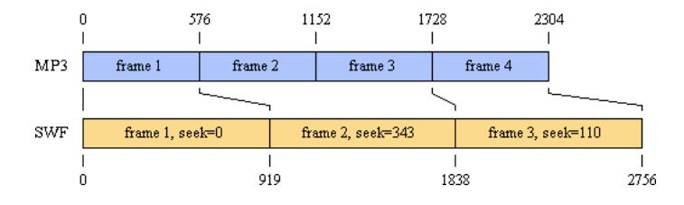

The SoundStreamBlock in SWF Frame 1 contains one MP3 frame and has SeekSamples set to zero. Frame 2 contains two MP3 frames and has SeekSamples set to 919 - 576 = 343. Frame 3 contains one MP3 frame and has SeekSamples set to 1838 - 1728 = 110.

In continuous playback, Flash Player will string all of the MP3 frames together and play them at their natural sample rate, reading ahead in the SWF bitstream to build up a buffer of sound data (this is why it is acceptable to include less than the ideal number of samples in a SWF frame). After a seek to a particular frame, such as is prompted by an ActionGotoFrame, Flash Player will skip the number of samples indicated by SeekSamples. For example, after a seek to Frame 2, it will skip 343 samples of the SoundStreamBlock data from Frame 2, which will cause sound playback to begin at sample 919, the ideal value.

If the ideal number of MP3 frames per SWF frame is less than one, there will be SWF frames whose SoundStreamBlocks cannot accommodate any MP3 frames without exceeding the ideal number of samples. In this case, write a SoundStreamBlock with SampleCount = 0, SeekSamples = 0, and no MP3 data.

Some MP3 encoders have an initial latency, generating a number of silent or meaningless samples before the desired sound data begins. This can help the Flash Player MP3 decoder as well, providing some ramp-up data before the samples that are needed. In this situation, determine how many samples the initial latency occupies, and supply that number for SeekSamples in the first SoundStreamBlock. Flash Player will add this number to the SeekSamples for any other frame when performing a seek. Latency also affects the decision as to how many MP3 frames to put into a SoundStreamBlock. Here is a modification of the above example with a latency of 940 samples:

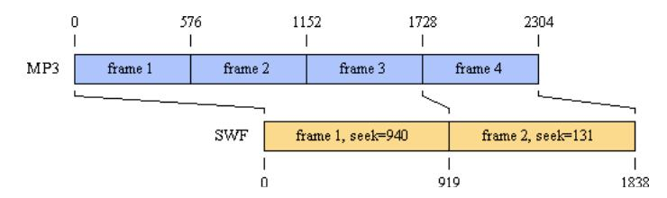

The SoundStreamBlock in SWF Frame 1 contains three MP3 frames, the maximum that can be accommodated without exceeding the ideal number of samples after adjusting for latency (represented by the leftward shift of the MP3 timeline above). The value of SeekSamples in Frame 1 is special; it represents the latency. Frame 2 contains one MP3 frame and has SeekSamples set to 919 - (1728 - 940) = 131.

# <span id="page-187-0"></span>**ADPCM compression**

ADPCM (Adaptive Differential Pulse Code Modulation) is a family of audio compression and decompression algorithms. It is a simple but efficient compression scheme that avoids any licensing or patent issues that arise with more sophisticated sound compression schemes, and helps to keep player implementations small.

For SWF 4 or later files, MP3 compression is a preferable format (see ["MP3 compression"](#page-189-0) ). MP3 produces substantially better sound for a given bitrate.

ADPCM uses a modified Differential Pulse Code Modulation (DPCM) sampling technique where the encoding of a each sample is derived by calculating a "difference" (DPCM) value, and applying to this a complex formula which includes the previous quantization value. The result is a compressed code, which can recreate almost the same subjective audio quality.

A common implementation takes 16-bit linear PCM samples and converts them to 4-bit codes, yielding a compression rate of 4:1. Public domain C code written by Jack Jansen is available at [www.cwi.nl/ftp/audio/adpcm.zip.](http://www.cwi.nl/ftp/audio/adpcm.zip)

The SWF file format extends Jansen's implementation to support 2-, 3-, 4- and 5-bit ADPCM codes. When choosing a code size, there is the usual trade-off between file size and audio quality. The code tables used in SWF file format are as follows (note that each structure here provides only the unique lower half of the range, the upper half being an exact duplicate):

```
int indexTable2[2] = {-1, 2};
int indexTable3[4] = {-1, -1, 2, 4};
int indexTable4[8] = {-1, -1, -1, -1, 2, 4, 6, 8};
int indexTable5[16] = {-1, -1, -1, -1, -1, -1, -1, -1, 1, 2,
 4, 6, 8, 10, 13, 16};
```

### <span id="page-188-0"></span>**ADPCM sound data**

The ADPCMSOUNDATA record defines the size of the ADPCM codes used, and an array of ADPCMPACKETs which contain the ADPCM data.

| Field         | Type                                                                                                         | Comment                                                                              |
|---------------|--------------------------------------------------------------------------------------------------------------|--------------------------------------------------------------------------------------|
| AdpcmCodeSize | UB[2]<br>0 = 2 bits/sample<br>1 = 3 bits/sample<br>2 = 4 bits/sample<br>3 = 5 bits/sample                    | Bits per ADPCM code less 2.<br>The actual size of each code<br>is AdpcmCodeSize + 2. |
| AdpcmPackets  | If SoundType = mono, ADPCMMONOPACKET [one or more]<br>If SoundType = stereo, ADPCMSTEREOPACKET [one or more] | Array of ADPCMPACKETs.                                                               |

ADPCMPACKETs vary in structure depending on whether the sound is mono or stereo.

| ADPCMMONOPACKET |                              |                                                                   |  |
|-----------------|------------------------------|-------------------------------------------------------------------|--|
| Field           | Type                         | Comment                                                           |  |
| InitialSample   | SI16                         | First sample. Identical to first sample in<br>uncompressed sound. |  |
| InitialIndex    | UB[6]                        | Initial index into the ADPCM StepSizeTable.*                      |  |
| AdpcmCodeData   | UB[4095 * (AdpcmCodeSize+2)] | 4095 ADPCM codes. Each sample is<br>(AdpcmCodeSize + 2) bits.     |  |

| ADPCMSTEREOPACKET  |                              |                                                                                                                                        |
|--------------------|------------------------------|----------------------------------------------------------------------------------------------------------------------------------------|
| Field              | Type                         | Comment                                                                                                                                |
| InitialSampleLeft  | SI16                         | First sample for left channel. Identical to first<br>sample in uncompressed sound.                                                     |
| InitialIndexLeft   | UB[6]                        | Initial index into the ADPCM StepSizeTable* for<br>left channel.                                                                       |
| InitialSampleRight | SI16                         | First sample for right channel. Identical to first<br>sample in uncompressed sound.                                                    |
| InitialIndexRight  | UB[6]                        | Initial index into the ADPCM StepSizeTable* for<br>right channel                                                                       |
| AdpcmCodeData      | UB[8190 * (AdpcmCodeSize+2)] | 4095 ADPCM codes per channel, total 8190. Each<br>sample is (AdpcmCodeSize + 2) bits. Channel data<br>is interleaved left, then right. |

<sup>\*</sup> For an explanation of StepSizeTable, see the Jansen source code.

# <span id="page-189-0"></span>**MP3 compression**

MP3 is a sophisticated and complex audio compression algorithm supported in SWF 4 and later. It produces superior audio quality at better compression ratios than ADPCM. Generally speaking, MP3 refers to MPEG1 Layer 3; however, the SWF file format supports later versions of MPEG (V2 and 2.5) that were designed to support lower bitrates. Flash Player supports both CBR (constant bitrate) and VBR (variable bitrate) MP3 encoding.

For more information on MP3, see [www.mp3-tech.org/](http://www.mp3-tech.org/) and [www.iis.fhg.de/amm/techinf/layer3/index.html.](http://www.iis.fhg.de/amm/techinf/layer3/index.html) Writing an MP3 encoder is quite difficult, but public-domain MP3 encoding libraries may be available.

**Note**: Be aware that software and hardware MP3 encoders and decoders might have their own licensing requirements.

## <span id="page-189-1"></span>**MP3 sound data**

MP3 sound data is described in the following table:

| Field                               | Type | Comment                    |
|-------------------------------------|------|----------------------------|
| SeekSamples                         | SI16 | Number of samples to skip. |
| Mp3Frames<br>MP3FRAME[zero or more] |      | Array of MP3 frames.       |

For an explanation of the the SeekSamples field, see ["Frame subdivision for streaming sound"](#page-185-1).

**Note**: For event sounds, SeekSamples is limited to specifying initial latency.

### <span id="page-191-0"></span>**MP3 frame**

The MP3FRAME record corresponds exactly to an MPEG audio frame that you would find in an MP3 music file. The first 32 bits of the frame contain header information, followed by an array of bytes, which are the encoded audio samples.

| Field         | Type   | Comment                                                                                                                                                                                                                                                                                                                                                                                      |  |
|---------------|--------|----------------------------------------------------------------------------------------------------------------------------------------------------------------------------------------------------------------------------------------------------------------------------------------------------------------------------------------------------------------------------------------------|--|
| Syncword      | UB[11] | Frame sync. All bits must be set.                                                                                                                                                                                                                                                                                                                                                            |  |
| MpegVersion   | UB[2]  | MPEG2.5 is an extension to MPEG2<br>that handles very low bitrates,<br>allowing the use of lower sampling<br>frequencies. 0 = MPEG Version 2.5;<br>1 = reserved; 2 = MPEG Version 2; 3<br>= MPEG Version 1                                                                                                                                                                                   |  |
| Layer         | UB[2]  | Layer is always equal to 1 for MP3<br>headers in SWF files. The "3" in<br>MP3 refers to the Layer, not the<br>MpegVersion.: 0 = reserved; 1 =<br>Layer III; 2 = Layer II; 3 = Layer I                                                                                                                                                                                                        |  |
| ProtectionBit | UB[1]  | If ProtectionBit == 0, a 16-bit CRC<br>follows the header: 0 = Protected<br>by CRC; 1 = Not protected                                                                                                                                                                                                                                                                                        |  |
| Bitrate       | UB[4]  | Bitrates are in thousands of bits per<br>second. For example, 128 means<br>128000 bps.<br>free<br>free<br>0<br>1<br>32<br>8<br>2<br>40<br>16<br>3<br>48<br>24<br>4<br>56<br>32<br>5<br>64<br>40<br>6<br>80<br>48<br>7<br>96<br>56<br>8<br>112<br>64<br>9<br>128<br>80<br>10<br>160<br>96<br>11<br>192<br>112<br>12<br>224<br>128<br>13<br>256<br>144<br>14<br>320<br>160<br>bad<br>15<br>bad |  |
| SamplingRate  | UB[2]  | Sampling rate in Hz.<br>Value MPEG1 MPEG2.x<br>MPEG2.5                                                                                                                                                                                                                                                                                                                                       |  |

|               |                          | 0 44100 22050 11025<br>1<br>48000 24000 12000<br>2<br>32000 16000 8000<br><br><br>                                                                                                                                  |
|---------------|--------------------------|---------------------------------------------------------------------------------------------------------------------------------------------------------------------------------------------------------------------|
| PaddingBit    | UB[1]                    | Padding is used to fit the bitrate<br>exactly. 0 = frame is not padded; 1<br>= frame is padded with one extra<br>slot                                                                                               |
| Reserved      | UB[1]                    |                                                                                                                                                                                                                     |
| ChannelMode   | UB[2]                    | Dual-channel files are made of two<br>independent mono channels. Each<br>one uses exactly half the bitrate of<br>the file. 0 = Stereo; 1 = Joint stereo<br>(Stereo); 2 = Dual channel; 2 =<br>Single channel (Mono) |
| ModeExtension | UB[2]                    |                                                                                                                                                                                                                     |
| Copyright     | UB[1]                    | 0 = Audio is not copyrighted; 1 =<br>Audio is copyrighted                                                                                                                                                           |
| Original      | UB[1]                    | 0 = Copy of original<br>media; 1 =<br>Original media                                                                                                                                                                |
| Emphasis      | UB[2]                    | 0 = none; 1 = 50/15 ms; 2 =<br>reserved; 3 = CCIT J.17                                                                                                                                                              |
| SampleData    | UB[size of sample data*] | The encoded audio samples.                                                                                                                                                                                          |

<sup>\*</sup> The size of the sample data is calculated like this (using integer arithmetic):

```
Size = (((MpegVersion == MPEG1 ? 144 : 72) * Bitrate) / SamplingRate) + PaddingBit
- 4
```

For example: The size of the sample data for an MPEG1 frame with a Bitrate of 128000, a SamplingRate of 44100, and PaddingBit of 1 is:

```
Size = (144 * 128000) / 44100 + 1 – 4 = 414 bytes
```

# <span id="page-193-0"></span>**Nellymoser compression**

Starting with SWF 6, a compressed sound format called Nellymoser Asao is available. This is a single-channel (mono) format optimized for low-bitrate transmission of speech. The format was developed by Nellymoser Inc. at [www.nellymoser.com.](http://www.nellymoser.com/)

A summary of the Nellymoser Asao encoding process is provided here. For full details of the Asao format, contact Nellymoser.

Asao uses frequency-domain characteristics of sound for compression. Sound data is grouped into frames of 256 samples. Each frame is converted into the frequency domain and the most significant (highest-amplitude) frequencies are identified. A number of frequency bands are selected for encoding; the rest are discarded. The bitstream for each frame then encodes which frequency bands are in use and what their amplitudes are.

# <span id="page-193-1"></span>**Speex compression**

Starting with SWF 10, a SWF file can store audio samples that have been compressed using the free, open source Speex voice codec (see [speex.org\).](http://speex.org/) Speex audio is stored as format 11 in a DefineSound tag. While Speex supports a range of sample rates, Speex audio encoded in SWF is always encoded at 16 kHz; the SoundRate field of the DefineSound tag is disregarded. The SoundType and SoundSize fields are also ingored in the case of Speex. Speex in SWF is always mono and always decodes to 16-bit audio samples internally.

Speex 1.2 beta 3 is compiled into the Flash Player as of version 10 (10.0.12).

# <span id="page-194-0"></span>**Chapter 12: Buttons**

Button characters in the SWF file format serve as interactive elements. They can react programmatically to events that occur. The most common event to handle is a simple click from the mouse, but more complex events can be trapped as well.

# <span id="page-194-1"></span>**Button states**

A button object can be displayed in one of three states: up, over, or down.

The up state is the default appearance of the button. The up state is displayed when the SWF file starts playing, and whenever the mouse is outside the button. The over state is displayed when the mouse is moved inside the button. This allows rollover or hover buttons in a SWF file. The down state is the clicked appearance of the button. It is displayed when the mouse is clicked inside the button.

A fourth state—the hit state—defines the active area of the button. This is an invisible state and is never displayed. It defines the area of the button that reacts to mouse clicks. This hit area is not necessarily rectangular and need not reflect the visible shape of the button.

Each state is made up of a collection of instances of characters from the dictionary. Each such instance is defined using a Button record, which, within a button definition, acts like a PlaceObject tag. For the up, over, and down states, these characters are placed on the display list when the button enters that state. For the hit-area state, these characters define the active area of the button.

The following is an example of a typical button and its four states. The button is initially blue. When the mouse is moved over the button, it changes to a purple color. When the mouse is pressed inside the button, the shading changes to simulate a depressed button. The fourth state—the hit area—is a simple rectangle. Anything outside this shape is outside the button, and anything inside this shape is inside the button.

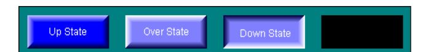

The SWF file format has no native support for radio buttons or check boxes. There is no "checked" (selected) state, and buttons cannot "stick" down after the mouse is released. In addition, there is no way to group buttons into mutually exclusive choices. However, both of these behaviors can be simulated by using button actions.

# <span id="page-194-2"></span>**Button tracking**

Button tracking refers to how a button behaves as it tracks the movement of the mouse. A button object can track the mouse in one of two modes, as a push button or as a menu button.

If a push button is clicked, all mouse movement events are directed to the push button until the mouse button is released. This is called capturing the mouse. For example, if you click a push button and drag outside the button

(without releasing), the button changes to the over state, and the pointer remains a pointing hand.

Menu buttons do not capture the mouse. If you click a menu button and drag outside, the button changes to the up state, and the pointer reverts to an arrow.

# <span id="page-195-0"></span>**Events, state transitions, and actions**

A button object can perform an action whenever a state transition occurs (that is, when the button changes from one state to another). A state transition occurs in response to some event, such as a mouse click, or mouse entering the button. In the SWF file format, events are described as state transitions. The following table shows possible state transitions and corresponding Flash Player events:

| State Transition | Event     | Description                                                         | Visual Effect                              |
|------------------|-----------|---------------------------------------------------------------------|--------------------------------------------|
| IdleToOverUp     | Roll Over | Mouse enters the hit area while the<br>mouse button is up.          | Button changes from up<br>to over state.   |
| OverUpToIdle     | Roll Out  | Mouse leaves the hit area while the                                 | Button changes from over                   |
|                  |           | mouse button is up.                                                 | to up state.                               |
| OverUpToOverDown | Press     | Mouse button is pressed while the<br>mouse is inside the hit area.  | Button changes from over<br>to down state. |
| OverDownToOverUp | Release   | Mouse button is released while the<br>mouse is inside the hit area. | Button changes from<br>down to over state. |

The following transitions only apply when tracking Push buttons:

| State Transition  | Event          | Description                                                                      | Visual Effect                              |
|-------------------|----------------|----------------------------------------------------------------------------------|--------------------------------------------|
| OutDownToOverDown | Drag Over      | Mouse is dragged inside the hit area<br>while the mouse button is down.          | Button changes from over<br>to down state. |
| OverDownToOutDown | Drag Out       | Mouse is dragged outside the hit<br>area while the mouse button is<br>down.      | Button changes from<br>down to over state. |
| OutDownToIdle     | ReleaseOutside | Mouse button is released outside<br>the hit area while the mouse is<br>captured. | Button changes from over<br>to up state.   |

The following transitions apply only when tracking Menu buttons:

| State Transition | Event     | Description                                                              | Visual Effect                            |
|------------------|-----------|--------------------------------------------------------------------------|------------------------------------------|
| IdleToOverDown   | Drag Over | Mouse is dragged inside the hit area<br>while the mouse button is down.  | Button changes from up to<br>down state. |
| OverDownToIdle   | Drag Out  | Mouse is dragged outside the hit area<br>while the mouse button is down. | Button changes from down to<br>up state. |

Often button actions are performed only on OverDownToOverUp (when the mouse button is released), but DefineButton2 allows actions to be triggered by any state transition. A button object can perform any action supported by the SWF 3 actions (see ["SWF 3 actions"](#page-65-0) on page [64\)](#page-65-0).

# <span id="page-196-0"></span>**Button tags**

### <span id="page-196-1"></span>**Buttonrecord**

A button record defines a character to be displayed in one or more button states. The ButtonState flags indicate which state (or states) the character belongs to.

A one-to-one relationship does not exist between button records and button states. A single button record can apply to more than one button state (by setting multiple ButtonState flags), and multiple button records can be present for any button state.

Each button record also includes a transformation matrix and depth (stacking-order) information. These apply just as in a PlaceObject tag, except that both pieces of information are relative to the button character itself.

SWF 8 and later supports the new ButtonHasBlendMode and ButtonHasFilterList fields to support blend modes and bitmap filters on buttons. Flash Player 7 and earlier ignores these two fields.

| Field               | Type  | Comment                                                           |
|---------------------|-------|-------------------------------------------------------------------|
| ButtonReserved      | UB[2] | Reserved bits; always 0                                           |
| ButtonHasBlendMode  | UB[1] | 0 = No blend mode; 1 = Has blend mode (SWF<br>8 and later only)   |
| ButtonHasFilterList | UB[1] | 0 = No filter list; 1 = Has filter list (SWF 8 and<br>later only) |
| ButtonStateHitTest  | UB[1] | Present in hit test state                                         |
| ButtonStateDown     | UB[1] | Present in down state                                             |

| ButtonStateOver | UB[1]                               | Present in over state                            |
|-----------------|-------------------------------------|--------------------------------------------------|
| ButtonStateUp   | UB[1]                               | Present in up state                              |
| CharacterID     | UI16                                | ID of character to place                         |
| PlaceDepth      | UI16                                | Depth at which to place character                |
| PlaceMatrix     | MATRIX                              | Transformation matrix for character              |
|                 |                                     | placement                                        |
| ColorTransform  | If within DefineButton2,            | Character color transform                        |
|                 | CXFORMWITHALPHA                     |                                                  |
| FilterList      | If within DefineButton2 and         | List of filters on this button                   |
|                 | ButtonHasFilterList = 1, FILTERLIST |                                                  |
| BlendMode       | If within DefineButton2 and         | 0 or 1 = normal; 2 = layer; 3 = multiply; 4 =    |
|                 | ButtonHasBlendMode = 1, UI8         | screen; 5 = lighten; 6 = darken; 7 = difference; |
|                 |                                     | 8 = add; 9 = subtract; 10 = invert; 11 = alpha;  |
|                 |                                     | 12 = erase; 13 = overlay; 14 =<br>hardlight;     |
|                 |                                     | Values 15 to 255 are reserved.                   |
|                 |                                     |                                                  |

### <span id="page-197-0"></span>**DefineButton**

The DefineButton tag defines a button character for later use by control tags such as PlaceObject.

DefineButton includes an array of Button records that represent the four button shapes: an up character, a mouse-over character, a down character, and a hit-area character. It is not necessary to define all four states, but at least one button record must be present. For example, if the same button record defines both the up and over states, only three button records are required to describe the button.

More than one button record per state is allowed. If two button records refer to the same state, both are displayed for that state.

DefineButton also includes an array of ACTIONRECORDs, which are performed when the button is clicked and released (see ["SWF 3 actions"](#page-65-0) on page [64\)](#page-65-0).

The minimum file format version is SWF 1.

| Field    | Type         | Comment               |
|----------|--------------|-----------------------|
| Header   | RECORDHEADER | Tag type = 7          |
| ButtonId | UI16         | ID for this character |

| Characters       | BUTTONRECORD[one or more]  | Characters that make up the button |
|------------------|----------------------------|------------------------------------|
| CharacterEndFlag | UI8                        | Must be 0                          |
| Actions          | ACTIONRECORD[zero or more] | Actions to perform                 |
| ActionEndFlag    | UI8                        | Must be 0                          |

## <span id="page-198-0"></span>**DefineButton2**

DefineButton2 extends the capabilities of DefineButton by allowing any state transition to trigger actions.

The minimum file format version is SWF 3:

Starting with SWF 9, if the ActionScript3 field of the FileAttributes tag is 1, there must be no BUTTONCONDACTION fields in the DefineButton2 tag. ActionOffset must be 0. This structure is not supported because it is not permitted to mix ActionScript 1/2 and ActionScript 3.0 code within the same SWF file.

| Field            | Type                            | Comment                                                                                             |
|------------------|---------------------------------|-----------------------------------------------------------------------------------------------------|
| Header           | RECORDHEADER                    | Tag type = 34                                                                                       |
| ButtonId         | UI16                            | ID for this character                                                                               |
| ReservedFlags    | UB[7]                           | Always 0                                                                                            |
| TrackAsMenu      | UB[1]                           | 0 = track as normal button; 1 = track as menu<br>button                                             |
| ActionOffset     | UI16                            | Offset in bytes from start of this field to the first<br>BUTTONCONDACTION, or 0 if no actions occur |
| Characters       | BUTTONRECORD [one or more]      | Characters that make up the button                                                                  |
| CharacterEndFlag | UI8                             | Must be 0                                                                                           |
| Actions          | BUTTONCONDACTION [zero or more] | Actions to execute at particular button events                                                      |

The actions associated with DefineButton2 are specified as follows:

| BUTTONCONDACTION |      |                                                  |
|------------------|------|--------------------------------------------------|
| Field            | Type | Comment                                          |
| CondActionSize   | UI16 | Offset in bytes from start of this field to next |

|                       |       | BUTTONCONDACTION, or 0 if last action       |  |
|-----------------------|-------|---------------------------------------------|--|
| CondIdleToOverDown    | UB[1] | Idle to OverDown                            |  |
| CondOutDownToIdle     | UB[1] | OutDown to Idle                             |  |
| CondOutDownToOverDown | UB[1] | OutDown to OverDown                         |  |
| CondOverDownToOutDown | UB[1] | OverDown to OutDown                         |  |
| CondOverDownToOverUp  | UB[1] | OverDown to OverUp                          |  |
| CondOverUpToOverDown  | UB[1] | OverUp to OverDown                          |  |
| CondOverUpToIdle      | UB[1] | OverUp to Idle                              |  |
| CondIdleToOverUp      | UB[1] | Idle to OverUp                              |  |
| CondKeyPress          | UB[7] | SWF 4 or later: key codeOtherwise: always 0 |  |
|                       |       | Valid key codes:                            |  |
|                       |       | •<br>1 = left arrow                         |  |
|                       |       | •<br>2 = right arrow                        |  |
|                       |       | •<br>3 = home                               |  |
|                       |       | •<br>4 = end                                |  |
|                       |       | •<br>5 = insert                             |  |
|                       |       | •<br>6 = delete                             |  |
|                       |       | •<br>8 = backspace                          |  |
|                       |       | •<br>13 = enter                             |  |
|                       |       | •<br>14 = up arrow                          |  |
|                       |       | •<br>15 = down arrow                        |  |
|                       |       | •<br>16 = page up                           |  |
|                       |       | •<br>17 = page down                         |  |
|                       |       | •<br>18 = tab                               |  |

|                    |                             | •<br>19 = escape                  |
|--------------------|-----------------------------|-----------------------------------|
|                    |                             | •<br>32 to 126: follows ASCII     |
| CondOverDownToIdle | UB[1]                       | OverDown to Idle                  |
| Actions            | ACTIONRECORD [zero or more] | Actions to perform. See DoAction. |
| ActionEndFlag      | UI8                         | Must be 0                         |

For each event handler (each BUTTONCONDACTION), one or more of the Cond bit fields should be filled in. This specifies when the event handler should be executed.

CondKeyPress specifies a particular key to trap. A CondKeyPress event handler is executed even if the button that it applies to does not have input focus. For the 32 to 126 ASCII key codes, the key event that is trapped is composite—it takes into account the effect of the Shift key. To trap raw key events, corresponding directly to keys on the keyboard (including the modifier keys themselves), use clip event handlers instead.

## <span id="page-200-0"></span>**DefineButtonCxform**

DefineButtonCxform defines the color transform for each shape and text character in a button. This is not used for DefineButton2, which includes its own CXFORM.

The minimum file format version is SWF 2.

| Field                | Type         | Comment                        |
|----------------------|--------------|--------------------------------|
| Header               | RECORDHEADER | Tag type = 23                  |
| ButtonId             | UI16         | Button ID for this information |
| ButtonColorTransform | CXFORM       | Character color transform      |

## <span id="page-200-1"></span>**DefineButtonSound**

The DefineButtonSound tag defines which sounds (if any) are played on state transitions. The minimum file format version is SWF 2.

| Field    | Type         | Comment                                     |
|----------|--------------|---------------------------------------------|
| Header   | RECORDHEADER | Tag type = 17                               |
| ButtonId | UI16         | The ID of the button these sounds apply to. |

| ButtonSoundChar0 | UI16                                          | Sound ID for OverUpToIdle        |
|------------------|-----------------------------------------------|----------------------------------|
| ButtonSoundInfo0 | SOUNDINFO (if ButtonSoundChar0 is<br>nonzero) | Sound style for OverUpToIdle     |
| ButtonSoundChar1 | UI16                                          | Sound ID for IdleToOverUp        |
| ButtonSoundInfo1 | SOUNDINFO (if ButtonSoundChar1 is<br>nonzero) | Sound style for IdleToOverUp     |
| ButtonSoundChar2 | UI16                                          | Sound ID for OverUpToOverDown    |
| ButtonSoundInfo2 | SOUNDINFO (if ButtonSoundChar2 is<br>nonzero) | Sound style for OverUpToOverDown |
| ButtonSoundChar3 | UI16                                          | Sound ID for OverDownToOverUp    |
| ButtonSoundInfo3 | SOUNDINFO (if ButtonSoundChar3 is<br>nonzero) | Sound style for OverDownToOverUp |

# <span id="page-202-0"></span>**Chapter 13: Sprites and Movie Clips**

A sprite corresponds to a movie clip in the Adobe Flash authoring application. It is a SWF file contained within another SWF file, and supports many of the features of a regular SWF file, such as the following:

- Most of the control tags that can be used in the main file.
- A timeline that can stop, start, and play independently of the main file.
- A streaming sound track that is automatically mixed with the main sound track.

A sprite object is defined with a DefineSprite tag. It consists of a character ID, a frame count, and a series of control tags. Definition tags (such as DefineShape) are not allowed in the DefineSprite tag. All of the characters that control tags refer to in the sprite must be defined outside the sprite, and before the DefineSprite tag.

Once defined, a sprite is displayed with a PlaceObject2 tag in the main file. The transform (specified in PlaceObject) is concatenated with the transforms of objects placed inside the sprite. These objects behave like children of the sprite, so when the sprite is moved, the objects inside the sprite move too. Similarly, when the sprite is scaled or rotated, the child objects are also scaled or rotated. A sprite object stops playing automatically when it is removed from the display list.

# <span id="page-202-1"></span>**Sprite names**

When a sprite is placed on the display list, it can be given a name with the PlaceObject2 tag. This name is used to identify the sprite so that the main file (or other sprites) can perform actions inside the sprite. This is achieved with the SetTarget action (see ActionSetTarget).

For example, say a sprite object is placed in the main file with the name "spinner". The main file can send this sprite to the first frame in its timeline with the following action sequence:

- 1. SetTarget "spinner"
- 2. GotoFrame zero
- 3. SetTarget "" (empty string)
- 4. End of actions. (Action code = 0)

**Note**: All actions following SetTarget "spinner" apply to the spinner object until SetTarget "", which sets the action context back to the main file.

The SWF file format supports placing sprites within sprites, which can lead to complex hierarchies of objects. To handle this complexity, the SWF file format uses a naming convention similar to that used by file systems to identify sprites.

For example, the following outline shows four sprites defined within the main file:

```
MainMovie.swf
 SpriteA (name: Jack) 
 SpriteA1 (name: Bert)
 SpriteA2 (name: Ernie)
 SpriteB (name: Jill)
```

The following SetTarget paths identify the preceding sprites:

- /Jack targets SpriteA from the main file.
- ../ targets the main file from SpriteA.
- /Jack/Bert targets SpriteA1 from any other sprite or the main file.
- Bert targets SpriteA1 from SpriteA.
- ../Ernie targets SpriteA2 from SpriteA1.
- ../../Jill targets SpriteB from SpriteA1.

# <span id="page-203-0"></span>**DefineSprite**

The DefineSprite tag defines a sprite character. It consists of a character ID and a frame count, followed by a series of control tags. The sprite is terminated with an End tag.

The length specified in the Header reflects the length of the entire DefineSprite tag, including the ControlTags field.

Definition tags (such as DefineShape) are not allowed in the DefineSprite tag. All of the characters that control tags refer to in the sprite must be defined in the main body of the file before the sprite is defined.

The minimum file format version is SWF 3.

| Field       | Type                           | Comment                    |  |
|-------------|--------------------------------|----------------------------|--|
| Header      | RECORDHEADER                   | Tag type = 39              |  |
| Sprite ID   | UI16<br>Character ID of sprite |                            |  |
| FrameCount  | UI16                           | Number of frames in sprite |  |
| ControlTags | TAG[one or more]               | A series of tags           |  |

The following tags are valid within a DefineSprite tag:

• ShowFrame • StartSound

• PlaceObject • FrameLabel

• PlaceObject2 • SoundStreamHead

• RemoveObject • SoundStreamHead2

• RemoveObject2 • SoundStreamBlock

• All Actions (see Actions) • End

# <span id="page-205-0"></span>**Chapter 14: Video**

Adobe Flash Player 6 and later supports video playback. Video can be provided to Flash Player in the following ways:

- Embed video within a SWF file by using the SWF video tags.
- Deliver a video stream over RTMP through the Adobe Flash Media Server, which, as one option, can obtain the video data from an FLV file format file.
- Load an FLV file directly into Flash Player by using the NetStream.play ActionScript method. This method is only available in Flash Player 7 and later. The SWF and FLV file formats share a common video encoding format.

For complete information about the FLV file format, refer to the FLV File Format Specification at [www.adobe.com/go/video\\_file\\_format.](http://www.adobe.com/go/video_file_format)

# <span id="page-205-1"></span>**Sorenson H.263 Bitstream Format**

As of SWF 6, a single video format, called Sorenson H.263, is available. This format is based on H.263, an open video encoding standard that is maintained by the ITU. Copies of the H.263 standard can be obtained at [www.itu.int/.](http://www.itu.int/)

All references to the H.263 standard in this document refer to the draft version of H.263, dated May 1996, sometimes referred to as H.263v1. This is distinct from the revised version of H.263, dated February 1998, sometimes referred to as H.263v2 or H.263+, and currently the in-force version of H.263 according to the ITU.

The Sorenson H.263 video format differs slightly from H.263. For the most part, it is a subset of H.263, with some advanced features removed and a few additions. These changes are described in this section.

The Sorenson H.263 video format was developed by Sorenson Media [\(www.sorenson.com\)](http://www.sorenson.com/). Existing products that can produce video for playback in Flash Player are the Adobe Flash authoring application, and Sorenson Squeeze for Adobe Flash 8, a professional video compression application. You can license the Sorenson Spark codec to perform video encoding for Flash Player; contact Sorenson Media for details.

## <span id="page-205-2"></span>**Summary of differences from H.263**

The following H.263 features are removed from the Sorenson H.263 video format:

- GOB (group of blocks) layer
- Split-screen indicator
- Document camera indicator

- Picture freeze release
- Syntax-based arithmetic coding
- PB frames
- Continuous-presence multipoint
- Overlapped block-motion compensation

The following non-H.263 features are added to the Sorenson H.263 video format:

- Disposable frames (difference frames with no future dependencies)
- Arbitrary picture width and height up to 65535 pixels
- Unrestricted motion vector support is always on
- A deblocking flag is available to suggest the use of a deblocking filter

To support these differences, the Sorenson H.263 video format uses different headers than H.263 at both the picture layer and the Macroblock layer. The GOB layer is absent.

Two versions of the Sorenson H.263 video format are defined. In version 0, the block layer is identical to H.263. In version 1, escape codes in transform coefficients are encoded differently than in H.263. Version 0 and version 1 have no other differences

### <span id="page-206-0"></span>**Video packet**

The video packet is the top-level structural element in a Sorenson H.263 video packet. It corresponds to the picture layer in H.263 section 5.1. This structure is included within the VideoFrame tag in the SWF file format, and also within the VIDEODATA structure in the FLV file format.

| H263VIDEOPACKET   |        |                                                                             |
|-------------------|--------|-----------------------------------------------------------------------------|
| Field             | Type   | Comment                                                                     |
| PictureStartCode  | UB[17] | Similar to H.263 5.1.1; 0000 0000 0000<br>0000 1                            |
| Version           | UB[5]  | Video format version; Flash Player 6<br>supports 0 and 1                    |
| TemporalReference | UB[8]  | See H.263 5.1.2                                                             |
| PictureSize       | UB[3]  | 000: custom, 1 byte; 001: custom, 2<br>bytes; 010: CIF (352x288); 011: QCIF |

|                      |                                                                                                                                                      | (176x144); 100: SQCIF (128x96); 101:<br>320x240; 110: 160x120; 111: reserved                                          |
|----------------------|------------------------------------------------------------------------------------------------------------------------------------------------------|-----------------------------------------------------------------------------------------------------------------------|
| CustomWidth          | If PictureSize = 000, UB[8] If PictureSize =<br>001, UB[16] Otherwise absent. Note:<br>UB[16] is not the same as UI16; there is no<br>byte swapping. | Width in pixels                                                                                                       |
| CustomHeight         | If PictureSize = 000, UB[8] If PictureSize =<br>001, UB[16] Otherwise absent. Note:<br>UB[16] is not the same as UI16; there is no<br>byte swapping. | Height in pixels                                                                                                      |
| PictureType          | UB[2]                                                                                                                                                | 00: intra frame; 01: inter frame; 10:<br>disposable inter frame; 11: reserved                                         |
| DeblockingFlag       | UB[1]                                                                                                                                                | Requests use of deblocking filter<br>(advisory only, Flash Player may ignore)                                         |
| Quantizer            | UB[5]                                                                                                                                                | See H.263<br>5.1.4                                                                                                    |
| ExtraInformationFlag | UB[1]                                                                                                                                                | See H.263 5.1.9                                                                                                       |
| ExtraInformation     | If ExtraInformationFlag = 1, UB[8],<br>Otherwise absent                                                                                              | See H.263 5.1.10                                                                                                      |
|                      |                                                                                                                                                      | The ExtraInformationFlag<br>ExtraInformation sequence repeats until<br>an ExtraInformationFlag of 0 is<br>encountered |
| Macroblock           | MACROBLOCK                                                                                                                                           | See following                                                                                                         |
| PictureStuffing      | varies                                                                                                                                               | See H.263 5.1.13                                                                                                      |

### <span id="page-207-0"></span>**Macro block**

The macro block is the next layer down in the video structure. It corresponds to the macro block layer in H.263 section 5.3.

| MACROBLOCK          |       |                                              |
|---------------------|-------|----------------------------------------------|
| Field               | Type  | Comment                                      |
| CodedMacroblockFlag | UB[1] | See H.263 5.3.1. If 1, macro block ends here |

| MacroblockType        | varies       | See H.263 5.3.2. Can cause various fields (see following)<br>to be absent                              |
|-----------------------|--------------|--------------------------------------------------------------------------------------------------------|
| BlockPattern          | varies       | See H.263 5.3.5                                                                                        |
| QuantizerInformation  | UB[2]        | See H.263 5.3.6; 00: -1; 01: -2; 10: +1; 11: +2                                                        |
| MotionVectorData      | varies[2]    | See H.263 5.3.7. A horizontal code followed by a vertical<br>code                                      |
| ExtraMotionVectorData | varies[6]    | See H.263 5.3.8. Three more MotionVectorData code<br>pairs are included when MacroblockType is INTER4V |
| BlockData             | BLOCKDATA[6] | See H.263 5.4. Four luminance blocks followed by two<br>chrominance blocks                             |

### <span id="page-208-0"></span>**Block data**

Block data is the lowest layer in the video structure. In version 0 of the Sorenson H.263 video format, this layer follows H.263 section 5.4 exactly.

In version 1 of the Sorenson H.263 video format, escape codes in transform coefficients (see H.263 section 5.4.2) are encoded differently. When the ESCAPE code 0000 011 appears, the next bit is a format bit that indicates the subsequent bit layout for LAST, RUN, and LEVEL. In both cases, one bit is used for LAST and six bits are used for RUN. If the format bit is 0, seven bits are used for LEVEL; if the format bit is 1, eleven bits are used for LEVEL. The 7-bit and 11-bit LEVEL tables, which replace table 14 in H.263, as the following table shows:

| 7-bit LEVELs |       |           | 11-bit LEVELs |       |                  |
|--------------|-------|-----------|---------------|-------|------------------|
| Index        | Level | Code      | Index         | Level | Code             |
| -            | -64   | FORBIDDEN | -             | -1024 | FORBIDDEN        |
| 0            | -63   | 1000 001  | 0             | -1023 | 1000 0000<br>001 |
|              |       |           |               |       |                  |
| 61           | -2    | 1111 110  | 1021          | -2    | 1111 1111 110    |
| 62           | -1    | 1111 111  | 1022          | -1    | 1111 1111 111    |
| -            | 0     | FORBIDDEN | -             | 0     | FORBIDDEN        |
| 63           | 1     | 0000 001  | 1023          | 1     | 0000 0000        |

|     |    |          |      |      | 001              |
|-----|----|----------|------|------|------------------|
| 64  | 2  | 0000 010 | 1024 | 2    | 0000 0000<br>010 |
|     |    |          |      |      |                  |
| 125 | 63 | 0111 111 | 2045 | 1023 | 0111 1111 111    |

# <span id="page-209-0"></span>**Screen Video bitstream format**

As of SWF 7, an additional video format, called screen video, is available. Screen video is a simple lossless sequential-bitmap format with blocked interframing. It is designed for sending captures of computer screens in action.

Pixel data in the screen video format is compressed by using the ZLIB open standard.

## <span id="page-209-1"></span>**Block format**

Each frame in a screen video sequence is formatted as a series of blocks. These blocks form a grid over the image. In a keyframe, information for every block is sent. In an interframe, there might be blocks that are unchanged from the previous frame and special information can be sent to indicate this.

Blocks have width and height that range from 16 to 256 in multiples of 16. Block height is not required to match block width. The block size must not change except at a keyframe.

Blocks are ordered from the bottom left of the image to the top right, in rows. A fixed layout of blocks exists for any given combination of block size and image size. To determine the number of blocks in a row of the grid, divide the image width by the block width. If the result is not an integer, the end of each row has one partial block, which contains only the number of pixels necessary to fill the remaining width of the image. The same logic applies to the image height, block height, number of rows in the grid, and partial blocks in the final row. It is important to understand the partial-block algorithm to create correct blocks, since the pixels within a partial block are extracted with implicit knowledge of the width and height of the block.

The following is an example of blocking. The image in this example is 120 x 80 pixels, and the block size is 32 x 32.

| #9      | #10     | #11     | #12     |
|---------|---------|---------|---------|
| 32 x 16 | 32 x 16 | 32 x 16 | 24 x 16 |
| #5      | #6      | #7      | #8      |
| 32 x 32 | 32 x 32 | 32 x 32 | 24 x 32 |
| #1      | #2      | #3      | #4      |
| 32 x 32 | 32 x 32 | 32 x 32 | 24 x 32 |

### <span id="page-210-0"></span>**Video packet**

The video packet is the top-level structural element in a screen video packet. This structure is included within the VideoFrame tag in the SWF file format, and also within the VIDEODATA structure in the FLV file format.

The data consists of information about the image sub-block dimensions and grid size, followed by the data for each block.

| SCREENVIDEOPACKET |               |                                                                                                                                                                       |  |  |
|-------------------|---------------|-----------------------------------------------------------------------------------------------------------------------------------------------------------------------|--|--|
| Field             | Type          | Comment                                                                                                                                                               |  |  |
| BlockWidth        | UB[4]         | Pixel width of each block in the grid. This value is stored<br>as (actualWidth / 16) -<br>1, so possible block sizes are a<br>multiple of 16 and not more than 256.   |  |  |
| ImageWidth        | UB[12]        | Pixel width of the full image.                                                                                                                                        |  |  |
| BlockHeight       | UB[4]         | Pixel height of each block in the grid. This value is stored<br>as (actualHeight / 16) -<br>1, so possible block sizes are a<br>multiple of 16 and not more than 256. |  |  |
| ImageHeight       | UB[12]        | Pixel height of the full image.                                                                                                                                       |  |  |
| ImageBlocks       | IMAGEBLOCK[n] | Blocks of image data. See preceding for details of how to<br>calculate n. Blocks are ordered from bottom left to top<br>right, in rows.                               |  |  |

## <span id="page-211-0"></span>**Image block**

The image block represents one block in a frame.

| IMAGEBLOCK |                                                                            |                                                                                                                                                                                          |  |
|------------|----------------------------------------------------------------------------|------------------------------------------------------------------------------------------------------------------------------------------------------------------------------------------|--|
| Field      | Type                                                                       | Comment                                                                                                                                                                                  |  |
| DataSize   | UB[16]<br>Note: UB[16] is not the same as<br>UI16; no byte swapping occurs | Size of the compressed block data<br>that follows. If this is an interframe,<br>and this block is not changed since<br>the last keyframe, DataSize is 0 and<br>the Data field is absent. |  |
| Data       | If DataSize > 0, UI8[DataSize]                                             | Pixel data compressed using ZLIB.<br>Pixels are ordered from bottom left<br>to top right in rows. Each pixel is<br>three bytes: B, G, R.                                                 |  |

# <span id="page-211-1"></span>**Screen Video V2 bitstream format**

SWF also supports a new screen video format, Screen Video Version 2, which is an extension of the Screen Video bitstream format and is supported in Flash Player 8 and later. Screen Video v2 uses several techniques to reduce the amount of data for each screen block.

In the initial Screen Video version, each block of screen data is a complete buffer of compressed data that can be decompressed to a full 24-bit color image for that block. In the Screen Video v2 format, the screen data blocks can be incomplete updates of the image area, similar to the concept of keyframes and interframes. Further, the v2 format introduces a hybrid 15/7-bit hybrid colorspace in addition to the usual 24-bit RGB colorspace. The 15/7- bit hybrid colorspace is useful for encoding images with a small number of unique colors (less than 256).In the Screen Video v2 format, block data comes in two types:

Keyblock contains complete information for the block. The contents can be decompressed to obtain the complete block image.

Interblock requires additional data, either from a previous image or the current image, to construct the full block image.

### <span id="page-211-2"></span>**V2 Colorspace**

The Screen Video v2 can encode video data using either a 24-bit RGB colorspace, as in v1, or using a 15/7-bit hybrid colorspace. Using the latter colorspace, an image has a corresponding 128-entry palette. Each pixel in a decoded image is represented by either 1 or 2 bytes. Generally, a decoder will want to convert a 15/7-bit hybrid colorspace to a 24-bit RGB colorspace. The process for doing so is:

- Fetch next byte from decoded image
- If next byte has its high bit set, clear high bit and fetch next byte from decoded image; form a 15-bit color by placing the low 7 bits of the current byte in bits 14-8 of the color, and place the 8 bits from the next byte in bits 7-0 of the color; convert the 15-bit RGB color to 24-bit RGB
- If next byte has its high bit clear, use the lower 7 bits as an index into the 128-entry palette and retrieve the corresponding 24-bit RGB color

A v2 video packet is free to define a new palette at any time, which is transmitted as a v1 IMAGEBLOCK. In the absence of a stream-defined palette, the v2 decoder will fall back to a default palette. For the default palette, see Appendix C, "Screen Video v2 Palette."

### <span id="page-212-0"></span>**V2 Video Packet**

Video Packet v2 is the top-level structural element in a screen video packet for Screen Video Version 2. This structure is included within the VideoFrame tag in SWF file format, and also within the VIDEODATA structure in FLV file format.

The data consists of information about the image sub-block dimensions and grid size, followed by the data for each block.

| SCREENV2VIDEOPACKET |                                  |                                                                                                                                                                       |  |
|---------------------|----------------------------------|-----------------------------------------------------------------------------------------------------------------------------------------------------------------------|--|
| Field               | Type                             | Comment                                                                                                                                                               |  |
| BlockWidth          | UB[4]                            | Pixel width of each block in the grid. This value is stored<br>as (actualWidth / 16) -<br>1, so possible block sizes are a<br>multiple of 16 and not more than 256.   |  |
| ImageWidth          | UB[12]                           | Pixel width of the full image.                                                                                                                                        |  |
| BlockHeight         | UB[4]                            | Pixel height of each block in the grid. This value is stored<br>as (actualHeight / 16) -<br>1, so possible block sizes are a<br>multiple of 16 and not more than 256. |  |
| ImageHeight         | UB[12]                           | Pixel height of the<br>full image.                                                                                                                                    |  |
| Reserved            | UB[6]                            | Must be 0                                                                                                                                                             |  |
| HasIFrameImage      | UB[1]                            | If 1, has IFrameImage                                                                                                                                                 |  |
| HasPaletteInfo      | UB[1]                            | If 1, has PaletteInfo                                                                                                                                                 |  |
| PaletteInfo         | If HasPaletteInfo,<br>IMAGEBLOCK | One block of data to describe the palette.                                                                                                                            |  |

| ImageBlocks | IMAGEBLOCKV2[n]                       | Blocks<br>of image data. See Block format for details of how<br>to calculate n. Blocks are ordered from bottom left to top<br>right in rows and can be a combination of keyblocks and<br>interblocks.                                        |
|-------------|---------------------------------------|----------------------------------------------------------------------------------------------------------------------------------------------------------------------------------------------------------------------------------------------|
| IFrameImage | If HasIFrameImage,<br>IMAGEBLOCKV2[n] | Blocks of image data representing interblocks that must<br>be combined with the previous keyblocks to produce the<br>image. See Block format for details of how to calculate n.<br>Blocks are ordered from bottom left to top right in rows. |

### <span id="page-213-0"></span>**Image Block V2**

The Image Block v2 structure represents one block in a frame.

| IMAGEBLOCKV2     |                                                                                                                              |                                                                                                                                                                                                                                                           |
|------------------|------------------------------------------------------------------------------------------------------------------------------|-----------------------------------------------------------------------------------------------------------------------------------------------------------------------------------------------------------------------------------------------------------|
| Field            | Type                                                                                                                         | Comment                                                                                                                                                                                                                                                   |
| DataSize         | UB[16] Note: UB[16] is not<br>the same as UI16; there is<br>no byte swapping.                                                | Size of the compressed block data that follows,<br>including the ImageFormat, ImageBlockHeader and<br>Data fields. If<br>this is an interframe, and this block has<br>not changed since the last keyframe, DataSize is 0 and<br>the Data field is absent. |
| Format           | IMAGEFORMAT                                                                                                                  | Compression format of block data.                                                                                                                                                                                                                         |
| ImageBlockHeader | If Format's HasDiffBlock =<br>1, IMAGEDIFFPOSITION. If<br>Format's<br>ZlibPrimeCompressCurrent<br>= 1,<br>IMAGEPRIMEPOSITION | Describes the format and compression of Data                                                                                                                                                                                                              |
| Data             | If DataSize > 0,<br>UI8[DataSize]                                                                                            | Pixel data compressed using ZLIB. Pixels are ordered<br>from bottom left to top right in rows. Each pixel is<br>three bytes: B, G, R.                                                                                                                     |

## <span id="page-213-1"></span>**Image format**

The IMAGEFORMAT byte describes the color depth and compression of the IMAGEBLOCKV2 structure.

| Field | Type | Comment |
|-------|------|---------|
|       |      |         |

| Reserved                  | UB[3] | Must be 0                                                                                                     |
|---------------------------|-------|---------------------------------------------------------------------------------------------------------------|
| ColorDepth                | UB[2] | 00: 24-bit RGB image. 10: 15/7-bit hybrid color image                                                         |
| HasDiffBlocks             | UB[1] | If 1, the data starts and stops on specific rows within the<br>block and does not represent the entire block. |
| ZlibPrimeCompressCurrent  | UB[1] | If 1, the current data block was produced with the ZLIB<br>priming technique of compression.                  |
| ZlibPrimeCompressPrevious | UB[1] | If 1, the previous data block was produced with the ZLIB<br>priming technique of compression.                 |

## <span id="page-214-0"></span>**Image block diff position**

The image block diff position can be included in the IMAGEBLOCKV2 ImageBlockHeader field. This structure describes the location and size of the diff block image data.

| IMAGEDIFFPOSITION |      |                                                                          |
|-------------------|------|--------------------------------------------------------------------------|
| Field             | Type | Comment                                                                  |
| RowStart          | UI8  | Indicates the first scan line of the block that contains the image data. |
| Height            | UI8  | Indicates the height, in contiguous scan lines, of the image data.       |

### <span id="page-214-1"></span>**Image block prime position**

The image block prime position is included in the IMAGEBLOCKV2 ImageBlockHeader field if the IMAGEFORMAT structure indicates ZLIB priming is used. This structure specifies which image is used as the priming source.

| IMAGEPRIMEPOSITION |      |                                             |  |
|--------------------|------|---------------------------------------------|--|
| Field              | Type | Comment                                     |  |
| Block column       | Ui8  | Indicates the position of the source block. |  |
| Block row          | Ui8  | Indicates the position of the source block. |  |

# <span id="page-214-2"></span>**On2 Truemotion VP6 bitstream format**

SWF 6 or later supports the On2 Truemotion VP6 video format, which can be played in Flash Player 8 and later. VP6 is a leading-edge video compression algorithm that combines traditional motion compensated prediction and pseudo discrete cosine transform (DCT) coding and context-dependent entropy-coding techniques (based

on Huffman and arithmetic principles) along with novel approaches to surpass the quality of other codecs. VP6 applies extensive context modeling, in and out of loop filtering, and novel quantization methods to achieve a high level of quality. Further information on this video format can be obtained from On2: [www.on2.com.](http://www.on2.com/)

Like the Sorenson H.263 video format, the On2 Truemotion VP6 video format uses color information encoded in the YCbCr color space described in the ITU-R BT.601 standard. This color information is stored as YUV 4:2:2 using unsigned 8-bit values for each color component. The following algorithm can be used to convert forward from RGB color space pixel data to YUV color space:

```
FUNCTION SATURATE(A) = MIN(255,MAX(0,A))
Y = SATURATE(+ (0.257 * R) + (0.504 * G) + (0.098 * B) + 16)
U = SATURATE(- (0.148 * R) - (0.291 * G) + (0.439 * B) + 128)
V = SATURATE(+ (0.439 * R) - (0.368 * G) - (0.071 * B) + 128)
```

This algorithm can be used to convert YUV color space pixel data back to RGB color space:

```
B = SATURATE(1.164(Y - 16) + 2.018(U - 128))
G = SATURATE(1.164(Y - 16) - 0.813(V - 128) - 0.391(U - 128))
R = SATURATE(1.164(Y - 16) + 1.596(V - 128))
```

In addition to supporting standard On2 Truemotion VP6 video streams, Flash Player 8 adds support for an extra alpha channel that is used to simulate transparency. The alpha channel is encoded by using a second On2 Truemotion VP6 stream that contains the alpha channel information. To encode this type of video stream, the preceding RGB-to-YUV algorithm should be used on the RGB color channels of the premultiplied ARGB color space pixel data. With the resulting YUV color space data, the video data can be encoded as the first video stream.

For the second video stream, the following algorithm can be used to obtain the YUV video data from the alpha channel of the premultiplied ARGB color space pixel data:

```
Y = A U = 0
V = 0
```

**Note**: At encode time, the second video stream must contain at least as many key frames as the first video stream. Each key frame occurring in the first video stream must force a key frame in the second video stream at encode time so that the combined video stream stays seekable.

To decode alpha channel video streams, assume that the first video stream returns YUV- encoded color channels for a screen pixel in the form of three channels named Y1, U1, and V1. The second video stream returns this data as Y2, U2, and V2. The resulting alpha premultiplied ARGB pixel values are obtained by using the following algorithm:

```
B = MIN(Y2,SATURATE(1.164(Y1 - 16) + 2.018(U1 - 128)))
G = MIN(Y2,SATURATE(1.164(Y1 - 16) - 0.813(V1 - 128) - 0.391(U1 - 128)))
R = MIN(Y2,SATURATE(1.164(Y1 - 16) + 1.596(V1 - 128)))
A = Y2
```

The U2 and V2 channels are not currently used at decode time.

### <span id="page-216-0"></span>**VP6 FLV video packet**

The VP6 FLV video packet represents a VP6 video frame within an FLV file.

| VP6FLVVIDEOPACKET    |        |                                                                                                                                                     |  |
|----------------------|--------|-----------------------------------------------------------------------------------------------------------------------------------------------------|--|
| Field                | Type   | Comment                                                                                                                                             |  |
| HorizontalAdjustment | UB[4]  | Number of pixels to subtract from the total width. The resulting width is<br>used on the stage, and the rightmost pixels of the video is cropped.   |  |
| VerticalAdjustment   | UB[4]  | Number of pixels to subtract from the total height. The resulting height<br>is used on the stage, and the rightmost pixels of the video is cropped. |  |
| Data                 | UI8[n] | Raw VP6 video stream data                                                                                                                           |  |

### <span id="page-216-1"></span>**VP6 FLV Alpha video packet**

The VP6 FLV Alpha video packet represents a VP6 video frame with alpha channel information within FLV files.

| VP6FLVALPHAVIDEOPACKET |                    |                                                                                                                                                                    |  |  |
|------------------------|--------------------|--------------------------------------------------------------------------------------------------------------------------------------------------------------------|--|--|
| Field                  | Type               | Comment                                                                                                                                                            |  |  |
| HorizontalAdjustment   | UB[4]              | Number of pixels to subtract from the total width.<br>The resulting width is used on the stage, and the<br>rightmost pixels of the video is cropped.               |  |  |
| VerticalAdjustment     | UB[4]              | Number of pixels to subtract from the from the total<br>height.<br>The resulting height is used on the stage, and<br>the rightmost pixels of the video is cropped. |  |  |
| OffsetToAlpha          | UI24               | Offset in bytes to the alpha channel video data                                                                                                                    |  |  |
| Data                   | UI8[OffsetToAlpha] | Raw VP6 video stream data representing the color<br>channels                                                                                                       |  |  |
| AlphaData              | UI8[n]             | Raw VP6 video stream data representing the alpha<br>channel                                                                                                        |  |  |

### <span id="page-217-0"></span>**VP6 SWF video packet**

The VP6 SWF video packet represents a VP6 video frame within SWF files.

| VP6SWFVIDEOPACKET |        |                           |  |
|-------------------|--------|---------------------------|--|
| Field             | Type   | Comment                   |  |
| Data              | UI8[n] | Raw VP6 video stream data |  |

### <span id="page-217-1"></span>**VP6 SWF Alpha video packet**

The VP6 SWF Alpha video packet represents a VP6 video frame with alpha channel information within SWF files.

| VP6SWFALPHAVIDEOPACKET |                    |                                                              |  |
|------------------------|--------------------|--------------------------------------------------------------|--|
| Field                  | Type               | Comment                                                      |  |
| OffsetToAlpha          | UI24               | Offset in bytes to the alpha<br>channel video data           |  |
| Data                   | UI8[OffsetToAlpha] | Raw VP6 video stream data<br>representing the color channels |  |
| AlphaData              | UI8[n]             | Raw VP6 video stream data<br>representing the alpha channel  |  |

# <span id="page-217-2"></span>**SWF video tags**

The following tags define embedded video data within a SWF file. These tags are permissible only in SWF 6 or later.

Video embedded in a SWF file is always streamed: video frames are located in the SWF frames with which they are temporally associated, and video playback can begin before an entire video stream is downloaded. This process is comparable to the way that streaming sounds are defined (see Streaming sound).

### <span id="page-218-0"></span>**DefineVideoStream**

DefineVideoStream defines a video character that can later be placed on the display list (see The Display List).

| DefineVideoStream    |              |                                                                                                                                                                                                                                                                                                                                    |  |
|----------------------|--------------|------------------------------------------------------------------------------------------------------------------------------------------------------------------------------------------------------------------------------------------------------------------------------------------------------------------------------------|--|
| Field                | Type         | Comment                                                                                                                                                                                                                                                                                                                            |  |
| Header               | RECORDHEADER | Tag type = 60                                                                                                                                                                                                                                                                                                                      |  |
| CharacterID          | UI16         | ID for this video character                                                                                                                                                                                                                                                                                                        |  |
| NumFrames            | UI16         | Number of VideoFrame tags that makes up this stream                                                                                                                                                                                                                                                                                |  |
| Width                | UI16         | Width in pixels                                                                                                                                                                                                                                                                                                                    |  |
| Height               | UI16         | Height in pixels                                                                                                                                                                                                                                                                                                                   |  |
| VideoFlagsReserved   | UB[4]        | Must be 0                                                                                                                                                                                                                                                                                                                          |  |
| VideoFlagsDeblocking | UB[3]        | 000 = use VIDEOPACKET value: ; 001 = off; 010 = Level 1 (Fast<br>deblocking filter); 011 = Level 2 (VP6 only, better deblocking<br>filter); 100 = Level 3 (VP6 only, better deblocking plus fast<br>deringing filter); 101 = Level 4 (VP6 only, better deblocking<br>plus better deringing filter); 110 = Reserved; 111 = Reserved |  |
| VideoFlagsSmoothing  | UB[1]        | 0 = smoothing off (faster); 1 = smoothing on (higher quality)                                                                                                                                                                                                                                                                      |  |
| CodecID              | UI8          | 2 = Sorenson H.263; 3 = Screen video (SWF 7 and later only);<br>4 = VP6 (SWF 8 and later only);<br>5 = VP6 video with alpha<br>channel (SWF 8 and later only)                                                                                                                                                                      |  |

## <span id="page-218-1"></span>**VideoFrame**

VideoFrame provides a single frame of video data for a video character that is already defined with DefineVideoStream.

In playback, the time sequencing of video frames depends on the SWF frame rate only. When SWF playback reaches a particular SWF frame, the video images from any VideoFrame tags in that SWF frame are rendered. Any timing mechanisms built into the video payload are ignored.

A VideoFrame tag is not needed for every video character in every frame number specified. A VideoFrame tag merely sets video data associated with a particular frame number; it does not automatically display a video frame. To display a video frame, specify the frame number as the Ratio field in PlaceObject2 or PlaceObject3.

| VideoFrame |                                                                                                                                                                                                         |                                                               |  |
|------------|---------------------------------------------------------------------------------------------------------------------------------------------------------------------------------------------------------|---------------------------------------------------------------|--|
| Field      | Type                                                                                                                                                                                                    | Comment                                                       |  |
| Header     | RECORDHEADER                                                                                                                                                                                            | Tag type = 61                                                 |  |
| StreamID   | UI16                                                                                                                                                                                                    | ID of video stream character of which this<br>frame is a part |  |
| FrameNum   | UI16                                                                                                                                                                                                    | Sequence number of this frame within its<br>video stream      |  |
| VideoData  | if CodecID<br>= 2<br>H263VIDEOPACKET<br>if CodecID = 3<br>SCREENVIDEOPACKET<br>if CodecID = 4<br>VP6SWFVIDEOPACKET<br>if CodecID = 5<br>VP6SWFALPHAVIDEOPACKET<br>if CodecID = 6<br>SCREENV2VIDEOPACKET | Video frame payload                                           |  |

# <span id="page-220-0"></span>**Chapter 15: Metadata**

Starting with version 9, the SWF file format specification supports the inclusion of arbitrary blobs of binary data.

# <span id="page-220-1"></span>**FileAttributes**

If the FileAttributes tag is used, it must immediately follow the SWF header. It defines a set of bit fields that configure the Flash Player. As such, it is only interpreted on the root SWF.

| Field                      | Type         | Comment                                                                                                       |  |  |  |  |  |  |
|----------------------------|--------------|---------------------------------------------------------------------------------------------------------------|--|--|--|--|--|--|
| Header                     | RECORDHEADER | Tag type = 69                                                                                                 |  |  |  |  |  |  |
| Reserved                   | UB[3]        | Must be 0                                                                                                     |  |  |  |  |  |  |
| HasMetaData                | UB[1]        | If set, the SWF contains metadata somewhere. This<br>is ignored by the player, but used by search<br>engines. |  |  |  |  |  |  |
| SWFFlagsAS3                | UB[1]        | Set if the SWF contains AVM-2 (Tamarin) byte code.                                                            |  |  |  |  |  |  |
| SWFFlagsNoCrossDomainCache | UB[1]        | If set, this SWF will never be placed in a cross<br>domain cache.                                             |  |  |  |  |  |  |
| Reserved                   | UB[1]        | Must be 0                                                                                                     |  |  |  |  |  |  |
| SWFFlagsUseNetwork         | UB[1]        | If this is a SWF running from the local drive, give it<br>network access instead of of local access.          |  |  |  |  |  |  |

# <span id="page-221-0"></span>**EnableTelemetry**

Telemetry is a a Flash player feature that sends profiling information about the runtime and the currently running content. The EnableTelemetry tag controls whether the advanced features of telemetry are included in the profile data. If the tag isn't present, only basic information is available.

| Field        | Type         | Comment                                                                                                                         |
|--------------|--------------|---------------------------------------------------------------------------------------------------------------------------------|
| Header       | RECORDHEADER | Tag type<br>= 93                                                                                                                |
| Reserved     | UB[16]       | Must be 0                                                                                                                       |
| PasswordHash | UI8[32]      | Optional: SHA-256 hash of the UTF-8<br>representation of the password.<br>If not present, SWF<br>opts in to advanced telemetry. |

# <span id="page-221-1"></span>**DefineBinaryData**

The DefineBinaryData tag permits arbitrary binary data to be embedded in a SWF file. DefineBinaryData is a definition tag, like DefineShape and DefineSprite. It associates a blob of binary data with a standard SWF 16-bit character ID. The character ID is entered into the SWF file's character dictionary.

DefineBinaryData is intended to be used in conjunction with the SymbolClass tag. The SymbolClass tag can be used to associate a DefineBinaryData tag with an AS3 class definition. The AS3 class must be a subclass of ByteArray. When the class is instantiated, it will be populated automatically with the contents of the binary data resource.

| Field    | Type         | Comment                                         |
|----------|--------------|-------------------------------------------------|
| Header   | RECORDHEADER | Tag type = 87                                   |
| Tag      | UI16         | 16-bit character ID                             |
| Reserved | U32          | Reserved space; must be 0                       |
| Data     | BINARY       | A blob of binary data, up to the end of the tag |

# <span id="page-222-0"></span>**Appendix A: SWF Uncovered: A Simple SWF File Dissected**

To write SWF files, you must be able to read and understand the raw bits and bytes. This appendix examines a simple, one-frame SWF file that contains only a rectangle.

Here is a hex dump of the SWF file:

| 000000 |  | 46 57 53 03 4F 00 00 00 |  |  |  |  |  |                      | 78 00 05 5F 00 00 0F A0 |  |
|--------|--|-------------------------|--|--|--|--|--|----------------------|-------------------------|--|
| 000010 |  | 00 00 0C 01 00 43 02 FF |  |  |  |  |  |                      | FF FF BF 00 23 00 00 00 |  |
| 000020 |  | 01 00 70 FB 49 97 0D 0C |  |  |  |  |  |                      | 7D 50 00 01 14 00 00 00 |  |
| 000030 |  | 00 01 25 C9 92 0D 21 ED |  |  |  |  |  |                      | 48 87 65 30 3B 6D E1 D8 |  |
| 000040 |  | B4 00 00 86 06 06 01 00 |  |  |  |  |  | 01 00 00 40 00 00 00 |                         |  |

A SWF file always begins with a header. It describes the file version, the length of the file in bytes, the frame size in twips (twentieths of a pixel), frame rate in frames per second, and the frame count.

The types are defined in [Chapter 1: Basic Data Types,](#page-13-0) on pag[e 14.](#page-13-0)

| SWF File Header |      |                                                                                                                                                                              |  |  |  |  |
|-----------------|------|------------------------------------------------------------------------------------------------------------------------------------------------------------------------------|--|--|--|--|
| Field           | Type | Comment                                                                                                                                                                      |  |  |  |  |
| Signature       | UI8  | Signature byte: "F" indicated uncompressed; "C" indicates<br>compressed (SWF 6 or later only)<br>using ZLib compression. "Z"<br>indicates compressed using LZMA compression. |  |  |  |  |
| Signature       | UI8  | Signature byte always "W"                                                                                                                                                    |  |  |  |  |
| Signature       | UI8  | Signature byte always "S"                                                                                                                                                    |  |  |  |  |
| Version         | UI8  | Single byte file version (for example, 0x06 for SWF 6)                                                                                                                       |  |  |  |  |
| FileLength      | UI32 | Length of entire file in bytes                                                                                                                                               |  |  |  |  |
| FrameSize       | RECT | Frame size in twips                                                                                                                                                          |  |  |  |  |
| FrameRate       | UI16 | Frame delay in 8.8 fixed number of frames per second                                                                                                                         |  |  |  |  |
| FrameCount      | UI16 | Total number of frames in file                                                                                                                                               |  |  |  |  |

The first three bytes are the standard signature for all SWF files. They are the ASCII values of the characters 'F' (or 'C'), 'W', and 'S' in that order. The fourth byte indicates the version of the file.

```
0x46 ➜ 'F' 0x57 ➜ 'W' 0x53 ➜ 'S' 0x03 ➜ 3
```

The next four bytes represent an unsigned 32-bit integer indicating the file size. Here's where it starts getting tricky and machine architecture gets involved. The next four bytes are 0x4F000000 so that would imply that the file length is 1325400064 bytes, a very large number which doesn't make sense. What we failed to do is swap all the bytes.

In SWF files, bytes are swapped whenever reading words and dwords such that a 32-bit value B1B2B3B4 is written as B4B3B2B1, and a 16-bit value B1B2 is written as B2B1. Single bytes are written unchanged since there is no bit-swapping. The reason for this is the differences in storage and retrieval between the Mac and PC processors.

Reversing the bytes we can read the four bytes correctly and see that file is 79 bytes long.

```
0x4F000000 ➜ 0x0000004F ➜ 79
```

The next nine bytes represent a data structure used in the SWF format called a Rectangle. Here is the file description of a rectangle:

| RECT  |           |                               |
|-------|-----------|-------------------------------|
| Field | Type      | Comment                       |
| Nbits | UB[5]     | Bits in each rect value field |
| Xmin  | SB[Nbits] | x minimum position for rect   |
| Xmax  | SB[Nbits] | x maximum position for rect   |
| Ymin  | SB[Nbits] | y minimum position for rect   |
| Ymax  | SB[Nbits] | y maximum position for rect   |

To understand these bytes, we need to look at the individual bits.

```
78 00 05 5F 00 00 0F A0 00
0111 1000 0000 0000 0000 0101 0101 1111 0000 0000
0000 0000 0000 1111 1010 0000 0000 0000
```

There are five fields in a rectangle structure: Nbits, Xmin, Xmax, Ymin, Ymax. The unsigned Nbits field occupies the first five bits of the rectangle and indicates how long the next four signed fields are.

Another subtle point about the SWF file representation is that reading and writing bits is different from reading and writing words and dwords. When reading and writing bits, no byte-swapping occurs. This is because when Flash Player is reading an n-bit field, it reads a byte at a time until it has read all n bits. Therefore, the next five

bits are read in order and evaluate to 15.

```
01111 ➜ 15
```

What if Nbit has a value of sixteen? This is exactly the size of a word so do we read the following fields as words and swap bytes? No. Fields described by bit size are always read a byte at a time. No swapping, just read the next n bits in that order.

```
000000000000000 ‹ 0 = Xmin
010101011111000 ‹ 11000 = Xmax
000000000000000 ‹ 0 = Ymin
001111101000000 ‹ 8000 = Ymax
```

For the header, the rectangle is used to store the file dimensions with Xmax corresponding to the file width and Ymax corresponding to the file height, both in twips. In SWF format, a twip is a twentieth of a pixel, so if we convert to pixels, we see that our file is 550 x 400.

Now we have looked at all of the fields of the rectangle and evaluated them, but what about those last seven bits which are all 0s? Those bits are filled with 0s so that the structure aligns to a byte boundary.

0000000 = padding bits

After the end of any structure, if the structure does not completely fill up its last byte, then that last byte is filled with 0s to keep the next item byte aligned. So if the next item is a word or dword, you can read it as such and not worry about being in the middle of a byte. In this case, only one bit in the last byte is used so the last seven bits are filled with 0s.

Next in the header is the frame rate. It is supposed to be stored as a 16-bit integer, but the first byte (or last depending on how you look at it) is completely ignored. So the frame rate is

12 fps.

0x000C ➜ 0x0C00 ➜ 0x0C ➜12 = frame rate

Next is the frame count, which is also a 16-bit integer. So the frame count is 1.

0x0100 ➜ 0x0001(byte swapping) ➜ 1 = frame count

Now we are finished with the header. After the header is a series of tagged data blocks. Here is a description of a tag (this is simplifying somewhat; byte swapping is necessary):

| RECORDHEADER (short) |      |                                                   |  |
|----------------------|------|---------------------------------------------------|--|
| Field                | Type | Comment                                           |  |
| TagCodeAndLength     | UI16 | Upper 10 bits: tag type; Lower 6 bits: tag length |  |

| RECORDHEADER (long) |      |                                                                |
|---------------------|------|----------------------------------------------------------------|
| Field               | Type | Comment                                                        |
| TagCodeAndLength    | UI16 | Tag type and length of 0x3F Packed together as in short header |
| Length              | UI32 | Length of tag                                                  |
|                     |      |                                                                |

There are two types of tags: the short and long tag header. Regardless of which case you have, you begin by looking at the first word.

0x4302 ➜ 0x0243 ➜ 0000 0010 0100 0011

The first 10 bits of the tag are the unsigned tag type. The tag type indicates what type of data is to follow in the body of the data block to follow. In this case, the value of the tag type is 9, which corresponds to a SetBackgroundColor block. The last six unsigned bits of the tag header indicate the length of the data block to follow if it is 62 bytes or less. If the length of the data block is more than 62 bytes, then this field has all 1s and the length is indicated in the following dword. For the tag we are looking at, the field does not have all 1s, so it does indicate the actual length which is 3 bytes.

0000001001 = 9 = SetBackgroundColor000011 = 3 = body length

Since we know that the length of the body is 3 bytes, let's take a look at it. A SetBackgroundColor tag only contains the 3-byte RGB color description so we evaluate it as such. A color is its own 3-byte data type so there is no byte swapping.

0XFFFFFF = white

The next tag is a long tag and is a DefineShape tag.

0xBF00 0x00BF 0000 0000 1011 1111

0000000010 = 2 = DefineShape

111111 = 63 = body length (indicates that the body length value is in the next dword)

0x23000000 0x00000023 35 = body length

Here is the file description of DefineShape:

| DefineShape |                |                       |
|-------------|----------------|-----------------------|
| Field       | Type           | Comment               |
| Header      | RECORDHEADER   | Tag type = 2          |
| ShapeId     | UI16           | ID for this character |
| ShapeBounds | RECT           | Bounds of the shape   |
| Shapes      | SHAPEWITHSTYLE | Shape information     |

The body of a DefineShape is composed of an unsigned 16-bit character ID, a rectangle defining the bounds for the shape, and a SHAPEWITHSTYLE structure which contains shape information.

0x0100 ➜ 0x0001 ➜ 1 = shape ID

Now the Rect, which defines the boundaries:

70 FB 49 97 0D 0C 7D 50

0111 0000 1111 1011 0100 1001 1001 0111 0000 1101 0000

1100 0111 1101 0101 0000

01110 = 14 = Nbits

| 00011111011010 = 2010 = Xmin | /20 to covert to pixels from twips | 100.5 |
|------------------------------|------------------------------------|-------|
| 01001100101110 = 4910 = Xmax |                                    | 245.5 |
| 00011010000110 = 1670 = Ymin |                                    | 83.5  |
| 00111110101010 = 4010 = Ymax |                                    | 200.5 |
| 000 = fill bits              |                                    |       |

The following table describes the SHAPEWITHSTYLE structure:

| SHAPEWITHSTYLE |                          |                               |  |
|----------------|--------------------------|-------------------------------|--|
| Field          | Type                     | Comment                       |  |
| FillStyles     | FILLSTYLEARRAY           | Array of fill styles          |  |
| LineStyles     | LINESTYLEARRAY           | Array of line styles          |  |
| NumFillBits    | UB[4]                    | Number of fill index bits     |  |
| NumLineBits    | UB[4]                    | Number of line index bits     |  |
| ShapeRecords   | SHAPERECORD[one or more] | Shape records (see following) |  |

A fill style array itself has three fields. The first field is an 8-bit integer count which indicates how many fill styles are in the array. This count works similar to the tag's length field in that if it is all 1s, you have to look at the next 16 bits to get the actual length. Here is the file description:

| FILLSTYLEARRAY         |                                                                                                          |                      |  |
|------------------------|----------------------------------------------------------------------------------------------------------|----------------------|--|
| Field                  | Type                                                                                                     | Comment              |  |
| FillStyleCount         | UI8                                                                                                      | Count of fill styles |  |
| FillStyleCountExtended | If FillStyleCount = 0xFF UI16 Extended count of fill<br>styles.<br>Supported only for Shape2 and Shape3. |                      |  |
| FillStyles             | FILLSTYLE[FillStyleCount]                                                                                | Array of fill styles |  |

In this case, the 8-bit count is equal to 0 so there is nothing to follow it.

0x00 = 0 = FillStyleCount ➜ This is the end of the fill style array because it has no elements

A line style array is exactly the same as a fill style array except it stores line styles. Here is the file description:

| LINESTYLEARRAY         |                               |                               |
|------------------------|-------------------------------|-------------------------------|
| Field                  | Type                          | Comment                       |
| LineStyleCount         | UI8                           | Count of line styles          |
| LineStyleCountExtended | If LineStyleCount = 0xFF UI16 | Extended count of line styles |

| LineStyles | LINESTYLE[count] | Array of line styles |
|------------|------------------|----------------------|
|            |                  |                      |

0x01 = 1 = LineStyleCount ➜ So there is one line style in the array.

A line style has two parts, an unsigned 16-bit integer indicating the width of a line in twips, and a color. Here is the file description:

| LINESTYLE |                                      |                                                               |
|-----------|--------------------------------------|---------------------------------------------------------------|
| Field     | Type                                 | Comment                                                       |
| Width     | UI16                                 | Width of line in twips                                        |
| Color     | RGB (Shape1 or Shape2) RGBA (Shape3) | Color value including alpha channel information<br>for Shape3 |

The color in this case is a 24-bit RGB, but if we were doing a DefineShape3, it would be a 32- bit RGBA where alpha is the opacity of the color.

0x1400 ➜ 0x0014 = 20 = width = 1 pixel

0x000000 = RGB = black

Back to the ShapeWithStyle, the NumFillBits field is 4 bits, as is the NumLineBits.

0x0 = 0 = NumFillBits 0x1 = 1 = NumLineBits

Now for the array of shape records. The following four tables describe the four types of shape records. Here are the file descriptions:

| ENDSHAPERECORD |       |                                |
|----------------|-------|--------------------------------|
| Field          | Type  | Comment                        |
| TypeFlag       | UB[1] | Non-edge record flag. Always 0 |
| EndOfShape     | UB[5] | End of shape flag. Always 0    |

| STYLECHANGERECORD |      |         |
|-------------------|------|---------|
| Field             | Type | Comment |

| TypeFlag        | UB[1]                                | Non-edge record flag, Always 0                                  |
|-----------------|--------------------------------------|-----------------------------------------------------------------|
| StateNewStyles  | UB[1]                                | New styles flag. Used by DefineShape2 and<br>DefineShape3 only. |
| StateLineStyle  | UB[1]                                | Line style change flag                                          |
| StateFillStyle1 | UB[1]                                | Fill style 1 change flag                                        |
| StateFillStyle0 | UB[1]                                | Fill style 0 change flag                                        |
| StateMoveTo     | UB[1]                                | Move to flag                                                    |
| MoveBits        | If StateMoveTo, UB[5]                | Move bit count                                                  |
| MoveDeltaX      | If StateMoveTo,<br>SB[MoveBits]      | Delta X value                                                   |
| MoveDeltaY      | If StateMoveTo,<br>SB[MoveBits]      | Delta Y value                                                   |
| FillStyle0      | If StateFillStyle0,<br>UB[FillBits]  | Fill 0 Style                                                    |
| FillStyle1      | If StateFillStyle1,<br>UB[FillBits]  | Fill 1 Style                                                    |
| LineStyle       | If StateLineStyle,<br>UB[LineBits]   | Line Style                                                      |
| FillStyles      | If StateNewStyles,<br>FILLSTYLEARRAY | Array of new fill styles                                        |
| LineStyles      | If StateNewStyles,<br>LINESTYLEARRAY | Array of new line styles                                        |
| NumFillBits     | If StateNewStyles, UB[4]             | Number of fill index bits for new styles                        |
| NumLineBits     | If StateNewStyles,<br>UB[4]          | Number of line index bits for new styles                        |

| STRAIGHTEDGERECORD |       |                                   |
|--------------------|-------|-----------------------------------|
| Field              | Type  | Comment                           |
| TypeFlag           | UB[1] | This is an edge record. Always 1. |

| StraightFlag    | UB[1]                             | Straight edge. Always 1.                                       |
|-----------------|-----------------------------------|----------------------------------------------------------------|
| NumBits         | UB[4]                             | Number of bits per value (two less than the<br>actual number). |
| GeneralLineFlag | UB[1]                             | General Line equals 1. Vert/Horz Line equals<br>0.             |
| DeltaX          | If GeneralLineFlag, SB[NumBits+2] | X delta                                                        |
| DeltaY          | If GeneralLineFlag, SB[NumBits+2] | Y delta                                                        |
| VertLineFlag    | If GeneralLineFlag, SB[1]         | Vertical Line equals 1. Horizontal Line equals<br>0.           |
| DeltaX          | If VertLineFlag, SB[NumBits+2]    | X delta                                                        |
| DeltaY          | If VertLineFlag, SB[NumBits+2]    | Y delta                                                        |

| CURVEDEDGERECORD |               |                                                             |
|------------------|---------------|-------------------------------------------------------------|
| Field            | Type          | Comment                                                     |
| TypeFlag         | UB[1]         | This is an edge record. Always 1.                           |
| StraightFlag     | UB[1]         | Curved edge. Always 0.                                      |
| NumBits          | UB[4]         | Number of bits per value. (two less than the actual number) |
| ControlDeltaX    | SB[NumBits+2] | X control point change                                      |
| ControlDeltaY    | SB[NumBits+2] | Y control point change                                      |
| AnchorDeltaX     | SB[NumBits+2] | X anchor point change                                       |
| AnchorDeltaY     | SB[NumBits+2] | Y anchor point change                                       |

ENDSHAPERECORD defines the end of the shape record array. STYLECHANGERECORD defines changes in line style, fill style, position, or a new set of styles. STRAIGHTEDGERECORD and CURVEDEDGERECORD define a straight or curved edge, respectively. The first bit in a shape record is a type flag. A 0 corresponds to a non-edge record, and a 1 corresponds to an edge record. Looking at the first bit of our first shape record, we see that it is not an edge record. Now we must look at the next five bits which are all flags that tell us what is to follow. If all of the five bits are 0, then that is a type0 shape record and defines the end of the array of shape records.

25 C9 92 0D 21

0010 0101 1100 1001 1001 0010 0000 1101 0010 0001

0 = 0 = non edge record

01001 = 5 flags line style flag is true, and move to flag is true

Since the move to flag is true, the next five bits are the MoveBits field. This value is 14 so the next two fields which are the MoveDeltaX, and the MoveDeltaY are of size 14. These are unsigned numbers.

01110 = MoveBits

01001100100100 = 4900 (twips) = 245 pixels = MoveDeltaX

00011010010000 = 1680 = 84 pixels = MoveDeltaY

Since the line style flag is true, the next field is a NumLineBits = 1 bit field representing the line style. This field is equal to 1. This means that the line style for the line to follow is the first one in the line style array.

1 = 1 = line style

Now for the rest of the shape records:

ED 48 87 65 30 3B 6D E1 D8 B4 00 00

1110 1101 0100 1000 1000 0111 0110 0101 0011 0000 0011 1011 0110 1101 1110 0001 1101 1000 1011 0100 0000 0000 0000 0000

The next shape record begins with a 1, so it is an edge record.

The next bit indicates if it is a straight or curved edge. It is a 1, which stands for a straight edge. The next four bits indicate the size of any delta fields which follow. The formula for the NumBits value is 2 + whatever the value of that 4-bit field. In this case, the value of NumBits is 13. Following the NumBits field is a 1-bit line flag. This indicates whether the line being described is a general line or horizontal/vertical line. The value of 0 corresponds to a hor/vert line, so the next bit is a VertLineFlag field and indicates whether the line is horizontal or vertical. The value of the bit is 1 which corresponds to a vertical line. The next field for a vertical line is the signed DeltaY field which is nbits = 13 bits long. The value corresponds to

116 pixels. That is the end of the shape record.

1 = 1 = edge record

1 = 1 = straight edge

1011 = 11 + 2 = 13 = NumBits

0 = 0 = hor/vert line

1 = 1 = vertical line

0100100010000 = 2320 twips = 116 pixels = DeltaY The next three records are very similar to the last one:

1 = 1 = edge record

1 = 1 = straight edge

1011 = 11 + 2 = 13 = NumBits

0 = 0 = hor/vert line

0 = 0 = horizontal line

1010011000000 = -2880 twips (2's complement number) = -144 pixels = DeltaX

1 = 1 = edge record

1 = 1 = straight edge

1011 = 11 + 2 = 13 = NumBits

0 = 0 = hor/vert line

1 = 1 = vertical line

1011011110000 = -2320 twips = -116 pixels = DeltaY

1 = 1 = edge record

1 = 1 = straight edge

1011 = 11 + 2 = 13 = NumBits

0 = 0 = hor/vert line

0 = 0 = horizontal line

0101101000000 = 2880 twips = 144 pixels = DeltaX

Finally, the last shape record begins with a 0 which means it is not an edge record. Furthermore, all of its flag bits are equal to 0, which means that it is the last shape record and we are through with our shape record array.

0 = 0 = non-edge record

000000 = flags (since they are all 0, this is the end of the shape record array

Since we are done with our structure, we must now fill our last byte with 0s to keep byte alignment.

000000 = padding bits so that the record aligns on a byte boundary

We are also done with our shape with style since the shape record array is the last element of the shape with style. Since we are already byte aligned, we can go on to our next tagged data block.

The Tag type of the block is equal to 26 which corresponds to a PlaceObject2. The length field has a value of 6 so the length of the data block is 6 bytes.

0x8606 ➜ 0x0686 ➜ 0000 0110 1000 0110

0000011010 = 26 = tag type = PlaceObject2

000110 = 6 = length

06 01 00 01 00 00

0000 0110 0000 0001 0000 0000 0000 0001 0000 0000 0000 0000

Here is the file description of the PlaceObject2 tag:

| PlaceObject2               |              |                                                                                    |
|----------------------------|--------------|------------------------------------------------------------------------------------|
| Field                      | Type         | Comment                                                                            |
| Header                     | RECORDHEADER | Tag type = 26.                                                                     |
| PlaceFlagHasClipActions    | UB[1]        | SWF 5 or later: has clip actions (sprite characters<br>only). Otherwise: always 0. |
| PlaceFlagHasClipDepth      | UB[1]        | Has clip depth.                                                                    |
| PlaceFlagHasName           | UB[1]        | Has name.                                                                          |
| PlaceFlagHasRatio          | UB[1]        | Has ratio.                                                                         |
| PlaceFlagHasColorTransform | UB[1]        | Has color transform.                                                               |
| PlaceFlagHasMatrix         | UB[1]        | Has matrix.                                                                        |
| PlaceFlagHasCharacter      | UB[1]        | Places a character.                                                                |
| PlaceFlagMove              | UB[1]        | Defines a character to be moved.                                                   |

| Depth          | UI16                                                | Depth of character.                |
|----------------|-----------------------------------------------------|------------------------------------|
| CharacterId    | If PlaceFlagHasCharacter<br>UI16                    | ID of character to place.          |
| Matrix         | If PlaceFlagHasMatrix<br>MATRIX                     | Transform matrix data.             |
| ColorTransform | If<br>PlaceFlagHasColorTransform<br>CXFORMWITHALPHA | Color<br>transform data.           |
| Ratio          | If PlaceFlagHasRatio UI16                           |                                    |
| Name           | If PlaceFlagHasName<br>STRING Name of character.    |                                    |
| ClipDepth      | If PlaceFlagHasClipDepth<br>UI16                    | Clip depth (see Clipping layers).  |
| ClipActions    | If PlaceFlagHasClipActions<br>CLIPACTIONS           | SWF 5 or later: Clip Actions Data. |

The first eight bits of the body are all flags indicating what is to follow. A 1 in the sixth bit indicates that the body has a transform matrix, and the 1 in the seventh bit indicates that the object to be placed has a character ID.

00000110 ➜ body has a transform matrix and object has a character ID

Following the flags is a 16-bit unsigned integer which indicates the depth of the character. In this case, the depth is 1, which makes sense since the rectangle is the only object in the file.

$$0x0100 \rightarrow 0x0001 \rightarrow depth = 1$$

Since the object has a character ID, the next field in the body is the unsigned 16-bit ID. Since the rectangle is the only object in the file, the ID of the rectangle is 1.

$$0x0100 \rightarrow 0x0001 \rightarrow character ID = 1$$

The final field for this PlaceObject2 is the transform matrix. Here is the file description:

| MATRIX   |       |                                 |
|----------|-------|---------------------------------|
| Field    | Type  | Comment                         |
| HasScale | UB[1] | Has scale values if equal to 1. |

| NScaleBits     | If HasScale = 1, UB[5]               | Bits in each scale value field.           |
|----------------|--------------------------------------|-------------------------------------------|
| ScaleX         | If HasScale = 1, FB[NScaleBits]      | x<br>scale value.                         |
| ScaleY         | If HasScale = 1, FB[NScaleBits]      | y scale value.                            |
| HasRotate      | UB[1]                                | Has rotate and skew values if equal to 1. |
| NRotateBits    | If HasRotate = 1, UB[5]              | Bits in each rotate value field.          |
| RotateSkew0    | If HasRotate = 1,<br>FB[NRotateBits] | First rotate and skew value.              |
| RotateSkew1    | If HasRotate = 1,<br>FB[NRotateBits] | Second rotate and skew value.             |
| NTranslateBits | UB[5]                                | Bits in each translate value field.       |
| TranslateX     | SB[NTranslateBits]                   | x translate value in twips.               |
| TranslateY     | SB[NTranslateBits]                   | y translate value in twips.               |

Since this shape has no transform information, the matrix is empty. All of its flag bits have values of zero. This is not super efficient but it is valid.

0x00 ➜completely empty matrix with leftover bits filled

Since we are done with our PlaceObject2, let's take a look at our next tag.

0x4000 ➜ 0x0040 ➜ 0000 0000 0100 0000

Tag type = 1 = ShowFrame length = 0

We see that the tag is an instruction to show the frame. A ShowFrame has no body. Its length is 0, so we move on to the next tag.

0x0000 0x0000 0000 0000 0000 0000

Tag type = 0 = end length = 0

We have reached the end tag which signals the end of our SWF file.

# <span id="page-236-0"></span>**Appendix B: Reverse index of tag values**

This table provides a quick lookup, allowing any tag in the SWF specification to be found by its tag value.

| Tag   |                    |
|-------|--------------------|
| value | Tag name           |
| 0     | End                |
| 1     | ShowFrame          |
| 2     | DefineShape        |
| 4     | PlaceObject        |
| 5     | RemoveObject       |
| 6     | DefineBits         |
| 7     | DefineButton       |
| 8     | JPEGTables         |
| 9     | SetBackgroundColor |
| 10    | DefineFont         |
| 11    | DefineText         |
| 12    | DoAction           |
| 13    | DefineFontInfo     |
| 14    | DefineSound        |
| 15    | StartSound         |
| 17    | DefineButtonSound  |
| 18    | SoundStreamHead    |
| 19    | SoundStreamBlock   |
| 20    | DefineBitsLossless |
| 21    | DefineBitsJPEG2    |
| 22    | DefineShape2       |

- [DefineButtonCxform](#page-200-0)
- [Protect](#page-54-0)
- [PlaceObject2](#page-36-0)
- [RemoveObject2](#page-51-1)
- [DefineShape3](#page-133-1)
- [DefineText2](#page-172-2)
- [DefineButton2](#page-198-0)
- [DefineBitsJPEG3](#page-140-0)
- [DefineBitsLossless2](#page-143-0)
- [DefineEditText](#page-172-1)
- [DefineSprite](#page-203-0)
- [FrameLabel](#page-53-2)
- [SoundStreamHead2](#page-184-0)
- [DefineMorphShape](#page-146-0)
- [DefineFont2](#page-163-0)
- [ExportAssets](#page-54-2)
- [ImportAssets](#page-55-0)
- [EnableDebugger](#page-56-0)
- [DoInitAction](#page-109-2)
- [DefineVideoStream](#page-218-0)
- [VideoFrame](#page-218-1)
- [DefineFontInfo2](#page-162-0)
- [EnableDebugger2](#page-56-1)
- [ScriptLimits](#page-57-0)
- [SetTabIndex](#page-57-1)

- [FileAttributes](#page-58-0)
- [PlaceObject3](#page-39-0)
- [ImportAssets2](#page-59-0)
- [DefineFontAlignZones](#page-167-0)
- [CSMTextSettings](#page-175-0)
- [DefineFont3](#page-165-0)
- [SymbolClass](#page-60-0)
- [Metadata](#page-60-1)
- [DefineScalingGrid](#page-61-0)
- [DoABC](#page-118-1)
- [DefineShape4](#page-133-2)
- [DefineMorphShape2](#page-147-0)
- [DefineSceneAndFrameLabelData](#page-63-0)
- [DefineBinaryData](#page-221-1)
- [DefineFontName](#page-169-0)
- [StartSound2](#page-181-0)
- [DefineBitsJPEG4](#page-144-0)
- [DefineFont4](#page-176-0)
- 93. [EnableTelemetry](#page-221-0)

# <span id="page-239-0"></span>**Appendix C: Screen Video v2 Palette**

The Screen Video v2 codec (see Chapter 14, "Video,") can use a 15/7-bit hybrid colorspace in addition to a 24-bit colorspace. The codec allows the bitstream to encode a 128-entry color palette. In the absence of a valid palette, the code will fall back on the following 128-entry RGB palette.

Each of these 32-bit numbers is formatted as 0x00rrggbb.

```
unsigned int default_screen_video_v2_palette[128] = {
 0x00000000,
 0x00333333,
 0x00666666,
 0x00999999,
 0x00CCCCCC,
 0x00FFFFFF,
 0x00330000,
 0x00660000,
 0x00990000,
 0x00CC0000,
 0x00FF0000,
 0x00003300,
 0x00006600,
 0x00009900,
 0x0000CC00,
 0x0000FF00,
 0x00000033,
 0x00000066,
 0x00000099,
 0x000000CC,
 0x000000FF,
 0x00333300,
 0x00666600,
 0x00999900,
 0x00CCCC00,
 0x00FFFF00,
 0x00003333,
 0x00006666,
 0x00009999,
 0x0000CCCC,
 0x0000FFFF,
 0x00330033,
 0x00660066,
 0x00990099,
 0x00CC00CC,
```

0x00FF00FF,

0x00FFFF33,

0x00FFFF66,

0x00FFFF99,

0x00FFFFCC,

0x00FF33FF,

0x00FF66FF,

0x00FF99FF,

0x00FFCCFF,

0x0033FFFF,

0x0066FFFF,

0x0099FFFF,

0x00CCFFFF,

0x00CCCC33,

0x00CCCC66,

0x00CCCC99,

0x00CCCCFF,

0x00CC33CC,

0x00CC66CC,

0x00CC99CC,

0x00CCFFCC,

0x0033CCCC,

0x0066CCCC,

0x0099CCCC,

0x00FFCCCC,

0x00999933,

0x00999966,

0x009999CC,

0x009999FF, 0x00993399,

0x00996699,

0x0099CC99,

0x0099FF99,

0x00339999,

0x00669999,

0x00CC9999,

0x00FF9999,

0x00666633,

0x00666699,

0x006666CC,

0x006666FF,

0x00663366,

0x00669966,

0x0066CC66,

0x0066FF66,

```
0x00336666,
0x00996666,
0x00CC6666,
0x00FF6666,
0x00333366,
0x00333399,
0x003333CC,
0x003333FF,
0x00336633,
0x00339933,
0x0033CC33,
0x0033FF33,
0x00663333,
0x00993333,
0x00CC3333,
0x00FF3333,
0x00003366,
0x00336600,
0x00660033,
0x00006633,
0x00330066,
0x00663300,
0x00336699,
0x00669933,
0x00993366,
0x00339966,
0x00663399,
0x00996633,
0x006699CC,
0x0099CC66,
0x00CC6699,
0x0066CC99,
0x009966CC,
0x00CC9966,
0x0099CCFF,
0x00CCFF99,
0x00FF99CC,
0x0099FFCC,
0x00CC99FF,
0x00FFCC99,
0x00111111,
0x00222222,
0x00444444,
```

0x00555555,

```
0x00AAAAAA,
0x00BBBBBB,
0x00DDDDDD,
0x00EEEEEE
};
```